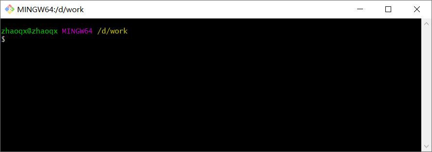
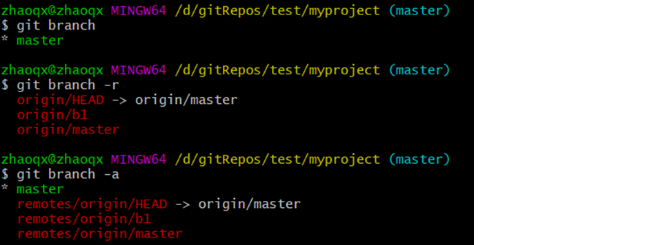
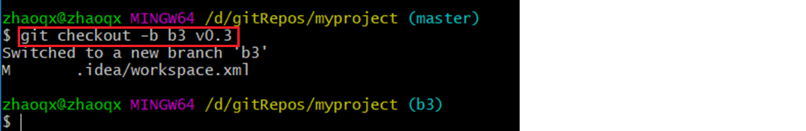
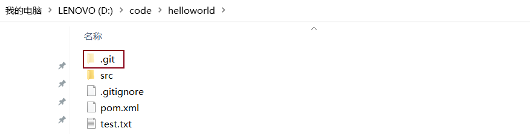
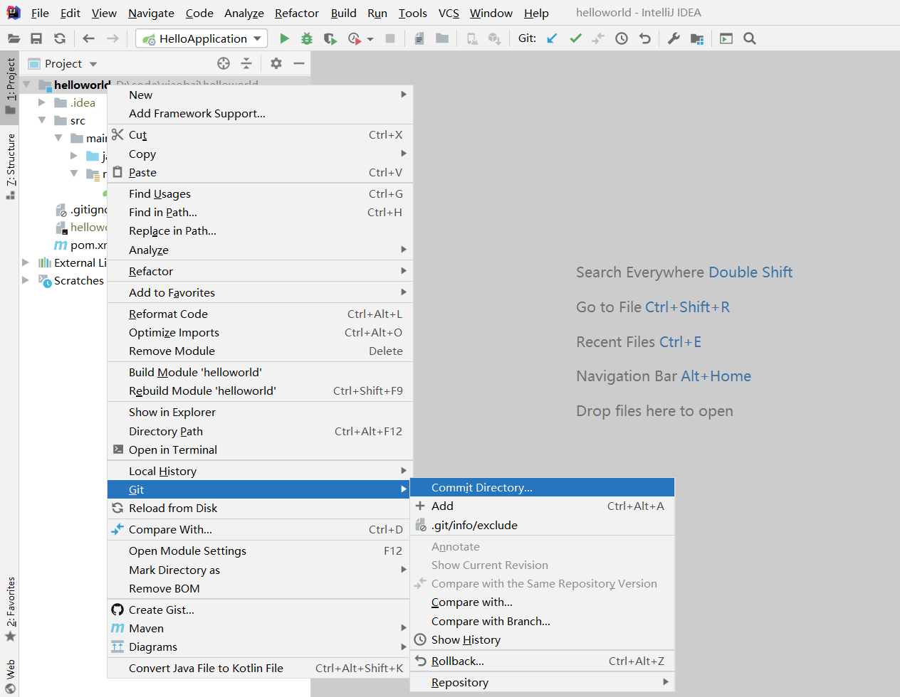
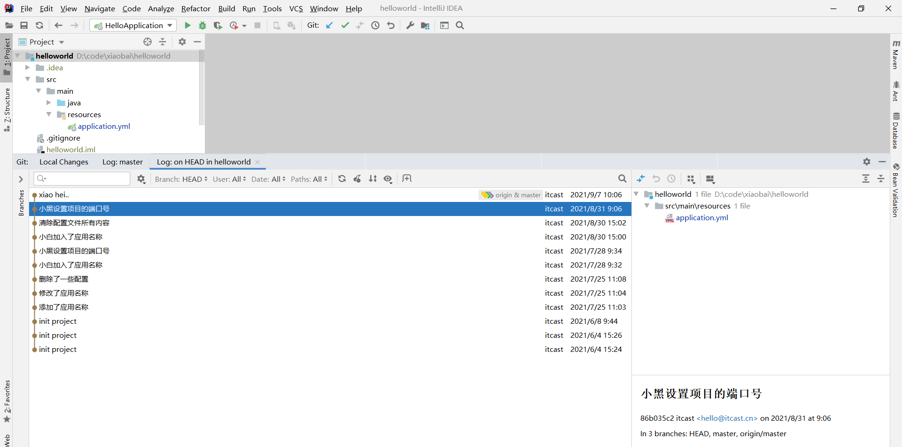
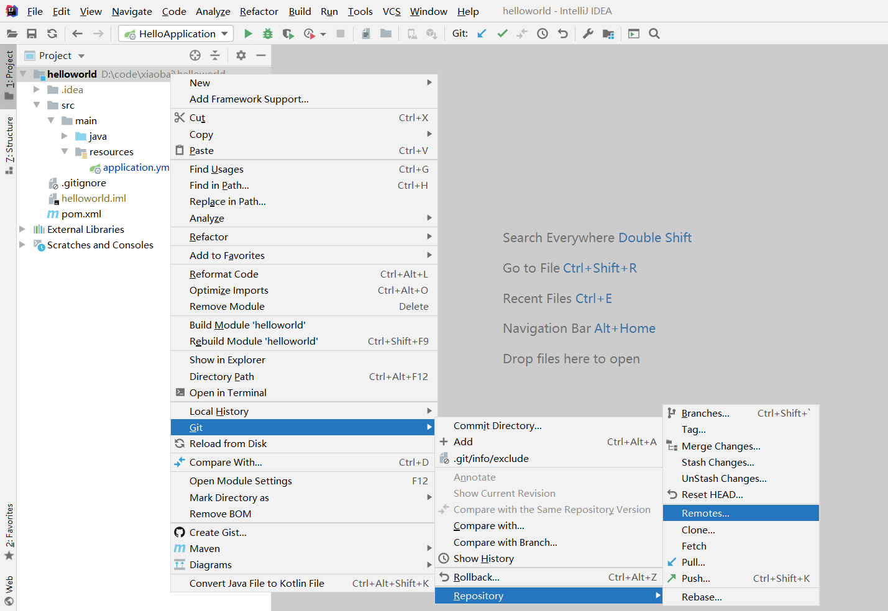
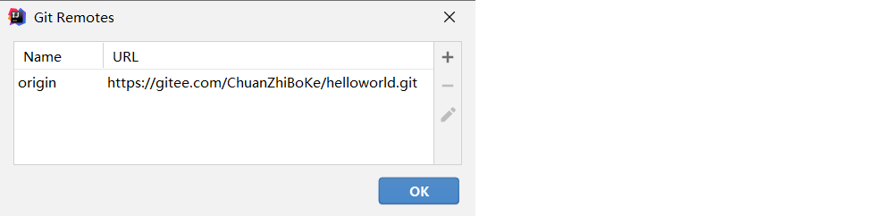
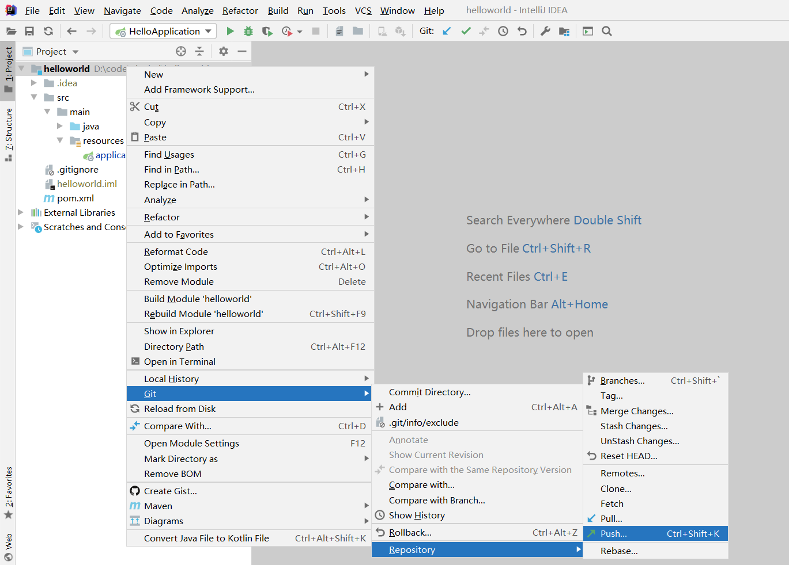

# Git 分布式版本控制工具

## 课程内容

- Git概述
- Git代码托管服务
- Git常用命令
- 在IDEA中使用Git

## 1. 前言

### 1.1 什么是Git

Git是一个分布式版本控制工具，主要用于管理开发过程中的源代码文件（Java类、xml文件、html页面等），在软件开发过程中被广泛使用。

在IDEA开发工具中可以集成Git（后面会讲解Git安装和集成过程）：

集成后在IDEA中可以看到Git相关图标：

可以通过启动两个IDEA窗口模拟两个开发人员来展示Git的使用：

其他的版本控制工具：

- SVN
- CVS
- VSS

### 1.2 使用Git能做什么

- 代码回溯：Git在管理文件过程中会记录日志，方便回退到历史版本
- 版本切换：Git存在分支的概念，一个项目可以有多个分支（版本），可以任意切换
- 多人协作：Git支持多人协作，即一个团队共同开发一个项目，每个团队成员负责一部分代码，通过Git就可以管理和协调
- 远程备份：Git通过仓库管理文件，在Git中存在远程仓库，如果本地文件丢失还可以从远程仓库获取

## 2. Git概述

### 2.1 Git简介

Git 是一个分布式版本控制工具，通常用来对软件开发过程中的源代码文件进行管理。通过Git 仓库来存储和管理这些文件，Git 仓库分为两种：

- 本地仓库：开发人员自己电脑上的 Git 仓库
- 远程仓库：远程服务器上的 Git 仓库

解释说明：

> commit：提交,将本地文件和版本信息保存到本地仓库
>
> push：推送,将本地仓库文件和版本信息上传到远程仓库
>
> pull：拉取,将远程仓库文件和版本信息下载到本地仓库

### 2.2 Git下载与安装

下载地址： https://git-scm.com/download

下载完成后得到安装文件：

直接双击完成安装即可，安装完成后可以在任意目录下点击鼠标右键，如果能够看到如下菜单则说明安装成功：

Git GUI Here：打开Git 图形界面

Git Bash Here：打开Git 命令行

Git安装目录结构如下：

## 3. Git代码托管服务

### 3.1 常用的Git代码托管服务

Git中存在两种类型的仓库，即**本地仓库**和**远程仓库**。那么我们如何搭建Git**远程仓库**呢？

我们可以借助互联网上提供的一些代码托管服务来实现，其中比较常用的有GitHub、码云、GitLab等。

| 名称      | 网址                               | 说明                                                         |
| --------- | ------------------------- | ------------------------------------------------------------ |
| gitHub    | https://github.com/       | 一个面向开源及私有软件项目的托管平台，因为只支持Git 作为唯一的版本库格式进行托管，故名gitHub |
| 码云      | https://gitee.com/        | 国内的一个代码托管平台，由于服务器在国内，所以相比于GitHub，码云速度会更快 |
| GitLab    | https://about.gitlab.com/ | 一个用于仓库管理系统的开源项目，使用Git作为代码管理工具，并在此基础上搭建起来的web服务 |
| BitBucket | https://bitbucket.org/    | 一家源代码托管网站，采用Mercurial和Git作为分布式版本控制系统，同时提供商业计划和免费账户 |

### 3.2 码云代码托管服务

码云网址：https://gitee.com/

使用码云的操作流程如下：

1. 注册码云账号
2. 登录码云
3. 创建远程仓库
4. 邀请其他用户成为仓库成员

#### 3.2.1 注册码云账号

注册网址： https://gitee.com/signup

#### 3.2.2 登录码云

注册完成后可以使用刚刚注册的邮箱进行登录（地址： https://gitee.com/login ）

#### 3.2.3 创建远程仓库

登录成功后可以创建远程仓库，操作方式如下：

页面跳转到新建仓库页面：

解释说明：

> 仓库名称：必填，每个仓库都需要有一个名称，同一个码云账号下的仓库名称不能重复
>
> 路径：访问远程仓库时会使用到，一般无需手动指定，和仓库名称自动保持一致
>
> 开源：所有人都可以查看此仓库
>
> 私有：只有此仓库的成员可见，其他人不可见

创建完成后可以查看仓库信息：

**注意**：每个Git远程仓库都会对应一个网络地址，点击【克隆/下载】按钮，在弹出窗口点击【复制】按钮即可复制网络地址，地址如下：

https://gitee.com/ChuanZhiBoKe/myGitRepo.git

#### 3.2.4 邀请其他用户成为仓库成员

前面已经在码云上创建了自己的远程仓库，目前仓库成员只有自己一个人（身份为管理员）。在企业实际开发中，一个项目往往是由多个人共同开发完成的，为了使多个参与者都有权限操作远程仓库，就需要邀请其他项目参与者成为当前仓库的成员。

点击管理按钮进入仓库管理页面，左侧菜单中可以看到【仓库成员管理】：

点击【开发者】菜单，跳转到如下页面：

点击【添加仓库成员】菜单下的【邀请用户】菜单，跳转到如下页面：

可以看到邀请用户有多种方式：链接邀请、直接添加、通过仓库邀请成员

**注意**：被邀请用户必须为码云的注册用户，否则无法成为仓库成员

## 4. Git常用命令

### 4.1 Git全局设置

当安装Git后首先要做的事情是设置用户名称和email地址。这是非常重要的，因为每次Git提交都会使用该用户信息。在Git 命令行中执行下面命令：

**设置用户信息** 

  git config --global user.name "itcast"

  git config --global user.email "hello@itcast.cn"

**查看配置信息**

  git config --list

注意：上面设置的user.name和user.email并不是我们在注册码云账号时使用的用户名和邮箱，此处可以任意设置。

### 4.2 获取Git仓库

要使用Git对我们的代码进行管理，首先需要获得Git仓库。

获取Git仓库通常有两种方式：

- 在本地初始化Git仓库（不常用）
- 从远程仓库克隆（常用）

#### 4.2.1 在本地初始化Git仓库

**操作步骤如下**：

1. 在任意目录下创建一个空目录（例如repo1）作为我们的本地Git仓库
2. 进入这个目录中，点击右键打开Git bash窗口
3. 执行命令**git** **init**

如果在当前目录中看到.git文件夹（此文件夹为隐藏文件夹）则说明Git仓库创建成功

#### 4.2.2 从远程仓库克隆

可以通过Git提供的命令从远程仓库进行克隆，将远程仓库克隆到本地

**命令格式**：git clone 远程仓库地址

### 4.3 工作区、暂存区、版本库

为了更好的学习Git，我们需要了解Git相关的一些概念，这些概念在后面的学习中会经常提到。

**版本库**：前面看到的.git隐藏文件夹就是版本库，版本库中存储了很多配置信息、日志信息和文件版本信息等

**工作区**：包含.git文件夹的目录就是工作区，也称为工作目录，主要用于存放开发的代码

**暂存区**：.git文件夹中有很多文件，其中有一个index文件就是暂存区，也可以叫做stage。暂存区是一个临时保存修改文件的地方

### 4.4 Git工作区中文件的状态

Git工作区中的文件存在两种状态：

- untracked 未跟踪（未被纳入版本控制）

- tracked 已跟踪（被纳入版本控制）

  ​     1）Unmodified 未修改状态

  ​     2）Modified 已修改状态

  ​     3）Staged 已暂存状态

**注意**：文件的状态会随着我们执行Git的命令发生变化

### 4.5 本地仓库操作

本地仓库常用命令如下：

- git status 查看文件状态
- git add 将文件的修改加入暂存区
- git reset 将暂存区的文件取消暂存或者是切换到指定版本
- git commit 将暂存区的文件修改提交到版本库
- git log  查看日志

#### 4.5.1 git status

git status 命令用于查看文件状态

注意：由于工作区中文件状态的不同，执行 git status 命令后的输出也会不同

#### 4.5.2 git add

git add 命令的作用是将文件的修改加入暂存区，命令格式：git add fileName

加入暂存区后再执行 git status 命令，可以发现文件的状态已经发生变化。

#### 4.5.3 git reset

git reset 命令的作用是将暂存区的文件**取消暂存**或者是**切换到指定版本**

取消暂存命令格式：git reset 文件名

切换到指定版本命令格式：git reset --hard 版本号

注意：每次Git提交都会产生新的版本号，通过版本号就可以回到历史版本

#### 4.5.4 git commit

git commit 命令的作用是将暂存区的文件修改提交到版本库，命令格式：git commit -m msg 文件名

解释说明：

> -m：代表message，每次提交时需要设置，会记录到日志中
>
> 可以使用通配符*一次提交多个文件

#### 4.5.5 git log

git log 命令的作用是查看提交日志

通过git log命令查看日志，可以发现每次提交都会产生一个版本号，提交时设置的message、提交人、邮箱、提交时间等信息都会记录到日志中

### 4.6 远程仓库操作

前面执行的命令操作都是针对的本地仓库，本节我们会学习关于远程仓库的一些操作，具体包括：

- git remote  查看远程仓库
- git remote add 添加远程仓库
- git clone 从远程仓库克隆
- git pull 从远程仓库拉取
- git push 推送到远程仓库

#### 4.6.1 git remote

如果要查看已经配置的远程仓库服务器，可以执行 git remote 命令，它会列出每一个远程服务器的简称。

如果已经克隆了远程仓库，那么至少应该能看到 origin ，这是 Git 克隆的仓库服务器的默认名字。

解释说明：

> 可以通过-v参数查看远程仓库更加详细的信息
>
> 本地仓库配置的远程仓库都需要一个简称，后续在和远程仓库交互时会使用到这个简称

#### 4.6.2 git remote add

添加远程仓库命令格式：git remote add 简称 远程仓库地址

注意：一个本地仓库可以关联多个远程仓库

#### 4.6.3 git clone

如果你想获得一份已经存在了的 Git 远程仓库的拷贝，这时就要用到 git clone 命令。 Git 克隆的是该 Git 仓库服务器上的几乎所有数据（包括日志信息、历史记录等）。

克隆仓库的命令格式： git clone 远程仓库地址

#### 4.6.4 git push

将本地仓库内容推送到远程仓库，命令格式：git push 远程仓库简称 分支名称

在使用git push命令将本地文件推送至码云远程仓库时，如果是第一次操作，需要进行身份认证，认证通过才可以推送，如下：

注意：上面的用户名和密码对应的就是我们在码云上注册的用户名和密码，认证通过后会将用户名和密码保存到windows系统中（如下图），后续再推送则无需重复输入用户名和密码。

推送完成后可以到远程仓库中查看文件的变化。

解释说明：

> 一个仓库可以有多个分支，默认情况下在创建仓库后会自动创建一个master分支
>
> 后面会讲解分支相关的操作

#### 4.6.5 git pull

**git** **pull** 命令的作用是从远程仓库获取最新版本并合并到本地仓库

命令格式：git pull 远程仓库简称 分支名称

**注意**：如果当前本地仓库不是从远程仓库克隆，而是本地创建的仓库，并且仓库中存在文件，此时再从远程仓库拉取文件的时候会报错（fatal: refusing to merge unrelated histories ）

解决此问题可以在git pull命令后加入参数--allow-unrelated-histories

### 4.7 分支操作

分支是Git 使用过程中非常重要的概念。使用分支意味着你可以把你的工作从开发主线上分离开来，以免影响开发主线。

本地仓库和远程仓库中都有分支，同一个仓库可以有多个分支，各个分支相互独立，互不干扰。

通过git init 命令创建本地仓库时默认会创建一个master分支。

本节我们会学习关于分支的相关命令，具体命令如下：

- git branch                                     查看分支
- git branch [name]                       创建分支
- git checkout [name]                    切换分支
- git push [shortName] [name]   推送至远程仓库分支
- git merge [name]                        合并分支

#### 4.7.1 查看分支

查看分支命令：git branch

git branch 		列出所有本地分支

git branch -r 	列出所有远程分支

git branch -a 	列出所有本地分支和远程分支

#### 4.7.2 创建分支

创建分支命令格式：git branch 分支名称

#### 4.7.3 切换分支

一个仓库中可以有多个分支，切换分支命令格式：git checkout 分支名称

注意：在命令行中会显示出当前所在分支，如上图所示。

#### 4.7.4 推送至远程仓库分支

推送至远程仓库分支命令格式：git push 远程仓库简称 分支命令

推送完成后可以查看远程仓库：

#### 4.7.5 合并分支

合并分支就是将两个分支的文件进行合并处理，命令格式：git merge 分支命令

注意：分支合并时需注意合并的方向，如上图所示，在Master分支执行操作，结果就是将b3分支合并到Master分支。

### 4.8 标签操作

Git 中的标签，指的是某个分支某个特定时间点的状态。通过标签，可以很方便的切换到标记时的状态。

比较有代表性的是人们会使用这个功能来标记发布结点（v1.0 、v1.2等）。下面是mybatis-plus的标签：

在本节中，我们将学习如下和标签相关的命令：

- git tag                                                查看标签
- git tag [name]                                  创建标签
- git push [shortName] [name]       将标签推送至远程仓库
- git checkout -b [branch] [name]   检出标签

#### 4.8.1 查看标签

查看标签命令：git tag

#### 4.8.2 创建标签

创建标签命令：git tag 标签名

#### 4.8.3 将标签推送至远程仓库

将标签推送至远程仓库命令：git push 远程仓库简称 标签名

推送完成后可以在远程仓库中查看标签。

#### 4.8.4 检出标签

检出标签时需要新建一个分支来指向某个标签，检出标签的命令格式：git checkout -b 分支名 标签名

## 5. 在IDEA中使用Git

通过Git命令可以完成Git相关操作，为了简化操作过程，我们可以在IEDA中配置Git，配置好后就可以在IDEA中通过图形化的方式来操作Git。

### 5.1 在IDEA中配置Git

在IDEA中使用Git，本质上还是使用的本地安装的Git软件，所以需要提前安装好Git并在IDEA中配置Git。

Git安装目录：

解释说明：

> git.exe：Git安装目录下的可执行文件，前面执行的git命令，其实就是执行的这个文件

IDEA中的配置：

说明：如果Git安装在默认目录中（C:\Program Files\Git），则IDEA中无需再手动配置，直接就可以使用。

### 5.2 获取Git仓库

在IDEA中获取Git仓库有两种方式：

- 本地初始化仓库，本质就是执行 git init 命令
- 从远程仓库克隆，本质就是执行 git clone 命令

#### 5.2.1 本地初始化仓库

在IDEA中通过如下操作可以在本地初始化一个本地仓库，其实底层就是执行的 git init 命令。操作过程如下：

1）依次选择菜单【VCS】---【Import into Version Control】---【Create Git Repository】

2）在弹出的【Create Git Repository】对话框中选择当前项目根目录，点击【OK】按钮：

操作完成后可以看到当前项目根目录下出现了.git隐藏目录：

操作完成后可以在IDEA的工具栏中看到Git的相关操作图标：

#### 5.2.2 从远程仓库克隆

在IDEA中从远程仓库克隆本质就是执行的 git clone 命令，具体操作过程如下：

1）在IDEA开始窗口中点击【Get from Version Control】

2）在弹出的【Get from Version Control】窗口中输入远程仓库的URL地址和对应的本地仓库存放目录，点击【Clone】按钮进行仓库克隆操作

### 5.3 Git忽略文件

在Git工作区中有一个特殊的文件 .gitignore，通过此文件可以指定工作区中的哪些文件不需要Git管理。我们在码云上创建Git远程仓库时可以指定生成此文件，如下：

创建完成后效果如下：

解释说明：

> 1）我们在使用Git管理项目代码时，并不是所有文件都需要Git管理，例如Java项目中编译的.class文件、开发工具自带的配置文件等，这些文件没有必要交给Git管理，所以也就不需要提交到Git版本库中
>
> 2）注意忽略文件的名称是固定的，不能修改
>
> 3）添加到忽略列表中的文件后续Git工具就会忽略它

一个参考的.gitignore文件内容如下：

~~~file
.git
logs
rebel.xml
target/
!.mvn/wrapper/maven-wrapper.jar
log.path_IS_UNDEFINED
.DS_Store
offline_user.md
*.class

### IntelliJ IDEA ###
.idea
*.iws
*.iml
*.ipr
~~~

### 5.4 本地仓库操作

本地仓库操作：

- 将文件加入暂存区，本质就是执行 git add 命令
- 将暂存区的文件提交到版本库，本质就是执行 git commit 命令
- 查看日志，本质就是执行 git log 命令

#### 5.4.1 将文件加入暂存区

当在Git工作区新增文件或者对已有文件修改后，就需要将文件的修改加入暂存区，具体操作如下：

#### 5.4.2 将暂存区文件提交到版本库

将暂存区文件提交到版本库，可以选择一个文件进行提交，也可以选择整个项目提交多个文件。在IEDA中对文件的提交进行了简化操作，也就是如果文件修改后，无需再加入暂存区，可以直接提交。

1）提交一个文件：

可以看到，如果选中一个文件提交，则菜单名称为【Commit File...】

2）提交多个文件：

可以看到，如果提交多个文件，则菜单名称为【Commit Directory...】

由于提交操作属于高频操作，所以为了进一步方便操作，在IDEA的工具栏中提供了提交操作的快捷按钮：

#### 5.4.3 查看日志

查看日志，既可以查看整个仓库的提交日志，也可以查看某个文件的提交日志。

1）查看整个项目的提交日志：

2）查看某个文件的提交日志

### 5.5 远程仓库操作

远程仓库操作：

- 查看远程仓库，本质就是执行 git remote 命令
- 添加远程仓库，本质就是执行 git remote add 命令
- 推送至远程仓库，本质就是执行 git push 命令
- 从远程仓库拉取，本质就是执行 git pull 命令

#### 5.5.1 查看远程仓库

操作过程如下：

在弹出的【Git Remotes】窗口中可以看到配置的远程仓库：

#### 5.5.2 添加远程仓库

一个本地仓库可以配置多个远程仓库，在【Git Remotes】窗口中点击【+】来添加一个新的远程仓库：

#### 5.5.3 推送至远程仓库

可以通过如下操作将本地仓库文件推送至远程仓库：

在弹出的【Push Commits】窗口中可以看到本次推送的文件，点击【Push】按钮即可推送至远程仓库：

由于推送至远程仓库操作属于高频操作，所以可以通过IDEA工具栏中的提交快捷按钮同时完成提交和推送：

点击【Commit and Push...】按钮同时完成提交和推送操作

#### 5.5.4 从远程仓库拉取

可以通过如下操作从远程仓库拉取：

由于从远程仓库拉取文件属于高频操作，所以在IDEA的工具栏中提供了对应的快捷按钮：

在弹出的【Update Project】窗口中点击【OK】：

### 5.6 分支操作

分支操作：

- 查看分支，本质就是执行 git branch 命令
- 创建分支，本质就是执行 git branch 分支名 命令
- 切换分支，本质就是执行 git checkout 命令
- 将分支推送到远程仓库，本质就是执行 git push 命令
- 合并分支，本质就是执行 git merge 命令

#### 5.6.1 查看分支

可以通过如下操作查看分支：

在弹出的窗口中可以看到本地分支和远程分支：

由于分支操作属于高频操作，所以在IDEA的状态栏中提供了分支操作的快捷按钮：

点击【master】快捷按钮即可弹出【Git Branches】分支窗口：

#### 5.6.2 创建分支

在【Git Branches】分支窗口中点击【New Branch】，弹出如下窗口：

在弹出的【Create New Branch】窗口中输入新分支的名称，点击【Create】按钮完成分支创建

#### 5.6.3 切换分支

通过如下操作可以切换分支：

#### 5.6.4 将分支推送到远程仓库

通过如下操作可以将分支推送到远程仓库：

#### 5.6.5 合并分支

通过下面操作可以进行分支的合并：

