# 瑞吉外卖项目优化-Day01

## 课程内容

- 环境搭建
- 缓存短信验证码
- 缓存菜品信息
- SpringCache
- 缓存套餐数据


## 前言

> 1). 当前系统存在的问题

之前我们已经实现了移动端菜品展示、点餐、购物车、下单等功能，但是由于移动端是面向所有的消费者的，请求压力相对比较大，而我们当前所有的数据查询都是从数据库MySQL中直接查询的，那么可能就存在如下问题： ==频繁访问数据库，数据库访问压力大，系统性能下降，用户体验较差。==

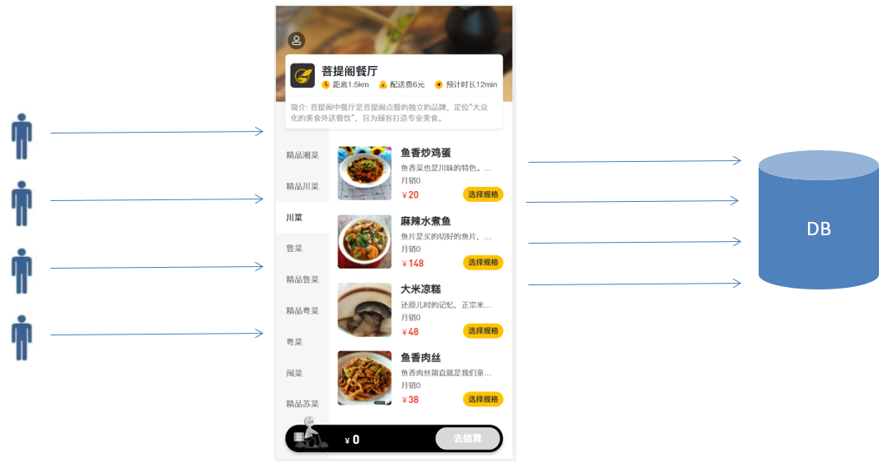 


> 2). 解决该问题的方法

要解决我们上述提到的问题，就可以使用我们前面学习的一个技术：Redis，通过Redis来做缓存，从而降低数据库的访问压力，提高系统的访问性能，从而提升用户体验。加入Redis做缓存之后，我们在进行数据查询时，就需要先查询缓存，如果缓存中有数据，直接返回，如果缓存中没有数据，则需要查询数据库，再将数据库查询的结果，缓存在redis中。


## 1. 环境搭建

### 1.1 版本控制

接下来，我们就需要对我们的功能进行优化，但是需要说明的是，我们不仅仅要对上述提到的缓存进行优化，还需要对我们程序的各个方面进行优化。我们本章节主要是针对于缓存进行优化，为了方便的对我们各个优化版本的代码进行管理，我们使用Git来控制代码版本。 那么此时我们就需要将我们之前开发完成的代码提交到Git，并且推送到码云Gitee的远程仓库，执行步骤如下： 


**1). 创建Gitee远程仓库**

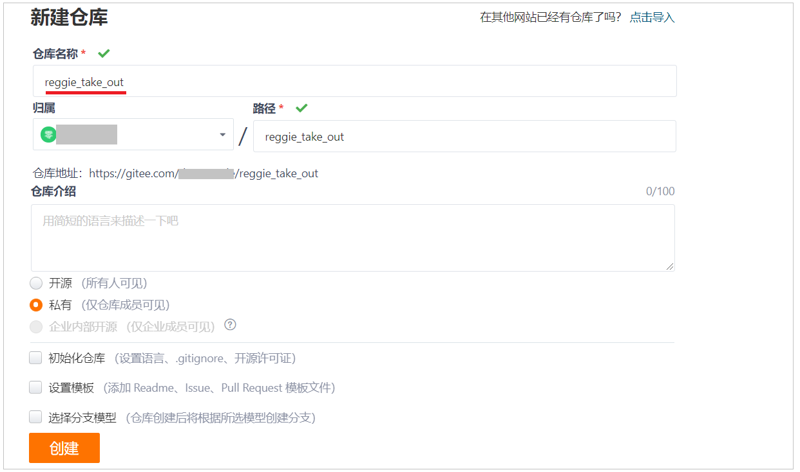 


**2). idea-创建本地仓库**

 


**3). 准备忽略文件.gitignore**

在我们的项目中, 有一些文件是无需提交的到git，比如: .idea，target/，*.iml等。我们可以直接将今天课程资料中提供的.gitignore 文件导入到我们的项目中。

 


**4). idea-提交并推送本地代码**

A. 添加项目文件进暂存区

 


B. 提交代码

 

 


C. 推送代码到远程仓库 

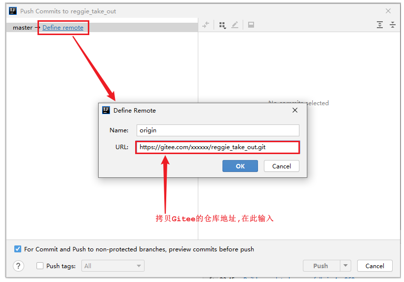 


**5). 查看gitee远程仓库**

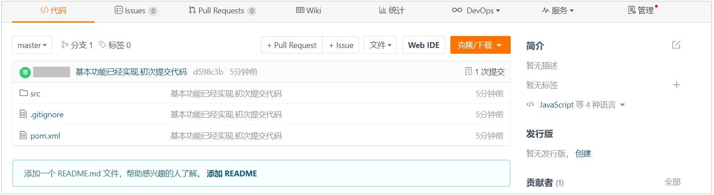 


**6). 创建分支**

目前默认git中只有一个主分支master，我们接下来进行缓存的优化，就不在master分支来操作了，我们需要在git上创建一个单独的分支v1.0，缓存的优化，我们就在该分支上进行操作。

  

当前创建的v1.0分支，是基于master分支创建出来的，所以目前master分支的代码， 和v1.0分支的代码是完全一样的，接下来把v1.0的代码也推送至远程仓库。


**7). 推送分支代码到远程**

 

 


### 1.2 环境准备

**1). 在项目的pom.xml文件中导入spring data redis的maven坐标**

```xml
<dependency>
    <groupId>org.springframework.boot</groupId>
    <artifactId>spring-boot-starter-data-redis</artifactId>
</dependency>
```


**2). 在项目的application.yml中加入redis相关配置**

```yml
  redis:
    host: 192.168.200.200
    port: 6379
    password: root@123456
    database: 0
```

==注意: 引入上述依赖时,需要注意yml文件前面的缩进,上述配置应该配置在spring层级下面。==


**3). 编写Redis的配置类RedisConfig,定义RedisTemplate**

```java
import org.springframework.cache.annotation.CachingConfigurerSupport;
import org.springframework.context.annotation.Bean;
import org.springframework.context.annotation.Configuration;
import org.springframework.data.redis.connection.RedisConnectionFactory;
import org.springframework.data.redis.core.RedisTemplate;
import org.springframework.data.redis.serializer.StringRedisSerializer;

@Configuration
public class RedisConfig extends CachingConfigurerSupport {
    @Bean
    public RedisTemplate<Object, Object> redisTemplate(RedisConnectionFactory connectionFactory) {
        RedisTemplate<Object, Object> redisTemplate = new RedisTemplate<>();
        //默认的Key序列化器为：JdkSerializationRedisSerializer
        redisTemplate.setKeySerializer(new StringRedisSerializer());
        redisTemplate.setConnectionFactory(connectionFactory);
        return redisTemplate;
    }
}
```

**解释说明:** 

1). 在SpringBoot工程启动时, 会加载一个自动配置类 RedisAutoConfiguration, 在里面已经声明了RedisTemplate这个bean

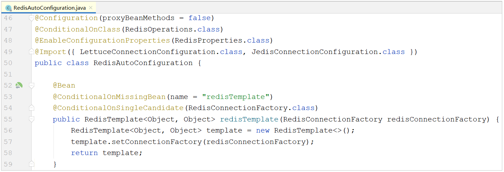 

上述框架默认声明的RedisTemplate用的key和value的序列化方式是默认的 JdkSerializationRedisSerializer，如果key采用这种方式序列化，最终我们在测试时通过redis的图形化界面查询不是很方便，如下形式：

 


2). 如果使用我们自定义的RedisTemplate, key的序列化方式使用的是StringRedisSerializer, 也就是字符串形式, 最终效果如下: 

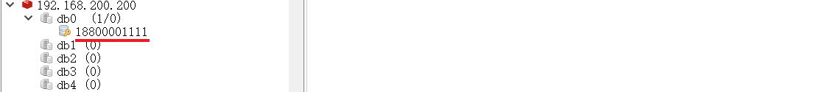 

 


3). 定义了两个bean会不会出现冲突呢? 答案是不会, 因为源码如下:

 


## 2. 缓存短信验证码

### 2.1 思路分析

前面我们已经实现了移动端手机验证码登录，随机生成的验证码我们是保存在HttpSession中的。但是在我们实际的业务场景中，一般验证码都是需要设置过期时间的，如果存在HttpSession中就无法设置过期时间，此时我们就需要对这一块的功能进行优化。

现在需要改造为将验证码缓存在Redis中，具体的实现思路如下：

1). 在服务端UserController中注入RedisTemplate对象，用于操作Redis;

2). 在服务端UserController的sendMsg方法中，将随机生成的验证码缓存到Redis中，并设置有效期为5分钟;

3). 在服务端UserController的login方法中，从Redis中获取缓存的验证码，如果登录成功则删除Redis中的验证码;


### 2.2 代码改造

1). 在UserController中注入RedisTemplate对象，用于操作Redis

```java
@Autowired
private RedisTemplate redisTemplate;
```


2). 在UserController的sendMsg方法中，将生成的验证码保存到Redis

```java
//需要将生成的验证码保存到Redis,设置过期时间
redisTemplate.opsForValue().set(phone, code, 5, TimeUnit.MINUTES);
```

 


3). 在UserController的login方法中，从Redis中获取生成的验证码，如果登录成功则删除Redis中缓存的验证码

```java
//从Redis中获取缓存的验证码
Object codeInSession = redisTemplate.opsForValue().get(phone);
```


```java
//从Redis中删除缓存的验证码
redisTemplate.delete(phone);
```

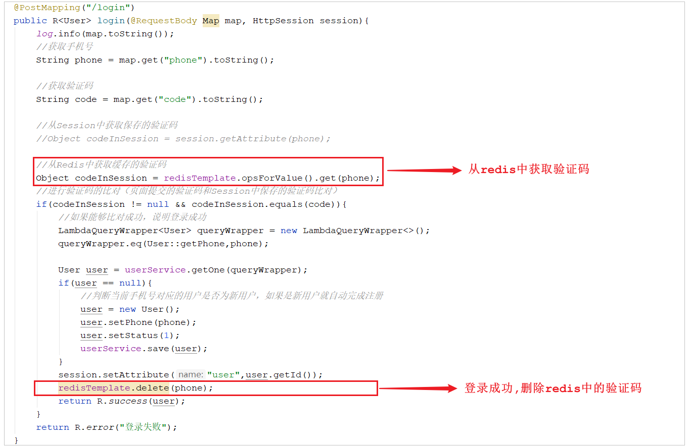 


### 2.3 功能测试

代码编写完毕之后,重启服务。

**1). 访问前端工程，获取验证码**

 

通过控制台的日志，我们可以看到生成的验证码：

  


**2). 通过Redis的图形化界面工具查看Redis中的数据**

 


**3). 在登录界面填写验证码登录完成后,查看Redis中的数据是否删除**

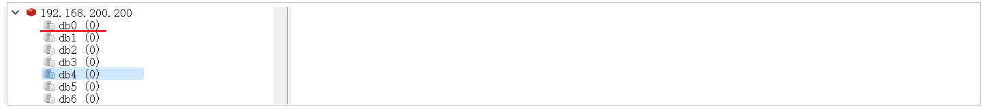 


## 3. 缓存菜品信息

### 3.1 实现思路

前面我们已经实现了移动端菜品查看功能，对应的服务端方法为DishController的list方法，此方法会根据前端提交的查询条件(categoryId)进行数据库查询操作。在高并发的情况下，频繁查询数据库会导致系统性能下降，服务端响应时间增长。现在需要对此方法进行缓存优化，提高系统的性能。


那么,我们又需要思考一个问题, 具体缓存几份数据呢, 所有的菜品缓存一份 , 还是说需要缓存多份呢? 我们可以看一下我们之前做的移动端效果: 

 

我们点击哪一个分类,展示的就是该分类下的菜品, 其他菜品无需展示。所以，这里面我们在缓存时，可以根据菜品的分类，缓存多份数据，页面在查询时，点击的是哪个分类，我们就查询该分类下的菜品缓存数据。


**具体的实现思路如下：**

1). 改造DishController的list方法，先从Redis中获取分类对应的菜品数据，如果有则直接返回，无需查询数据库;如果没有则查询数据库，并将查询到的菜品数据存入Redis。

2). 改造DishController的save和update方法，加入清理缓存的逻辑。

> 注意： 
>
> ​	在使用缓存过程中，要注意保证数据库中的数据和缓存中的数据一致，如果数据库中的数据发生变化，需要及时清理缓存数据。否则就会造成缓存数据与数据库数据不一致的情况。


### 3.2 代码改造

需要改造的代码为： DishController

#### 3.2.1 查询菜品缓存

| 改造的方法 | redis的数据类型 | redis缓存的key                              | redis缓存的value |
| ---------- | --------------- | ------------------------------------------- | ---------------- |
| list       | string          | dish_分类Id_状态 , 比如: dish_12323232323_1 | List<DishDto>    |


**1). 在DishController中注入RedisTemplate**

```java
@Autowired
private RedisTemplate redisTemplate;
```


**2). 在list方法中,查询数据库之前,先查询缓存, 缓存中有数据, 直接返回**

```java
List<DishDto> dishDtoList = null;
//动态构造key
String key = "dish_" + dish.getCategoryId() + "_" + dish.getStatus();//dish_1397844391040167938_1
//先从redis中获取缓存数据
dishDtoList = (List<DishDto>) redisTemplate.opsForValue().get(key);
if(dishDtoList != null){
    //如果存在，直接返回，无需查询数据库
    return R.success(dishDtoList);
}
```

 


**3). 如果redis不存在，查询数据库，并将数据库查询结果，缓存在redis，并设置过期时间**

```java
//如果不存在，需要查询数据库，将查询到的菜品数据缓存到Redis
redisTemplate.opsForValue().set(key,dishDtoList,60, TimeUnit.MINUTES);
```

 


#### 3.2.2 清理菜品缓存

为了保证数据库中的数据和缓存中的数据一致，如果数据库中的数据发生变化，需要及时清理缓存数据。所以，我们需要在添加菜品、更新菜品时清空缓存数据。


**1). 保存菜品,清空缓存**

在保存菜品的方法save中，当菜品数据保存完毕之后，需要清空菜品的缓存。那么这里清理菜品缓存的方式存在两种：

A. 清理所有分类下的菜品缓存

```java
//清理所有菜品的缓存数据
Set keys = redisTemplate.keys("dish_*"); //获取所有以dish_xxx开头的key
redisTemplate.delete(keys); //删除这些key
```


B. 清理当前添加菜品分类下的缓存

```java
//清理某个分类下面的菜品缓存数据
String key = "dish_" + dishDto.getCategoryId() + "_1";
redisTemplate.delete(key);
```

此处, 我们推荐使用第二种清理的方式, 只清理当前菜品关联的分类下的菜品数据。

 


**2). 更新菜品,清空缓存**

在更新菜品的方法update中，当菜品数据更新完毕之后，需要清空菜品的缓存。这里清理缓存的方式和上述基本一致。

A. 清理所有分类下的菜品缓存

```java
//清理所有菜品的缓存数据
Set keys = redisTemplate.keys("dish_*"); //获取所有以dish_xxx开头的key
redisTemplate.delete(keys); //删除这些key
```


B. 清理当前添加菜品分类下的缓存

```java
//清理某个分类下面的菜品缓存数据
String key = "dish_" + dishDto.getCategoryId() + "_1";
redisTemplate.delete(key);
```

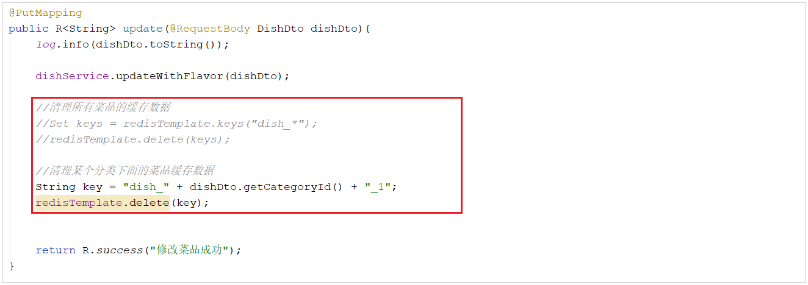 


==注意: 在这里我们推荐使用第一种方式进行清理，这样逻辑更加严谨。 因为对于修改操作，用户是可以修改菜品的分类的，如果用户修改了菜品的分类，那么原来分类下将少一个菜品，新的分类下将多一个菜品，这样的话，两个分类下的菜品列表数据都发生了变化。==


### 3.3 功能测试

代码编写完毕之后,重新启动服务。

1). 访问移动端，根据分类查询菜品列表，然后再检查Redis的缓存数据，是否可以正常缓存；

 

我们也可以在服务端，通过debug断点的形式一步一步的跟踪代码的执行。


2). 当我们在进行新增及修改菜品时, 查询Redis中的缓存数据, 是否被清除;


### 3.4 提交并推送代码

**1). 提交并推送代码**

在v1.0分支中, 将我们已经实现并且测试通过的使用redis缓存验证码和菜品信息的代码,提交并推送至Gitee

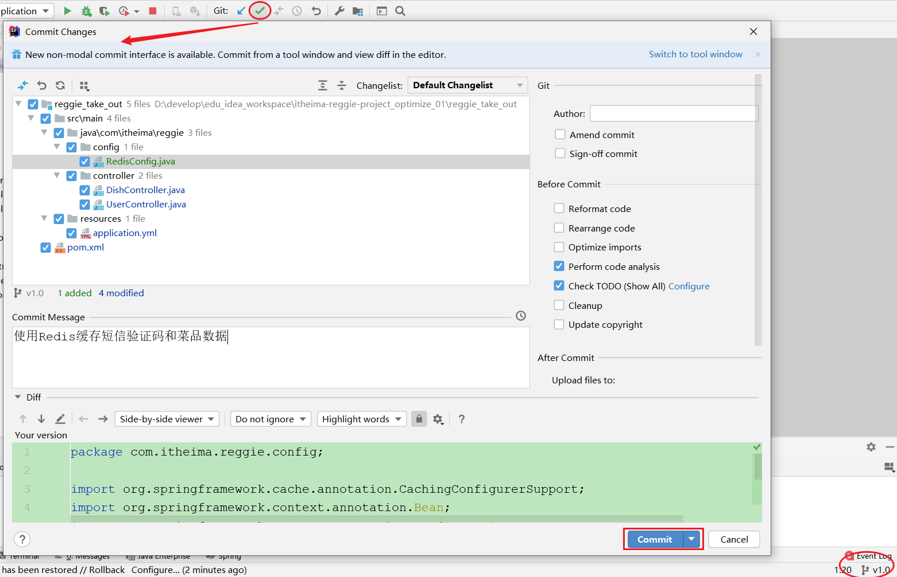 

 


**2). 合并代码到master分支**

A. 将代码切换到master分支

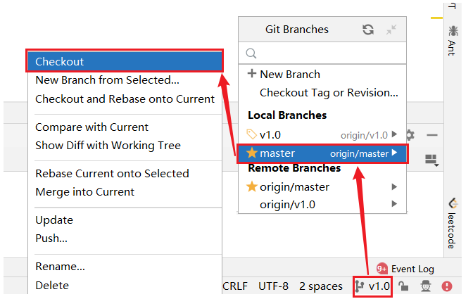 


B. 将v1.0分支的代码合并到当前master分支

 


C. 将master分支合并后代码推送到Gitee

 

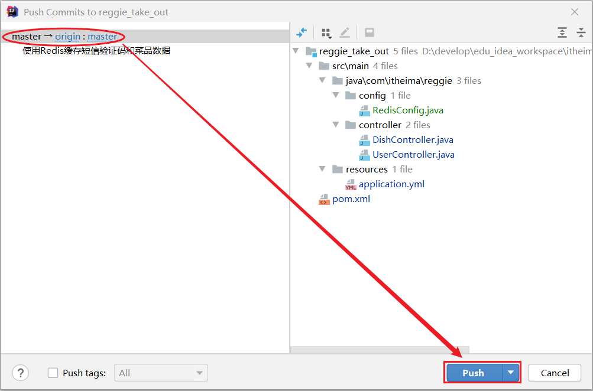 


## 4. SpringCache

### 4.1 介绍

**Spring Cache**是一个框架，实现了基于注解的缓存功能，只需要简单地加一个注解，就能实现缓存功能，大大简化我们在业务中操作缓存的代码。

Spring Cache只是提供了一层抽象，底层可以切换不同的cache实现。具体就是通过**CacheManager**接口来统一不同的缓存技术。CacheManager是Spring提供的各种缓存技术抽象接口。


针对不同的缓存技术需要实现不同的CacheManager：

| **CacheManager**    | **描述**                           |
| ------------------- | ---------------------------------- |
| EhCacheCacheManager | 使用EhCache作为缓存技术            |
| GuavaCacheManager   | 使用Google的GuavaCache作为缓存技术 |
| RedisCacheManager   | 使用Redis作为缓存技术              |


### 4.2 注解

在SpringCache中提供了很多缓存操作的注解，常见的是以下的几个：

| **注解**       | **说明**                                                     |
| -------------- | ------------------------------------------------------------ |
| @EnableCaching | 开启缓存注解功能                                             |
| @Cacheable     | 在方法执行前spring先查看缓存中是否有数据，如果有数据，则直接返回缓存数据；若没有数据，调用方法并将方法返回值放到缓存中 |
| @CachePut      | 将方法的返回值放到缓存中                                     |
| @CacheEvict    | 将一条或多条数据从缓存中删除                                 |


在spring boot项目中，使用缓存技术只需在项目中导入相关缓存技术的依赖包，并在启动类上使用@EnableCaching开启缓存支持即可。

例如，使用Redis作为缓存技术，只需要导入Spring data Redis的maven坐标即可。


### 4.3 入门程序

接下来，我们将通过一个入门案例来演示一下SpringCache的常见用法。 上面我们提到，SpringCache可以集成不同的缓存技术，如Redis、Ehcache甚至我们可以使用Map来缓存数据， 接下来我们在演示的时候，就先通过一个Map来缓存数据，最后我们再换成Redis来缓存。


#### 4.3.1 环境准备

**1). 数据库准备**

将今天资料中的SQL脚本直接导入数据库中。

 


**2). 导入基础工程**

基础环境的代码，在我们今天的资料中已经准备好了， 大家只需要将这个工程导入进来就可以了。导入进来的工程结构如下： 

 

由于SpringCache的基本功能是Spring核心(spring-context)中提供的，所以目前我们进行简单的SpringCache测试，是可以不用额外引入其他依赖的。


**3). 注入CacheManager**

我们可以在UserController注入一个CacheManager，在Debug时，我们可以通过CacheManager跟踪缓存中数据的变化。

 


我们可以看到CacheManager是一个接口，默认的实现有以下几种 ；

 

而在上述的这几个实现中，默认使用的是 ConcurrentMapCacheManager。稍后我们可以通过断点的形式跟踪缓存数据的变化。


**4). 引导类上加@EnableCaching**

在引导类上加该注解，就代表当前项目开启缓存注解功能。

 


#### 4.3.2 @CachePut注解

> @CachePut 说明： 
>
> ​	作用: 将方法返回值，放入缓存
>
> ​	value: 缓存的名称, 每个缓存名称下面可以有很多key
>
> ​	key: 缓存的key  ----------> 支持Spring的表达式语言SPEL语法


**1). 在save方法上加注解@CachePut**

当前UserController的save方法是用来保存用户信息的，我们希望在该用户信息保存到数据库的同时，也往缓存中缓存一份数据，我们可以在save方法上加上注解 @CachePut，用法如下： 

```java
/**
* CachePut：将方法返回值放入缓存
* value：缓存的名称，每个缓存名称下面可以有多个key
* key：缓存的key
*/
@CachePut(value = "userCache", key = "#user.id")
@PostMapping
public User save(User user){
    userService.save(user);
    return user;
}
```


> key的写法如下： 
>
> ​	#user.id : #user指的是方法形参的名称, id指的是user的id属性 , 也就是使用user的id属性作为key ;
>
> ​	#user.name: #user指的是方法形参的名称, name指的是user的name属性 ,也就是使用user的name属性作为key ;
>
> ​	
>
> ​	#result.id : #result代表方法返回值，该表达式 代表以返回对象的id属性作为key ；
>
> ​	#result.name : #result代表方法返回值，该表达式 代表以返回对象的name属性作为key ；


**2). 测试**

启动服务,通过postman请求访问UserController的方法, 然后通过断点的形式跟踪缓存数据。


第一次访问时，缓存中的数据是空的，因为save方法执行完毕后才会缓存数据。 

 


第二次访问时，我们通过debug可以看到已经有一条数据了，就是上次保存的数据，已经缓存了，缓存的key就是用户的id。

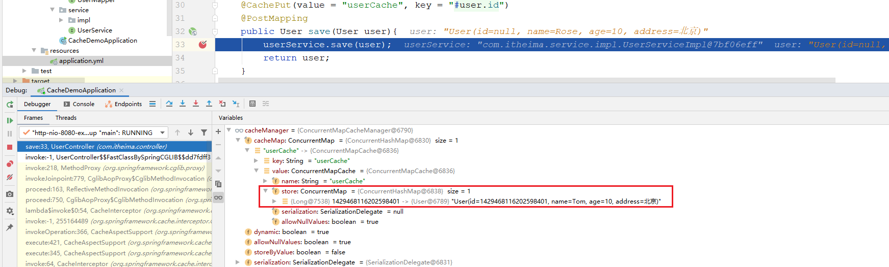 


==注意: 上述的演示，最终的数据，实际上是缓存在ConcurrentHashMap中，那么当我们的服务器重启之后，缓存中的数据就会丢失。 我们后面使用了Redis来缓存就不存在这样的问题了。==


#### 4.3.3 @CacheEvict注解

> @CacheEvict 说明： 
>
> ​	作用: 清理指定缓存
>
> ​	value: 缓存的名称，每个缓存名称下面可以有多个key
>
> ​	key: 缓存的key  ----------> 支持Spring的表达式语言SPEL语法


**1). 在 delete 方法上加注解@CacheEvict**

当我们在删除数据库user表的数据的时候,我们需要删除缓存中对应的数据,此时就可以使用@CacheEvict注解, 具体的使用方式如下: 

```java
/**
* CacheEvict：清理指定缓存
* value：缓存的名称，每个缓存名称下面可以有多个key
* key：缓存的key
*/
@CacheEvict(value = "userCache",key = "#p0")  //#p0 代表第一个参数
//@CacheEvict(value = "userCache",key = "#root.args[0]") //#root.args[0] 代表第一个参数
//@CacheEvict(value = "userCache",key = "#id") //#id 代表变量名为id的参数
@DeleteMapping("/{id}")
public void delete(@PathVariable Long id){
    userService.removeById(id);
}
```


**2). 测试**

要测试缓存的删除，我们先访问save方法4次，保存4条数据到数据库的同时，也保存到缓存中，最终我们可以通过debug看到缓存中的数据信息。 然后我们在通过postman访问delete方法， 如下： 

 


删除数据时，通过debug我们可以看到已经缓存的4条数据：

 


当执行完delete操作之后，我们再次保存一条数据，在保存的时候debug查看一下删除的ID值是否已经被删除。

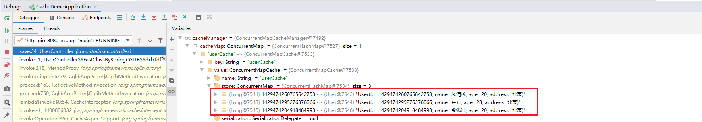 


**3). 在 update 方法上加注解@CacheEvict**

在更新数据之后，数据库的数据已经发生了变更，我们需要将缓存中对应的数据删除掉，避免出现数据库数据与缓存数据不一致的情况。

``` java
//@CacheEvict(value = "userCache",key = "#p0.id")   //第一个参数的id属性
//@CacheEvict(value = "userCache",key = "#user.id") //参数名为user参数的id属性
//@CacheEvict(value = "userCache",key = "#root.args[0].id") //第一个参数的id属性
@CacheEvict(value = "userCache",key = "#result.id")         //返回值的id属性
@PutMapping
public User update(User user){
    userService.updateById(user);
    return user;
}
```


加上注解之后，我们可以重启服务，然后测试方式，基本和上述相同，先缓存数据，然后再更新某一条数据，通过debug的形式查询缓存数据的情况。


#### 4.3.4 @Cacheable注解

> @Cacheable 说明:
>
> ​	作用: 在方法执行前，spring先查看缓存中是否有数据，如果有数据，则直接返回缓存数据；若没有数据，调用方法并将方法返回值放到缓存中
>
> ​	value: 缓存的名称，每个缓存名称下面可以有多个key
>
> ​	key: 缓存的key  ----------> 支持Spring的表达式语言SPEL语法


**1). 在getById上加注解@Cacheable**

```java
/**
* Cacheable：在方法执行前spring先查看缓存中是否有数据，如果有数据，则直接返回缓存数据；若没有数据，调用方法并将方法返回值放到缓存中
* value：缓存的名称，每个缓存名称下面可以有多个key
* key：缓存的key
*/
@Cacheable(value = "userCache",key = "#id")
@GetMapping("/{id}")
public User getById(@PathVariable Long id){
    User user = userService.getById(id);
    return user;
}
```


**2). 测试**

我们可以重启服务，然后通过debug断点跟踪程序执行。我们发现，第一次访问，会请求我们controller的方法，查询数据库。后面再查询相同的id，就直接获取到数据库，不用再查询数据库了，就说明缓存生效了。

 


当我们在测试时，查询一个数据库不存在的id值，第一次查询缓存中没有，也会查询数据库。而第二次再查询时，会发现，不再查询数据库了，而是直接返回，那也就是说如果根据ID没有查询到数据,那么会自动缓存一个null值。 我们可以通过debug，验证一下： 

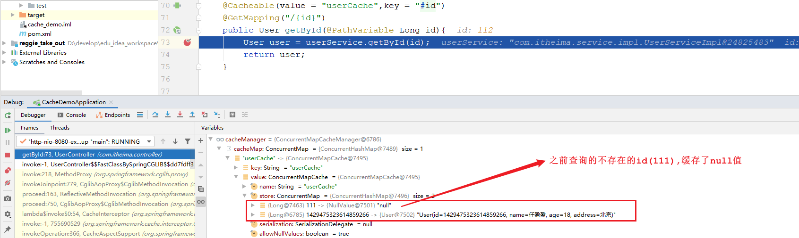 


我们能不能做到，当查询到的值不为null时，再进行缓存，如果为null，则不缓存呢? 答案是可以的。


**3). 缓存非null值**

在@Cacheable注解中，提供了两个属性分别为： condition， unless 。

> condition : 表示满足什么条件, 再进行缓存 ;
>
> unless : 表示满足条件则不缓存 ; 与上述的condition是反向的 ;


具体实现方式如下: 

```java
/**
 * Cacheable：在方法执行前spring先查看缓存中是否有数据，如果有数据，则直接返回缓存数据；若没有数据，调用方法并将方法返回值放到缓存中
 * value：缓存的名称，每个缓存名称下面可以有多个key
 * key：缓存的key
 * condition：条件，满足条件时才缓存数据
 * unless：满足条件则不缓存
 */
@Cacheable(value = "userCache",key = "#id", unless = "#result == null")
@GetMapping("/{id}")
public User getById(@PathVariable Long id){
    User user = userService.getById(id);
    return user;
}
```

==注意： 此处，我们使用的时候只能够使用 unless， 因为在condition中，我们是无法获取到结果 #result的。==


**4). 在list方法上加注解@Cacheable**

在list方法中进行查询时，有两个查询条件，如果传递了id，根据id查询； 如果传递了name， 根据name查询，那么我们缓存的key在设计的时候，就需要既包含id，又包含name。 具体的代码实现如下： 

```java
@Cacheable(value = "userCache",key = "#user.id + '_' + #user.name")
@GetMapping("/list")
public List<User> list(User user){
    LambdaQueryWrapper<User> queryWrapper = new LambdaQueryWrapper<>();
    queryWrapper.eq(user.getId() != null,User::getId,user.getId());
    queryWrapper.eq(user.getName() != null,User::getName,user.getName());
    List<User> list = userService.list(queryWrapper);
    return list;
}
```


然后再次重启服务，进行测试。

 

第一次查询时，需要查询数据库，在后续的查询中，就直接查询了缓存，不再查询数据库了。


### 4.4 集成Redis

在使用上述默认的ConcurrentHashMap做缓存时，服务重启之后，之前缓存的数据就全部丢失了，操作起来并不友好。在项目中使用，我们会选择使用redis来做缓存，主要需要操作以下几步： 

1). pom.xml

```xml
<dependency>
    <groupId>org.springframework.boot</groupId>
    <artifactId>spring-boot-starter-cache</artifactId>
</dependency>

<dependency>
    <groupId>org.springframework.boot</groupId>
    <artifactId>spring-boot-starter-data-redis</artifactId>
</dependency>
```


2). application.yml

```yml
spring:
  redis:
    host: 192.168.200.200
    port: 6379
    password: root@123456
    database: 0
  cache:
    redis:
      time-to-live: 1800000   #设置缓存过期时间，可选
```


3). 测试

重新启动项目，通过postman发送根据id查询数据的请求，然后通过redis的图形化界面工具，查看redis中是否可以正常的缓存数据。

  


## 5. 缓存套餐数据

### 5.1 实现思路

前面我们已经实现了移动端套餐查看功能，对应的服务端方法为SetmealController的list方法，此方法会根据前端提交的查询条件进行数据库查询操作。在高并发的情况下，频繁查询数据库会导致系统性能下降，服务端响应时间增长。现在需要对此方法进行缓存优化，提高系统的性能。


具体的实现思路如下：

1). 导入Spring Cache和Redis相关maven坐标

2). 在application.yml中配置缓存数据的过期时间

3). 在启动类上加入@EnableCaching注解，开启缓存注解功能

4). 在SetmealController的list方法上加入@Cacheable注解

5). 在SetmealController的save和delete方法上加入CacheEvict注解


### 5.2 缓存套餐数据

#### 5.2.1 代码实现

1). pom.xml中引入依赖

```xml
<dependency>
    <groupId>org.springframework.boot</groupId>
    <artifactId>spring-boot-starter-cache</artifactId>
</dependency>
```

==备注: spring-boot-starter-data-redis 这个依赖前面已经引入了, 无需再次引入。==


2). application.yml中设置缓存过期时间

```yml
spring:  
  cache:
    redis:
      time-to-live: 1800000 #设置缓存数据的过期时间
```


3). 启动类上加入@EnableCaching注解

 


4). SetmealController的list方法上加入@Cacheable注解

在进行套餐数据查询时，我们需要根据分类ID和套餐的状态进行查询，所以我们在缓存数据时，可以将套餐分类ID和套餐状态组合起来作为key，如： 1627182182_1 (1627182182为分类ID，1为状态)。

```java
/**
* 根据条件查询套餐数据
* @param setmeal
* @return
*/
@GetMapping("/list")
@Cacheable(value = "setmealCache",key = "#setmeal.categoryId + '_' + #setmeal.status")
public R<List<Setmeal>> list(Setmeal setmeal){
    LambdaQueryWrapper<Setmeal> queryWrapper = new LambdaQueryWrapper<>();
    queryWrapper.eq(setmeal.getCategoryId() != null,Setmeal::getCategoryId,setmeal.getCategoryId());
    queryWrapper.eq(setmeal.getStatus() != null,Setmeal::getStatus,setmeal.getStatus());
    queryWrapper.orderByDesc(Setmeal::getUpdateTime);

    List<Setmeal> list = setmealService.list(queryWrapper);

    return R.success(list);
}
```


#### 5.2.2 测试

缓存数据的代码编写完毕之后，重新启动服务，访问移动端进行测试，我们登陆之后在点餐界面，点击某一个套餐分类，查询套餐列表数据时，服务端报错了，错误信息如下： 

 

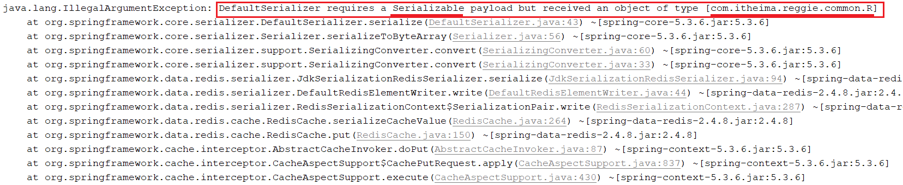 


==为什么会报出这个错误呢？==

因为 @Cacheable 会将方法的返回值R缓存在Redis中，而在Redis中存储对象，该对象是需要被序列化的，而对象要想被成功的序列化，就必须得实现 Serializable 接口。而当前我们定义的R，并未实现 Serializable 接口。所以，要解决该异常，只需要让R实现  Serializable 接口即可。如下： 

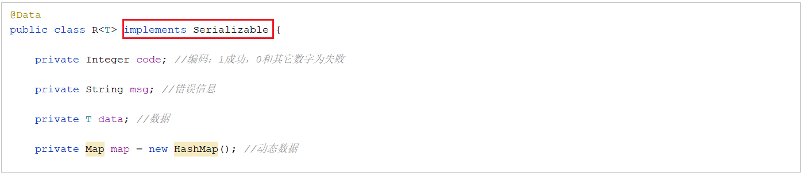 


修复完毕之后，再次重新测试，访问套餐分类下对应的套餐列表数据后，我们会看到Redis中确实可以缓存对应的套餐列表数据。

 


### 5.3 清理套餐数据

#### 5.3.1 代码实现

为了保证数据库中数据与缓存数据的一致性，在我们添加套餐或者删除套餐数据之后，需要清空当前套餐缓存的全部数据。那么@CacheEvict注解如何清除某一份缓存下所有的数据呢，这里我们可以指定@CacheEvict中的一个属性 allEnties，将其设置为true即可。


**1). 在delete方法上加注解@CacheEvict**

```java
/**
 * 删除套餐
 * @param ids
 * @return
 */
@DeleteMapping
@CacheEvict(value = "setmealCache",allEntries = true) //清除setmealCache名称下,所有的缓存数据
public R<String> delete(@RequestParam List<Long> ids){
    log.info("ids:{}",ids);
    setmealService.removeWithDish(ids);
    return R.success("套餐数据删除成功");
}
```


**2). 在delete方法上加注解@CacheEvict**

```java
/**
 * 新增套餐
 * @param setmealDto
 * @return
 */
@PostMapping
@CacheEvict(value = "setmealCache",allEntries = true) //清除setmealCache名称下,所有的缓存数据
public R<String> save(@RequestBody SetmealDto setmealDto){
    log.info("套餐信息：{}",setmealDto);

    setmealService.saveWithDish(setmealDto);

    return R.success("新增套餐成功");
}
```


#### 5.3.2 测试

代码编写完成之后,重启工程,然后访问后台管理系统,对套餐数据进行新增 以及 删除, 然后通过Redis的图形化界面工具,查看Redis中的套餐缓存是否已经被删除。


### 5.4 提交推送代码

到目前为止，我们已经在v1.0这个分支中完成了套餐数据的缓存，接下来我们就需要将代码提交并推送到远程仓库。

 

然后，在idea中切换到master分支，然后将v1.0分支的代码合并到master。

 


再将合并后的master分支的代码，推送到远程仓库。

 


