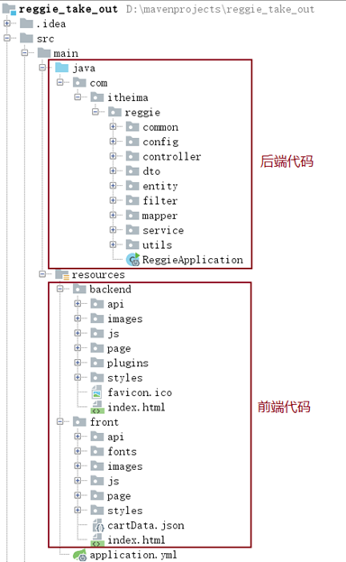
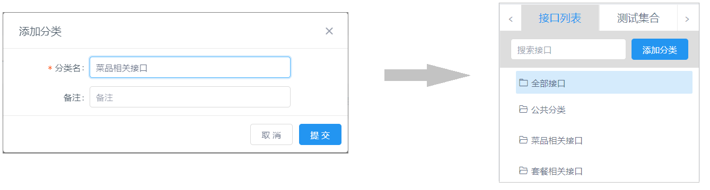
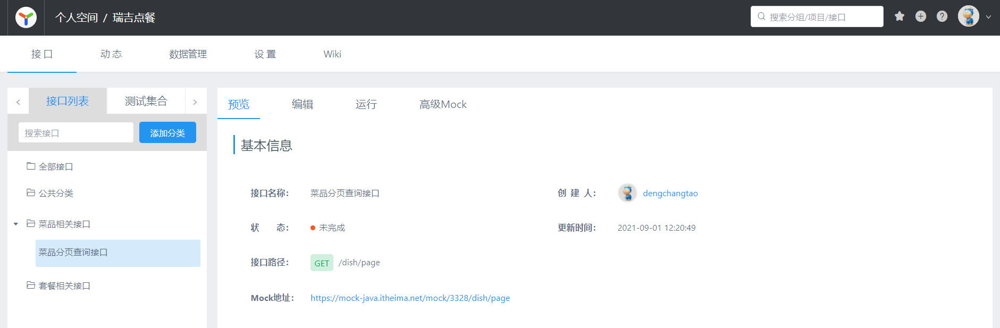
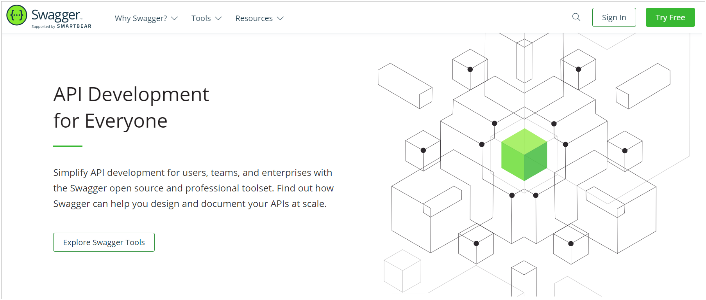
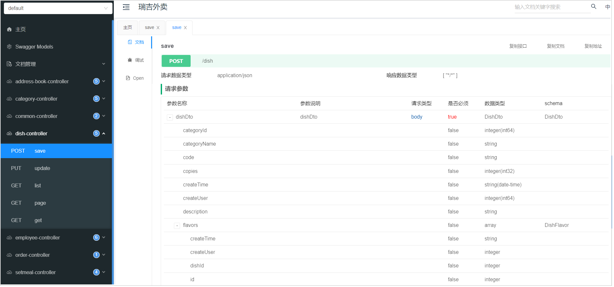
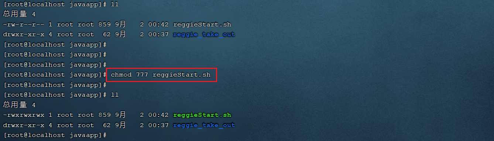
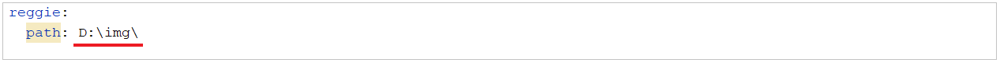

# 瑞吉外卖项目优化-Day03

## 课程内容

- 前后端分离开发

- Yapi

- Swagger

- 项目部署


## 前言

> 当前项目中，前端代码和后端代码混合在一起，是存在问题的，存在什么问题呢？

 

主要存在以下几点问题： 

1). 开发人员同时负责前端和后端代码开发，分工不明确

2). 开发效率低

3). 前后端代码混合在一个工程中，不便于管理

4). 对开发人员要求高(既会前端，又会后端)，人员招聘困难


为了解决上述提到的问题，现在比较主流的开发方式，就是**前后端分离开发**，前端人员开发前端的代码，后端开发人员开发服务端的业务功能，分工明确，各司其职。我们本章节，就是需要将之前的项目进行优化改造，变成前后端分离开发的项目。


## 1. 前后端分离开发

### 1.1 介绍

**前后端分离开发**，就是在项目开发过程中，对于前端代码的开发由专门的前端开发人员负责，后端代码则由后端开发人员负责，这样可以做到分工明确、各司其职，提高开发效率，前后端代码并行开发，可以加快项目开发进度。

目前，前后端分离开发方式已经被越来越多的公司所采用，成为当前项目开发的主流开发方式。


前后端分离开发后，从工程结构上也会发生变化，即前后端代码不再混合在同一个maven工程中，而是分为 **前端工程** 和 **后端工程** 。

 

前后端分离之后，不仅工程结构变化，后期项目上线部署时，与之前也不同:

1). 之前: 前后端代码都混合在一起，我们只需要将前端和后端的代码统一打成jar包，直接运行就可以了。 

2). 现在: 拆分为前后端分离的项目后，最终部署时，后端工程会打成一个jar包，运行在Tomcat中(springboot内嵌的tomcat)。前端工程的静态资源，会直接部署在Nginx中进行访问。


### 1.2 开发流程

前后端分离开发后，面临一个问题，就是前端开发人员和后端开发人员如何进行配合来共同开发一个项目？可以按照如下流程进行：

             


1). 定制接口: 这里所说的接口不是我们之前在service， mapper层定义的interface； 这里的接口(API接口)就是一个http的请求地址，主要就是去定义：请求路径、请求方式、请求参数、响应数据等内容。(具体接口文档描述的信息, 如上图)

2). 前后端并行开发: 依据定义好的接口信息，前端人员开发前端的代码，服务端人员开发服务端的接口； 在开发中前后端都需要进行测试，后端需要通过对应的工具来进行接口的测试，前端需要根据接口定义的参数进行Mock数据模拟测试。

3). 联调: 当前后端都开发完毕并且自测通过之后，就可以进行前后端的联调测试了，在这一阶段主要就是校验接口的参数格式。

4). 提测: 前后端联调测试通过之后，就可以将项目部署到测试服务器，进行自动化测试了。

 


### 1.3 前端技术栈

**1). 开发工具**

Visual Studio Code (简称VsCode)

Hbuilder


**2). 技术框架**

A. Node.js:  Node.js 是一个基于 Chrome V8 引擎的 JavaScript 运行环境。(类似于java语言中的JDK)。

B. Vue : 目前最火的的一个前端javaScript框架。

C. ElementUI: 一套为开发者、设计师和产品经理准备的基于 Vue 2.0 的桌面端组件库，通过ElementUI组件可以快速构建项目页面。

D. Mock: 生成随机数据，拦截 Ajax 请求，前端可以借助于Mock生成测试数据进行功能测试。

E. Webpack: webpack 是一个现代 JavaScript 应用程序的模块打包器(module bundler)，分析你的项目结构，找到JavaScript模块以及其它的一些浏览器不能直接运行的拓展语言（Sass，TypeScript等），并将其转换和打包为合适的格式供浏览器使用。


## 2. Yapi

### 2.1 介绍

 

YApi 是高效、易用、功能强大的 api 管理平台，旨在为开发、产品、测试人员提供更优雅的接口管理服务。可以帮助开发者轻松创建、发布、维护 API，YApi 还为用户提供了优秀的交互体验，开发人员只需利用平台提供的接口数据写入工具以及简单的点击操作就可以实现接口的管理。

YApi让接口开发更简单高效，让接口的管理更具可读性、可维护性，让团队协作更合理。


源码地址: https://github.com/YMFE/yapi

官方文档: https://hellosean1025.github.io/yapi/


要使用YApi，项目组需要自己进行部署，在本项目中我们可以使用课程提供的平台进行测试，域名： https://mock-java.itheima.net/

  


### 2.2 使用

#### 2.2.1 准备

注册账号，登录平台

 


#### 2.2.2 定义接口

登录到Yapi平台之后，我们可以创建项目，在项目下创建接口分类，在对应的分类中添加接口。

 1). 创建项目

 

 


2). 添加分类

在当前项目中,有针对于员工、菜品、套餐、订单的操作，我们在进行接口维护时，可以针对接口进行分类，如果没有对应的分类，我们自己添加分类。

 


3). 添加接口

 

接口基本信息录入之后，添加提交，就可以看到该接口的基本信息：

  

但是目前，接口中我们并未指定请求参数，响应数据等信息，我们可以进一步点击编辑，对该接口 详情进行编辑处理。

 


4). 运行接口

Yapi也提供了接口测试功能，当我们接口编辑完毕后，后端服务的代码开发完毕，启动服务，就可以使用Yapi进行接口测试了。

 

<font color='red'>注意： 由于菜品分页查询接口，是需要登录后才可以访问的，所以在测试该接口时，需要先请求员工管理接口中的登录接口，登录完成后，再访问该接口。</font>


在Yapi平台中，将接口文档定义好了之后，前后端开发人员就需要根据接口文档中关于接口的描述进行前端和后端功能的开发。


#### 2.2.3 导出接口文档

在Yapi平台中我们不仅可以在线阅读文档，还可以将Yapi中维护的文档直接导出来，可以导出md，json，html格式，在导出时自行选择即可 。

 

而在导出的html文件或md文件中，主要描述的就是接口的基本信息， 包括： 请求路径、请求方式、接口描述、请求参数、返回数据等信息。展示形式如下： 

 


#### 2.2.4 导入接口文档

上述我们讲解了接口文档的导出，我们也可以将外部的接口文档导入到Yapi的平台中，这样我们就不用一个接口一个接口的添加了。我们可以将课程资料中提供的json格式的接口文档直接导入Yapi平台中来。

 

导入过程中出现的确认弹窗，选择"确认"。

 

导入成功之后，我们就可以在Yapi平台查看到已导入的接口。

 


## 3. Swagger

### 3.1 介绍

官网：https://swagger.io/

 

Swagger 是一个规范和完整的框架，用于生成、描述、调用和可视化 RESTful 风格的 Web 服务。功能主要包含以下几点:

A. 使得前后端分离开发更加方便，有利于团队协作

B. 接口文档在线自动生成，降低后端开发人员编写接口文档的负担

C. 接口功能测试

使用Swagger只需要按照它的规范去定义接口及接口相关的信息，再通过Swagger衍生出来的一系列项目和工具，就可以做到生成各种格式的接口文档，以及在线接口调试页面等等。


直接使用Swagger, 需要按照Swagger的规范定义接口, 实际上就是编写Json文件，编写起来比较繁琐、并不方便, 。而在项目中使用，我们一般会选择一些现成的框架来简化文档的编写，而这些框架是基于Swagger的，如knife4j。knife4j是为Java MVC框架集成Swagger生成Api文档的增强解决方案。而我们要使用kinfe4j，需要在pom.xml中引入如下依赖即可： 

```xml
<dependency>
    <groupId>com.github.xiaoymin</groupId>
    <artifactId>knife4j-spring-boot-starter</artifactId>
    <version>3.0.2</version>
</dependency>
```


### 3.2 使用方式

接下来，我们就将我们的项目集成Knife4j，来自动生成接口文档。这里我们还是需要再创建一个新的分支v1.2，在该分支中进行knife4j的集成，集成测试完毕之后，没有问题，我们再将v1.2分支合并到master。

使用knife4j，主要需要操作以下几步:

**1). 导入knife4j的maven坐标**

```xml
<dependency>
    <groupId>com.github.xiaoymin</groupId>
    <artifactId>knife4j-spring-boot-starter</artifactId>
    <version>3.0.2</version>
</dependency>
```


**2). 导入knife4j相关配置类**

这里我们就不需要再创建一个新的配置类了，我们直接在WebMvcConfig配置类中声明即可。

A. 在该配置类中加上两个注解 @EnableSwagger2 @EnableKnife4j ,开启Swagger和Knife4j的功能。

B. 在配置类中声明一个Docket类型的bean, 通过该bean来指定生成文档的信息。

```java
@Slf4j
@Configuration
@EnableSwagger2
@EnableKnife4j
public class WebMvcConfig extends WebMvcConfigurationSupport {
	
    /**
     * 设置静态资源映射
     * @param registry
     */
    @Override
    protected void addResourceHandlers(ResourceHandlerRegistry registry) {
        log.info("开始进行静态资源映射...");
        registry.addResourceHandler("/backend/**").addResourceLocations("classpath:/backend/");
        registry.addResourceHandler("/front/**").addResourceLocations("classpath:/front/");
    }
	
    /**
     * 扩展mvc框架的消息转换器
     * @param converters
     */
    @Override
    protected void extendMessageConverters(List<HttpMessageConverter<?>> converters) {
        log.info("扩展消息转换器...");
        //创建消息转换器对象
        MappingJackson2HttpMessageConverter messageConverter = new MappingJackson2HttpMessageConverter();
        //设置对象转换器，底层使用Jackson将Java对象转为json
        messageConverter.setObjectMapper(new JacksonObjectMapper());
        //将上面的消息转换器对象追加到mvc框架的转换器集合中
        converters.add(0,messageConverter);
    }
	
    @Bean
    public Docket createRestApi() {
        // 文档类型
        return new Docket(DocumentationType.SWAGGER_2)
                .apiInfo(apiInfo())
                .select()
                .apis(RequestHandlerSelectors.basePackage("com.itheima.reggie.controller"))
                .paths(PathSelectors.any())
                .build();
    }
	
    private ApiInfo apiInfo() {
        return new ApiInfoBuilder()
                .title("瑞吉外卖")
                .version("1.0")
                .description("瑞吉外卖接口文档")
                .build();
    }
}
```

> 注意： Docket声明时，指定的有一个包扫描的路径，该路径指定的是Controller所在包的路径。因为Swagger在生成接口文档时，就是根据这里指定的包路径，自动的扫描该包下的@Controller， @RestController， @RequestMapping等SpringMVC的注解，依据这些注解来生成对应的接口文档。


**3). 设置静态资源映射**

由于Swagger生成的在线文档中，涉及到很多静态资源，这些静态资源需要添加静态资源映射，否则接口文档页面无法访问。因此需要在 WebMvcConfig类中的addResourceHandlers方法中增加如下配置。

```java
registry.addResourceHandler("doc.html").addResourceLocations("classpath:/META-INF/resources/");
registry.addResourceHandler("/webjars/**").addResourceLocations("classpath:/META-INF/resources/webjars/");
```


**4). 在LoginCheckFilter中设置不需要处理的请求路径**

需要将Swagger及Knife4j相关的静态资源直接放行，无需登录即可访问，否则我们就需要登录之后，才可以访问接口文档的页面。

在原有的不需要处理的请求路径中，再增加如下链接： 

```java
"/doc.html",
"/webjars/**",
"/swagger-resources",
"/v2/api-docs"
```

 


### 3.3 查看接口文档

经过上面的集成配置之后，我们的项目集成Swagger及Knife4j就已经完成了，接下来我们可以重新启动项目，访问接口文档，访问链接为： http://localhost:8080/doc.html

 

我们可以看到，在所有的Controller中提供的所有的业务增删改查的接口，全部都已经自动生成了，我们通过接口文档可以看到请求的url、请求方式、请求参数、请求实例、响应的参数，响应的示例。 并且呢，我们也可以通过这份在线的接口文档，对接口进行测试。

 


注意： 由于我们服务端的Controller中的业务增删改查的方法，都是必须登录之后才可以访问的，所以，我们在测试时候，也是需要先访问登录接口。登录完成之后，我们可以再访问其他接口进行测试。


我们不仅可以在浏览器浏览生成的接口文档，Knife4j还支持离线文档，对接口文档进行下载，支持下载的格式有：markdown、html、word、openApi。

 


### 3.4 常用注解

#### 3.4.1 问题说明

在上面我们直接访问Knife4j的接口文档页面，可以查看到所有的接口文档信息，但是我们发现，这些接口文档分类及接口描述都是Controller的类名(驼峰命名转换而来)及方法名，而且在接口文档中，所有的请求参数，响应数据，都没有中文的描述，并不知道里面参数的含义，接口文档的可读性很差。

 


#### 3.4.2 注解介绍

为了解决上述的问题，Swagger提供了很多的注解，通过这些注解，我们可以更好更清晰的描述我们的接口，包含接口的请求参数、响应数据、数据模型等。核心的注解，主要包含以下几个： 

| 注解               | 位置             | 说明                                                         |
| ------------------ | ---------------- | ------------------------------------------------------------ |
| @Api               | 类               | 加载Controller类上,表示对类的说明                            |
| @ApiModel          | 类(通常是实体类) | 描述实体类的作用                                             |
| @ApiModelProperty  | 属性             | 描述实体类的属性                                             |
| @ApiOperation      | 方法             | 说明方法的用途、作用                                         |
| @ApiImplicitParams | 方法             | 表示一组参数说明                                             |
| @ApiImplicitParam  | 方法             | 用在@ApiImplicitParams注解中，指定一个请求参数的各个方面的属性 |


#### 3.4.3 注解测试

**1). 实体类**

> 可以通过 @ApiModel , @ApiModelProperty 来描述实体类及属性

```java
@Data
@ApiModel("套餐")
public class Setmeal implements Serializable {
    private static final long serialVersionUID = 1L;
    @ApiModelProperty("主键")
    private Long id;
    
    //分类id
    @ApiModelProperty("分类id")
    private Long categoryId;
    
    //套餐名称
    @ApiModelProperty("套餐名称")
    private String name;

    //套餐价格
    @ApiModelProperty("套餐价格")
    private BigDecimal price;

    //状态 0:停用 1:启用
    @ApiModelProperty("状态")
    private Integer status;

    //编码
    @ApiModelProperty("套餐编号")
    private String code;

    //描述信息
    @ApiModelProperty("描述信息")
    private String description;

    //图片
    @ApiModelProperty("图片")
    private String image;

    @TableField(fill = FieldFill.INSERT)
    private LocalDateTime createTime;

    @TableField(fill = FieldFill.INSERT_UPDATE)
    private LocalDateTime updateTime;

    @TableField(fill = FieldFill.INSERT)
    private Long createUser;

    @TableField(fill = FieldFill.INSERT_UPDATE)
    private Long updateUser;
}
```


**2). 响应实体R**

```java
@Data
@ApiModel("返回结果")
public class R<T> implements Serializable{

    @ApiModelProperty("编码")
    private Integer code; //编码：1成功，0和其它数字为失败

    @ApiModelProperty("错误信息")
    private String msg; //错误信息

    @ApiModelProperty("数据")
    private T data; //数据

    @ApiModelProperty("动态数据")
    private Map map = new HashMap(); //动态数据
	
	//省略静态方法 ....
}    
```


**3). Controller类及其中的方法**

> 描述Controller、方法及其方法参数，可以通过注解： @Api， @APIOperation， @ApiImplicitParams, @ApiImplicitParam

```java
@RestController
@RequestMapping("/setmeal")
@Slf4j
@Api(tags = "套餐相关接口")
public class SetmealController {

    @Autowired
    private SetmealService setmealService;
    @Autowired
    private CategoryService categoryService;
    @Autowired
    private SetmealDishService setmealDishService;

    /**
     * 新增套餐
     * @param setmealDto
     * @return
     */
    @PostMapping
    @CacheEvict(value = "setmealCache",allEntries = true)
    @ApiOperation(value = "新增套餐接口")
    public R<String> save(@RequestBody SetmealDto setmealDto){
        log.info("套餐信息：{}",setmealDto);

        setmealService.saveWithDish(setmealDto);

        return R.success("新增套餐成功");
    }

    /**
     * 套餐分页查询
     * @param page
     * @param pageSize
     * @param name
     * @return
     */
    @GetMapping("/page")
    @ApiOperation(value = "套餐分页查询接口")
    @ApiImplicitParams({
            @ApiImplicitParam(name = "page",value = "页码",required = true),
            @ApiImplicitParam(name = "pageSize",value = "每页记录数",required = true),
            @ApiImplicitParam(name = "name",value = "套餐名称",required = false)
    })
    public R<Page> page(int page,int pageSize,String name){
        //分页构造器对象
        Page<Setmeal> pageInfo = new Page<>(page,pageSize);
        Page<SetmealDto> dtoPage = new Page<>();

        LambdaQueryWrapper<Setmeal> queryWrapper = new LambdaQueryWrapper<>();
        //添加查询条件，根据name进行like模糊查询
        queryWrapper.like(name != null,Setmeal::getName,name);
        //添加排序条件，根据更新时间降序排列
        queryWrapper.orderByDesc(Setmeal::getUpdateTime);

        setmealService.page(pageInfo,queryWrapper);

        //对象拷贝
        BeanUtils.copyProperties(pageInfo,dtoPage,"records");
        List<Setmeal> records = pageInfo.getRecords();

        List<SetmealDto> list = records.stream().map((item) -> {
            SetmealDto setmealDto = new SetmealDto();
            //对象拷贝
            BeanUtils.copyProperties(item,setmealDto);
            //分类id
            Long categoryId = item.getCategoryId();
            //根据分类id查询分类对象
            Category category = categoryService.getById(categoryId);
            if(category != null){
                //分类名称
                String categoryName = category.getName();
                setmealDto.setCategoryName(categoryName);
            }
            return setmealDto;
        }).collect(Collectors.toList());

        dtoPage.setRecords(list);
        return R.success(dtoPage);
    }

    /**
     * 删除套餐
     * @param ids
     * @return
     */
    @DeleteMapping
    @CacheEvict(value = "setmealCache",allEntries = true)
    @ApiOperation(value = "套餐删除接口")
    public R<String> delete(@RequestParam List<Long> ids){
        log.info("ids:{}",ids);

        setmealService.removeWithDish(ids);

        return R.success("套餐数据删除成功");
    }

    /**
     * 根据条件查询套餐数据
     * @param setmeal
     * @return
     */
    @GetMapping("/list")
    @Cacheable(value = "setmealCache",key = "#setmeal.categoryId + '_' + #setmeal.status")
    @ApiOperation(value = "套餐条件查询接口")
    public R<List<Setmeal>> list(Setmeal setmeal){
        LambdaQueryWrapper<Setmeal> queryWrapper = new LambdaQueryWrapper<>();
        queryWrapper.eq(setmeal.getCategoryId() != null,Setmeal::getCategoryId,setmeal.getCategoryId());
        queryWrapper.eq(setmeal.getStatus() != null,Setmeal::getStatus,setmeal.getStatus());
        queryWrapper.orderByDesc(Setmeal::getUpdateTime);

        List<Setmeal> list = setmealService.list(queryWrapper);

        return R.success(list);
    }
}

```


**4). 重启服务测试**

我们上述通过Swagger的注解，对实体类及实体类中的属性，以及Controller和Controller的方法进行描述，接下来，我们重新启动服务，然后看一下自动生成的接口文档有何变化。

 

在接口文档的页面中，我们可以看到接口的中文描述，清晰的看到每一个接口是做什么的，接口方法参数什么含义，参数是否是必填的，响应结果的参数是什么含义等，都可以清楚的描述出来。

总之，我们要想清晰的描述一个接口，就需要借助于Swagger给我们提供的注解。


## 4. 项目部署

在本章节，我们要做的是项目的部署，包含前端项目的部署，及后端项目的部署。

### 4.1 部署架构

 

PC端： 主要是为餐厅的员工及管理员使用的后台管理系统，对分类、菜品、套餐信息进行维护。

移动端： 可以基于微信公众号或小程序实现，我们课上并未实现，这部分的工作是前端开发人员需要开发的。


前端部署服务器： Nginx

后端部署服务器： Tomcat(内嵌)


### 4.2 环境说明

由于我们的服务器数量有限，就使用这三台服务器，具体的软件规划如下: 

| 服务器          | 软件                                                         | 名称    |
| --------------- | ------------------------------------------------------------ | ------- |
| 192.168.138.100 | Nginx(部署前端项目、配置反向代理)，MySQL(主从复制的主库)     | 服务器A |
| 192.168.138.101 | JDK1.8、Git、Maven、jar(项目jar包基于内嵌Tomcat运行)、MySQL(主从复制的从库) | 服务器B |
| 172.17.2.94     | Redis(缓存中间件)                                            | 服务器C |


由于我们前面的课程中Nginx、MySQL的主从复制、Redis、JDK、Git、Maven都已经演示过安装及配置了，这里我们就不再演示软件的安装了。


### 4.3 前端部署

**1). 在服务器A(192.168.138.100)中安装Nginx，将课程资料中的dist目录上传到Nginx的html目录下**

 

将整个dist目录上传至/usr/local/nginx/html目录下

 


**2). 修改Nginx配置文件nginx.conf**

将nginx.conf配置文件中，将原有的监听80, 82, 8080端口号 的虚拟主机注释掉，引入如下的配置信息：

```properties
    server {
        listen       80;
        server_name  localhost;

        location / {
            root   html/dist;
            index  index.html;
        }
		
		location ^~ /api/ {
			rewrite ^/api/(.*)$ /$1 break;
			proxy_pass http://192.168.138.101:8080;
		}
		
        location = /50x.html {
            root   html;
        }
    }
```

 


**3). 通过nginx访问前端工程**

http://192.168.138.100

 


### 4.4 反向代理配置

前端工程部署完成之后，我们可以正常的访问到系统的登录页面，点击登录按钮，可以看到服务端发起的请求，请求信息如下： 

 

而大家知道，在我们之前开发的工程中，是没有/api这个前缀的,那这个时候,在不修改服务端代码的情况下，如何处理该请求呢? 

实际上，通过nginx的就可以轻松解决这个问题。


在上述我们配置的nginx.conf中，除了配置了静态资源的加载目录以外，我们还配置了一段反向代理的配置，配置信息如下： 

```properties
location ^~ /api/ {
    rewrite ^/api/(.*)$ /$1 break;
    proxy_pass http://192.168.138.101:8080;
}
```

这一段配置代表，如果请求当前nginx，并且请求的路径如果是 /api/ 开头，将会被该location处理。而在该location中，主要配置了两块儿信息： rewrite(url重写) 和 proxy_pass(反向代理)。 接下来我们就来解析一下这两项的配置。


**1). 路径重写rewrite**

```
rewrite ^/api/(.*)$ /$1 break;
```

这里写的是一个正则表达式，代表如果请求路径是以 `/api/` 开头，后面的请求路径任意，此时将原始的url路径重写为 `/$1`，这里的`$1`指代的就是通配符 .* 这一块的内容。比如： 

```
/api/employee/login ------> ^/api/(.*)$ --------> 此时 (.*) 匹配的就是 employee/login ------> 最终重写为/$1 : /employee/login
```


**2). 反向代理**

```
proxy_pass http://192.168.138.101:8080;
```

路径重写后的请求，将会转发到后端的 http://192.168.138.101:8080 服务器中。 而这台服务器中，就部署的是我们的后端服务。


### 4.5 服务端部署

**1). 在服务器B(192.168.138.101)中安装jdk、git、maven、MySQL，使用git clone命令将git远程仓库的代码克隆下来**

A. 确认JDK环境

 


B. 确认Git环境

 


C. 确认Maven环境

 


D. 将我们开发完成的代码推送至远程仓库,并在服务器B中克隆下来

```shell
#创建java代码存放目录
mkdir -p /usr/local/javaapp

#切换目录
cd /usr/local/javaapp

#克隆代码 , 需要使用自己的远程仓库
git clone https://gitee.com/ChuanZhiBoKe/reggie_take_out.git 
```

  


**2). 将资料中提供的reggieStart.sh文件上传到服务器B，通过chmod命令设置执行权限**

 


**3). 执行reggieStart.sh脚本文件，自动部署项目**

 

执行完shell脚本之后，我们可以通过 ps -ef|grep java 指令，查看服务是否启动。

 


**4). 访问系统测试**

http://192.168.138.101/

 


### 4.6 图片展示问题处理

在上述的测试中，我们发现菜品的图片无法正常展示。原因是因为，在我们的配置文件中，图片信息依然是从 D:/img 中加载的，但是在Linux服务器中，是不存在D盘的。

 


**1). 修改文件存储目录**

将文件存储目录修改为：

```
reggie:
  path: /usr/local/img/
```

 修改完成之后，需要将变动的代码提交到本地仓库，并推送至远程仓库。

 


**2). 执行shell脚本,进行自动化部署**

 


**3). 将本地的测试图片文件夹img(整个文件夹)上传到服务器B的/usr/local目录下**

 


**4).访问测试**

http://192.168.138.101/

 


