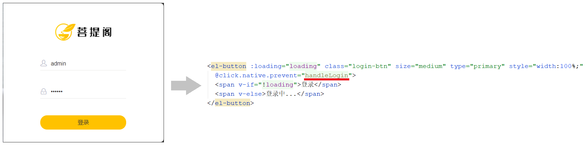
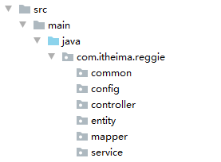
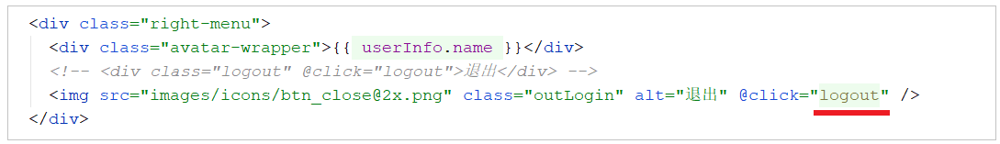
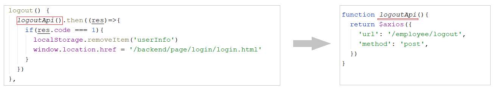
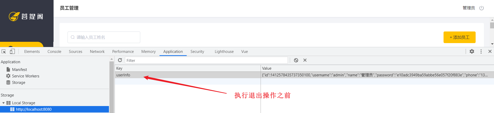

# 瑞吉外卖-Day01

## 课程内容

- 软件开发整体介绍

- 瑞吉外卖项目介绍

- 开发环境搭建

- 后台登录功能开发

- 后台退出功能开发


## 1. 软件开发整体介绍

作为一名软件开发工程师,我们需要了解在软件开发过程中的开发流程， 以及软件开发过程中涉及到的岗位角色，角色的分工、职责， 并了解软件开发中涉及到的三种软件环境。那么这一小节，我们将从 软件开发流程、角色分工、软件环境 三个方面，来整体上介绍一下软件开发。


### 1.1 软件开发流程

 


**1). 第1阶段: 需求分析**

完成产品原型、需求规格说明书的编写。  

产品原型，一般是通过网页(html)的形式展示当前的页面展示什么样的数据, 页面的布局是什么样子的，点击某个菜单，打开什么页面，点击某个按钮，出现什么效果，都可以通过产品原型看到。 

需求规格说明书， 一般来说就是使用 Word 文档来描述当前项目有哪些功能，每一项功能的需求及业务流程是什么样的，都会在文档中描述。


**2). 第2阶段: 设计**

设计的内容包含 产品设计、UI界面设计、概要设计、详细设计、数据库设计。

在设计阶段，会出具相关的UI界面、及相关的设计文档。比如数据库设计，需要设计当前项目中涉及到哪些数据库，每一个数据库里面包含哪些表，这些表结构之间的关系是什么样的，表结构中包含哪些字段，字段类型都会在文档中描述清楚。


**3). 第3阶段: 编码**

编写项目代码、并完成单元测试。

作为软件开发工程师，我们主要的工作就是在该阶段， 对分配给我们的模块功能，进行编码实现。编码实现完毕后，进行单元测试，单元测试通过后再进入到下一阶段。


**4). 第4阶段: 测试**

在该阶段中主要由测试人员, 对部署在测试环境的项目进行功能测试, 并出具测试报告。


**5). 第5阶段: 上线运维**

在项目上线之前， 会由运维人员准备服务器上的软件环境安装、配置， 配置完毕后， 再将我们开发好的项目，部署在服务器上运行。


我们作为软件开发工程师， 我们主要的任务是在编码阶段， 但是在一些小的项目组当中， 也会涉及到数据库的设计、测试等方面的工作。


### 1.2 角色分工

学习了软件开发的流程之后， 我们还有必要了解一下在整个软件开发过程中涉及到的岗位角色，以及各个角色的职责分工。

 

| 岗位/角色                           | 职责/分工                                  |
| ----------------------------------- | ------------------------------------------ |
| 项目经理                            | 对整个项目负责，任务分配、把控进度         |
| 产品经理                            | 进行需求调研，输出需求调研文档、产品原型等 |
| UI设计师                            | 根据产品原型输出界面效果图                 |
| 架构师                              | 项目整体架构设计、技术选型等               |
| <font color='red'>开发工程师</font> | <font color='red'>功能代码实现</font>      |
| 测试工程师                          | 编写测试用例，输出测试报告                 |
| 运维工程师                          | 软件环境搭建、项目上线                     |


上述我们讲解的角色分工, 是在一个项目组中比较标准的角色分工, 但是在实际的项目中, 有一些项目组由于人员配置紧张, 可能并没有专门的架构师或测试人员, 这个时候可能需要有项目经理或者程序员兼任。


### 1.3 软件环境

 

在我们日常的软件开发中，会涉及到软件开发中的三套环境， 那么这三套环境分别是: 开发环境、测试环境、生产环境。 接下来，我们分别介绍一下这三套环境的作用和特点。


**1). 开发环境(development)**

我们作为软件开发人员，在开发阶段使用的环境，就是开发环境，一般外部用户无法访问。

比如，我们在开发中使用的MySQL数据库和其他的一些常用软件，我们可以安装在本地， 也可以安装在一台专门的服务器中， 这些应用软件仅仅在软件开发过程中使用， 项目测试、上线时，我们不会使用这套环境了，这个环境就是开发环境。


**2). 测试环境(testing)**

当软件开发工程师，将项目的功能模块开发完毕，并且单元测试通过后，就需要将项目部署到测试服务器上，让测试人员对项目进行测试。那这台测试服务器就是专门给测试人员使用的环境， 也就是测试环境，用于项目测试，一般外部用户无法访问。


**3). 生产环境(production)**

当项目开发完毕，并且由测试人员测试通过之后，就可以上线项目，将项目部署到线上环境，并正式对外提供服务，这个线上环境也称之为生产环境。


> <font color='gree'> <b>拓展知识:</b></font> 
>
> ​	**准生产环境:** 对于有的公司来说，项目功能开发好, 并测试通过以后，并不是直接就上生产环境。为了保证我们开发的项目在上线之后能够完全满足要求，就需要把项目部署在真实的环境中, 测试一下是否完全符合要求啊，这时候就诞生了准生产环境，你可以把他当做生产环境的克隆体，准生产环境的服务器配置, 安装的应用软件(JDK、Tomcat、数据库、中间件 ...) 的版本都一样，这种环境也称为 "仿真环境"。
>
> ​	ps.由于项目的性质和类型不同，有的项目可能不需要这个环境


## 2. 瑞吉外卖项目介绍

在开发瑞吉外卖这个项目之前，我们需要全方位的来介绍一下当前我们学习的这个项目。接下来，我们将从以下的五个方面， 来介绍瑞吉外卖这个项目。


### 2.1 项目介绍

 


本项目（瑞吉外卖）是专门为餐饮企业（餐厅、饭店）定制的一款软件产品，包括 系统管理后台 和 移动端应用 两部分。其中系统管理后台主要提供给餐饮企业内部员工使用，可以对餐厅的分类、菜品、套餐、订单、员工等进行管理维护。移动端应用主要提供给消费者使用，可以在线浏览菜品、添加购物车、下单等。


本项目共分为3期进行开发：

| 阶段   | 功能实现                                                     |
| ------ | ------------------------------------------------------------ |
| 第一期 | 主要实现基本需求，其中移动端应用通过H5实现，用户可以通过手机浏览器访问 |
| 第二期 | 主要针对移动端应用进行改进，使用微信小程序实现，用户使用起来更加方便 |
| 第三期 | 主要针对系统进行优化升级，提高系统的访问性能                 |


### 2.2 产品原型

**产品原型**，就是一款产品成型之前，由产品经理绘制的一个简单的框架，就是将页面的排版布局展现出来，使产品的初步构思有一个可视化的展示。通过原型展示，可以更加直观的了解项目的需求和提供的功能。

> **<font color='red'>注意事项：</font>** 产品原型主要用于展示项目的功能，并不是最终的页面效果。


在课程资料的产品原型文件夹下,提供了两份产品原型。

 


**1). 管理端**

餐饮企业内部员工使用。 主要功能有: 

| 模块      | 描述                                                         |
| --------- | ------------------------------------------------------------ |
| 登录/退出 | 内部员工必须登录后,才可以访问系统管理后台                    |
| 员工管理  | 管理员可以在系统后台对员工信息进行管理，包含查询、新增、编辑、禁用等功能 |
| 分类管理  | 主要对当前餐厅经营的 菜品分类 或 套餐分类 进行管理维护， 包含查询、新增、修改、删除等功能 |
| 菜品管理  | 主要维护各个分类下的菜品信息，包含查询、新增、修改、删除、启售、停售等功能 |
| 套餐管理  | 主要维护当前餐厅中的套餐信息，包含查询、新增、修改、删除、启售、停售等功能 |
| 订单明细  | 主要维护用户在移动端下的订单信息，包含查询、取消、派送、完成，以及订单报表下载等功能 |


**2). 用户端**

移动端应用主要提供给消费者使用。主要功能有:

| 模块        | 描述                                                         |
| ----------- | ------------------------------------------------------------ |
| 登录/退出   | 在移动端, 用户也需要登录后使用APP进行点餐                    |
| 点餐-菜单   | 在点餐界面需要展示出菜品分类/套餐分类, 并根据当前选择的分类加载其中的菜品信息, 供用户查询选择 |
| 点餐-购物车 | 用户选中的菜品就会加入用户的购物车, 主要包含 查询购物车、加入购物车、删除购物车、清空购物车等功能 |
| 订单支付    | 用户选完菜品/套餐后, 可以对购物车菜品进行结算支付, 这时就需要进行订单的支付 |
| 个人信息    | 在个人中心页面中会展示当前用户的基本信息, 用户可以管理收货地址, 也可以查询历史订单数据 |


### 2.3 技术选型

关于本项目的技术选型, 我们将会从 用户层、网关层、应用层、数据层 这几个方面进行介绍，而对于我们服务端开发工程师来说，在项目开发过程中，我们主要关注应用层及数据层技术的应用。

 

**1). 用户层**

本项目中在构建系统管理后台的前端页面，我们会用到H5、Vue.js、ElementUI等技术。而在构建移动端应用时，我们会使用到微信小程序。


**2). 网关层**

Nginx是一个服务器，主要用来作为Http服务器，部署静态资源，访问性能高。在Nginx中还有两个比较重要的作用： 反向代理和负载均衡， 在进行项目部署时，要实现Tomcat的负载均衡，就可以通过Nginx来实现。


**3). 应用层**

SpringBoot： 快速构建Spring项目, 采用 "约定优于配置" 的思想, 简化Spring项目的配置开发。

Spring: 统一管理项目中的各种资源(bean), 在web开发的各层中都会用到。

SpringMVC：SpringMVC是spring框架的一个模块，springmvc和spring无需通过中间整合层进行整合，可以无缝集成。

SpringSession: 主要解决在集群环境下的Session共享问题。

lombok：能以简单的注解形式来简化java代码，提高开发人员的开发效率。例如开发中经常需要写的javabean，都需要花时间去添加相应的getter/setter，也许还要去写构造器、equals等方法。

Swagger： 可以自动的帮助开发人员生成接口文档，并对接口进行测试。


**4). 数据层**

MySQL： 关系型数据库, 本项目的核心业务数据都会采用MySQL进行存储。

MybatisPlus： 本项目持久层将会使用MybatisPlus来简化开发, 基本的单表增删改查直接调用框架提供的方法即可。

Redis： 基于key-value格式存储的内存数据库, 访问速度快, 经常使用它做缓存(降低数据库访问压力, 提供访问效率), 在后面的性能优化中会使用。


**5). 工具**

git: 版本控制工具, 在团队协作中, 使用该工具对项目中的代码进行管理。

maven: 项目构建工具。

junit：单元测试工具，开发人员功能实现完毕后，需要通过junit对功能进行单元测试。


### 2.4 功能架构

 

**1). 移动端前台功能**

手机号登录 , 微信登录 , 收件人地址管理 , 用户历史订单查询 , 菜品规格查询 , 购物车功能 , 下单 , 分类及菜品浏览。


**2). 系统管理后台功能**

员工登录/退出 , 员工信息管理 , 分类管理 , 菜品管理 , 套餐管理 , 菜品口味管理 , 订单管理 。


### 2.5 角色

在瑞吉外卖这个项目中，存在以下三种用户，这三种用户对应三个角色： 后台系统管理员、后台系统普通员工、C端(移动端)用户。

| 角色             | 权限操作                                                     |
| ---------------- | ------------------------------------------------------------ |
| 后台系统管理员   | 登录后台管理系统，拥有后台系统中的所有操作权限               |
| 后台系统普通员工 | 登录后台管理系统，对菜品、套餐、订单等进行管理 (不包含员工管理) |
| C端用户          | 登录移动端应用，可以浏览菜品、添加购物车、设置地址、在线下单等 |


## 3. 开发环境搭建

### 3.1 数据库环境搭建

#### 3.1.1 创建数据库

可以通过以下两种方式中的任意一种, 来创建项目的数据库:

**1).图形界面**

 

注意: 本项目数据库的字符串, 选择 utf8mb4


**2).命令行**

 


#### 3.1.2 数据库表导入

项目的数据库创建好了之后, 可以直接将 资料/数据模型/db_reggie.sql 直接导入到数据库中, 也可以通过两种方式实现:

**1).图形界面**

 


**2).命令行**

 


> **<font color='red'>注意:</font>** 通过命令导入表结构时，注意sql文件不要放在中文目录中


#### 3.1.3 数据库表介绍

数据库表导入之后, 接下来介绍一下本项目中所涉及到的表结构: 

| **序号** | **表名**      | **说明**         |
| -------- | ------------- | ---------------- |
| 1        | employee      | 员工表           |
| 2        | category      | 菜品和套餐分类表 |
| 3        | dish          | 菜品表           |
| 4        | setmeal       | 套餐表           |
| 5        | setmeal_dish  | 套餐菜品关系表   |
| 6        | dish_flavor   | 菜品口味关系表   |
| 7        | user          | 用户表（C端）    |
| 8        | address_book  | 地址簿表         |
| 9        | shopping_cart | 购物车表         |
| 10       | orders        | 订单表           |
| 11       | order_detail  | 订单明细表       |


上述的表结构, 我们目前先简单的结合页面原型了解一下, 大概有那些表, 每张表结构中存储什么样的数据, 有一个印象。对于具体的表结构, 以及表结构中的字段, 在讲解具体的功能开发时, 我们再详细介绍。


### 3.2 Maven项目搭建

#### 3.2.1 创建maven项目

**1). 在idea中创建maven project, 项目名称 reggie_take_out** 

 


**2). 检查项目编码**

 


**3). 检查maven配置**

 


**4). 检查JDK版本**

 

JDK的版本选择1.8;


#### 3.2.2 搭建基础环境

1).在pom.xml中导入依赖

```xml
<properties>
    <java.version>1.8</java.version>
</properties>

<parent>
    <groupId>org.springframework.boot</groupId>
    <artifactId>spring-boot-starter-parent</artifactId>
    <version>2.4.5</version>
    <relativePath/> <!-- lookup parent from repository -->
</parent>

<dependencies>
    <dependency>
        <groupId>org.springframework.boot</groupId>
        <artifactId>spring-boot-starter</artifactId>
    </dependency>
    <dependency>
        <groupId>org.springframework.boot</groupId>
        <artifactId>spring-boot-starter-test</artifactId>
        <scope>test</scope>
    </dependency>
    <dependency>
        <groupId>org.springframework.boot</groupId>
        <artifactId>spring-boot-starter-web</artifactId>
        <scope>compile</scope>
    </dependency>
    <dependency>
        <groupId>com.baomidou</groupId>
        <artifactId>mybatis-plus-boot-starter</artifactId>
        <version>3.4.2</version>
    </dependency>
    <dependency>
        <groupId>org.projectlombok</groupId>
        <artifactId>lombok</artifactId>
        <version>1.18.20</version>
    </dependency>
    <dependency>
        <groupId>com.alibaba</groupId>
        <artifactId>fastjson</artifactId>
        <version>1.2.76</version>
    </dependency>
    <dependency>
        <groupId>commons-lang</groupId>
        <artifactId>commons-lang</artifactId>
        <version>2.6</version>
    </dependency>
    <dependency>
        <groupId>mysql</groupId>
        <artifactId>mysql-connector-java</artifactId>
        <scope>runtime</scope>
    </dependency>
    <dependency>
        <groupId>com.alibaba</groupId>
        <artifactId>druid-spring-boot-starter</artifactId>
        <version>1.1.23</version>
    </dependency>
</dependencies>

<build>
    <plugins>
        <plugin>
            <groupId>org.springframework.boot</groupId>
            <artifactId>spring-boot-maven-plugin</artifactId>
            <version>2.4.5</version>
        </plugin>
    </plugins>
</build>
```


2).在工程的resources目录下创建application.yml文件,并引入配置

```yml
server:
  port: 8080
spring:
  application:
  	#应用名称 , 可选
    name: reggie_take_out
  datasource:
    druid:
      driver-class-name: com.mysql.cj.jdbc.Driver
      url: jdbc:mysql://localhost:3306/reggie?serverTimezone=Asia/Shanghai&useUnicode=true&characterEncoding=utf-8&zeroDateTimeBehavior=convertToNull&useSSL=false&allowPublicKeyRetrieval=true
      username: root
      password: root
mybatis-plus:
  configuration:
    #在映射实体或者属性时，将数据库中表名和字段名中的下划线去掉，按照驼峰命名法映射 address_book ---> AddressBook
    map-underscore-to-camel-case: true
    #日志输出
    log-impl: org.apache.ibatis.logging.stdout.StdOutImpl
  global-config:
    db-config:
      id-type: ASSIGN_ID
```


3).创建包 com.itheima.reggie , 并编写启动类

```java
import lombok.extern.slf4j.Slf4j;
import org.springframework.boot.SpringApplication;
import org.springframework.boot.autoconfigure.SpringBootApplication;

@Slf4j
@SpringBootApplication
public class ReggieApplication {
    public static void main(String[] args) {
        SpringApplication.run(ReggieApplication.class,args);
        log.info("项目启动成功...");
    }
}
```


> @Slf4j : 
>
> ​	是lombok中提供的注解, 用来通过slf4j记录日志。


当搭建完上述的基础环境之后, 就可以通过引导类, 启动该项目。


#### 3.2.3 前端静态资源导入

我们作为服务端开发工程师， 我们课程学习的重心应该放在后端的业务代码上， 前端的页面我们只需要导入课程资料中的前端资源， 前端页面的代码我们只需要能看懂即可。


**1). 导入静态资源**

前端资源存放位置为  资料/前端资源 :  

将上述两个目录中的静态资源文件, 导入到项目的resources目录下: 

 


**2). 创建配置类WebMvcConfig，设置静态资源映射**

用于在Springboot项目中, 默认静态资源的存放目录为 : "classpath:/resources/", "classpath:/static/", "classpath:/public/" ; 而在我们的项目中静态资源存放在 backend, front 目录中, 那么这个时候要想访问到静态资源, 就需要设置静态资源映射。

```java
import lombok.extern.slf4j.Slf4j;
import org.springframework.context.annotation.Configuration;
import org.springframework.web.servlet.config.annotation.ResourceHandlerRegistry;
import org.springframework.web.servlet.config.annotation.WebMvcConfigurationSupport;

@Slf4j
@Configuration
public class WebMvcConfig extends WebMvcConfigurationSupport {
    /**
     * 设置静态资源映射
     * @param registry
     */
    @Override
    protected void addResourceHandlers(ResourceHandlerRegistry registry) {
        log.info("开始进行静态资源映射...");
        registry.addResourceHandler("/backend/**").addResourceLocations("classpath:/backend/");
        registry.addResourceHandler("/front/**").addResourceLocations("classpath:/front/");
    }
}
```


**3). 访问测试**

http://localhost:8080/backend/index.html

 


## 4. 后台系统登录功能

### 4.1 需求分析

**1). 页面原型展示**

   


**2). 登录页面成品展示**

登录页面存放目录 /resources/backend/page/login/login.html

 


**3). 查看登录请求**

通过浏览器调试工具（F12），可以发现，点击登录按钮时，页面会发送请求（请求地址为http://localhost:8080/employee/login）并提交参数 username和password, 请求参数为json格式数据 {"username":"admin","password":"123456"}。

 

> 此时报404，是因为我们的后台系统还没有响应此请求的处理器，所以我们需要创建相关类来处理登录请求 ；
>
>  


**4). 数据模型(employee表)**

 


**5). 前端页面分析**

 


当点击 "登录" 按钮, 会触发Vue中定义的 handleLogin 方法:

 

在上述的前端代码中, 大家可以看到, 发送登录的异步请求之后, 获取到响应结果, 在响应结果中至少包含三个属性: code、data、msg 。


由前端代码，我们也可以看到，在用户登录成功之后，服务端会返回用户信息，而前端是将这些用户信息，存储在客户端的 localStorage 中了。

```js
localStorage.setItem('userInfo',JSON.stringify(res.data))
```


### 4.2 代码开发

#### 4.2.1 基础准备工作

在进行登录功能的代码实现之前， 首先在我们的工程下创建包结构： 

 


**1). 创建实体类Employee**

该实体类主要用于和员工表 employee 进行映射。 该实体类， 也可以直接从资料( 资料/实体类 )中拷贝工程中。

所属包: com.itheima.reggie.entity

```java
import com.baomidou.mybatisplus.annotation.FieldFill;
import com.baomidou.mybatisplus.annotation.TableField;
import lombok.Data;
import java.io.Serializable;
import java.time.LocalDateTime;

@Data
public class Employee implements Serializable {
    private static final long serialVersionUID = 1L;

    private Long id;

    private String username;

    private String name;

    private String password;

    private String phone;

    private String sex;

    private String idNumber; //驼峰命名法 ---> 映射的字段名为 id_number

    private Integer status;

    private LocalDateTime createTime;

    private LocalDateTime updateTime;

    @TableField(fill = FieldFill.INSERT)
    private Long createUser;

    @TableField(fill = FieldFill.INSERT_UPDATE)
    private Long updateUser;
}
```


**2). 定义Mapper接口**

在MybatisPlus中, 自定义的Mapper接口, 需要继承自 BaseMapper。

所属包: com.itheima.reggie.mapper

```java
@Mapper
public interface EmployeeMapper extends BaseMapper<Employee>{
}
```


**3).Service接口**

本项目的Service接口, 在定义时需要继承自MybatisPlus提供的Service层接口 IService, 这样就可以直接调用 父接口的方法直接执行业务操作, 简化业务层代码实现。

所属包: com.itheima.reggie.service

```java
public interface EmployeeService extends IService<Employee> {
}
```


**4). Service实现类**

所属包: com.itheima.reggie.service.impl

```java
import com.baomidou.mybatisplus.extension.service.impl.ServiceImpl;
import com.itheima.reggie.entity.Employee;
import com.itheima.reggie.mapper.EmployeeMapper;
import com.itheima.reggie.service.EmployeeService;
import org.springframework.stereotype.Service;

@Service
public class EmployeeServiceImpl extends ServiceImpl<EmployeeMapper,Employee> implements EmployeeService{
}
```


**5). Controller基础代码**

所属包: com.itheima.reggie.controller

```java
import lombok.extern.slf4j.Slf4j;
import org.springframework.beans.factory.annotation.Autowired;
import org.springframework.web.bind.annotation.RequestMapping;
import org.springframework.web.bind.annotation.RestController;

@Slf4j
@RestController
@RequestMapping("/employee")
public class EmployeeController {

    @Autowired
    private EmployeeService employeeService;
	
}    
```


**6). 导入通用结果类R**

此类是一个通用结果类，服务端响应的所有结果最终都会包装成此种类型返回给前端页面。

所属包: com.itheima.reggie.common

```java
import lombok.Data;
import java.util.HashMap;
import java.util.Map;

/**
 * 通用返回结果，服务端响应的数据最终都会封装成此对象
 * @param <T>
 */
@Data
public class R<T> {
    private Integer code; //编码：1成功，0和其它数字为失败
    private String msg; //错误信息
    private T data; //数据
    private Map map = new HashMap(); //动态数据

    public static <T> R<T> success(T object) {
        R<T> r = new R<T>();
        r.data = object;
        r.code = 1;
        return r;
    }
    public static <T> R<T> error(String msg) {
        R r = new R();
        r.msg = msg;
        r.code = 0;
        return r;
    }
    public R<T> add(String key, Object value) {
        this.map.put(key, value);
        return this;
    }
}
```

A. 如果业务执行结果为成功, 构建R对象时, 只需要调用 success 方法; 如果需要返回数据传递 object 参数, 如果无需返回, 可以直接传递null。

B. 如果业务执行结果为失败, 构建R对象时, 只需要调用error 方法, 传递错误提示信息即可。


#### 4.2.2 登录逻辑分析

 

处理逻辑如下：

①. 将页面提交的密码password进行md5加密处理, 得到加密后的字符串

②. 根据页面提交的用户名username查询数据库中员工数据信息

③. 如果没有查询到, 则返回登录失败结果

④. 密码比对，如果不一致, 则返回登录失败结果

⑤. 查看员工状态，如果为已禁用状态，则返回员工已禁用结果

⑥. 登录成功，将员工id存入Session, 并返回登录成功结果


#### 4.2.3 代码实现

**技术点说明:** 

A. 由于需求分析时, 我们看到前端发起的请求为post请求, 所以服务端需要使用注解 @PostMapping

B. 由于前端传递的请求参数为json格式的数据, 这里使用Employee对象接收, 但是将json格式数据封装到实体类中, 在形参前需要加注解@RequestBody

```java
/**
 * 员工登录
 * @param request
 * @param employee
 * @return
 */
@PostMapping("/login")
public R<Employee> login(HttpServletRequest request,@RequestBody Employee employee){

    //1、将页面提交的密码password进行md5加密处理
    String password = employee.getPassword();
    password = DigestUtils.md5DigestAsHex(password.getBytes());

    //2、根据页面提交的用户名username查询数据库
    LambdaQueryWrapper<Employee> queryWrapper = new LambdaQueryWrapper<>();
    queryWrapper.eq(Employee::getUsername,employee.getUsername());
    Employee emp = employeeService.getOne(queryWrapper);

    //3、如果没有查询到则返回登录失败结果
    if(emp == null){
        return R.error("登录失败");
    }

    //4、密码比对，如果不一致则返回登录失败结果
    if(!emp.getPassword().equals(password)){
        return R.error("登录失败");
    }

    //5、查看员工状态，如果为已禁用状态，则返回员工已禁用结果
    if(emp.getStatus() == 0){
        return R.error("账号已禁用");
    }

    //6、登录成功，将员工id存入Session并返回登录成功结果
    request.getSession().setAttribute("employee",emp.getId());
    return R.success(emp);
}
```


### 4.3 功能测试

代码实现完毕后, 启动项目, 访问url: http://localhost:8080/backend/page/login/login.html , 进行登录测试。

在测试过程中， 可以通过debug断点调试的方式来跟踪程序的执行过程，并且可以查看程序运行时各个对象的具体赋值情况。而且需要注意, 在测试过程中，需要将所有的情况都覆盖到。


**1). 问题说明**

当我们在进行debug端点调试时, 前端可能会出现如下问题: 前端页面的控制台报出错误-超时;

 


**2). 解决方案**

前端进行异步请求时, 默认超时10000ms , 可以将该值调大一些。

 


==由于修改了JS文件，需要手动清理一下浏览器缓存，避免缓存影响，JS不能及时生效。==


## 5. 后台系统退出功能

### 5.1 需求分析

在后台管理系统中，管理员或者员工，登录进入系统之后，页面跳转到后台系统首页面(backend/index.html)，此时会在系统的右上角显示当前登录用户的姓名。

如果员工需要退出系统，直接点击右侧的退出按钮即可退出系统，退出系统后页面应跳转回登录页面。


**1). 退出页面展示**

 


**2).前端页面分析**

   

点击  将会调用一个js方法logout, 在logout的方法中执行如下逻辑: 

 

A. 发起post请求, 调用服务端接口 /employee/logout 执行退出操作 ;

B. 删除客户端 localStorage 中存储的用户登录信息, 跳转至登录页面 ;


### 5.2 代码实现

需要在Controller中创建对应的处理方法, 接收页面发送的POST请求 /employee/logout ，具体的处理逻辑：

A. 清理Session中的用户id

B. 返回结果

```java
/**
* 员工退出
* @param request
* @return
*/
@PostMapping("/logout")
public R<String> logout(HttpServletRequest request){
    //清理Session中保存的当前登录员工的id
    request.getSession().removeAttribute("employee");
    return R.success("退出成功");
}
```


### 5.3 功能测试

1). 代码实现完毕后, 重启服务, 访问登录界面 http://localhost:8080/backend/page/login/login.html ;

2). 登录完成之后, 进入到系统首页 backend/index.html, 点击右上角  按钮 执行退出操作, 完成后看看是否可以跳转到登录页面 , 并检查localStorage。

 


 


