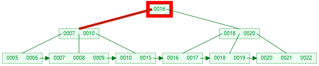
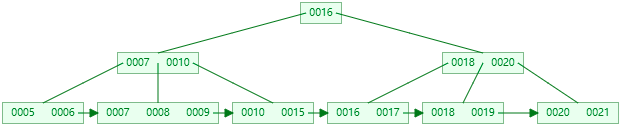

# 数据库篇

## 1. 隔离级别

**要求**

* 掌握四种隔离级别与相关的错误现象


**未提交读**

* 读到其它事务未提交的数据（最新的版本）

* 错误现象：有脏读、不可重复读、幻读现象


**脏读现象**

| **tx1**                                                    | **tx2**                                               |
| ---------------------------------------------------------- | ----------------------------------------------------- |
| set  session transaction isolation level read uncommitted; |                                                       |
| start  transaction;                                        |                                                       |
| select  * from account;  /*两个账户都为 1000*/             |                                                       |
|                                                            | start  transaction;                                   |
|                                                            | update  account set balance = 2000 where accountNo=1; |
| select  * from account; /*1号账户2000, 2号账户1000*/       |                                                       |

* tx2 未提交的情况下，tx1 仍然读取到了它的更改


**提交读（RC）**

* 读到其它事务已提交的数据（最新已提交的版本）

* 错误现象：有不可重复读、幻读现象

* 使用场景：希望看到最新的有效值


**不可重复度现象**

| **tx1**                                                  | **tx2**                                               |
| -------------------------------------------------------- | ----------------------------------------------------- |
| set  session transaction isolation level read committed; |                                                       |
| start  transaction;                                      |                                                       |
| select  * from account; /*两个账户都为 1000*/            |                                                       |
|                                                          | update  account set balance = 2000 where accountNo=1; |
| select  * from account; /*1号账户2000, 2号账户1000*/     |                                                       |

* tx1 在同一事务内，两次读取的结果不一致，当然，此时 tx2 的事务已提交


**可重复读（RR）** 

* 在事务范围内，多次读能够保证一致性（快照建立时最新已提交版本）

* 错误现象：有幻读现象，可以用加锁避免

* 使用场景：事务内要求更强的一致性，但看到的未必是最新的有效值


**幻读现象**

| **tx1**                                                      | **tx2**                               |
| ------------------------------------------------------------ | ------------------------------------- |
| set  session transaction isolation level repeatable read;    |                                       |
| start  transaction;                                          |                                       |
| select  * from account; /*存在 1,2 两个账户*/                |                                       |
|                                                              | insert  into account values(3, 1000); |
| select  * from account; /*发现还是只有 1,2 两个账户*/        |                                       |
| insert  into account values(3, 5000);  /* ERROR  1062 (23000): Duplicate entry '3' for key 'PRIMARY'  */ |                                       |

* tx1 查询时并没有发现 3 号账户，执行插入时却发现主键冲突异常，就好像出现了幻觉一样


**加锁避免幻读**

| **tx1**                                                   | **tx2**                                           |
| --------------------------------------------------------- | ------------------------------------------------- |
| set  session transaction isolation level repeatable read; |                                                   |
| start  transaction;                                       |                                                   |
| select  * from account; /*存在 1,2 两个账户*/             |                                                   |
| select  * from account where accountNo=3  for update;     |                                                   |
|                                                           | insert  into account values(3, 1000);  /* 阻塞 */ |
| insert  into account values(3, 5000);                     |                                                   |

* 在 for update 这行语句执行时，虽然此时 3 号账户尚不存在，但 MySQL 在 repeatable read 隔离级别下会用间隙锁，锁住 2 号记录与正无穷大之间的间隙
* 此时 tx2 想插入 3 号记录就不行了，被间隙锁挡住了


**串行读** 

* 在事务范围内，仅有读读可以并发，读写或写写会阻塞其它事务，用这种办法保证更强的一致性

* 错误现象：无


**串行读避免幻读**

| **tx1**                                                | **tx2**                                           |
| ------------------------------------------------------ | ------------------------------------------------- |
| set  session transaction isolation level serializable; |                                                   |
| start  transaction;                                    |                                                   |
| select  * from account; /* 存在 1,2 两个账户 */        |                                                   |
|                                                        | insert  into account values(3, 1000);  /* 阻塞 */ |
| insert  into account values(3, 5000);                  |                                                   |

* 串行读隔离级别下，普通的 select 也会加共享读锁，其它事务的查询可以并发，但增删改就只能阻塞了


## 2. 快照读与当前读

**要求**

* 理解快照读与当前读
* 了解快照产生的时机

**当前读**

即读取最新提交的数据

* select … for update
* select ... lock in share mode
* insert、update、delete，都会按最新提交的数据进行操作

当前读本质上是基于锁的并发读操作

**快照读**

读取某一个快照建立时（可以理解为某一时间点）的数据，也称为一致性读。快照读主要体现在 select 时，而不同隔离级别下，select 的行为不同

* 在 Serializable 隔离级别下 - 普通 select 也变成当前读，即加共享读锁

* 在 RC 隔离级别下 - 每次 select 都会建立新的快照

* 在 RR 隔离级别下
  * 事务启动后，首次 select 会建立快照
  * 如果事务启动选择了 with consistent snapshot，事务启动时就建立快照
  * 基于旧数据的修改操作，会重新建立快照

快照读本质上读取的是历史数据（原理是回滚段），属于无锁查询

**RR 下，快照建立时机 - 第一次 select 时**

| **tx1**                                                      | **tx2**                                               |
| ------------------------------------------------------------ | ----------------------------------------------------- |
| set  session transaction isolation level repeatable read;    |                                                       |
| start  transaction;                                          |                                                       |
| select  * from account;  /* 此时建立快照，两个账户为 1000  */ |                                                       |
|                                                              | update  account set balance = 2000 where accountNo=1; |
| select  * from account;  /* 两个账户仍为 1000 */             |                                                       |

* 快照一旦建立，以后的查询都基于此快照，因此 tx1 中第二次 select 仍然得到 1 号账户余额为 1000

如果 tx2 的 update 先执行

| **tx1**                                                      | **tx2**                                               |
| ------------------------------------------------------------ | ----------------------------------------------------- |
| set  session transaction isolation level repeatable read;    |                                                       |
| start  transaction;                                          |                                                       |
|                                                              | update  account set balance = 2000 where accountNo=1; |
| select  * from account; /* 此时建立快照，1号余额已经为2000 */ |                                                       |

**RR 下，快照建立时机 - 事务启动时**

如果希望事务启动时就建立快照，可以添加 with consistent snapshot 选项

| **tx1**                                                      | **tx2**                                               |
| ------------------------------------------------------------ | ----------------------------------------------------- |
| set  session transaction isolation level repeatable read;    |                                                       |
| start  transaction with consistent snapshot; /* 此时建立快照，两个账户为 1000  */ |                                                       |
|                                                              | update  account set balance = 2000 where accountNo=1; |
| select  * from account; /* 两个账户仍为 1000 */              |                                                       |

**RR 下，快照建立时机 - 修改数据时**

| **tx1**                                                     | **tx2**                                                     |
| ----------------------------------------------------------- | ----------------------------------------------------------- |
| set  session transaction isolation level repeatable read;   |                                                             |
| start  transaction;                                         |                                                             |
| select  * from account; /* 此时建立快照，两个账户为 1000 */ |                                                             |
|                                                             | update  account set balance=balance+1000 where accountNo=1; |
| update  account set balance=balance+1000 where accountNo=1; |                                                             |
| select  * from account; /* 1号余额为3000 */                 |                                                             |

* tx1 内的修改必须重新建立快照，否则，就会发生丢失更新的问题


## 3. InnoDB vs MyISAM

**要求**

* 掌握 InnoDB 与 MyISAM 的主要区别
* 尤其注意它们在索引结构上的区别

**InnoDB**

* 索引分为聚簇索引与二级索引
  * 聚簇索引：主键值作为索引数据，叶子节点还包含了所有字段数据，索引和数据是存储在一起的
  * 二级索引：除主键外的其它字段建立的索引称为二级索引。被索引的字段值作为索引数据，叶子节点还包含了主键值

* 支持事务
  * 通过 undo log 支持事务回滚、当前读（多版本查询）
  * 通过 redo log 实现持久性
  * 通过两阶段提交实现一致性
  * 通过当前读、锁实现隔离性

* 支持行锁、间隙锁

* 支持外键

**MyISAM**

* 索引只有一种
  * 被索引字段值作为索引数据，叶子节点还包含了该记录数据页地址，数据和索引是分开存储的
* 不支持事务，没有 undo log 和 redo log

* 仅支持表锁

* 不支持外键

* 会保存表的总行数


**InnoDB 索引特点**

聚簇索引：主键值作为索引数据，叶子节点还包含了所有字段数据，索引和数据是存储在一起的


* 主键即 7369、7499、7521 等

二级索引：除主键外的其它字段建立的索引称为二级索引。被索引的字段值作为索引数据，叶子节点还包含了主键值


* 上图中 800、950、1100 这些是工资字段的值，根据它们建立了二级索引


* 上图中，如果执行查询 `select empno, ename, sal from emp where sal = 800`，这时候可以利用二级索引定位到 800 这个工资，同时还能知道主键值 7369
* 但 select 字句中还出现了 ename 字段，在二级索引中不存在，因此需要根据主键值 7369 查询聚簇索引来获取 ename 的信息，这个过程俗称**回表**


**MyISAM 索引特点**

被索引字段值作为索引数据，叶子节点还包含了该记录数据页地址，数据和索引是分开存储的


## 4. 索引

**要求**

* 了解常见索引与它们的适用场景，尤其是 B+Tree 索引的特点
* 掌握索引用于排序，以及失效情况
* 掌握索引用于筛选，以及失效情况
* 理解索引条件下推
* 理解二级索引覆盖


### 索引基础

**常见索引**

* 哈希索引
  * 理想时间复杂度为 $O(1)$
  * 适用场景：适用于等值查询的场景，内存数据的索引
  * 典型实现：Redis，MySQL 的 memory 引擎
* 平衡二叉树索引 
  * 查询和更新的时间复杂度都是 $O(log_2(n))$
  * 适用场景：适用于等值查询以及范围查询；适合内存数据的索引，但不适合磁盘数据的索引，可以认为**树的高度决定了磁盘 I/O 的次数**，百万数据树高约为 20
* BTree 索引
  * BTree 其实就是 n 叉树，分叉多意味着节点中的孩子（key）多，树高自然就降低了
  * 分叉数由页大小和行（包括 key 与 value）大小决定
    * 假设页大小为 16k，每行 40 个字节，那么分叉数就为 16k / 40 ≈ 410
    * 而分叉为 410，则百万数据树高约为3，仅 3 次 I/O 就能找到所需数据
  * **局部性原理**：每次 I/O 按页为单位读取数据，把多个 **key 相邻**的行放在同一页中（每页就是树上一个节点），能进一步减少 I/O

* B+ 树索引 
  * 在 BTree 的基础上做了改进，索引上只存储 key，这样能进一步增加分叉数，假设 key 占 13 个字节，那么一页数据分叉数可以到 1260，树高可以进一步下降为 2

> ***树高计算公式***
>
> * $log_{10}(N) /  log_{10}(M)$ 其中 N 为数据行数，M 为分叉数


**BTree vs B+Tree**

* 无论 BTree 还是 B+Tree，每个叶子节点到根节点距离都相同
* BTree key 及 value 在每个节点上，无论叶子还是非叶子节点


* B+Tree 普通节点只存 key，叶子节点才存储 key 和 value，因此分叉数可以更多
  * 不过也请注意，普通节点上的 key 有的会与叶子节点的 key 重复
* B+Tree 必须到达叶子节点才能找到 value
* B+Tree 叶子节点用链表连接，可以方便范围查询及全表遍历


> 注：这两张图都是仅画了 key，未画 value


**B+Tree 新增 key**

假设阶数（m）为5

1. 若为空树，那么直接创建一个节点，插入 key 即可，此时这个叶子结点也是根结点。例如，插入 5

   

2. 插入时，若当前结点 key 的个数小于阶数，则插入结束

3. 依次插入 8、10、15，按 key 大小升序

   

4. 插入 16，这时到达了阶数限制，所以要进行分裂

   

5. **叶子节点分裂规则**：将这个叶子结点分裂成左右两个叶子结点，左叶子结点包含前 m/2 个（2个）记录，右结点包含剩下的记录，将中间的 key 进位到父结点中。**注意**：中间的 key 仍会保留在叶子节点一份

   

6. 插入 17

   

7. 插入 18，这时当前结点的 key 个数到达 5，进行分裂

   

8. 分裂成两个结点，左结点 2 个记录，右结点 3 个记录，key 16 进位到父结点中

   

9. 插入 19、20、21、22、6、9

   

10. 插入 7，当前结点的 key 个数到达 5，需要分裂

    

11. 分裂后 key 7 进入到父结点中，这时父节点 key 个数也到达 5

    

12. **非叶子节点分裂规则**：左子结点包含前 (m-1)/2 个 key，将中间的 key 进位到父结点中（**不保留**），右子节点包含剩余的 key

    


**B+Tree 查询 key**

以查询 15 为例

* 第一次 I/O

  

* 第二次 I/O

  <!--  -->

* 第三次 I/O

  


**B+Tree 删除叶子节点 key**

1. 初始状态

   

2. **删完有富余**。即删除后结点的key的个数 > m/2 – 1，删除操作结束，例如删除 22

   

3. **删完没富余，但兄弟节点有富余**。即兄弟结点 key 有富余（ > m/2 – 1 ），向兄弟结点借一个记录，同时替换父节点，例如删除 15

   

4. **兄弟节点也不富余，合并兄弟叶子节点**。即兄弟节点合并成一个新的叶子结点，并删除父结点中的key，将当前结点指向父结点，例如删除 7

   

5. 也需要删除非叶子节点中的 7，并替换父节点保证区间仍有效

   

6. 左右兄弟都不够借，合并


**B+Tree 删除非叶子节点 key**

接着上面的操作

1. 非叶子节点 key 的个数 > m/2 – 1，则删除操作结束，否则执行 2

2. 若**兄弟结点有富余**，父结点 key 下移，兄弟结点 key 上移，删除结束，否则执行 3

3. 若**兄弟节点没富余**，当前结点和兄弟结点及父结点合并成一个新的结点。重复 1
<!-- 
    -->

   


### 命中索引

> **准备数据**
>
> 1. 修改 MySQL 配置文件，在 [mysqld] 下添加 secure_file_priv= 重启 MySQL 服务器，让选项生效
>
> 2. 执行 db.sql 内的脚本，建表
>
> 3. 执行 `LOAD DATA INFILE 'D:\\big_person.txt' INTO TABLE big_person;` 注意实际路径根据情况修改
>    * 测试表 big_person（此表数据量较大，如果与其它表数据一起提供不好管理，故单独提供），数据行数 100 万条，列个数 15 列。为了更快速导入数据，这里采用了 load data infile 命令配合 *.txt 格式数据

**索引用于排序**

```sql
/* 测试单列索引并不能在多列排序时加速 */
create index first_idx on big_person(first_name);
create index last_idx on big_person(last_name);
explain select * from big_person order by last_name, first_name limit 10; 

/* 多列排序需要用组合索引 */
alter table big_person drop index first_idx;
alter table big_person drop index last_idx;
create index last_first_idx on big_person(last_name,first_name);

/* 多列排序需要遵循最左前缀原则, 第1个查询可以利用索引，第2,3查询不能利用索引 */
explain select * from big_person order by last_name, first_name limit 10; 
explain select * from big_person order by first_name, last_name limit 10; 
explain select * from big_person order by first_name limit 10; 

/* 多列排序升降序需要一致，查询1可以利用索引，查询2不能利用索引*/
explain select * from big_person order by last_name desc, first_name desc limit 10; 
explain select * from big_person order by last_name desc, first_name asc limit 10; 
```

> ***最左前缀原则***
>
> 若建立组合索引 (a,b,c)，则可以**利用**到索引的排序条件是：
>
> * order by a
> * order by a, b
> * order by a, b, c


**索引用于 where 筛选**

* 参考 https://dev.mysql.com/doc/refman/8.0/en/multiple-column-indexes.html

```sql
/* 模糊查询需要遵循字符串最左前缀原则，查询2可以利用索引，查询1,3不能利用索引 */
explain SELECT * FROM big_person WHERE first_name LIKE 'dav%' LIMIT 5;
explain SELECT * FROM big_person WHERE last_name LIKE 'dav%' LIMIT 5;
explain SELECT * FROM big_person WHERE last_name LIKE '%dav' LIMIT 5;

/* 组合索引需要遵循最左前缀原则，查询1,2可以利用索引，查询3,4不能利用索引 */
create index province_city_county_idx on big_person(province,city,county);
explain SELECT * FROM big_person WHERE province = '上海' AND city='宜兰县' AND county='中西区';
explain SELECT * FROM big_person WHERE county='中西区' AND city='宜兰县' AND province = '上海';
explain SELECT * FROM big_person WHERE city='宜兰县' AND county='中西区';
explain SELECT * FROM big_person WHERE county='中西区';

/* 函数及计算问题，一旦在字段上应用了计算或函数，都会造成索引失效。查询2可以利用索引，查询1不能利用索引 */
create index birthday_idx on big_person(birthday);
explain SELECT * FROM big_person WHERE ADDDATE(birthday,1)='2005-02-10';
explain SELECT * FROM big_person WHERE birthday=ADDDATE('2005-02-10',-1);

/* 隐式类型转换问题
	* 查询1会发生隐式类型转换等价于在phone上应用了函数，造成索引失效
	* 查询2字段与值类型相同不会类型转换，可以利用索引
*/
create index phone_idx on big_person(phone);
explain SELECT * FROM big_person WHERE phone = 13000013934;
explain SELECT * FROM big_person WHERE phone = '13000013934';
```

> ***最左前缀原则（leftmost prefix）***
>
> 若建立组合索引 (a,b,c)，则可以**利用**到索引的查询条件是：
>
> * where a = ?
> * where a = ? and b = ? （注意与条件的先后次序无关，也可以是 where b = ? and a = ?，只要出现即可）
> * where a = ? and b = ? and c = ? （注意事项同上）
>
> **不能利用**的例子：
>
> * where b = ?
> * where b = ? and c = ?
> * where c = ?
>
> 特殊情况：
>
> * where a = ? and c = ?（a = ? 会利用索引，但 c = ? 不能利用索引加速，会触发索引条件下推）


**索引条件下推**

* 参考 https://dev.mysql.com/doc/refman/8.0/en/index-condition-pushdown-optimization.html

```sql
/* 查询 1,2,3,4 都能利用索引，但 4 相当于部分利用了索引，会触发索引条件下推 */
explain SELECT * FROM big_person WHERE province = '上海';
explain SELECT * FROM big_person WHERE province = '上海' AND city='嘉兴市';
explain SELECT * FROM big_person WHERE province = '上海' AND city='嘉兴市' AND county='中西区';
explain SELECT * FROM big_person WHERE province = '上海' AND county='中西区';
```

> ***索引条件下推***
>
> * MySQL 执行条件判断的时机有两处：
>   * 服务层（上层，不包括索引实现）
>   * 引擎层（下层，包括了索引实现，可以利用）
>   * 上面查询 4 中有 province 条件能够利用索引，在引擎层执行，但 county 条件仍然要交给服务层处理
> * 在 5.6 之前，服务层需要判断所有记录的 county 条件，性能非常低
> * 5.6 以后，引擎层会先根据 province 条件过滤，满足条件的记录才在服务层处理 county 条件

我们现在用的是 5.6 以上版本，所以没有体会，可以用下面的语句关闭索引下推优化，再测试一下性能

```sql
SET optimizer_switch = 'index_condition_pushdown=off';
SELECT * FROM big_person WHERE province = '上海' AND county='中西区';
```


**二级索引覆盖**

```sql
explain SELECT * FROM big_person WHERE province = '上海' AND city='宜兰县' AND county= '中西区';
explain SELECT id,province,city,county FROM big_person WHERE province = '上海' AND city='宜兰县' AND county='中西区';
```

根据查询条件查询 1，2 都会先走二级索引，但是二级索引仅包含了 (province, city, county) 和 id 信息

* 查询 1 是 select *，因此还有一些字段二级索引中没有，需要回表（查询聚簇索引）来获取其它字段信息
* 查询 2 的 select 中明确指出了需要哪些字段，这些字段在二级索引都有，就避免了回表查询


**其它注意事项**

* 表连接需要在连接字段上建立索引
* 不要迷信网上说法，具体情况具体分析

例如：

```sql
create index first_idx on big_person(first_name);

/* 不会利用索引，因为优化器发现查询记录数太多，还不如直接全表扫描 */
explain SELECT * FROM big_person WHERE first_name > 'Jenni';

/* 会利用索引，因为优化器发现查询记录数不太多 */
explain SELECT * FROM big_person WHERE first_name > 'Willia';

/* 同一字段的不同值利用 or 连接，会利用索引 */
explain select * from big_person where id = 1 or id = 190839;

/* 不同字段利用 or 连接，会利用索引(底层分别用了两个索引) */
explain select * from big_person where first_name = 'David' or last_name = 'Thomas';

/* in 会利用索引 */
explain select * from big_person where first_name in ('Mark', 'Kevin','David'); 

/* not in 不会利用索引的情况 */
explain select * from big_person where first_name not in ('Mark', 'Kevin','David');

/* not in 会利用索引的情况 */
explain select id from big_person where first_name not in ('Mark', 'Kevin','David');
```

* 以上实验基于 5.7.27，其它如 !=、is null、is not null 是否使用索引都会跟版本、实际数据相关，以优化器结果为准


## 5. 查询语句执行流程

**要求**

* 了解查询语句执行流程


**执行 SQL 语句 select * from user where id = 1 时发生了什么**


1. 连接器：负责建立连接、检查权限、连接超时时间由 wait_timeout 控制，默认 8 小时

2. 查询缓存：会将 SQL 和查询结果以键值对方式进行缓存，修改操作会以表单位导致缓存失效

3. 分析器：词法、语法分析

4. 优化器：决定用哪个索引，决定表的连接顺序等

5. 执行器：根据存储引擎类型，调用存储引擎接口

6. 存储引擎：数据的读写接口，索引、表都在此层实现


## 6. undo log 与 redo log

**要求**

* 理解 undo log 的作用
* 理解 redo log 的作用

**undo log**

* 回滚数据，以行为单位，记录数据每次的变更，一行记录有多个版本并存
* 多版本并发控制，即快照读（也称为一致性读），让查询操作可以去访问历史版本


1. 每个事务会按照开始时间，分配一个单调递增的事务编号 trx id
2. 每次事务的改动都会以行为单位记入回滚日志，包括当时的事务编号，改动的值等
3. 查询操作，事务编号大于自己的数据是不可见的，事务编号小于等于自己的数据才是可见的
   * 例如图中红色事务看不到 trx id=102 以及 trx id=101 的数据，只有 trx id=99 的数据对它可见


**redo log**

redo log 的作用主要是实现 ACID 中的持久性，保证提交的数据不丢失

* 它记录了事务提交的变更操作，服务器意外宕机重启时，利用 redo log 进行回放，重新执行已提交的变更操作
* 事务提交时，首先将变更写入 redo log，事务就视为成功。至于数据页（表、索引）上的变更，可以放在后面慢慢做
  * 数据页上的变更宕机丢失也没事，因为 redo log 里已经记录了
  * 数据页在磁盘上位置随机，写入速度慢，redo log 的写入是顺序的速度快

它由两部分组成，内存中的 redo log buffer，磁盘上的 redo log file

* redo log file 由一组文件组成，当写满了会循环覆盖较旧的日志，这意味着不能无限依赖 redo log，更早的数据恢复需要 binlog 
* buffer 和 file 两部分组成意味着，写入了文件才真正安全，同步策略由参数 innodb_flush_log_at_trx_commit  控制
  * 0 - 每隔 1s 将日志 write and flush 到磁盘 
  * 1 - 每次事务提交将日志 write and flush（默认值）
  * 2 - 每次事务提交将日志 write，每隔 1s flush 到磁盘，意味着 write 意味着写入操作系统缓存，如果 MySQL 挂了，而操作系统没挂，那么数据不会丢失


## 7. 锁

**要求**

* 了解全局锁
* 了解表级锁
* 掌握行级锁


**全局锁**

用作全量备份时，保证**表与表之间的数据一致性**

如果不加任何包含，数据备份时就可能产生不一致的情况，如下图所示


全局锁的语法：

```sql
flush tables with read lock;	
```

* 使用全局读锁锁定所有数据库的所有表。这时会阻塞其它所有 DML 以及 DDL 操作，这样可以避免备份过程中的数据不一致。接下来可以执行备份，最后用 unlock tables 来解锁

> ***注意***
>
> 但 flush tables 属于比较重的操作，可以使用 --single-transaction 参数来完成不加锁的一致性备份（仅针对 InnoDB 引擎的表）
>
> ```sql
> mysqldump --single-transaction -uroot -p test > 1.sql
> ```


**表级锁 - 表锁**

* 语法：加锁 lock tables 表名 read/write，解锁 unlock tables
* 缺点：粒度较粗，在 InnoDB 引擎很少使用


**表级锁 - 元数据锁**

* 即 metadata-lock（MDL），主要是为**了避免 DML 与 DDL 冲突**，DML 的元数据锁之间不互斥

* 加元数据锁的几种情况
  * `lock tables read/write`，类型为 SHARED_READ_ONLY 和 SHARED_NO_READ_WRITE
  * `alter table`，类型为 EXCLUSIVE，与其它 MDL 都互斥
  * `select，select … lock in share mode`，类型为 SHARED_READ
  * `insert，update，delete，select for update`，类型为 SHARED_WRITE 

* 查看元数据锁（适用于 MySQL 8.0 以上版本）
  * `select object_type,object_schema,object_name,lock_type,lock_duration from performance_schema.metadata_locks;`


**表级锁 - IS（意向共享） 与 IX（意向排他）**

* 主要是**避免 DML 与表锁冲突**，DML 主要目的是加行锁，为了让表锁不用检查每行数据是否加锁，加意向锁（表级）来减少表锁的判断，意向锁之间不会互斥
* 加意向表锁的几种情况
  * `select  … lock in share mode` 会加 IS 锁
  * `insert，update，delete， select … for update` 会加 IX 锁
* 查看意向表锁（适用于 MySQL 8.0 以上版本）
  * `select object_schema,object_name,index_name,lock_type,lock_mode,lock_data from performance_schema.data_locks;`


**行级锁**

* 种类
  * 行锁 – 在 RC 下，锁住的是行，防止其他事务对此行 update 或 delete
  * 间隙锁 – 在 RR 下，锁住的是间隙，防止其他事务在这个间隙 insert 产生幻读
  * 临键锁 – 在 RR 下，锁住的是前面间隙+行，特定条件下可优化为行锁

* 查看行级锁
  * `select object_schema,object_name,index_name,lock_type,lock_mode,lock_data from performance_schema.data_locks where object_name='表名';`

> ***注意***
>
> * 它们锁定的其实都是**索引**上的行与间隙，根据索引的有序性来确定间隙


测试数据

```sql
create table t (id int primary key, name varchar(10),age int, key (name)); 
insert into t values(1, 'zhangsan',18); 
insert into t values(2, 'lisi',20); 
insert into t values(3, 'wangwu',21); 
insert into t values(4, 'zhangsan', 17); 
insert into t values(8,'zhang',18);
insert into t values(12,'zhang',20);
```

> **说明**
>
> * 1,2,3,4 之间其实并不可能有间隙
> * 4 与 8 之间有间隙
> * 8 与 12 之间有间隙
> * 12 与正无穷大之间有间隙
> * 其实我们的例子中还有负无穷大与 1 之间的间隙，想避免负数可以通过建表时选择数据类型为 unsigned int


间隙锁例子

事务1：

```sql
begin;
select * from t where id = 9 for update; /* 锁住的是 8 与 12 之间的间隙 */
```

事务2：

```sql
update t set age=100 where id = 8; /* 不会阻塞 */
update t set age=100 where id = 12; /* 不会阻塞 */
insert into t values(10,'aaa',18); /* 会阻塞 */
```


临键锁和记录锁例子

事务1：

```sql
begin;
select * from t where id >= 8 for update;
```

* 临键锁锁定的是左开右闭的区间，与上条查询条件相关的区间有 (4,8]，(8,12]，(12,+∞)
* 临键锁在某些条件下可以被优化为记录锁，例如 (4,8] 被优化为只针对 8 的记录锁，前面的区间不会锁住

事务2：

```sql
insert into t values(7,'aaa',18); /* 不会阻塞 */
update t set age=100 where id = 8; /* 会阻塞 */
insert into t values(10,'aaa',18); /* 会阻塞 */
update t set age=100 where id = 12; /* 会阻塞 */
insert into t values(13,'aaa',18); /* 会阻塞 */
```

