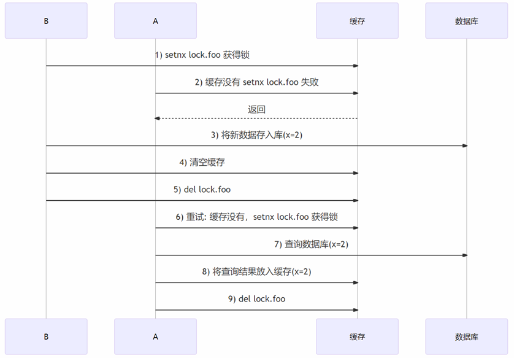
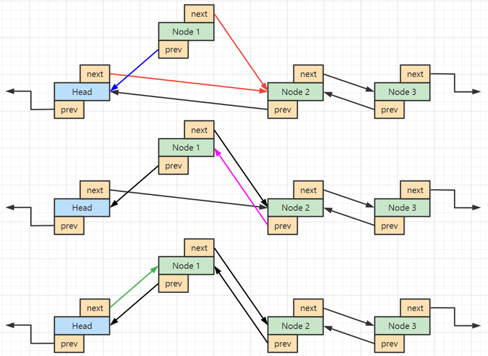

# 缓存篇

## 1. Redis 数据类型

**要求**

* 掌握常见数据类型的底层结构

**概述**

数据类型实际描述的是 value 的类型，key 都是 string，常见数据类型（value）有

1. string（embstr、raw、int）
2. list（quicklist，由多个 ziplist 双向链表组成）
3. hash（ziplist、hashtable）
4. set（intset、hashtable）
5. sorted set（ziplist、skiplist）
6. bitmap
7. hyperloglog

每一种类型都用 redisObject 结构体来表示，每种类型根据情况不同，有不同的编码 encoding（即底层数据结构）


**String**

1. 如果字符串保存的是整数值，则底层编码为 **int**，实际使用 long 来存储

2. 如果字符串保存的是非整数值（浮点数字或其它字符）又分两种情况
   1. 长度 <= 39 字节，使用 **embstr** 编码来保存，即将 redisObject 和 sdshdr 结构体保存在一起，分配内存只需一次
   2. 长度 > 39 字节，使用 **raw** 编码来保存，即 redisObject 结构体分配一次内存，sdshdr 结构体分配一次内存，用指针相连
3. sdshdr 称为**简单动态字符串**，实现上有点类似于 java 中的 StringBuilder，有如下特性
   1. 单独存储字符长度，相比 char* 获取长度效率高（char* 是 C 语言原生字符串表示）
   2. 支持动态扩容，方便字符串拼接操作
   3. 预留空间，减少内存分配、释放次数（< 1M 时容量是字符串实际长度 2 倍，>= 1M 时容量是原有容量 + 1M）
   4. 二进制安全，例如传统 char* 以 \0 作为结束字符，这样就不能保存视频、图片等二进制数据，而 sds 以长度来进行读取

**List**

1. 3.2 开始，Redis 采用 quicklist 作为其编码方式，它是一个双向链表，节点元素是 ziplist
   1. 由于是链表，**内存上不连续**
   2. **操作头尾效率高**，时间复杂度 O(1)
   3. 链表中 ziplist 的大小和元素个数都可以设置，其中大小默认 8kb

2. ziplist 用一块**连续的内存**存储数据，设计目标是让数据存储更紧凑，减少碎片开销，节约内存，它的结构如下 
   1. zlbytes – 记录整个 ziplist 占用字节数
   2. zltail-offset – 记录尾节点偏移量
   3. zllength – 记录节点数量
   4. entry – 节点，1 ~ N 个，每个 entry 记录了前一 entry 长度，本 entry 的编码、长度、实际数据，为了节省内存，根据**实际数据长度不同，用于记录长度的字节数也不同**，例如前一 entry 长度是 253 时，需要用 1 个字节，但超过了 253，需要用 5 个字节
   5. zlend – 结束标记

3. ziplist **适合存储少量元素，否则查询效率不高，并且长度可变的设计会带来连锁更新问题**

**Hash**

1. 在数据量较小时，采用 ziplist 作为其编码，当键或值长度过大（64）或个数过多（512）时，转为 hashtable 编码

2. hashtable 编码

   * hash 函数，Redis 5.0 采用了 SipHash 算法

   * 采用拉链法解决 key 冲突

   * **rehash 时机**

     ① 当元素数 < 1 * 桶个数时，不扩容

     ② 当元素数 > 5 * 桶个数时，一定扩容

     ③ 当 1 * 桶个数 <= 元素数 <= 5 * 桶个数时，如果此时没有进行 AOF 或 RDB 操作时

     ④ 当元素数 < 桶个数 / 10 时，缩容

   * **rehash 要点**

     ① 每个字典有两个哈希表，桶个数为 $2^n$，平时使用 ht[0]，ht[1] 开始为 null，扩容时新数组大小为元素个数 * 2

     ② **渐进式 rehash**，即不是一次将所有桶都迁移过去，每次对这张表 CRUD 仅迁移一个桶

     ③ **active rehash**，server 的主循环中，每 100 ms 里留出 1s 进行主动迁移

     ④ rehash 过程中，新增操作 ht[1] ，其它操作先操作 ht[0]，若没有，再操作 ht[1]

     ⑤ redis 所有 CRUD 都是单线程，因此 rehash 一定是线程安全的

**Sorted Set**

1. 在数据量较小时，采用 ziplist 作为其编码，按 score 有序，当键或值长度过大（64）或个数过多（128）时，转为 skiplist + hashtable 编码，同时采用的理由是
   * 只用 hashtable，CRUD 是 O(1)，但要执行有序操作，需要排序，带来额外时间空间复杂度
   * 只用 skiplist，虽然范围操作优点保留，但时间复杂度上升
   * 虽然同时采用了两种结构，但由于采用了指针，元素并不会占用双份内存

2. skiplist 要点：多层链表、排序规则、 backward、level（span，forward）


* score 存储分数、member 存储数据、按 score 排序，如果 score 相同再按 member 排序
* backward 存储上一个节点指针
* 每个节点中会存储层级信息（level），同一个节点可能会有多层，每个 level 有属性：
  * foward 同层中下一个节点指针
  * span 跨度，用于计算排名，不是所有跳表都实现了跨度，Redis 实现特有

3. 多层链表可以加速查询，规则为，从顶层开始

   1. 大于同层右边的，继续在同层向右找

   2. 相等找到了

   3. 小于同层右边的或右边为 NULL，下一层，重复 1、2 步骤


* 以查找【崔八】为例
  1. 从顶层（4）层向右找到【王五】节点，22 > 7 继续向右找，但右侧是 NULL，下一层
  2. 在【王五】节点的第 3 层向右找到【孙二】节点，22 < 37，下一层
  3. 在【王五】节点的第 2 层向右找到【赵六】节点，22 > 19，继续向右找到【孙二】节点，22 < 37，下一层
  4. 在【赵六】节点的第 1 层向右找到【崔八】节点，22 = 22，返回

> ***注意***
>
> * 数据量较小时，不能体现跳表的性能提升，跳表查询的时间复杂度是 $log_2(N)$，与二叉树性能相当


## 2. keys 命令问题

**要求**

* 理解低效命令对单线程的 Redis 影响

**问题描述**

* redis有一亿个 key，使用 keys 命令是否会影响线上服务？

**解答**

* keys 命令时间复杂度是 $O(n)$，n 即总的 key 数量，n 如果很大，性能非常低
* redis 执行命令是单线程执行，一个命令执行太慢会阻塞其它命令，阻塞时间长甚至会让 redis 发生故障切换

**改进方案**

* 可以使用 scan 命令替换 keys 命令，语法 `scan 起始游标 match 匹配规则 count 提示数目`，返回值代表下次的起点
  1. 虽然 scan 命令的时间复杂度仍是 $O(n)$，但它是通过游标分步执行，不会导致长时间阻塞
  2. 可以用 count 参数**提示**返回 key 的个数
  3. 弱状态，客户端仅需维护游标
  4. scan 能保证在 rehash 也正常工作
  5. 缺点是可能会重复遍历 key（缩容时）、应用应自己处理重复 key


## 3. 过期 key 的删除策略

**要求**

* 了解 Redis 如何记录 key 的过期时间
* 掌握 Redis 对过期 key 的删除策略

**记录 key 过期时间**

* 每个库中都包含了 expires 过期字典
  * hashtable结构，键为指针，指向真正 key，值为 long 类型的时间戳，毫秒精度
* 当设置某个 key 有过期时间时，就会向过期字典中添加此 key 的指针和时间戳

**过期 key 删除策略**

* 惰性删除

  * 在执行读写数据库的命令时，执行命令前会检查 key 是否过期，如果已过期，则删除 key

* 定期删除

  * redis 有一个定时任务处理器 serverCron，负责周期性任务处理，默认 100 ms 执行一次（hz 参数控制）包括：① 处理过期 key、② hash 表 rehash、③ 更新统计结果、④ 持久化、⑤ 清理过期客户端

  * 对于处理过期 key 会：依次遍历库，在规定时间内运行如下操作

    ① 从每个库的 expires 过期字典中随机选择 20 个 key 检查，如果过期则删除

    ② 如果删除达到 5 个，重复 ① 步骤，没有达到，遍历至下一个库

    ③ 规定时间没有做完，等待下一轮 serverCron 运行


## 4. Redis 持久化

**要求**

* 掌握 AOF 持久化和 AOF 重写
* 掌握 RDB 持久化
* 了解混合持久化


**AOF 持久化**

* AOF - 将每条**写命令追加至 aof 文件**，当重启时会执行 aof 文件中每条命令来重建内存数据
* AOF 日志是**写后日志**，即先执行命令，再记录日志
  * Redis 为了性能，向 aof 记录日志时没有对命令进行语法检查，如果要先记录日志，那么日志里就会记录语法错误的命令
* 记录 AOF 日志时，有**三种同步策略**
  * Always 同步写，日志写入磁盘再返回，可以做到基本不丢数据，性能不高
    * 为什么说基本不丢呢，因为 aof 是在 serverCron 事件循环中执行 aof 写入的，并且这次写入的是上一次循环暂存在 aof 缓冲中的数据，因此最多还是可能丢失一个循环的数据
  * Everysec 每秒写，日志写入 AOF 文件的内存缓冲区，每隔一秒将内存缓冲区数据刷入磁盘，最多丢一秒的数据
  * No 操作系统写，日志写入AOF 文件的内存缓冲区，由操作系统决定何时将数据刷入磁盘

**AOF 重写**

* AOF 文件太大引起的问题
  1. 文件大小受操作系统限制
  2. 文件太大，写入效率变低
  3. 文件太大，**恢复时非常慢**
* 重写就是对同一个 key 的多次操作进行瘦身
  1. 例如一个 key 我改了 100 遍，aof 里记录了100 条修改日志，但实际上只有最后一次有效
  2. 重写无需操作现有 aof 日志，只需要根据当前内存数据的状态，生成相应的命令，记入一个新的日志文件即可
  3. 重写过程是由另一个后台子进程完成的，不会阻塞主进程
* **AOF 重写过程**
  1. 创建子进程时会根据主进程生成内存快照，只需要对子进程的内存进行遍历，把每个 key 对应的命令写入新的日志文件（即重写日志）
  2. 此时如果有新的命令执行，修改的是主进程内存，不会影响子进程内存，并且新命令会记录到 `重写缓冲区`  
  3. 等子进程所有的 key 处理完毕，再将 `重写缓冲区` 记录的增量指令写入重写日志 
  4. 在此期间旧的 AOF 日志仍然在工作，待到重写完毕，用重写日志替换掉旧的 AOF 日志

**RDB 持久化**

* RDB - 是把整个内存数据以二进制方式写入磁盘
  * 对应数据文件为 `dump.rdb`
  * 好处是恢复速度快
* 相关命令有两个
  * save - 在主进程执行，会阻塞其它命令
  * bgsave - 创建子进程执行，避免阻塞，是默认方式
    * 子进程不会阻塞主进程，但创建子进程的期间，仍会阻塞，内存越大，阻塞时间越长
    * bgsave 也是利用了快照机制，执行 RDB 持久化期间如果有新数据写入，新的数据修改发生在主进程，子进程向 RDB 文件中写入还是旧的数据，这样新的修改不会影响到 RDB 操作
    * 但这些**新数据不会补充**至 RDB 文件
* 缺点： 可以通过调整 redis.conf 中的 save 参数来控制 rdb 的执行周期，但这个周期不好把握
  * 频繁执行的话，会影响性能
  * 偶尔执行的话，如果宕机又容易丢失较多数据

**混合持久化**

* 从 4.0 开始，Redis 支持混合持久化，即使用 RDB 作为全量备份，两次 RDB 之间使用 AOF 作为增量备份
  * 配置项 aof-use-rdb-preamble 用来控制是否启用混合持久化，默认值 no
  * 持久化时将数据都存入 AOF 日志，日志前半部分为二进制的 RDB 格式，后半部分是 AOF 命令日志
  * 下一次 RDB 时，会覆盖之前的日志文件
* 优缺点
  * 结合了 RDB 与 AOF 的优点，恢复速度快，增量用 AOF 表示，数据更完整（取决于同步策略）、也无需 AOF 重写
  * 与旧版本的 redis 文件格式不兼容


## 5. 缓存问题

**要求**

* 掌握缓存击穿
* 掌握缓存雪崩
* 掌握缓存穿透
* 掌握旁路缓存与缓存一致性

**缓存击穿**

* 缓存击穿是指：某一热点 key 在缓存和数据库中都存在，它过期时，这时由于并发用户特别多，同时读缓存没读到，又同时去数据库去读，压垮数据库

* 解决方法

  1. 热点数据不过期
  2. 对【查询缓存没有，查询数据库，结果放入缓存】这三步进行加锁，这时只有一个客户端能获得锁，其它客户端会被阻塞，等锁释放开，缓存已有了数据，其它客户端就不必访问数据库了。但会影响吞吐量（有损方案）

  

**缓存雪崩**

* 情况1：由于大量 key 设置了相同的过期时间（数据在缓存和数据库都存在），一旦到达过期时间点，这些 key 集体失效，造成访问这些 key 的请求全部进入数据库。

* 解决方法：

  1. 错开过期时间：在过期时间上加上随机值（比如 1~5 分钟）

  2. 服务降级：暂停非核心数据查询缓存，返回预定义信息（错误页面，空值等）

* 情况2：Redis 实例宕机，大量请求进入数据库

* 解决方法：

  1. 事前预防：搭建高可用集群

  2. 多级缓存：缺点是实现复杂度高

  3. 熔断：通过监控一旦雪崩出现，暂停缓存访问待实例恢复，返回预定义信息（有损方案）

  4. 限流：通过监控一旦发现数据库访问量超过阈值，限制访问数据库的请求数（有损方案）

**缓存穿透**

* 缓存穿透是指：如果一个 key 在缓存和数据库都不存在，那么访问这个 key 每次都会进入数据库

  * 很可能被恶意请求利用
  * 缓存雪崩与缓存击穿都是数据库中有，但缓存暂时缺失
  * 缓存雪崩与缓存击穿都能自然恢复，但缓存穿透则不能

* 解决方法

  1. 如果数据库没有，也将此不存在的 key 关联 null 值放入缓存，缺点是这样的 key 没有任何业务作用，白占空间

  2. 布隆过滤器

  

  ① 过滤器可以用来判定 key 不存在，发现这些不存在的 key，把它们过滤掉就好

  ② 需要将所有的 key 都预先加载至布隆过滤器

  ③ 布隆过滤器不能删除，因此查询删除的数据一定会发生穿透

**旁路缓存**

* 旁路缓存（Cache Aside），是一种常见的使用缓存的策略
* 查询规则
  * 先读缓存
  * 如果命中，直接返回
  * 如果缺失，查 DB 并将结果放入缓存，再返回
* 增、删、改规则
  * 新增数据，直接存 DB
  * 修改、删除数据，先更新DB，再删缓存

> ***为什么要先操作库，再操作缓存？***
>
> * 假设操作库和缓存均能成功，如果先操作缓存，会大几率出现数据库与缓存不一致的情况

**一致性分析 - 先清缓存，再更新库**


**一致性分析 - 先更新库，再清缓存**


* 会有短暂不一致，但最终会一致


* 假设查询线程 A 查询数据时恰好缓存数据由于时间到期失效，或是第一次查询，会如上图所示出现不一致
* 但这种几率出现机会很小

**用锁解决一致性**



* 缺点：影响吞吐量、分布式锁设计较为复杂


## 6. 缓存原子性

**要求**

* 掌握 Redis 事务的局限性
* 理解用乐观锁保证原子性
* 理解用 lua 脚本保证原子性

**Redis 事务局限性**

* 单条命令是原子性，这是由 redis 单线程保障的
* 多条命令能否用 `multi + exec` 来保证其原子性呢？

Redis 中 `multi + exec` 并不支持回滚，例如有初始数据如下

```cmd
set a 1000
set b 1000
set c a
```

执行

```cmd
multi
decr a
incr b
incr c
exec
```

执行 `incr c` 时，由于字符串不支持自增导致此条命令失败，但之前的两条命令并不会回滚

更为重要的是，`multi + exec` 中的**读操作没有意义**，因为读的结果并不能赋值给临时变量，用于后续的写操作，既然 `multi + exec` 中读没有意义，就**无法保证读 + 写的原子性**，例如有初始数据如下

```cmd
set a 1000
set b 1000
```

假设 a 和 b 代表的是两个账户余额，现在获取旧值，执行转账 500 的操作：

```cmd
get a /* 存入客户端临时变量 */
get b /* 存入客户端临时变量 */
/* 客户端计算出 a 和 b 更新后的值 */
multi
set a 500
set b 1500
exec
```

但如果在 get 与 multi 之间其它客户端修改了 a 或 b，会造成丢失更新


**乐观锁保证原子性**

watch 命令，用来盯住 key（一到多个），如果这些 key 在事务期间：

* 没有被别的客户端修改，则 exec 才会成功

* 被别的客户端改了，则 exec 返回 nil

还是上一个例子

```cmd
get a /* 存入客户端临时变量 */
get b /* 存入客户端临时变量 */
/* 客户端计算出 a 和 b 更新后的值 */
watch a b /* 盯住 a 和 b */
multi
set a 500
set b 1500
exec
```

此时，如果其他客户端修改了 a 和 b 的值，那么 exec 就会返回 nil，并不会执行两条 set 命令，此时客户端可以进行重试


**lua 脚本保证原子性**

Redis 支持 lua 脚本，能保证 lua 脚本执行的原子性，可以取代 `multi + exec`

例如要解决上面的问题，可以执行如下命令

```cmd
eval "local a = tonumber(redis.call('GET',KEYS[1]));local b = tonumber(redis.call('GET',KEYS[2]));local c = tonumber(ARGV[1]); if(a >= c) then redis.call('SET', KEYS[1], a-c); redis.call('SET', KEYS[2], b+c); return 1;else return 0; end" 2 a b 500
```

* eval 用来执行 lua 脚本
* 2 表示后面用空格分隔的参数中，前两个是 key，剩下的是普通参数
* 脚本中可以用 keys[n] 来引用第 n 个 key，用 argv[n] 来引用第 n 个普通参数
* 其中双引号内部的即为 lua 脚本，格式化如下

```lua
local a = tonumber(redis.call('GET',KEYS[1]));
local b = tonumber(redis.call('GET',KEYS[2]));
local c = tonumber(ARGV[1]); 
if(a >= c) then 
    redis.call('SET', KEYS[1], a-c); 
    redis.call('SET', KEYS[2], b+c); 
    return 1;
else 
    return 0; 
end
```


## 7. LRU Cache 实现

**要求**

* 掌握基于链表的 LRU Cache 实现
* 了解 Redis 在 LRU Cache 实现上的变化

**LRU Cache 淘汰规则**

Least Recently Used，将最近最少使用的 key 从缓存中淘汰掉。以链表法为例，最近访问的 key 移动到链表头，不常访问的自然靠近链表尾，如果超过容量、个数限制，移除尾部的

* 例如有原始数据如下，容量规定为 3

  

* 时间上，新的留下，老的淘汰，比如 put d，那么最老的 a 被淘汰

  

* 如果访问了某个 key，则它就变成最新的，例如 get b，则 b 被移动到链表头

  
  

**LRU Cache 链表实现**

* 如何断开节点链接


* 如何链入头节点



参考代码一

```java
package day06;

import java.util.ArrayList;
import java.util.HashMap;
import java.util.List;
import java.util.Map;

public class LruCache1 {
    static class Node {
        Node prev;
        Node next;
        String key;
        Object value;

        public Node(String key, Object value) {
            this.key = key;
            this.value = value;
        }

        // (prev <- node -> next)
        public String toString() {
            StringBuilder sb = new StringBuilder(128);
            sb.append("(");
            sb.append(this.prev == null ? null : this.prev.key);
            sb.append("<-");
            sb.append(this.key);
            sb.append("->");
            sb.append(this.next == null ? null : this.next.key);
            sb.append(")");
            return sb.toString();
        }
    }

    public void unlink(Node node) {
        node.prev.next = node.next;
        node.next.prev = node.prev;
    }

    public void toHead(Node node) {
        node.prev = this.head;
        node.next = this.head.next;
        this.head.next.prev = node;
        this.head.next = node;
    }

    int limit;
    Node head;
    Node tail;
    Map<String, Node> map;
    public LruCache1(int limit) {
        this.limit = Math.max(limit, 2);
        this.head = new Node("Head", null);
        this.tail = new Node("Tail", null);
        head.next = tail;
        tail.prev = head;
        this.map = new HashMap<>();
    }

    public void remove(String key) {
        Node old = this.map.remove(key);
        unlink(old);
    }

    public Object get(String key) {
        Node node = this.map.get(key);
        if (node == null) {
            return null;
        }
        unlink(node);
        toHead(node);
        return node.value;
    }

    public void put(String key, Object value) {
        Node node = this.map.get(key);
        if (node == null) {
            node = new Node(key, value);
            this.map.put(key, node);
        } else {
            node.value = value;
            unlink(node);
        }
        toHead(node);
        if(map.size() > limit) {
            Node last = this.tail.prev;
            this.map.remove(last.key);
            unlink(last);
        }
    }

    @Override
    public String toString() {
        StringBuilder sb = new StringBuilder();
        sb.append(this.head);
        Node node = this.head;
        while ((node = node.next) != null) {
            sb.append(node);
        }
        return sb.toString();
    }

    public static void main(String[] args) {
        LruCache1 cache = new LruCache1(5);
        System.out.println(cache);
        cache.put("1", 1);
        System.out.println(cache);
        cache.put("2", 1);
        System.out.println(cache);
        cache.put("3", 1);
        System.out.println(cache);
        cache.put("4", 1);
        System.out.println(cache);
        cache.put("5", 1);
        System.out.println(cache);
        cache.put("6", 1);
        System.out.println(cache);
        cache.get("2");
        System.out.println(cache);
        cache.put("7", 1);
        System.out.println(cache);
    }

}
```


参考代码二

```java
package day06;

import java.util.LinkedHashMap;
import java.util.Map;

public class LruCache2 extends LinkedHashMap<String, Object> {

    private int limit;

    public LruCache2(int limit) {
        // 1 2 3 4 false
        // 1 3 4 2 true
        super(limit * 4 /3, 0.75f, true);
        this.limit = limit;
    }

    @Override
    protected boolean removeEldestEntry(Map.Entry<String, Object> eldest) {
        if (this.size() > this.limit) {
            return true;
        }
        return false;
    }

    public static void main(String[] args) {
        LruCache2 cache = new LruCache2(5);
        System.out.println(cache);
        cache.put("1", 1);
        System.out.println(cache);
        cache.put("2", 1);
        System.out.println(cache);
        cache.put("3", 1);
        System.out.println(cache);
        cache.put("4", 1);
        System.out.println(cache);
        cache.put("5", 1);
        System.out.println(cache);
        cache.put("6", 1);
        System.out.println(cache);
        cache.get("2");
        System.out.println(cache);
        cache.put("7", 1);
        System.out.println(cache);
    }
}
```


**Redis LRU Cache 实现**

Redis 采用了随机取样法，较之链表法占用内存更少，每次只抽 5 个 key，每个 key 记录了它们的**最近访问时间**，在这 5 个里挑出最老的移除

* 例如有原始数据如下，容量规定为 160，put 新 key a

  

* 每个 key 记录了放入 LRU 时的时间，随机挑到的 5 个 key（16,78,90,133,156），会挑时间最老的移除（16）

* 再 put b 时，会使用上轮剩下的 4 个（78,90,133,156），外加一个随机的 key（125），这里面挑最老的（78）

  

* 如果 get 了某个 key，它的访问时间会被更新（下图中 90）这样就避免了它下一轮被移除

  

