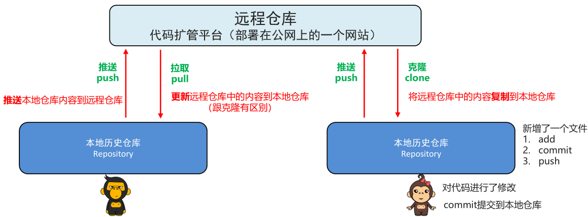
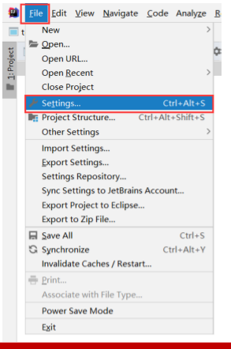
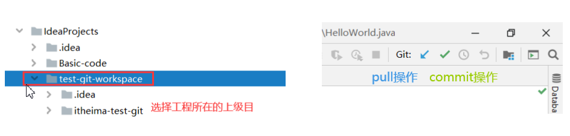
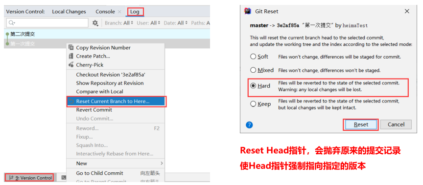
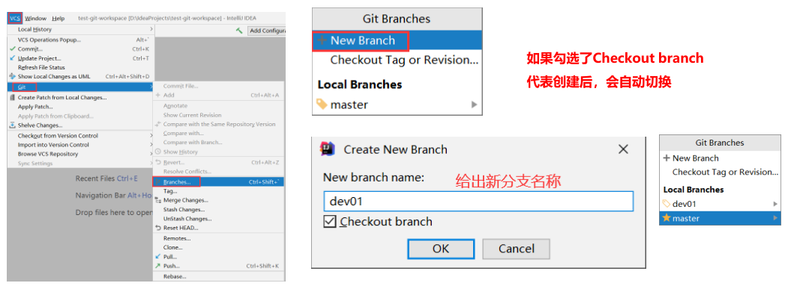
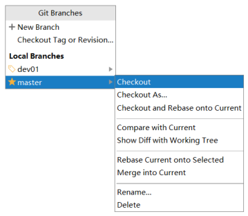
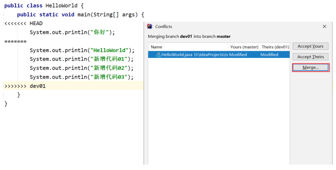
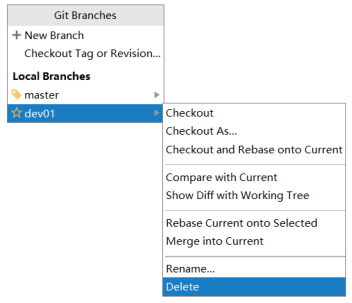
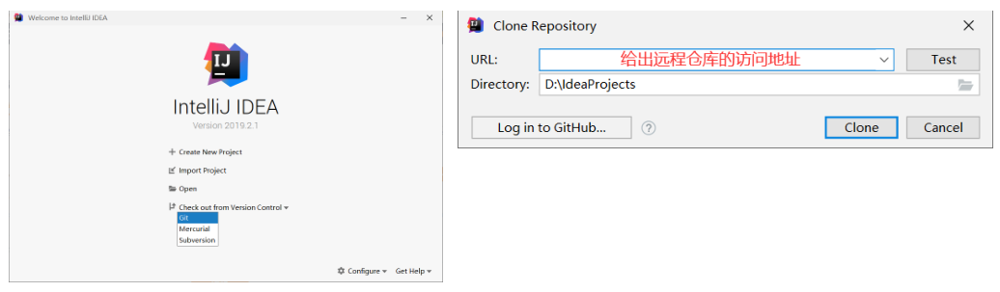

## 1.Git介绍 

### 1.1版本控制(理解)

无论是代码编写，还是文档编写，我们都会遇到对文档内容反复修改的情况

### 1.2开发中存在的问题(理解)

+ 程序员小明负责的模块就要完成了，就在即将提交发布之前的一瞬间，电脑突然蓝屏，硬盘光荣下岗！

几个月来的努力付之东流

​	

+ 老王需要在项目中加入一个很复杂的功能，一边尝试，一边修改代码，就这样摸索了一个星期。
  可是这被改得面目全非的代码已经回不到从前了。

  

+ 小明和老王先后从文件服务器上下载了同一个文件

  

+ 因项目中Bug过多，导致项目进度拖延，项目经理老徐因此被骂，但不清楚Bug是手下哪一个程序员写的

  

+ 开发中要解决的问题

  + 代码备份
  + 版本控制
  + 协同工作
  + 责任追溯

### 1.3SVN版本控制(理解)

SVN是集中式版本控制系统，版本库是集中放在中央服务器的，而开发人员工作的时候，用的都是自己的电脑，
所以首先要从中央服务器下载最新的版本，然后开发，开发完后，需要把自己开发的代码提交到中央服务器。

+ 服务器单点故障

  将会导致所有人员无法工作

+ 而服务器硬盘损坏

  这意味着，你可能失去了该项目的所有历史记录，这是毁灭性的。

  

### 1.4Git版本控制(理解)

Git是在2005年，Linux系统的创建者Linus Torvalds,为了帮助全球的开发者，维护Linux系统内核的开发
而开发了自己的开源分布式版本控制工具,分为两种类型的仓库：本地仓库和远程仓库。

+ 每一个客户端都保存了完整的历史记录

  服务器的故障，都可以通过客户端的记录得以恢复。

  

## 2.Git下载和安装 

### 2.1Git的下载(应用)

官网下载地址：https://git-scm.com/downloads

### 2.2Git的安装(应用)

1. 双击安装包，进入安装向导界面

   

2. 指定安装目录

   

3. 一路next下一步

   

4. 等待安装

   

5. 安装完成

   

6. 安装完成后在电脑桌面（也可以是其他目录）点击右键，如果能够看到如下两个菜单则说明Git安装成功。

   

7. 运行Git命令客户端，使用git --version 命令，可以查看git版本

   

### 2.3TortoiseGit的安装(应用)

1. 双击安装包，进入安装向导界面

   

2. 一路next下一步

   

3. 指定安装目录
   

4. 安装

   

5. 配置

   

   

   

   

   

   

6. 安装TortoiseGit中文语言包,一路next即可

7. 配置TortoiseGit中文语言

   

   

   

   

## 3.Git操作入门 

### 3.1Git基本工作流程(理解)

本地仓库

### 3.2Git命令行操作(应用)

+ git常用命令

  | 命令                   | 作用                         |
  | -------------------- | -------------------------- |
  | git init             | 初始化，创建 git 仓库              |
  | git status           | 查看 git 状态 （文件是否进行了添加、提交操作） |
  | git add 文件名          | 添加，将指定文件添加到暂存区             |
  | git commit -m '提交信息' | 提交，将暂存区文件提交到历史仓库           |
  | git log              | 查看日志（ git 提交的历史日志）         |

+ 操作步骤

  1. 创建工作目录、初始化本地 git 仓库

     

  2. 新建一个 test.txt 文件（暂不执行添加操作）

  3. 使用 status 命令，查看状态

     

  4. 使用 add 命令添加，并查看状态

     

  5. 使用 commit 命令，提交到本地历史仓库

     

  6. 使用 log 命令，查看日志

     

  7. 修改 test.txt 文件

     

  8. 添加并提交，查看日志

     

### 3.3Git图形化工具操作(理解)

1. 创建工作目录、初始化本地 git 仓库

   

   

2. 新建一个 test.txt 文件（暂不执行添加操作）

3. 选中文件右键，选择TortoiseGit，之后选择添加

   

4. 空白处右键,Git提交,提交到本地历史仓库

   

5. 空白处右键,TortoiseGit,显示日志,可以产看日志信息

   

6. 修改 test.txt 文件

7. 添加并提交，查看日志

## 4.Git版本管理 

### 4.1历史版本切换(理解)

+ 准备动作

  1. 查看 my_project 的 log 日志
     git reflog ：可以查看所有分支的所有操作记录（包括已经被删除的 commit 记录的操作）
  2. 增加一次新的修改记录

+ 需求: 将代码切换到第二次修改的版本

  指令：git reset --hard 版本唯一索引值

### 4.2分支管理介绍(理解)

+ 分支
  + 由每次提交的代码，串成的一条时间线
  + 使用分支意味着你可以把你的工作从开发主线上分离开来,以免影响开发主线
+ 分支的使用场景
  1. 周期较长的模块开发
     假设你准备开发一个新功能，但是需要一个月才能完成
     第一周写了20%的代码，突然发现原来已经写好的功能出现了一个严重的Bug
     那现在就需要放下手中的新功能，去修复Bug
     但这20%的代码不能舍弃，并且也担心丢失，这就需要开启一个新的版本控制。
  2. 尝试性的模块开发
     业务人员给我们提出了一个需求，经过我们的思考和分析
     该需求应该可以使用技术手段进行实现。
     但是我们还不敢确定，我们就可以去创建一个分支基于分支进行尝试性开发。

+ 分支工作流程

  + Master: 指向提交的代码版本

  + Header: 指向当前所使用的的分支

    

### 4.3分支管理操作(应用)

+ 创建和切换

  创建命令：git branch 分支名
  切换命令：git checkout 分支名

+ 新分支添加文件

  查看文件命令：ls

  总结：不同分支之间的关系是平行的关系，不会相互影响

+ 合并分支

  合并命令：git merge 分支名

+ 删除分支

  删除命令：git branch -d 分支名

+ 查看分支列表

  查看命令：git branch

## 5.远程仓库

### 5.1远程仓库工作流程(理解)

### 5.2远程仓库平台介绍(理解)

+ GitHub

  域名：https://github.com
  介绍：GitHub是全球最大的开源项目托管平台，俗称大型程序员社区化交友网站

  ​	    各类好玩有趣的开源项目，只有想不到，没有找不到。

+ 码云

  域名：https://gitee.com
  介绍：码云是全国最大的开源项目托管平台，良心平台，速度快，提供免费私有库

### 5.3码云的注册(应用)

### 5.4先有本地项目,远程为空(应用)

+ 步骤

  1. 创建本地仓库
  2. 创建或修改文件，添加（add）文件到暂存区，提交（commit）到本地仓库
  3. 创建远程仓库
  4. 推送到远程仓库

+ 创建远程仓库

  

  

+ 生成SSH公钥

  + 推送代码之前，需要先配置SSH公钥

    

  + 生成SSH公钥步骤

    1. 设置Git账户

       + git config user.name（查看git账户）
       + git config user.email（查看git邮箱）
       + git config --global user.name “账户名”（设置全局账户名）
       + git config --global user.email “邮箱”（设置全局邮箱）
       + cd ~/.ssh（查看是否生成过SSH公钥）

       

    2. 生成SSH公钥

       + 生成命令: ssh-keygen –t rsa –C “邮箱” ( 注意：这里需要敲3次回车)

       

       + 查看命令: cat ~/.ssh/id-rsa.pub

       

    3. 设置账户公钥

       

       

    4. 公钥测试

       + 命令: ssh -T git@gitee.com

       

+  推送到远程仓库

  + 步骤

    1. 为远程仓库的URL（网址），自定义仓库名称
    2. 推送

  + 命令
       git remote add 远程名称 远程仓库URL
       git push -u 仓库名称 分支名

    

    

### 5.5先有远程仓库,本地为空(应用)

+ 步骤
  1. 将远程仓库的代码，克隆到本地仓库
      克隆命令：git clone 仓库地址
  2. 创建新文件，添加并提交到本地仓库
  3. 推送至远程仓库
  4. 项目拉取更新
      拉取命令：git pull 远程仓库名 分支名

### 5.6代码冲突(应用)

+ 产生原因:

  两个程序员操作同一个文件,其中一个程序员在修改文件后,push到远程仓库,另一个程序员应该先pull将最新的代码更新到本地仓库后,在修改代码,之后push到远程仓库,结果他没有先pull将最新的代码更新到本地仓库,而是直接将自己的代码push到远程仓库,这样就可能会导致代码冲突

+ 如何解决冲突

  和‘>>>>>>>’中间的内容,就是冲突部分

  1. 修改冲突行，保存，即可解决冲突。
  2. 重新add冲突文件并commit到本地仓库，重新push到远程

## 6.IDEA集成Git 

### 6.1IDEA中配置Git(应用)

1. File -> Settings

2. Version Control -> Git -> 指定git.exe存放目录

3. 点击Test测试

### 6.2创建本地仓库(应用)

1. VCS->Import into Version Control->Create Git Repository

   

2. 选择工程所在的目录,这样就创建好本地仓库了

   

3. 点击git后边的对勾,将当前项目代码提交到本地仓库

   注意: 项目中的配置文件不需要提交到本地仓库中,提交时,忽略掉即可

   

### 6.3版本切换(应用)

+ 方式一: 控制台Version Control->Log->Reset Current Branch...->Reset

  这种切换的特点是会抛弃原来的提交记录

  

+ 方式二:控制台Version Control->Log->Revert Commit->Merge->处理代码->commit

  这种切换的特点是会当成一个新的提交记录,之前的提交记录也都保留

  

  

  ​		

### 6.4分支管理(应用)

+ 创建分支

  VCS->Git->Branches->New Branch->给分支起名字->ok

  

+ 切换分支

  idea右下角Git->选择要切换的分支->checkout

  

+ 合并分支

  VCS->Git->Merge changes->选择要合并的分支->merge

  

  处理分支中的代码

  

  

  

+ 删除分支

  idea右下角->选中要删除的分支->Delete

  

### 6.5本地仓库推送到远程仓库(应用)

1. VCS->Git->Push->点击master Define remote

   

2. 将远程仓库的路径复制过来->Push

   

### 6.6远程仓库克隆到本地仓库(应用)

File->Close Project->Checkout from Version Control->Git->指定远程仓库的路径->指定本地存放的路径->clone

