## 课程介绍

- 完善个人信息
- 阿里云OSS服务应用
- 人脸识别
- MongoDB快速入门
- SpringBoot整合MongoDB

## 1、完善个人信息

用户在首次登录时需要完善个人信息，包括性别、昵称、生日、城市、头像等。

其中，头像数据需要做图片上传，这里采用阿里云的OSS服务作为我们的图片服务器，并且对头像要做人脸识别，非人脸照片不得上传。

### 1.1、图片上传

#### 1.1.1、图片存储解决方案

实现图片上传服务，需要有存储的支持，那么我们的解决方案将以下几种：

1. 直接将图片保存到服务的硬盘
   1. 优点：开发便捷，成本低
   2. 缺点：扩容困难
2. 使用分布式文件系统进行存储
   1. 优点：容易实现扩容
   2. 缺点：开发复杂度稍大（有成熟的产品可以使用，比如：FastDFS）
3. 使用nfs做存储
   1. 优点：开发较为便捷
   2. 缺点：需要有一定的运维知识进行部署和维护
4. 使用第三方的存储服务
   1. 优点：开发简单，拥有强大功能，免维护
   2. 缺点：付费

在本套课程中选用阿里云的OSS服务进行图片存储。

#### 1.1.2、阿里云OSS存储

流程：

 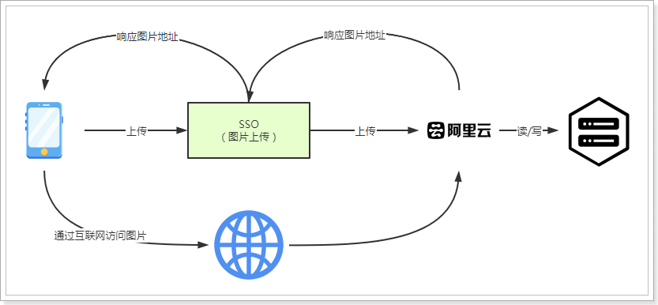

##### 1.1.2.1、什么是OSS服务？

地址：https://www.aliyun.com/product/oss


##### 1.1.2.2、购买服务

使用第三方服务最大的缺点就是需要付费，下面，我们看下如何购买开通服务。 


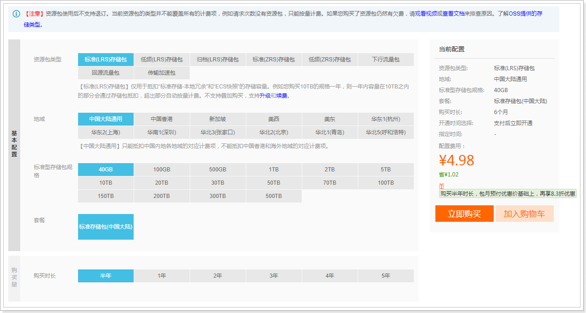

购买下行流量包： （不购买也可以使用，按照流量付费）


> 说明：OSS的上行流量是免费的，但是下行流量是需要购买的。

##### 1.1.2.3、创建Bucket

使用OSS，首先需要创建Bucket，Bucket翻译成中文是水桶的意思，把存储的图片资源看做是水，想要盛水必须得有桶，就是这个意思了。

进入控制台，https://oss.console.aliyun.com/overview

 

选择Bucket后，即可看到对应的信息，如：url、消耗流量等 :


文件管理：


查看文件：

 

##### 1.1.2.4、创建用户

创建用户的方式与短信接口中的方式一样，需要设置oss权限。

 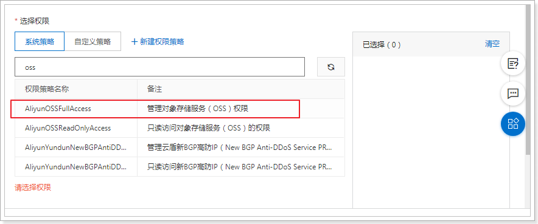

#### 1.1.3、导入依赖

~~~xml
<dependency>
    <groupId>com.aliyun.oss</groupId>
    <artifactId>aliyun-sdk-oss</artifactId>
    <version>2.8.3</version>
</dependency>
~~~

#### 1.1.4、OSS配置

aliyun.properties：

~~~properties
aliyun.endpoint = http://oss-cn-zhangjiakou.aliyuncs.com
aliyun.accessKeyId = ***********
aliyun.accessKeySecret = ***************
aliyun.bucketName= tanhua-dev
aliyun.urlPrefix=http://tanhua-dev.oss-cn-zhangjiakou.aliyuncs.com/
~~~

AliyunConfig：

~~~java
package com.tanhua.sso.config;

import com.aliyun.oss.OSSClient;
import lombok.Data;
import org.springframework.boot.context.properties.ConfigurationProperties;
import org.springframework.context.annotation.Bean;
import org.springframework.context.annotation.Configuration;
import org.springframework.context.annotation.PropertySource;

@Configuration
@PropertySource("classpath:aliyun.properties")
@ConfigurationProperties(prefix = "aliyun")
@Data
public class AliyunConfig {

    private String endpoint;
    private String accessKeyId;
    private String accessKeySecret;
    private String bucketName;
    private String urlPrefix;

    @Bean
    public OSSClient oSSClient() {
        return new OSSClient(endpoint, accessKeyId, accessKeySecret);
    }

}
~~~

#### 1.1.5、PicUploadService

~~~java
package com.tanhua.sso.service;

import com.aliyun.oss.OSSClient;
import com.tanhua.sso.config.AliyunConfig;
import com.tanhua.sso.vo.PicUploadResult;
import org.apache.commons.lang3.RandomUtils;
import org.apache.commons.lang3.StringUtils;
import org.joda.time.DateTime;
import org.springframework.beans.factory.annotation.Autowired;
import org.springframework.stereotype.Service;
import org.springframework.web.multipart.MultipartFile;

import java.io.ByteArrayInputStream;

@Service
public class PicUploadService {

    // 允许上传的格式
    private static final String[] IMAGE_TYPE = new String[]{".bmp", ".jpg",
            ".jpeg", ".gif", ".png"};

    @Autowired
    private OSSClient ossClient;

    @Autowired
    private AliyunConfig aliyunConfig;

    public PicUploadResult upload(MultipartFile uploadFile) {

        PicUploadResult fileUploadResult = new PicUploadResult();

        //图片做校验，对后缀名
        boolean isLegal = false;

        for (String type : IMAGE_TYPE) {
            if (StringUtils.endsWithIgnoreCase(uploadFile.getOriginalFilename(),
                    type)) {
                isLegal = true;
                break;
            }
        }

        if (!isLegal) {
            fileUploadResult.setStatus("error");
            return fileUploadResult;
        }

        // 文件新路径
        String fileName = uploadFile.getOriginalFilename();
        String filePath = getFilePath(fileName);

        // 上传到阿里云
        try {
            // 目录结构：images/2018/12/29/xxxx.jpg
            ossClient.putObject(aliyunConfig.getBucketName(), filePath, new
                    ByteArrayInputStream(uploadFile.getBytes()));
        } catch (Exception e) {
            e.printStackTrace();
            //上传失败
            fileUploadResult.setStatus("error");
            return fileUploadResult;
        }

        // 上传成功
        fileUploadResult.setStatus("done");
        fileUploadResult.setName(this.aliyunConfig.getUrlPrefix() + filePath);
        fileUploadResult.setUid(String.valueOf(System.currentTimeMillis()));

        return fileUploadResult;
    }

    private String getFilePath(String sourceFileName) {
        DateTime dateTime = new DateTime();
        return "images/" + dateTime.toString("yyyy")
                + "/" + dateTime.toString("MM") + "/"
                + dateTime.toString("dd") + "/" + System.currentTimeMillis() +
                RandomUtils.nextInt(100, 9999) + "." +
                StringUtils.substringAfterLast(sourceFileName, ".");
    }

}

~~~

所需其他的代码：

PicUploadResult:

~~~java
package com.tanhua.sso.vo;

import lombok.Data;

@Data
public class PicUploadResult {

    // 文件唯一标识
    private String uid;
    // 文件名
    private String name;
    // 状态有：uploading done error removed
    private String status;
    // 服务端响应内容，如：'{"status": "success"}'
    private String response;

}

~~~

#### 1.1.6、PicUploadController

~~~java
package com.tanhua.sso.controller;

import com.tanhua.sso.service.PicUploadService;
import com.tanhua.sso.vo.PicUploadResult;
import org.springframework.beans.factory.annotation.Autowired;
import org.springframework.stereotype.Controller;
import org.springframework.web.bind.annotation.PostMapping;
import org.springframework.web.bind.annotation.RequestMapping;
import org.springframework.web.bind.annotation.RequestParam;
import org.springframework.web.bind.annotation.ResponseBody;
import org.springframework.web.multipart.MultipartFile;

@RequestMapping("pic/upload")
@Controller
public class PicUploadController {

    @Autowired
    private PicUploadService picUploadService;

    @PostMapping
    @ResponseBody
    public PicUploadResult upload(@RequestParam("file") MultipartFile multipartFile) {
        return this.picUploadService.upload(multipartFile);
    }
}

~~~

#### 1.1.7、测试

 

 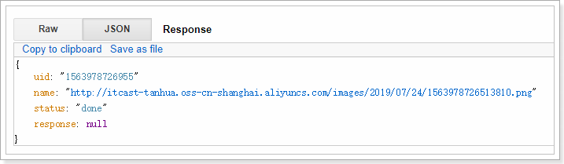

 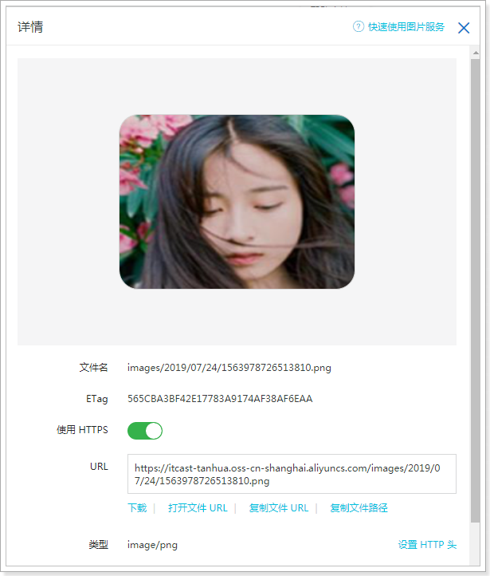

### 1.2、人脸识别

人脸识别技术采用虹软开放平台实现（免费使用）。官网：https://www.arcsoft.com.cn/ 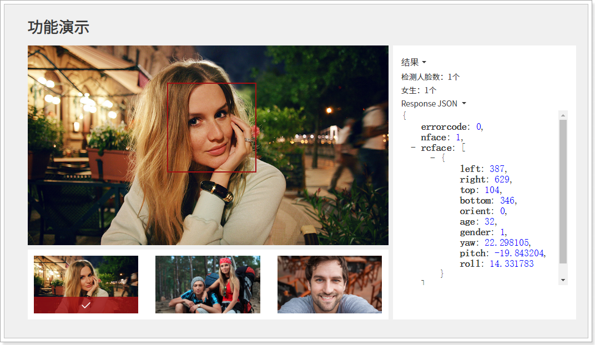

#### 1.2.1、使用说明

使用虹软平台需要先注册开发者账号：https://ai.arcsoft.com.cn/ucenter/user/userlogin


注册完成后进行登录，然后进行创建应用：

 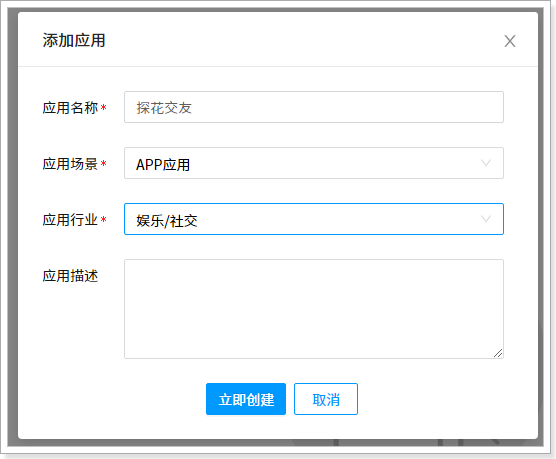

创建完成后，需要进行实名认证，否则相关的SDK是不能使用的。

 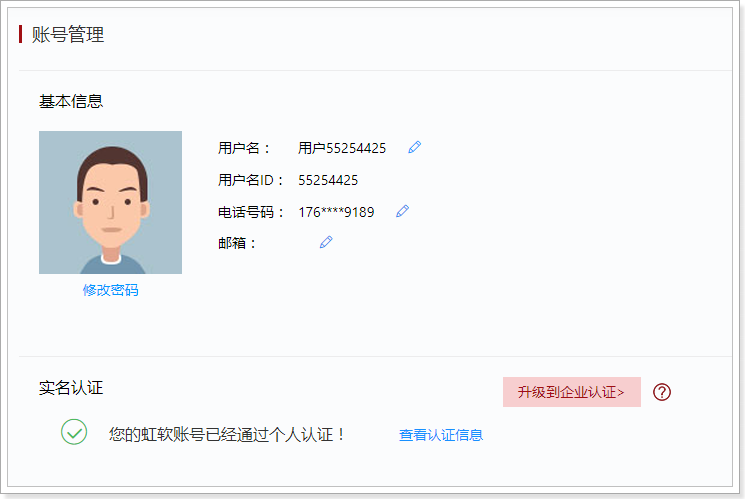

实名认证后即可下载对应平台的SDk，我们需要下载windows以及linux平台。

添加SDK（Linux与Windows平台）：

 

 

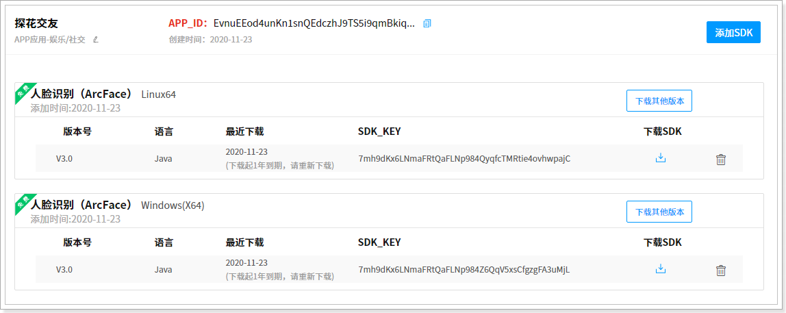

下载SDK，打开解压包，可以看到有提供相应的jar包以及示例代码：

 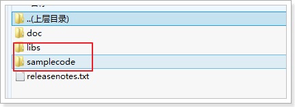

需要特别说明的是：每个账号的SDK包不通用，所以自己要下载自己的SDK包。

#### 1.2.2、安装jar到本地仓库

进入到libs目录，需要将arcsoft-sdk-face-3.0.0.0.jar安装到本地仓库：

~~~shell
mvn install:install-file -DgroupId=com.arcsoft.face -DartifactId=arcsoft-sdk-face -Dversion=3.0.0.0 -Dpackaging=jar -Dfile=arcsoft-sdk-face-3.0.0.0.jar
~~~
安装成功后，即可通过maven坐标引用了：

~~~xml
<dependency>
    <groupId>com.arcsoft.face</groupId>
    <artifactId>arcsoft-sdk-face</artifactId>
    <version>3.0.0.0</version>
    <!--<scope>system</scope>-->
    <!--如果没有安装到本地仓库，可以将jar包拷贝到工程的lib下面下，直接引用-->
    <!--<systemPath>${project.basedir}/lib/arcsoft-sdk-face-3.0.0.0.jar</systemPath>-->
</dependency>
~~~

#### 1.2.3、开始使用

> 说明：虹软的SDK是免费使用的，但是首次使用时需要联网激活，激活后可离线使用。使用周期为1年，1年后需要联网再次激活。
>
> 个人免费激活SDK总数量为100。

配置：application.properties

~~~properties
#虹软相关配置(在虹软应用中找到对应的参数)
arcsoft.appid=******************
arcsoft.sdkKey=*****************
arcsoft.libPath=F:\\code\\WIN64
~~~

FaceEngineService：

~~~java
package com.tanhua.sso.service;

import com.arcsoft.face.EngineConfiguration;
import com.arcsoft.face.FaceEngine;
import com.arcsoft.face.FaceInfo;
import com.arcsoft.face.FunctionConfiguration;
import com.arcsoft.face.enums.DetectMode;
import com.arcsoft.face.enums.DetectOrient;
import com.arcsoft.face.enums.ErrorInfo;
import com.arcsoft.face.enums.ImageFormat;
import com.arcsoft.face.toolkit.ImageFactory;
import com.arcsoft.face.toolkit.ImageInfo;
import org.slf4j.Logger;
import org.slf4j.LoggerFactory;
import org.springframework.beans.factory.annotation.Value;
import org.springframework.stereotype.Service;

import javax.annotation.PostConstruct;
import java.io.File;
import java.util.ArrayList;
import java.util.List;

@Service
public class FaceEngineService {

    private static final Logger LOGGER = LoggerFactory.getLogger(FaceEngineService.class);

    @Value("${arcsoft.appid}")
    private String appid;

    @Value("${arcsoft.sdkKey}")
    private String sdkKey;

    @Value("${arcsoft.libPath}")
    private String libPath;

    private FaceEngine faceEngine;

    @PostConstruct
    public void init() {
        // 激活并且初始化引擎
        FaceEngine faceEngine = new FaceEngine(libPath);
        int activeCode = faceEngine.activeOnline(appid, sdkKey);
        if (activeCode != ErrorInfo.MOK.getValue() && activeCode != ErrorInfo.MERR_ASF_ALREADY_ACTIVATED.getValue()) {
            LOGGER.error("引擎激活失败");
            throw new RuntimeException("引擎激活失败");
        }

        //引擎配置
        EngineConfiguration engineConfiguration = new EngineConfiguration();
        //IMAGE检测模式，用于处理单张的图像数据
        engineConfiguration.setDetectMode(DetectMode.ASF_DETECT_MODE_IMAGE);
        //人脸检测角度，全角度
        engineConfiguration.setDetectFaceOrientPriority(DetectOrient.ASF_OP_ALL_OUT);

        //功能配置
        FunctionConfiguration functionConfiguration = new FunctionConfiguration();
        functionConfiguration.setSupportAge(true);
        functionConfiguration.setSupportFace3dAngle(true);
        functionConfiguration.setSupportFaceDetect(true);
        functionConfiguration.setSupportFaceRecognition(true);
        functionConfiguration.setSupportGender(true);
        functionConfiguration.setSupportLiveness(true);
        functionConfiguration.setSupportIRLiveness(true);
        engineConfiguration.setFunctionConfiguration(functionConfiguration);

        //初始化引擎
        int initCode = faceEngine.init(engineConfiguration);

        if (initCode != ErrorInfo.MOK.getValue()) {
            LOGGER.error("初始化引擎出错!");
            throw new RuntimeException("初始化引擎出错!");
        }

        this.faceEngine = faceEngine;
    }

    /**
     * 检测图片是否为人像
     *
     * @param imageInfo 图像对象
     * @return true:人像，false:非人像
     */
    public boolean checkIsPortrait(ImageInfo imageInfo) {
        // 定义人脸列表
        List<FaceInfo> faceInfoList = new ArrayList<FaceInfo>();
        faceEngine.detectFaces(imageInfo.getImageData(), imageInfo.getWidth(), imageInfo.getHeight(), ImageFormat.CP_PAF_BGR24, faceInfoList);
        return !faceInfoList.isEmpty();
    }

    public boolean checkIsPortrait(byte[] imageData) {
        return this.checkIsPortrait(ImageFactory.getRGBData(imageData));
    }

    public boolean checkIsPortrait(File file) {
        return this.checkIsPortrait(ImageFactory.getRGBData(file));
    }

}

~~~

~~~shell
#问题：
Caused by: java.lang.UnsatisfiedLinkError: D:\gongju\renlian\haha\libs\WIN64\libarcsoft_face.dll: Can't find dependent libraries

解决：
安装资料中的：vcredist_x64.exe，即可解决。
~~~

#### 1.2.4、测试

~~~java
package com.tanhua.sso.service;

import org.junit.Test;
import org.junit.runner.RunWith;
import org.springframework.beans.factory.annotation.Autowired;
import org.springframework.boot.test.context.SpringBootTest;
import org.springframework.test.context.junit4.SpringJUnit4ClassRunner;

import java.io.File;

@SpringBootTest
@RunWith(SpringJUnit4ClassRunner.class)
public class TestFaceEngineService {

    @Autowired
    private FaceEngineService faceEngineService;

    @Test
    public void testCheckIsPortrait(){
        File file = new File("F:\\1.jpg");
        boolean checkIsPortrait = this.faceEngineService.checkIsPortrait(file);
        System.out.println(checkIsPortrait); // true|false
    }
}

~~~

### 1.3、实现完善个人信息

完善个人信息的功能实现，分为2个接口完成，分别是：完善个人资料信息、头像上传。

mock接口：

- 完善个人信息
  - https://mock.boxuegu.com/project/164/interface/api/28553
  - 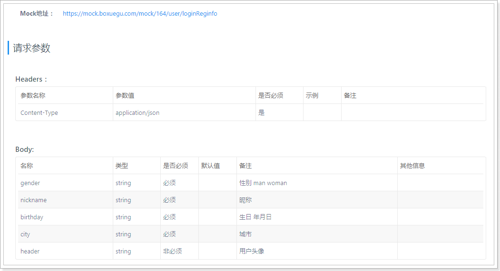
- 上传头像
  - https://mock.boxuegu.com/project/164/interface/api/39725
  - 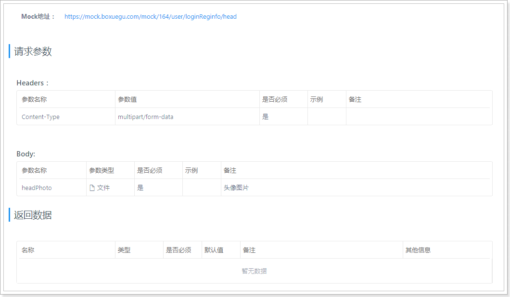

#### 1.3.1、UserInfoMapper

~~~java
package com.tanhua.sso.mapper;

import com.baomidou.mybatisplus.core.mapper.BaseMapper;
import com.tanhua.sso.pojo.UserInfo;

public interface UserInfoMapper extends BaseMapper<UserInfo> {
}

~~~

#### 1.3.2、UserInfoService

~~~java
package com.tanhua.sso.service;

import com.baomidou.mybatisplus.core.conditions.query.QueryWrapper;
import com.tanhua.sso.enums.SexEnum;
import com.tanhua.sso.mapper.UserInfoMapper;
import com.tanhua.sso.pojo.User;
import com.tanhua.sso.pojo.UserInfo;
import com.tanhua.sso.vo.PicUploadResult;
import org.apache.commons.lang3.StringUtils;
import org.springframework.beans.factory.annotation.Autowired;
import org.springframework.stereotype.Service;
import org.springframework.web.multipart.MultipartFile;

import java.io.IOException;
import java.util.Map;

@Service
public class UserInfoService {

    @Autowired
    private UserService userService;

    @Autowired
    private UserInfoMapper userInfoMapper;

    @Autowired
    private FaceEngineService faceEngineService;

    @Autowired
    private PicUploadService picUploadService;

    public Boolean saveUserInfo(Map<String, String> param, String token) {
        //校验token
        User user = this.userService.queryUserByToken(token);
        if (null == user) {
            return false;
        }

        UserInfo userInfo = new UserInfo();
        userInfo.setUserId(user.getId());
        userInfo.setSex(StringUtils.equalsIgnoreCase(param.get("gender"), "man") ? SexEnum.MAN : SexEnum.WOMAN);
        userInfo.setNickName(param.get("nickname"));
        userInfo.setBirthday(param.get("birthday"));
        userInfo.setCity(param.get("city"));
        return this.userInfoMapper.insert(userInfo) == 1;
    }

    public Boolean saveUserLogo(MultipartFile file, String token) {
        //校验token
        User user = this.userService.queryUserByToken(token);
        if (null == user) {
            return false;
        }

        try {
            //校验图片是否是人像，如果不是人像就返回false
            boolean b = this.faceEngineService.checkIsPortrait(file.getBytes());
            if (!b) {
                return false;
            }
        } catch (IOException e) {
            e.printStackTrace();
        }

        //图片上传到阿里云OSS
        PicUploadResult result = this.picUploadService.upload(file);
        if (StringUtils.isEmpty(result.getName())) {
            //上传失败
            return false;
        }

        //把头像保存到用户信息表中
        UserInfo userInfo = new UserInfo();
        userInfo.setLogo(result.getName());

        QueryWrapper<UserInfo> queryWrapper = new QueryWrapper<>();
        queryWrapper.eq("user_id", user.getId());

        return this.userInfoMapper.update(userInfo, queryWrapper) == 1;
    }
}

~~~

#### 1.3.3、UserInfoController

~~~java
package com.tanhua.sso.controller;

import com.tanhua.sso.service.UserInfoService;
import com.tanhua.sso.service.UserService;
import com.tanhua.sso.vo.ErrorResult;
import org.apache.commons.lang3.StringUtils;
import org.springframework.beans.factory.annotation.Autowired;
import org.springframework.http.HttpStatus;
import org.springframework.http.ResponseEntity;
import org.springframework.web.bind.annotation.*;
import org.springframework.web.multipart.MultipartFile;

import java.util.HashMap;
import java.util.Map;

@RestController
@RequestMapping("user")
public class UserInfoController {

    @Autowired
    private UserInfoService userInfoService;

    /**
     * 完善个人信息-基本信息
     *
     * @param param
     * @return
     */
    @PostMapping("loginReginfo")
    public ResponseEntity<Object> saveUserInfo(@RequestBody Map<String, String> param,
                                               @RequestHeader("Authorization") String token) {
        try {
            Boolean bool = this.userInfoService.saveUserInfo(param, token);
            if (bool) {
                return ResponseEntity.ok(null);
            }
        } catch (Exception e) {
            e.printStackTrace();
        }
        ErrorResult errorResult = ErrorResult.builder().errCode("000001").errMessage("保存用户信息失败！").build();
        return ResponseEntity.status(HttpStatus.INTERNAL_SERVER_ERROR).body(errorResult);
    }

    /**
     * 完善个人信息-用户头像
     *
     * @return
     */
    @PostMapping("loginReginfo/head")
    public ResponseEntity<Object> saveUserLogo(@RequestParam("headPhoto") MultipartFile file,
                                               @RequestHeader("Authorization") String token) {
        try {
            Boolean bool = this.userInfoService.saveUserLogo(file, token);
            if (bool) {
                return ResponseEntity.ok(null);
            }
        } catch (Exception e) {
            e.printStackTrace();
        }
        ErrorResult errorResult = ErrorResult.builder().errCode("000001").errMessage("保存用户logo失败！").build();
        return ResponseEntity.status(HttpStatus.INTERNAL_SERVER_ERROR).body(errorResult);
    }

}

~~~

#### 1.4.4、测试

 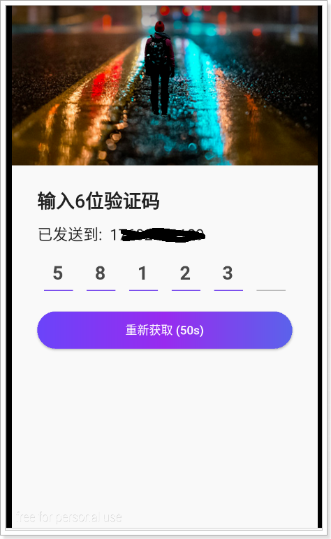

 

 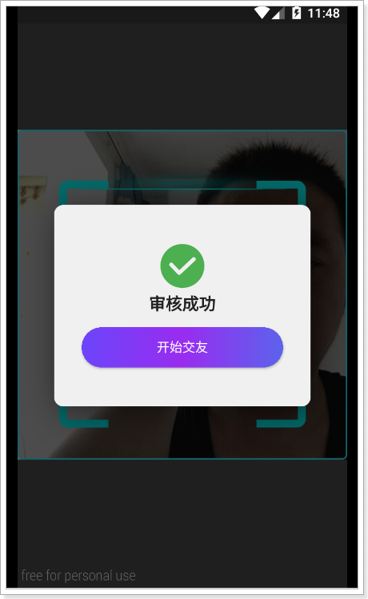

图片上传超过1MB出错的解决方案：

~~~properties
#在application.properties文件中，填入下面的配置
#设置最大的文件上传大小
spring.servlet.multipart.max-request-size=30MB
spring.servlet.multipart.max-file-size=30MB
~~~


## 2、校验token

在整个系统架构中，只有SSO保存了JWT中的秘钥，所以只能通过SSO系统提供的接口服务进行对token的校验，所以在SSO系统中，需要对外开放接口，通过token进行查询用户信息，如果返回null说明用户状态已过期或者是非法的token，否则返回User对象数据。

### 2.1、UserController

~~~java
    /**
     * 校验token，根据token查询用户数据
     *
     * @param token
     * @return
     */
    @GetMapping("{token}")
    public User queryUserByToken(@PathVariable("token") String token) {
        return this.userService.queryUserByToken(token);
    }
~~~

### 2.2、UserService

~~~java
	public User queryUserByToken(String token) {
        try {
            // 通过token解析数据
            Map<String, Object> body = Jwts.parser()
                    .setSigningKey(secret)
                    .parseClaimsJws(token)
                    .getBody();

            User user = new User();
            user.setId(Long.valueOf(body.get("id").toString()));

            //需要返回user对象中的mobile，需要查询数据库获取到mobile数据
            //如果每次都查询数据库，必然会导致性能问题，需要对用户的手机号进行缓存操作
            //数据缓存时，需要设置过期时间，过期时间要与token的时间一致
            //如果用户修改了手机号，需要同步修改redis中的数据

            String redisKey = "TANHUA_USER_MOBILE_" + user.getId();
            if(this.redisTemplate.hasKey(redisKey)){
                String mobile = this.redisTemplate.opsForValue().get(redisKey);
                user.setMobile(mobile);
            }else {
                //查询数据库
                User u = this.userMapper.selectById(user.getId());
                user.setMobile(u.getMobile());

                //将手机号写入到redis中
                //在jwt中的过期时间的单位为：秒
                long timeout = Long.valueOf(body.get("exp").toString()) * 1000 - System.currentTimeMillis();
                this.redisTemplate.opsForValue().set(redisKey, u.getMobile(), timeout, TimeUnit.MILLISECONDS);
            }

            return user;
        } catch (ExpiredJwtException e) {
            log.info("token已经过期！ token = " + token);
        } catch (Exception e) {
            log.error("token不合法！ token = "+ token, e);
        }
        return null;
    }
~~~

### 2.3、测试

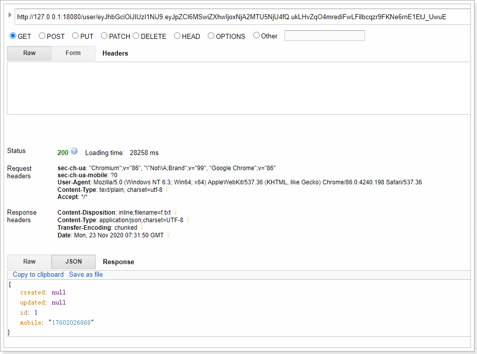

数据已经存储到redis中：

 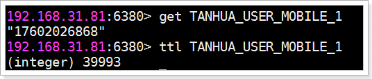

## 3、MongoDB快速入门

### 3.1、MongoDB简介

MongoDB是一个基于分布式文件存储的数据库。由C++语言编写。旨在为WEB应用提供可扩展的高性能数据存储解决方案。

MongoDB是一个介于关系数据库和非关系数据库之间的产品，是非关系数据库当中功能最丰富，最像关系数据库的，它支持的数据结构非常松散，是类似json的bson格式，因此可以存储比较复杂的数据类型。

MongoDB最大的特点是它支持的查询语言非常强大，其语法有点类似于面向对象的查询语言，几乎可以实现类似关系数据库单表查询的绝大部分功能，而且还支持对数据建立索引。

官网：https://www.mongodb.com

### 3.2、通过docker安装MongoDB

~~~shell
#拉取镜像
docker pull mongo:4.0.3

#创建容器
docker create --name mongodb-server -p 27018:27017 -v mongodb-data:/data/db mongo:4.0.3 --auth

#启动容器
docker start mongodb-server

#进入容器
docker exec -it mongodb-server /bin/bash


#进入admin数据库
mongo
use admin

#添加管理员，其拥有管理用户和角色的权限
db.createUser({ user: 'root', pwd: 'root', roles: [ { role: "root", db: "admin" } ] })

#测试，发现是没有权限操作的
> show dbs
2020-10-20T09:09:15.543+0000 E QUERY    [js] Error: listDatabases failed:{
        "ok" : 0,
        "errmsg" : "command listDatabases requires authentication",
        "code" : 13,
        "codeName" : "Unauthorized"
} :

#进行认证
mongo -u "root" -p "root" --authenticationDatabase "admin"

#通过admin添加普通用户
use admin
db.createUser({ user: 'tanhua', pwd: 'l3SCjl0HvmSkTtiSbN0Swv40spYnHhDV', roles: [ { role: "readWrite", db: "tanhua" } ] });

#通过tanhua用户登录进行测试
mongo -u "tanhua" -p "l3SCjl0HvmSkTtiSbN0Swv40spYnHhDV" --authenticationDatabase "admin"

#测试
root@5d848955ff7e:/# mongo -u "tanhua" -p "tanhua123" --authenticationDatabase "admin"
MongoDB shell version v4.0.3
connecting to: mongodb://127.0.0.1:27017
Implicit session: session { "id" : UUID("6c368269-30f0-4b29-a224-05a38b5847e2") }
MongoDB server version: 4.0.3
> use tanhua
switched to db tanhua
> db.user.insert({id:1,username:'zhangsan',age:20})
WriteResult({ "nInserted" : 1 })
> db.user.find()
{ "_id" : ObjectId("5f8eb2726e0de0aa9517afd3"), "id" : 1, "username" : "zhangsan", "age" : 20 }

~~~

### 3.3、MongoDB基本操作

#### 3.3.1、基本概念

为了更好的理解，下面与SQL中的概念进行对比：

| SQL术语/概念 | MongoDB术语/概念 | 解释/说明                           |
| ------------ | ---------------- | ----------------------------------- |
| database     | database         | 数据库                              |
| table        | collection       | 数据库表/集合                       |
| row          | document         | 数据记录行/文档                     |
| column       | field            | 数据字段/域                         |
| index        | index            | 索引                                |
| table joins  |                  | 表连接,MongoDB不支持                |
| primary key  | primary key      | 主键,MongoDB自动将_id字段设置为主键 |

 

#### 3.3.2、数据库以及表的操作

~~~shell
#查看所有的数据库
> show dbs
admin   0.000GB
config  0.000GB
local   0.000GB

#通过use关键字切换数据库
> use admin
switched to db admin

#创建数据库
#说明：在MongoDB中，数据库是自动创建的，通过use切换到新数据库中，进行插入数据即可自动创建数据库
> use testdb
switched to db testdb
> show dbs #并没有创建数据库
admin   0.000GB
config  0.000GB
local   0.000GB
> db.user.insert({id:1,name:'zhangsan'})  #插入数据
WriteResult({ "nInserted" : 1 })
> show dbs
admin   0.000GB
config  0.000GB
local   0.000GB
testdb  0.000GB #数据库自动创建

#查看表
> show tables
user
> show collections
user
> 

#删除集合（表）
> db.user.drop()
true  #如果成功删除选定集合，则 drop() 方法返回 true，否则返回 false。

#删除数据库
> use testdb #先切换到要删除的数据库中
switched to db testdb
> db.dropDatabase()  #删除数据库
{ "dropped" : "testdb", "ok" : 1 }
> show dbs
admin   0.000GB
config  0.000GB
local   0.000GB
~~~

#### 3.3.3、新增数据

在MongoDB中，存储的文档结构是一种类似于json的结构，称之为bson（全称为：Binary JSON）。

~~~shell
#插入数据

#语法：db.COLLECTION_NAME.insert(document)
> db.user.insert({id:1,username:'zhangsan',age:20})
WriteResult({ "nInserted" : 1 })
> db.user.save({id:2,username:'lisi',age:25})
WriteResult({ "nInserted" : 1 })
> db.user.find()  #查询数据
{ "_id" : ObjectId("5c08c0024b318926e0c1f6dc"), "id" : 1, "username" : "zhangsan", "age" : 20 }
{ "_id" : ObjectId("5c08c0134b318926e0c1f6dd"), "id" : 2, "username" : "lisi", "age" : 25 }

~~~

#### 3.3.4、更新数据

update() 方法用于更新已存在的文档。语法格式如下：

```shell
db.collection.update(
   <query>,
   <update>,
   [
     upsert: <boolean>,
     multi: <boolean>,
     writeConcern: <document>
   ]
)
```

**参数说明：**

- **query** : update的查询条件，类似sql update查询内where后面的。
- **update** : update的对象和一些更新的操作符（如$,$inc...）等，也可以理解为sql update查询内set后面的
- **upsert** : 可选，这个参数的意思是，如果不存在update的记录，是否插入objNew,true为插入，默认是false，不插入。
- **multi** : 可选，mongodb 默认是false,只更新找到的第一条记录，如果这个参数为true,就把按条件查出来多条记录全部更新。
- **writeConcern** :可选，抛出异常的级别。

~~~shell
> db.user.find()
{ "_id" : ObjectId("5c08c0024b318926e0c1f6dc"), "id" : 1, "username" : "zhangsan", "age" : 20 }
{ "_id" : ObjectId("5c08c0134b318926e0c1f6dd"), "id" : 2, "username" : "lisi", "age" : 25 }

> db.user.update({id:1},{$set:{age:22}}) #更新数据

WriteResult({ "nMatched" : 1, "nUpserted" : 0, "nModified" : 1 })

> db.user.find()
{ "_id" : ObjectId("5c08c0024b318926e0c1f6dc"), "id" : 1, "username" : "zhangsan", "age" : 22 }
{ "_id" : ObjectId("5c08c0134b318926e0c1f6dd"), "id" : 2, "username" : "lisi", "age" : 25 }

#注意：如果这样写，会删除掉其他的字段
> db.user.update({id:1},{age:25})
WriteResult({ "nMatched" : 1, "nUpserted" : 0, "nModified" : 1 })
> db.user.find()
{ "_id" : ObjectId("5c08c0024b318926e0c1f6dc"), "age" : 25 }
{ "_id" : ObjectId("5c08c0134b318926e0c1f6dd"), "id" : 2, "username" : "lisi", "age" : 25 }

#更新不存在的字段，会新增字段
> db.user.update({id:2},{$set:{sex:1}}) #更新数据
> db.user.find()
{ "_id" : ObjectId("5c08c0024b318926e0c1f6dc"), "age" : 25 }
{ "_id" : ObjectId("5c08c0134b318926e0c1f6dd"), "id" : 2, "username" : "lisi", "age" : 25, "sex" : 1 }

#更新不存在的数据，默认不会新增数据
> db.user.update({id:3},{$set:{sex:1}})
WriteResult({ "nMatched" : 0, "nUpserted" : 0, "nModified" : 0 })
> db.user.find()
{ "_id" : ObjectId("5c08c0024b318926e0c1f6dc"), "age" : 25 }
{ "_id" : ObjectId("5c08c0134b318926e0c1f6dd"), "id" : 2, "username" : "lisi", "age" : 25, "sex" : 1 }

#如果设置第一个参数为true，就是新增数据
> db.user.update({id:3},{$set:{sex:1}},true)
WriteResult({
	"nMatched" : 0,
	"nUpserted" : 1,
	"nModified" : 0,
	"_id" : ObjectId("5c08cb281418d073246bc642")
})
> db.user.find()
{ "_id" : ObjectId("5c08c0024b318926e0c1f6dc"), "age" : 25 }
{ "_id" : ObjectId("5c08c0134b318926e0c1f6dd"), "id" : 2, "username" : "lisi", "age" : 25, "sex" : 1 }
{ "_id" : ObjectId("5c08cb281418d073246bc642"), "id" : 3, "sex" : 1 }

~~~

#### 3.3.5、删除数据

通过remove()方法进行删除数据，语法如下：

~~~shell
db.collection.remove(
   <query>,
   {
     justOne: <boolean>,
     writeConcern: <document>
   }
)
~~~

**参数说明：**

- **query** :（可选）删除的文档的条件。
- **justOne** : （可选）如果设为 true 或 1，则只删除一个文档，如果不设置该参数，或使用默认值 false，则删除所有匹配条件的文档。
- **writeConcern** :（可选）抛出异常的级别。

实例：

~~~shell
> db.user.remove({age:25})
WriteResult({ "nRemoved" : 2 })  #删除了2条数据

#插入4条测试数据
db.user.insert({id:1,username:'zhangsan',age:20})
db.user.insert({id:2,username:'lisi',age:21})
db.user.insert({id:3,username:'wangwu',age:22})
db.user.insert({id:4,username:'zhaoliu',age:22})

> db.user.remove({age:22},true)
WriteResult({ "nRemoved" : 1 })  #删除了1条数据

#删除所有数据
> db.user.remove({})

#说明：为了简化操作，官方推荐使用deleteOne()与deleteMany()进行删除数据操作。
db.user.deleteOne({id:1})
db.user.deleteMany({})  #删除所有数据

~~~

#### 3.3.6、查询数据

MongoDB 查询数据的语法格式如下：

```
db.user.find([query],[fields])
```

- **query** ：可选，使用查询操作符指定查询条件
- **fields** ：可选，使用投影操作符指定返回的键。查询时返回文档中所有键值， 只需省略该参数即可（默认省略）。

如果你需要以易读的方式来读取数据，可以使用 pretty() 方法，语法格式如下：

```
>db.col.find().pretty()
```

pretty() 方法以格式化的方式来显示所有文档。

条件查询：

| 操作       | 格式                     | 范例                                        | RDBMS中的类似语句         |
| ---------- | ------------------------ | ------------------------------------------- | ------------------------- |
| 等于       | `{<key>:<value>`}        | `db.col.find({"by":"黑马程序员"}).pretty()` | `where by = '黑马程序员'` |
| 小于       | `{<key>:{$lt:<value>}}`  | `db.col.find({"likes":{$lt:50}}).pretty()`  | `where likes < 50`        |
| 小于或等于 | `{<key>:{$lte:<value>}}` | `db.col.find({"likes":{$lte:50}}).pretty()` | `where likes <= 50`       |
| 大于       | `{<key>:{$gt:<value>}}`  | `db.col.find({"likes":{$gt:50}}).pretty()`  | `where likes > 50`        |
| 大于或等于 | `{<key>:{$gte:<value>}}` | `db.col.find({"likes":{$gte:50}}).pretty()` | `where likes >= 50`       |
| 不等于     | `{<key>:{$ne:<value>}}`  | `db.col.find({"likes":{$ne:50}}).pretty()`  | `where likes != 50`       |


实例：

~~~shell
#插入测试数据
db.user.insert({id:1,username:'zhangsan',age:20})
db.user.insert({id:2,username:'lisi',age:21})
db.user.insert({id:3,username:'wangwu',age:22})
db.user.insert({id:4,username:'zhaoliu',age:22})

db.user.find()  #查询全部数据
db.user.find({},{id:1,username:1})  #只查询id与username字段
db.user.find().count()  #查询数据条数
db.user.find({id:1}) #查询id为1的数据
db.user.find({age:{$lte:21}}) #查询小于等于21的数据
db.user.find({age:{$lte:21}, id:{$gte:2}}) #and查询，age小于等于21并且id大于等于2
db.user.find({$or:[{id:1},{id:2}]}) #查询id=1 or id=2

#分页查询：Skip()跳过几条，limit()查询条数
db.user.find().limit(2).skip(1)  #跳过1条数据，查询2条数据

db.user.find().sort({id:-1}) #按照age倒序排序，-1为倒序，1为正序
~~~

### 3.4、索引

索引通常能够极大的提高查询的效率，如果没有索引，MongoDB在读取数据时必须扫描集合中的每个文件并选取那些符合查询条件的记录。

这种扫描全集合的查询效率是非常低的，特别在处理大量的数据时，查询可以要花费几十秒甚至几分钟，这对网站的性能是非常致命的。

索引是特殊的数据结构，索引存储在一个易于遍历读取的数据集合中，索引是对数据库表中一列或多列的值进行排序的一种结构


~~~shell
#查看索引
> db.user.getIndexes()
[
	{
		"v" : 2,
		"key" : {
			"_id" : 1
		},
		"name" : "_id_",
		"ns" : "testdb.user"
	}
]

#说明：1表示升序创建索引，-1表示降序创建索引。
~~~

~~~shell
#创建索引
> db.user.createIndex({'age':1})
{
	"createdCollectionAutomatically" : false,
	"numIndexesBefore" : 1,
	"numIndexesAfter" : 2,
	"ok" : 1
}
~~~

~~~shell
#删除索引
db.user.dropIndex("age_1")
#或者，删除除了_id之外的索引
db.user.dropIndexes()
~~~

~~~shell
#创建联合索引
db.user.createIndex({'age':1, 'id':-1})
~~~

~~~shell
#查看索引大小，单位：字节
db.user.totalIndexSize()
~~~

### 3.5、执行计划

MongoDB 查询分析可以确保我们建议的索引是否有效，是查询语句性能分析的重要工具。

~~~shell
#插入1000条数据
for(var i=1;i<1000;i++)db.user.insert({id:100+i,username:'name_'+i,age:10+i})
~~~

~~~shell
#查看执行计划
> db.user.find({age:{$gt:100},id:{$lt:200}}).explain()
{
	"queryPlanner" : {
		"plannerVersion" : 1,
		"namespace" : "testdb.user",
		"indexFilterSet" : false,
		"parsedQuery" : {
			"$and" : [
				{
					"id" : {
						"$lt" : 200
					}
				},
				{
					"age" : {
						"$gt" : 100
					}
				}
			]
		},
		"winningPlan" : {  #最佳执行计划
			"stage" : "FETCH", #查询方式，常见的有COLLSCAN/全表扫描、IXSCAN/索引扫描、FETCH/根据索引去检索文档、SHARD_MERGE/合并分片结果、IDHACK/针对_id进行查询
			"inputStage" : {
				"stage" : "IXSCAN",
				"keyPattern" : {
					"age" : 1,
					"id" : -1
				},
				"indexName" : "age_1_id_-1",
				"isMultiKey" : false,
				"multiKeyPaths" : {
					"age" : [ ],
					"id" : [ ]
				},
				"isUnique" : false,
				"isSparse" : false,
				"isPartial" : false,
				"indexVersion" : 2,
				"direction" : "forward",
				"indexBounds" : {
					"age" : [
						"(100.0, inf.0]"
					],
					"id" : [
						"(200.0, -inf.0]"
					]
				}
			}
		},
		"rejectedPlans" : [ ]
	},
	"serverInfo" : {
		"host" : "c493d5ff750a",
		"port" : 27017,
		"version" : "4.0.3",
		"gitVersion" : "7ea530946fa7880364d88c8d8b6026bbc9ffa48c"
	},
	"ok" : 1
}

~~~

~~~shell
#测试没有使用索引
> db.user.find({username:'zhangsan'}).explain()
{
	"queryPlanner" : {
		"plannerVersion" : 1,
		"namespace" : "testdb.user",
		"indexFilterSet" : false,
		"parsedQuery" : {
			"username" : {
				"$eq" : "zhangsan"
			}
		},
		"winningPlan" : {
			"stage" : "COLLSCAN",  #全表扫描
			"filter" : {
				"username" : {
					"$eq" : "zhangsan"
				}
			},
			"direction" : "forward"
		},
		"rejectedPlans" : [ ]
	},
	"serverInfo" : {
		"host" : "c493d5ff750a",
		"port" : 27017,
		"version" : "4.0.3",
		"gitVersion" : "7ea530946fa7880364d88c8d8b6026bbc9ffa48c"
	},
	"ok" : 1
}
~~~

### 3.6、UI客户端工具

 Robo 3T是MongoDB的客户端工具，我们可以使用它来操作MongoDB。

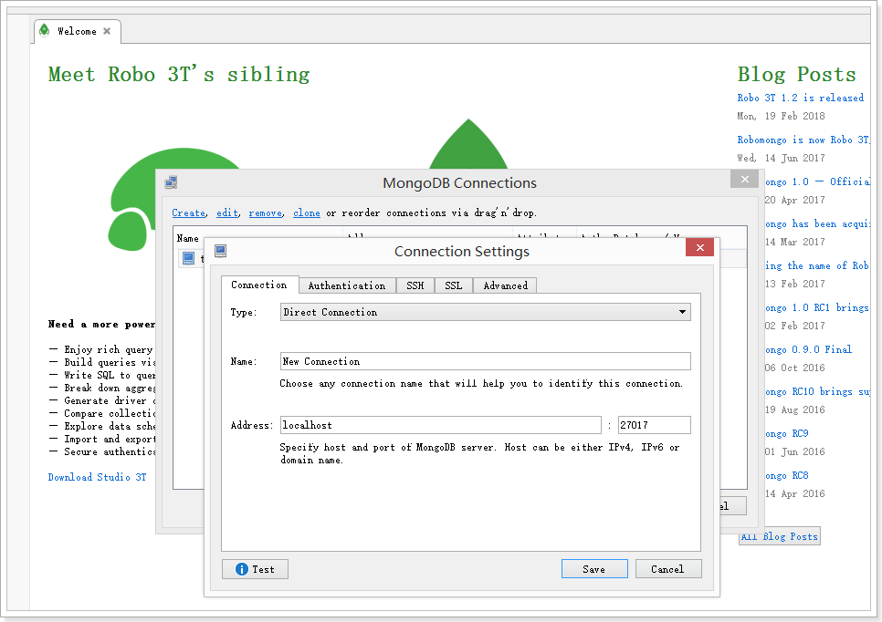

查看数据： 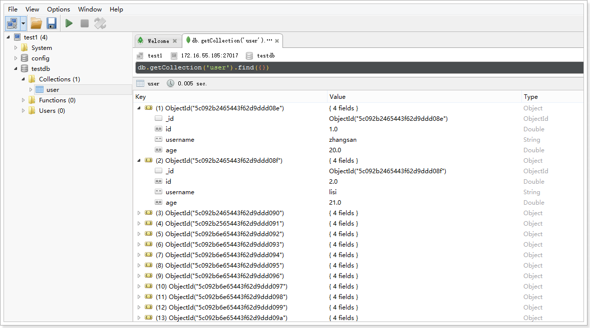

或使用Navicat Premium 15：

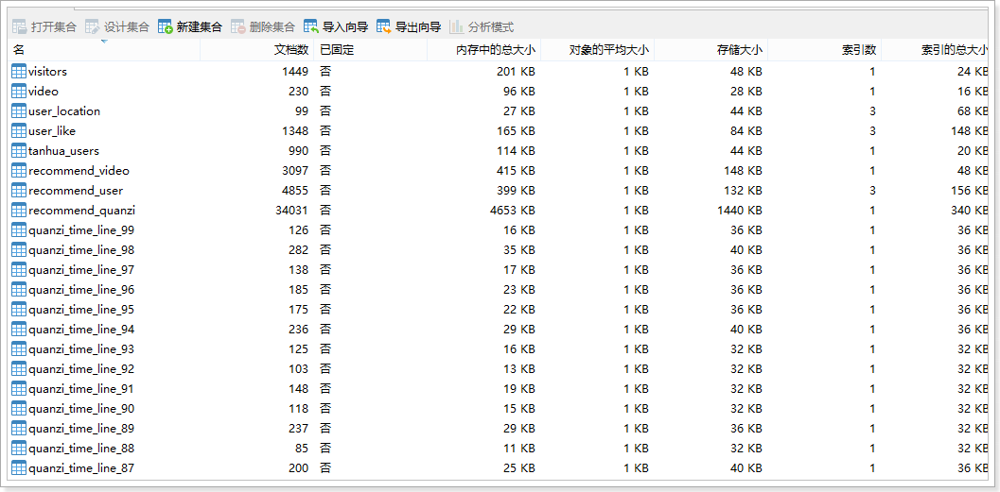


## 4、SpringBoot整合MongoDB

spring-data对MongoDB做了支持，使用spring-data-mongodb可以简化MongoDB的操作。

地址：https://spring.io/projects/spring-data-mongodb

### 4.1、导入依赖

~~~xml
<?xml version="1.0" encoding="UTF-8"?>
<project xmlns="http://maven.apache.org/POM/4.0.0"
         xmlns:xsi="http://www.w3.org/2001/XMLSchema-instance"
         xsi:schemaLocation="http://maven.apache.org/POM/4.0.0 http://maven.apache.org/xsd/maven-4.0.0.xsd">
    <modelVersion>4.0.0</modelVersion>

    <parent>
        <groupId>org.springframework.boot</groupId>
        <artifactId>spring-boot-starter-parent</artifactId>
        <version>2.1.0.RELEASE</version>
    </parent>

    <groupId>cn.itcast.mongodb</groupId>
    <artifactId>itcast-mongodb</artifactId>
    <version>1.0-SNAPSHOT</version>

    <dependencies>
        <dependency>
            <groupId>org.springframework.boot</groupId>
            <artifactId>spring-boot-starter-data-mongodb</artifactId>
        </dependency>
        <dependency>
            <groupId>org.springframework.boot</groupId>
            <artifactId>spring-boot-starter-test</artifactId>
            <scope>test</scope>
        </dependency>
        <dependency>
            <groupId>org.projectlombok</groupId>
            <artifactId>lombok</artifactId>
            <optional>true</optional>
            <version>1.18.4</version>
        </dependency>
    </dependencies>

    <build>
        <plugins>
            <!-- java编译插件 -->
            <plugin>
                <groupId>org.apache.maven.plugins</groupId>
                <artifactId>maven-compiler-plugin</artifactId>
                <version>3.2</version>
                <configuration>
                    <source>1.8</source>
                    <target>1.8</target>
                    <encoding>UTF-8</encoding>
                </configuration>
            </plugin>
        </plugins>
    </build>

</project>
~~~

### 4.2、编写application.properties配置文件

~~~properties
# Spring boot application
spring.application.name = itcast-mongodb

#无认证信息的配置
#spring.data.mongodb.uri=mongodb://192.168.31.81:27017/tanhua

#springboot 配置
spring.data.mongodb.username=tanhua
spring.data.mongodb.password=l3SCjl0HvmSkTtiSbN0Swv40spYnHhDV
spring.data.mongodb.authentication-database=admin
spring.data.mongodb.database=tanhua
spring.data.mongodb.port=27018
spring.data.mongodb.host=192.168.31.81
~~~

### 4.3、编写实体

~~~java
package cn.itcast.mongodb.pojo;

import lombok.AllArgsConstructor;
import lombok.Data;
import lombok.NoArgsConstructor;
import org.bson.types.ObjectId;

@Data
@AllArgsConstructor
@NoArgsConstructor
public class Person {

    private ObjectId id;
    private String name;
    private int age;
    private Address address;
}
~~~

~~~java
package cn.itcast.mongodb.pojo;

import lombok.AllArgsConstructor;
import lombok.Data;
import lombok.NoArgsConstructor;

@Data
@AllArgsConstructor
@NoArgsConstructor
public class Address {
    private String street;
    private String city;
    private String zip;
}
~~~

### 4.4、编写dao

~~~java
package cn.itcast.mongodb.dao;

import cn.itcast.mongodb.pojo.Person;
import com.mongodb.client.result.DeleteResult;
import com.mongodb.client.result.UpdateResult;
import org.springframework.beans.factory.annotation.Autowired;
import org.springframework.data.mongodb.core.MongoTemplate;
import org.springframework.data.mongodb.core.query.Criteria;
import org.springframework.data.mongodb.core.query.Query;
import org.springframework.data.mongodb.core.query.Update;
import org.springframework.stereotype.Component;

import java.util.List;

@Component
public class PersonDao {

    @Autowired
    private MongoTemplate mongoTemplate;

    public void savePerson(Person person) {
        this.mongoTemplate.save(person);
    }

    public List<Person> queryPersonListByName(String name) {
        Query query = Query.query(Criteria.where("name").is(name));
        return this.mongoTemplate.find(query, Person.class);
    }

    public List<Person> queryPersonPageList(Integer page, Integer rows) {
        Query query = new Query().limit(rows).skip((page - 1) * rows);
        return this.mongoTemplate.find(query, Person.class);
    }

    public UpdateResult update(Person person) {
        Query query = Query.query(Criteria.where("id").is(person.getId()));
        Update update = Update.update("age", person.getAge());
        return this.mongoTemplate.updateFirst(query, update, Person.class);
    }

    public DeleteResult deleteById(String id) {
        Query query = Query.query(Criteria.where("id").is(id));
        return this.mongoTemplate.remove(query, Person.class);
    }
}

~~~

### 4.5、编写启动类

~~~java
package cn.itcast.mongodb;

import org.springframework.boot.SpringApplication;
import org.springframework.boot.autoconfigure.SpringBootApplication;

@SpringBootApplication
public class MongoApplication {

    public static void main(String[] args) {
        SpringApplication.run(MongoApplication.class, args);
    }
}

~~~

### 4.6、编写单元测试

~~~java
package cn.itcast.mongodb;

import cn.itcast.mongodb.dao.PersonDao;
import cn.itcast.mongodb.pojo.Address;
import cn.itcast.mongodb.pojo.Person;
import org.bson.types.ObjectId;
import org.junit.Test;
import org.junit.runner.RunWith;
import org.springframework.beans.factory.annotation.Autowired;
import org.springframework.boot.test.context.SpringBootTest;
import org.springframework.test.context.junit4.SpringRunner;

import java.util.List;

@RunWith(SpringRunner.class)
@SpringBootTest
public class TestPersonDao {

    @Autowired
    private PersonDao personDao;

    @Test
    public void testSave() {
        Person person = new Person(ObjectId.get(), "张三", 20,
                new Address("人民路", "上海市", "666666"));
        this.personDao.savePerson(person);
    }

    @Test
    public void testQuery() {
        List<Person> personList = this.personDao.queryPersonListByName("张三");
        for (Person person : personList) {
            System.out.println(person);
        }
    }

    @Test
    public void testQuery2() {
        List<Person> personList = this.personDao.queryPersonPageList(2, 2);
        for (Person person : personList) {
            System.out.println(person);
        }
    }

    @Test
    public void testUpdate() {
        Person person = new Person();
        person.setId(new ObjectId("5c0956ce235e192520086736"));
        person.setAge(30);
        this.personDao.update(person);
    }

    @Test
    public void testDelete() {
        this.personDao.deleteById("5c09ca05235e192d8887a389");
    }

}

~~~


