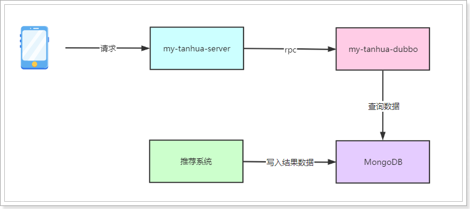
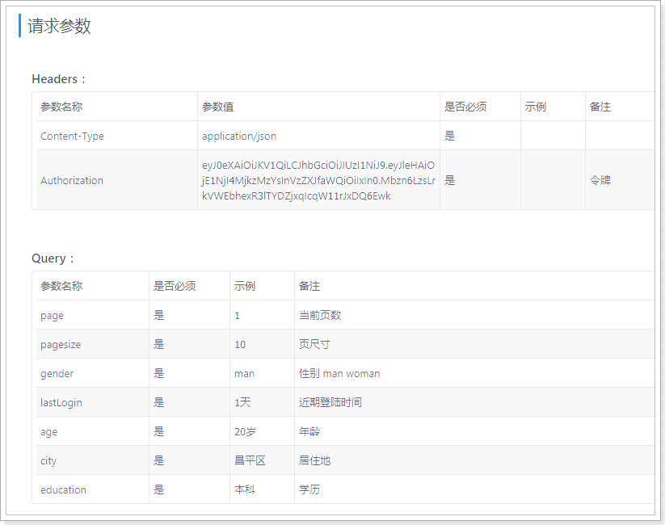

## 课程说明

- 首页功能说明
- 系统架构说明
- 实现今日佳人功能
- 实现推荐用户的列表
- 接口增加缓存功能
- 整合前端联调测试

## 1、首页

在用户登录成功后，就会进入首页，首页中有今日佳人、推荐好友、探花、搜附近等功能。

 

## 2、系统架构

在开发完SSO系统中的登录功能后，接下来就需要实现其他的功能，在整体架构中，完成与APP对接的服务工程叫my-tanhua-server，真正的核心业务逻辑使用dubbo完成，其工程名叫：my-tanhua-dubbo，它们的架构示意图如下：


说明：

- 客户端APP发起请求到Nginx，在Nginx中对请求做出判断，将请求转发至sso系统或server系统。
- sso系统中，将对接第三方平台以及完成数据的缓存、消息发送、用户的注册登录功能。
- server系统为APP提供了接口服务的支撑
  - 用户请求中携带的token需要到sso系统中进行校验
  - 通过rpc调用dubbo中提供的服务，在dubbo服务中与MongoDB对接，完成数据的CRUD操作
  - 将一些数据缓存到Redis，从而提升数据查询性能
  - 用户数据的查询将基于MySQL数据库进行查询

### 2.1、nginx服务

#### 2.1.1、部署安装

安装包在资料中：nginx-1.17.3.zip

安装在任意目录，通过命令：start nginx.exe 启动：

 

重启加载配置文件命令：nginx.exe -s reload

 

#### 2.1.2、配置

修改conf目录下的nginx.conf文件：

~~~shell
#user  nobody;
worker_processes  1;

#error_log  logs/error.log;
#error_log  logs/error.log  notice;
#error_log  logs/error.log  info;

#pid        logs/nginx.pid;


events {
    worker_connections  1024;
}


http {
    include       mime.types;
    default_type  application/octet-stream;

    #log_format  main  '$remote_addr - $remote_user [$time_local] "$request" '
    #                  '$status $body_bytes_sent "$http_referer" '
    #                  '"$http_user_agent" "$http_x_forwarded_for"';

    #access_log  logs/access.log  main;

    sendfile        on;
    #tcp_nopush     on;

    #keepalive_timeout  0;
    keepalive_timeout  65;

    #gzip  on;

    server {
        listen       80;
        server_name  localhost;

        #charset koi8-r;

        #access_log  logs/host.access.log  main;

        #error_page  404              /404.html;

        # redirect server error pages to the static page /50x.html
        #
        error_page   500 502 503 504  /50x.html;
        location = /50x.html {
            root   html;
        }

        location /user/ {  #请求路径中凡是以/user/开头的请求，转发到sso系统
            client_max_body_size  300m;  #设置最大的请求体大小，解决大文件上传不了的问题
            proxy_connect_timeout 300s;  #代理连接超时时间
            proxy_send_timeout 300s;  #代理发送数据的超时时间
            proxy_read_timeout 300s;  #代理读取数据的超时时间
            proxy_pass   http://127.0.0.1:18080;  #转发请求
        }

        location / {   #上面未匹配到的在这里处理
            client_max_body_size  300m;
            proxy_connect_timeout 300s;
            proxy_send_timeout 300s;
            proxy_read_timeout 300s;
                proxy_pass   http://127.0.0.1:18081;  #转发请求到server系统
            }
        }

}
~~~

#### 2.1.3、测试

 

### 2.2、搭建server工程

#### 2.2.1、导入依赖

pom.xml文件：

~~~xml
<?xml version="1.0" encoding="UTF-8"?>
<project xmlns="http://maven.apache.org/POM/4.0.0"
         xmlns:xsi="http://www.w3.org/2001/XMLSchema-instance"
         xsi:schemaLocation="http://maven.apache.org/POM/4.0.0 http://maven.apache.org/xsd/maven-4.0.0.xsd">
    <parent>
        <artifactId>my-tanhua</artifactId>
        <groupId>cn.itcast.tanhua</groupId>
        <version>1.0-SNAPSHOT</version>
    </parent>
    <modelVersion>4.0.0</modelVersion>

    <artifactId>my-tanhua-server</artifactId>

    <dependencies>
        <dependency>
            <groupId>cn.itcast.tanhua</groupId>
            <artifactId>my-tanhua-dubbo-interface</artifactId>
            <version>1.0-SNAPSHOT</version>
        </dependency>
        <dependency>
            <groupId>org.springframework.boot</groupId>
            <artifactId>spring-boot-starter-web</artifactId>
        </dependency>
        <dependency>
            <groupId>org.springframework.boot</groupId>
            <artifactId>spring-boot-starter-test</artifactId>
            <scope>test</scope>
        </dependency>
        <dependency>
            <groupId>org.springframework.boot</groupId>
            <artifactId>spring-boot-starter-data-redis</artifactId>
        </dependency>
        <!--dubbo的springboot支持-->
        <dependency>
            <groupId>com.alibaba.boot</groupId>
            <artifactId>dubbo-spring-boot-starter</artifactId>
        </dependency>
        <!--dubbo框架-->
        <dependency>
            <groupId>com.alibaba</groupId>
            <artifactId>dubbo</artifactId>
        </dependency>
        <!--zk依赖-->
        <dependency>
            <groupId>org.apache.zookeeper</groupId>
            <artifactId>zookeeper</artifactId>
        </dependency>
        <dependency>
            <groupId>com.github.sgroschupf</groupId>
            <artifactId>zkclient</artifactId>
        </dependency>
        <dependency>
            <groupId>org.apache.commons</groupId>
            <artifactId>commons-lang3</artifactId>
        </dependency>
        <dependency>
            <groupId>org.apache.commons</groupId>
            <artifactId>commons-collections4</artifactId>
            <version>4.4</version>
        </dependency>
        <dependency>
            <groupId>com.baomidou</groupId>
            <artifactId>mybatis-plus</artifactId>
        </dependency>
        <dependency>
            <groupId>com.baomidou</groupId>
            <artifactId>mybatis-plus-boot-starter</artifactId>
        </dependency>
        <dependency>
            <groupId>mysql</groupId>
            <artifactId>mysql-connector-java</artifactId>
        </dependency>
        <dependency>
            <groupId>commons-io</groupId>
            <artifactId>commons-io</artifactId>
            <version>2.6</version>
        </dependency>
        <dependency>
            <groupId>commons-codec</groupId>
            <artifactId>commons-codec</artifactId>
        </dependency>
    </dependencies>
</project>
~~~

#### 2.2.2、application.properties

~~~properties
spring.application.name = itcast-tanhua-server
server.port = 18081

#数据库连接信息
spring.datasource.driver-class-name=com.mysql.jdbc.Driver
spring.datasource.url=jdbc:mysql://192.168.31.81:3306/mytanhua?useUnicode=true&characterEncoding=utf8&autoReconnect=true&allowMultiQueries=true&useSSL=false
spring.datasource.username=root
spring.datasource.password=root

# 枚举包扫描
mybatis-plus.type-enums-package=com.tanhua.server.enums
# 表名前缀
mybatis-plus.global-config.db-config.table-prefix=tb_
# id策略为自增长
mybatis-plus.global-config.db-config.id-type=auto

#dubbo注册中心配置
dubbo.application.name = itcast-tanhua-server
dubbo.registry.address = zookeeper://192.168.31.81:2181
dubbo.registry.client = zkclient
dubbo.registry.timeout = 60000
dubbo.consumer.timeout = 60000

#sso系统服务地址
tanhua.sso.url=http://127.0.0.1
#默认今日佳人推荐用户
tanhua.sso.default.user=2
~~~

#### 2.2.3、ServerApplication

~~~java
package com.tanhua.server;

import org.mybatis.spring.annotation.MapperScan;
import org.springframework.boot.SpringApplication;
import org.springframework.boot.autoconfigure.SpringBootApplication;

@MapperScan("com.tanhua.server.mapper") //设置mapper接口的扫描包
@SpringBootApplication
public class ServerApplication {

    public static void main(String[] args) {
        SpringApplication.run(ServerApplication.class, args);
    }
}

~~~

### 2.3、搭建dubbo工程

my-tanhua-dubbo是dubbo工程的父工程：

 ~~~xml
<?xml version="1.0" encoding="UTF-8"?>
<project xmlns="http://maven.apache.org/POM/4.0.0"
         xmlns:xsi="http://www.w3.org/2001/XMLSchema-instance"
         xsi:schemaLocation="http://maven.apache.org/POM/4.0.0 http://maven.apache.org/xsd/maven-4.0.0.xsd">
    <parent>
        <artifactId>my-tanhua</artifactId>
        <groupId>cn.itcast.tanhua</groupId>
        <version>1.0-SNAPSHOT</version>
    </parent>
    <modelVersion>4.0.0</modelVersion>

    <artifactId>my-tanhua-dubbo</artifactId>
    <packaging>pom</packaging>
    <modules>
        <module>my-tanhua-dubbo-interface</module>
        <module>my-tanhua-dubbo-service</module>
    </modules>


</project>
 ~~~

#### 2.3.1、创建my-tanhua-dubbo-interface工程

该工程中定义了dubbo服务中的interface与实体对象。

~~~xml
<?xml version="1.0" encoding="UTF-8"?>
<project xmlns="http://maven.apache.org/POM/4.0.0"
         xmlns:xsi="http://www.w3.org/2001/XMLSchema-instance"
         xsi:schemaLocation="http://maven.apache.org/POM/4.0.0 http://maven.apache.org/xsd/maven-4.0.0.xsd">
    <parent>
        <artifactId>my-tanhua-dubbo</artifactId>
        <groupId>cn.itcast.tanhua</groupId>
        <version>1.0-SNAPSHOT</version>
    </parent>
    <modelVersion>4.0.0</modelVersion>

    <artifactId>my-tanhua-dubbo-interface</artifactId>
    <dependencies>
        <dependency>
            <groupId>org.projectlombok</groupId>
            <artifactId>lombok</artifactId>
        </dependency>
        <dependency>
            <groupId>org.springframework.boot</groupId>
            <artifactId>spring-boot-starter-data-mongodb</artifactId>
        </dependency>
    </dependencies>
</project>
~~~

#### 2.3.2、创建my-tanhua-dubbo-service工程

```xml
<?xml version="1.0" encoding="UTF-8"?>
<project xmlns="http://maven.apache.org/POM/4.0.0"
         xmlns:xsi="http://www.w3.org/2001/XMLSchema-instance"
         xsi:schemaLocation="http://maven.apache.org/POM/4.0.0 http://maven.apache.org/xsd/maven-4.0.0.xsd">
    <parent>
        <artifactId>my-tanhua-dubbo</artifactId>
        <groupId>cn.itcast.tanhua</groupId>
        <version>1.0-SNAPSHOT</version>
    </parent>
    <modelVersion>4.0.0</modelVersion>

    <artifactId>my-tanhua-dubbo-service</artifactId>

    <dependencies>
        <!--引入interface依赖-->
        <dependency>
            <groupId>cn.itcast.tanhua</groupId>
            <artifactId>my-tanhua-dubbo-interface</artifactId>
            <version>1.0-SNAPSHOT</version>
        </dependency>

        <dependency>
            <groupId>org.springframework.boot</groupId>
            <artifactId>spring-boot-starter</artifactId>
        </dependency>
        <dependency>
            <groupId>org.springframework.boot</groupId>
            <artifactId>spring-boot-starter-test</artifactId>
            <scope>test</scope>
        </dependency>

        <!--dubbo的springboot支持-->
        <dependency>
            <groupId>com.alibaba.boot</groupId>
            <artifactId>dubbo-spring-boot-starter</artifactId>
        </dependency>
        <!--dubbo框架-->
        <dependency>
            <groupId>com.alibaba</groupId>
            <artifactId>dubbo</artifactId>
        </dependency>
        <!--zk依赖-->
        <dependency>
            <groupId>org.apache.zookeeper</groupId>
            <artifactId>zookeeper</artifactId>
        </dependency>
        <dependency>
            <groupId>com.github.sgroschupf</groupId>
            <artifactId>zkclient</artifactId>
        </dependency>

        <!--MongoDB相关依赖-->
        <dependency>
            <groupId>org.springframework.boot</groupId>
            <artifactId>spring-boot-starter-data-mongodb</artifactId>
        </dependency>
        <dependency>
            <groupId>org.mongodb</groupId>
            <artifactId>mongodb-driver-sync</artifactId>
        </dependency>

        <!--其他工具包依赖-->
        <dependency>
            <groupId>org.apache.commons</groupId>
            <artifactId>commons-lang3</artifactId>
        </dependency>
        <dependency>
            <groupId>joda-time</groupId>
            <artifactId>joda-time</artifactId>
        </dependency>

        <dependency>
            <groupId>io.netty</groupId>
            <artifactId>netty-all</artifactId>
        </dependency>

    </dependencies>


</project>
```

application.properties：

~~~properties
# Spring boot application
spring.application.name = itcast-tanhua-dubbo-service

# dubbo 扫描包配置
dubbo.scan.basePackages = com.tanhua.dubbo.server
dubbo.application.name = dubbo-provider-tanhua

#dubbo 对外暴露的端口信息
dubbo.protocol.name = dubbo
dubbo.protocol.port = 20880

#dubbo注册中心的配置
dubbo.registry.address = zookeeper://192.168.31.81:2181
dubbo.registry.client = zkclient
dubbo.registry.timeout = 60000 

#springboot MongoDB配置
spring.data.mongodb.username=tanhua
spring.data.mongodb.password=l3SCjl0HvmSkTtiSbN0Swv40spYnHhDV
spring.data.mongodb.authentication-database=admin
spring.data.mongodb.database=tanhua
spring.data.mongodb.port=27017
spring.data.mongodb.host=192.168.31.81
~~~

编写启动类：

~~~java
package com.tanhua.dubbo.server;

import org.springframework.boot.SpringApplication;
import org.springframework.boot.autoconfigure.SpringBootApplication;

@SpringBootApplication
public class DubboApplication {

    public static void main(String[] args) {
        SpringApplication.run(DubboApplication.class, args);
    }
}

~~~

### 2.4、工程结构

最终搭建完成的效果如下：

 

各工程之间的关系如下：

 <!--  -->

## 3、今日佳人

今日佳人，会推荐缘分值最大的用户，进行展现出来。缘分值的计算是由用户的行为进行打分，如：点击、点赞、评论、学历、婚姻状态等信息组合而成的。

实现：我们先不考虑推荐的逻辑，假设现在已经有推荐的结果，我们只需要从结果中查询到缘分值最高的用户就可以了。至于推荐的逻辑以及实现，我们将后面的课程中讲解。

流程：

 

### 3.1、表结构

~~~shell
#表结构，表名：recommend_user
{
  "userId":1001,  #推荐的用户id
  "toUserId":1002, #用户id
  "score":90,  #推荐得分
  "date":"2019/1/1" #日期
}
~~~

已经提供的测试数据（4855条数据）：

 

### 3.2、编写dubbo服务

#### 3.2.1、编写接口

在my-tanhua-dubbo-interface工程中定义接口：

~~~java
package com.tanhua.dubbo.server.api;

import com.tanhua.dubbo.server.vo.PageInfo;
import com.tanhua.dubbo.server.pojo.RecommendUser;

public interface RecommendUserApi {

    /**
     * 查询一位得分最高的推荐用户
     *
     * @param userId
     * @return
     */
    RecommendUser queryWithMaxScore(Long userId);

    /**
     * 按照得分倒序
     *
     * @param userId
     * @param pageNum
     * @param pageSize
     * @return
     */
    PageInfo<RecommendUser> queryPageInfo(Long userId, Integer pageNum, Integer pageSize);
}

~~~

~~~java
package com.tanhua.dubbo.server.pojo;

import lombok.AllArgsConstructor;
import lombok.Data;
import lombok.NoArgsConstructor;
import org.bson.types.ObjectId;
import org.springframework.data.annotation.Id;
import org.springframework.data.mongodb.core.index.Indexed;
import org.springframework.data.mongodb.core.mapping.Document;

@Data
@NoArgsConstructor
@AllArgsConstructor
@Document(collection = "recommend_user")
public class RecommendUser implements java.io.Serializable{

    private static final long serialVersionUID = -4296017160071130962L;

    @Id
    private ObjectId id; //主键id
    @Indexed
    private Long userId; //推荐的用户id
    private Long toUserId; //用户id
    @Indexed
    private Double score; //推荐得分
    private String date; //日期
}

~~~

~~~java
package com.tanhua.dubbo.server.vo;

import lombok.AllArgsConstructor;
import lombok.Data;

import java.util.Collections;
import java.util.List;

@Data
@AllArgsConstructor
public class PageInfo<T> implements java.io.Serializable {

    private static final long serialVersionUID = -2105385689859184204L;

    /**
     * 总条数
     */
    private Integer total = 0;

    /**
     * 当前页
     */
    private Integer pageNum = 0;

    /**
     * 一页显示的大小
     */
    private Integer pageSize = 0;

    /**
     * 数据列表
     */
    private List<T> records = Collections.emptyList();

}

~~~

#### 3.2.2、编写实现

~~~java
package com.tanhua.dubbo.server.api;

import com.alibaba.dubbo.config.annotation.Service;
import com.tanhua.dubbo.server.pojo.RecommendUser;
import com.tanhua.dubbo.server.vo.PageInfo;
import org.springframework.beans.factory.annotation.Autowired;
import org.springframework.data.domain.PageRequest;
import org.springframework.data.domain.Sort;
import org.springframework.data.mongodb.core.MongoTemplate;
import org.springframework.data.mongodb.core.query.Criteria;
import org.springframework.data.mongodb.core.query.Query;

import java.util.List;

@Service(version = "1.0.0") //申明这是一个dubbo服务
public class RecommendUserApiImpl implements RecommendUserApi {

    @Autowired
    private MongoTemplate mongoTemplate;

    @Override
    public RecommendUser queryWithMaxScore(Long userId) {
        //查询得分最高的用户，按照得分倒序排序
        Query query = Query.query(Criteria.where("toUserId").is(userId))
                .with(Sort.by(Sort.Order.desc("score"))).limit(1);
        return this.mongoTemplate.findOne(query, RecommendUser.class);
    }

    @Override
    public PageInfo<RecommendUser> queryPageInfo(Long userId, Integer pageNum, Integer pageSize) {

        //分页并且排序参数
        PageRequest pageRequest = PageRequest.of(pageNum - 1, pageSize, Sort.by(Sort.Order.desc("score")));

        //查询参数
        Query query = Query.query(Criteria.where("toUserId").is(userId)).with(pageRequest);

        List<RecommendUser> recommendUserList = this.mongoTemplate.find(query, RecommendUser.class);

        //暂时不提供数据总数
        return new PageInfo<>(0, pageNum, pageSize, recommendUserList);
    }
}

~~~

#### 3.2.3、测试

~~~java
package com.tanhua.dubbo.server.api;

import org.junit.Test;
import org.junit.runner.RunWith;
import org.springframework.beans.factory.annotation.Autowired;
import org.springframework.boot.test.context.SpringBootTest;
import org.springframework.test.context.junit4.SpringRunner;

@RunWith(SpringRunner.class)
@SpringBootTest
public class TestRecommendUserApi {

    @Autowired
    private RecommendUserApi recommendUserApi;

    @Test
    public void testQueryWithMaxScore(){
        System.out.println(this.recommendUserApi.queryWithMaxScore(1L));
        System.out.println(this.recommendUserApi.queryWithMaxScore(8L));
        System.out.println(this.recommendUserApi.queryWithMaxScore(26L));
    }

    @Test
    public void testQueryPageInfo(){
        System.out.println(this.recommendUserApi.queryPageInfo(1L,1,5));
        System.out.println(this.recommendUserApi.queryPageInfo(1L,2,5));
        System.out.println(this.recommendUserApi.queryPageInfo(1L,3,5));
    }

}

~~~

### 3.3、实现今日佳人服务

#### 3.3.1、mock服务

地址：https://mock-java.itheima.net/project/35/interface/api/617


#### 3.3.2、基础代码

##### 3.3.2.1、SexEnum

~~~java
package com.tanhua.server.enums;

import com.baomidou.mybatisplus.core.enums.IEnum;

public enum SexEnum implements IEnum<Integer> {

    MAN(1,"男"),
    WOMAN(2,"女"),
    UNKNOWN(3,"未知");

    private int value;
    private String desc;

    SexEnum(int value, String desc) {
        this.value = value;
        this.desc = desc;
    }

    @Override
    public Integer getValue() {
        return this.value;
    }

    @Override
    public String toString() {
        return this.desc;
    }
}

~~~

##### 3.3.2.2、BasePojo

~~~java
package com.tanhua.server.pojo;

import com.baomidou.mybatisplus.annotation.FieldFill;
import com.baomidou.mybatisplus.annotation.TableField;

import java.util.Date;


public abstract class BasePojo {

    @TableField(fill = FieldFill.INSERT)
    private Date created;
    @TableField(fill = FieldFill.INSERT_UPDATE)
    private Date updated;
}

~~~

##### 3.3.2.3、User

~~~java
package com.tanhua.server.pojo;

import com.fasterxml.jackson.annotation.JsonIgnore;
import com.fasterxml.jackson.annotation.JsonIgnoreProperties;
import lombok.AllArgsConstructor;
import lombok.Data;
import lombok.NoArgsConstructor;

@Data
@NoArgsConstructor
@AllArgsConstructor
@JsonIgnoreProperties(ignoreUnknown = true)
public class User extends BasePojo {

    private Long id;
    private String mobile; //手机号

    @JsonIgnore
    private String password; //密码，json序列化时忽略

}

~~~

##### 3.3.2.4、UserInfo

~~~java
package com.tanhua.server.pojo;

import com.tanhua.server.enums.SexEnum;
import lombok.AllArgsConstructor;
import lombok.Data;
import lombok.NoArgsConstructor;

@Data
@NoArgsConstructor
@AllArgsConstructor
public class UserInfo extends BasePojo {

    private Long id;
    private Long userId; //用户id
    private String nickName; //昵称
    private String logo; //用户头像
    private String tags; //用户标签：多个用逗号分隔
    private SexEnum sex; //性别
    private Integer age; //年龄
    private String edu; //学历
    private String city; //城市
    private String birthday; //生日
    private String coverPic; // 封面图片
    private String industry; //行业
    private String income; //收入
    private String marriage; //婚姻状态

}

~~~

#### 3.3.3、实现功能

实现描述：

- 需要根据前端定义的结构定义java对象
- 根据sso系统提供的接口查询当前登录用户的信息
- 根据dubbo系统提供的服务进行查询今日佳人数据

##### 3.3.3.1、TodayBest

~~~java
package com.tanhua.server.vo;

import lombok.AllArgsConstructor;
import lombok.Data;
import lombok.NoArgsConstructor;

/**
 * 今日佳人
 */
@Data
@NoArgsConstructor
@AllArgsConstructor
public class TodayBest {

    private Long id;
    private String avatar;
    private String nickname;
    private String gender; //性别 man woman
    private Integer age;
    private String[] tags;
    private Long fateValue; //缘分值

}

~~~

##### 3.3.3.2、TodayBestController

~~~java
package com.tanhua.server.controller;

import com.tanhua.server.service.TodayBestService;
import com.tanhua.server.vo.TodayBest;
import lombok.extern.slf4j.Slf4j;
import org.springframework.beans.factory.annotation.Autowired;
import org.springframework.http.HttpStatus;
import org.springframework.http.ResponseEntity;
import org.springframework.web.bind.annotation.GetMapping;
import org.springframework.web.bind.annotation.RequestHeader;
import org.springframework.web.bind.annotation.RequestMapping;
import org.springframework.web.bind.annotation.RestController;

@RestController
@RequestMapping("tanhua")
@Slf4j
public class TodayBestController {

    @Autowired
    private TodayBestService todayBestService;

    /**
     * 查询今日佳人
     *
     * @param token
     * @return
     */
    @GetMapping("todayBest")
    public ResponseEntity<TodayBest> queryTodayBest(@RequestHeader("Authorization") String token) {
        try {
            TodayBest todayBest = this.todayBestService.queryTodayBest(token);
            if (null != todayBest) {
                return ResponseEntity.ok(todayBest);
            }
        } catch (Exception e) {
            log.error("查询今日佳人出错~ token = " + token, e);
        }
        return ResponseEntity.status(HttpStatus.INTERNAL_SERVER_ERROR).body(null);
    }
}

~~~

##### 3.3.3.3、TodayBestService

~~~java
package com.tanhua.server.service;

import com.tanhua.server.pojo.User;
import com.tanhua.server.pojo.UserInfo;
import com.tanhua.server.vo.TodayBest;
import org.apache.commons.lang3.StringUtils;
import org.springframework.beans.factory.annotation.Autowired;
import org.springframework.beans.factory.annotation.Value;
import org.springframework.stereotype.Service;

@Service
public class TodayBestService {

    @Autowired
    private UserService userService;

    @Autowired
    private RecommendUserService recommendUserService;

    @Autowired
    private UserInfoService userInfoService;

    @Value("${tanhua.sso.default.user}")
    private Long defaultUser;

    public TodayBest queryTodayBest(String token) {
        //校验token是否有效，通过SSO的接口进行校验
        User user = this.userService.queryUserByToken(token);
        if (null == user) {
            //token非法或已经过期
            return null;
        }

        //查询推荐用户（今日佳人）
        TodayBest todayBest = this.recommendUserService.queryTodayBest(user.getId());
        if(null == todayBest){
            //给出默认的推荐用户
            todayBest = new TodayBest();
            todayBest.setId(defaultUser);
            todayBest.setFateValue(80L); //固定值
        }

        //补全个人信息
        UserInfo userInfo = this.userInfoService.queryUserInfoByUserId(todayBest.getId());
        if(null == userInfo){
            return null;
        }
        todayBest.setAvatar(userInfo.getLogo());
        todayBest.setNickname(userInfo.getNickName());
        todayBest.setTags(StringUtils.split(userInfo.getTags(), ','));
        todayBest.setGender(userInfo.getSex().getValue() == 1 ? "man" : "woman");
        todayBest.setAge(userInfo.getAge());

        return todayBest;
    }
}

~~~

##### 3.3.3.4、UserService

~~~java
package com.tanhua.server.service;

import com.fasterxml.jackson.databind.ObjectMapper;
import com.tanhua.server.pojo.User;
import lombok.extern.slf4j.Slf4j;
import org.apache.commons.lang3.StringUtils;
import org.springframework.beans.factory.annotation.Autowired;
import org.springframework.beans.factory.annotation.Value;
import org.springframework.stereotype.Service;
import org.springframework.web.client.RestTemplate;

@Service
@Slf4j
public class UserService {

    @Autowired
    private RestTemplate restTemplate;

    @Value("${tanhua.sso.url}")
    private String ssoUrl;

    private static final ObjectMapper MAPPER = new ObjectMapper();

    /**
     * 通过sso的rest接口查询
     *
     * @param token
     * @return
     */
    public User queryUserByToken(String token) {
        String url = ssoUrl + "/user/" + token;
        try {
            String data = this.restTemplate.getForObject(url, String.class);
            if (StringUtils.isEmpty(data)) {
                return null;
            }
            return MAPPER.readValue(data, User.class);
        } catch (Exception e) {
            log.error("校验token出错，token = " + token, e);
        }
        return null;
    }
}

~~~

~~~java
package com.tanhua.server.config;

import org.springframework.context.annotation.Bean;
import org.springframework.context.annotation.Configuration;
import org.springframework.http.client.ClientHttpRequestFactory;
import org.springframework.http.client.SimpleClientHttpRequestFactory;
import org.springframework.http.converter.StringHttpMessageConverter;
import org.springframework.web.client.RestTemplate;

import java.nio.charset.Charset;

@Configuration
public class RestTemplateConfig {

    @Bean
    public RestTemplate restTemplate(ClientHttpRequestFactory factory) {
        RestTemplate restTemplate = new RestTemplate(factory);
        // 支持中文编码
        restTemplate.getMessageConverters().set(1, new StringHttpMessageConverter(Charset.forName("UTF-8")));
        return restTemplate;
    }

    @Bean
    public ClientHttpRequestFactory simpleClientHttpRequestFactory() {
        SimpleClientHttpRequestFactory factory = new SimpleClientHttpRequestFactory();
        factory.setReadTimeout(5000);//单位为ms
        factory.setConnectTimeout(5000);//单位为ms
        return factory;
    }
}
~~~

##### 3.3.3.5、RecommendUserService

~~~java
package com.tanhua.server.service;

import com.alibaba.dubbo.config.annotation.Reference;
import com.tanhua.dubbo.server.api.RecommendUserApi;
import com.tanhua.dubbo.server.pojo.RecommendUser;
import com.tanhua.server.vo.TodayBest;
import org.springframework.stereotype.Service;

/**
 * 负责与dubbo服务进行交互
 */
@Service
public class RecommendUserService {

    @Reference(version = "1.0.0")
    private RecommendUserApi recommendUserApi;

    public TodayBest queryTodayBest(Long userId) {
        RecommendUser recommendUser = this.recommendUserApi.queryWithMaxScore(userId);
        if(null == recommendUser){
            return null;
        }

        TodayBest todayBest = new TodayBest();
        todayBest.setId(recommendUser.getUserId());

        //缘分值
        double score = Math.floor(recommendUser.getScore());//取整,98.2 -> 98
        todayBest.setFateValue(Double.valueOf(score).longValue());

        return todayBest;
    }
}

~~~

##### 3.3.3.6、UserInfoService

~~~java
package com.tanhua.server.service;

import com.baomidou.mybatisplus.core.conditions.query.QueryWrapper;
import com.tanhua.server.mapper.UserInfoMapper;
import com.tanhua.server.pojo.UserInfo;
import org.springframework.beans.factory.annotation.Autowired;
import org.springframework.stereotype.Service;

@Service
public class UserInfoService {

    @Autowired
    private UserInfoMapper userInfoMapper;

    public UserInfo queryUserInfoByUserId(Long userId) {
        QueryWrapper<UserInfo> queryWrapper = new QueryWrapper<>();
        queryWrapper.eq("user_id", userId);
        return this.userInfoMapper.selectOne(queryWrapper);
    }
}

~~~

##### 3.3.3.7、UserInfoMapper

~~~java
package com.tanhua.server.mapper;

import com.baomidou.mybatisplus.core.mapper.BaseMapper;
import com.tanhua.common.pojo.UserInfo;

public interface UserInfoMapper extends BaseMapper<UserInfo> {
    
}

~~~

#### 3.3.4、测试

单元测试，测试dubbo服务：

~~~java
package com.tanhua.server;

import com.tanhua.server.service.RecommendUserService;
import com.tanhua.server.vo.TodayBest;
import org.junit.Test;
import org.junit.runner.RunWith;
import org.springframework.beans.factory.annotation.Autowired;
import org.springframework.boot.test.context.SpringBootTest;
import org.springframework.test.context.junit4.SpringJUnit4ClassRunner;

@SpringBootTest
@RunWith(SpringJUnit4ClassRunner.class)
public class TestRecommendUserApi {

    @Autowired
    private RecommendUserService recommendUserService;

    @Test
    public void testQueryTodayBest(){
        TodayBest todayBest = this.recommendUserService.queryTodayBest(1L);
        System.out.println(todayBest);
    }

}

~~~

整合功能测试，需要将sso、dubbo服务启动完成后进行测试。


#### 3.3.5、解决MongoDB启动bug

在项目中，添加了mongo的依赖的话，springboot就会自动去连接本地的mongo，由于他连接不上会导致出错。


解决：

springboot中添加排除自动配置的注解

~~~java
package com.tanhua.server;

import org.mybatis.spring.annotation.MapperScan;
import org.springframework.boot.SpringApplication;
import org.springframework.boot.autoconfigure.SpringBootApplication;
import org.springframework.boot.autoconfigure.data.mongo.MongoDataAutoConfiguration;
import org.springframework.boot.autoconfigure.mongo.MongoAutoConfiguration;

@MapperScan("com.tanhua.server.mapper") //设置mapper接口的扫描包
@SpringBootApplication(exclude = {MongoAutoConfiguration.class, MongoDataAutoConfiguration.class}) //排除mongo的自动配置
public class ServerApplication {

    public static void main(String[] args) {
        SpringApplication.run(ServerApplication.class, args);
    }
}

~~~

## 4、推荐列表

 

### 4.1、mock接口

地址：https://mock-java.itheima.net/project/35/interface/api/623

 

 

### 4.2、查询参数对象

~~~java
package com.tanhua.server.vo;

import lombok.AllArgsConstructor;
import lombok.Data;
import lombok.NoArgsConstructor;

@Data
@NoArgsConstructor
@AllArgsConstructor
public class RecommendUserQueryParam {

    private Integer page = 1; //当前页数
    private Integer pagesize = 10; //页尺寸
    private String gender; //性别 man woman
    private String lastLogin; //近期登陆时间
    private Integer age; //年龄
    private String city; //居住地
    private String education; //学历
}

~~~

### 4.3、结果对象

~~~java
package com.tanhua.server.vo;

import lombok.AllArgsConstructor;
import lombok.Data;
import lombok.NoArgsConstructor;

import java.util.Collections;
import java.util.List;

@Data
@AllArgsConstructor
@NoArgsConstructor
public class PageResult {

    private Integer counts = 0;//总记录数
    private Integer pagesize = 0;//页大小
    private Integer pages = 0;//总页数
    private Integer page = 0;//当前页码
    private List<?> items = Collections.emptyList(); //列表

}
~~~

### 4.4、Controller

~~~java
    /**
     * 查询推荐用户列表
     *
     * @param token
     * @param queryParam
     * @return
     */
    @GetMapping("recommendation")
    public ResponseEntity<PageResult> queryRecommendation(@RequestHeader("Authorization") String token,
                                                          RecommendUserQueryParam queryParam){
        try {
            PageResult pageResult = this.todayBestService.queryRecommendation(token, queryParam);
            if (null != pageResult) {
                return ResponseEntity.ok(pageResult);
            }
        } catch (Exception e) {
            log.error("查询推荐用户列表出错~ token = " + token, e);
        }
        return ResponseEntity.status(HttpStatus.INTERNAL_SERVER_ERROR).body(null);

    }
~~~

### 4.5、Service

~~~java
/**
     * 查询推荐用户列表
     *
     * @param queryParam
     * @param token
     * @return
     */
    public PageResult queryRecommendation(String token, RecommendUserQueryParam queryParam) {
        //校验token是否有效，通过SSO的接口进行校验
        User user = this.userService.queryUserByToken(token);
        if (null == user) {
            //token非法或已经过期
            return null;
        }

        PageResult pageResult = new PageResult();
        pageResult.setPage(queryParam.getPage());
        pageResult.setPagesize(queryParam.getPagesize());

        PageInfo<RecommendUser> pageInfo = this.recommendUserService.queryRecommendUserList(user.getId(), queryParam.getPage(), queryParam.getPagesize());
        List<RecommendUser> records = pageInfo.getRecords();
        if (CollectionUtils.isEmpty(records)) {
            //没有查询到推荐的用户列表
            return pageResult;
        }

        //填充个人信息

        //收集推荐用户的id
        Set<Long> userIds = new HashSet<>();
        for (RecommendUser record : records) {
            userIds.add(record.getUserId());
        }

        QueryWrapper<UserInfo> queryWrapper = new QueryWrapper<>();

        //用户id参数
        queryWrapper.in("user_id", userIds);

        if (StringUtils.isNotEmpty(queryParam.getGender())) {
            //需要性别参数查询
            queryWrapper.eq("sex", StringUtils.equals(queryParam.getGender(), "man") ? 1 : 2);
        }

        if (StringUtils.isNotEmpty(queryParam.getCity())) {
            //需要城市参数查询
            queryWrapper.like("city", queryParam.getCity());
        }

        if (queryParam.getAge() != null) {
            //设置年龄参数，条件：小于等于
            queryWrapper.le("age", queryParam.getAge());
        }

        List<UserInfo> userInfoList = this.userInfoService.queryUserInfoList(queryWrapper);
        if(CollectionUtils.isEmpty(userInfoList)){
            //没有查询到用户的基本信息
            return pageResult;
        }

        List<TodayBest> todayBests = new ArrayList<>();
        for (UserInfo userInfo : userInfoList) {
            TodayBest todayBest = new TodayBest();

            todayBest.setId(userInfo.getUserId());
            todayBest.setAvatar(userInfo.getLogo());
            todayBest.setNickname(userInfo.getNickName());
            todayBest.setTags(StringUtils.split(userInfo.getTags(), ','));
            todayBest.setGender(userInfo.getSex().getValue() == 1 ? "man" : "woman");
            todayBest.setAge(userInfo.getAge());

            //缘分值
            for (RecommendUser record : records) {
                if(record.getUserId().longValue() == userInfo.getUserId().longValue()){
                    double score = Math.floor(record.getScore());//取整,98.2 -> 98
                    todayBest.setFateValue(Double.valueOf(score).longValue());
                    break;
                }
            }

            todayBests.add(todayBest);
        }

        //按照缘分值进行倒序排序
        Collections.sort(todayBests, (o1, o2) -> new Long(o2.getFateValue() - o1.getFateValue()).intValue());

        pageResult.setItems(todayBests);

        return pageResult;
    }
~~~

~~~java
//RecommendUserService
    public PageInfo<RecommendUser> queryRecommendUserList(Long id, Integer page, Integer pagesize) {
        return this.recommendUserApi.queryPageInfo(id, page, pagesize);
    }
~~~

~~~java
//UserInfoService
    /**
     * 查询用户信息列表
     *
     * @param queryWrapper
     * @return
     */
    public List<UserInfo> queryUserInfoList(QueryWrapper queryWrapper) {
        return this.userInfoMapper.selectList(queryWrapper);
    }
~~~

### 4.6、测试


<!--  -->

## 5、缓存

在接口服务中，有必要对于接口进行缓存处理，尤其是GET请求，如果每个接口单独添加的话会存在很多的重复的逻辑，所以可以编写一套通用的解决方案。

实现思路：

- 通过拦截器实现对请求的拦截，在拦截器中实现缓存的命中。
- 通过ResponseBodyAdvice进行对响应的拦截，可以将数据缓存到Redis中。
- 考虑到，不能对于所有的请求都一刀切，所以需要创建@Cache注解进行标记，只有标记的Controller才进行缓存处理。
- 缓存的处理中，仅针对GET请求处理，其他的请求均不做处理。

### 5.1、自定义注解

```java
package com.tanhua.server.utils;

import java.lang.annotation.*;

/**
 * 被标记为Cache的Controller进行缓存，其他情况不进行缓存
 */
@Target(ElementType.METHOD)
@Retention(RetentionPolicy.RUNTIME)
@Documented //标记注解
public @interface Cache {

    /**
     * 缓存时间，默认为60秒
     * @return
     */
    String time() default "60";
}
```

### 5.2、采用拦截器进行缓存命中

编写拦截器：RedisCacheInterceptor。

~~~java
package com.tanhua.server.interceptor;

import com.fasterxml.jackson.databind.ObjectMapper;
import com.tanhua.server.utils.Cache;
import org.apache.commons.codec.digest.DigestUtils;
import org.apache.commons.lang3.StringUtils;
import org.springframework.beans.factory.annotation.Autowired;
import org.springframework.beans.factory.annotation.Value;
import org.springframework.data.redis.core.RedisTemplate;
import org.springframework.stereotype.Component;
import org.springframework.web.bind.annotation.GetMapping;
import org.springframework.web.method.HandlerMethod;
import org.springframework.web.servlet.HandlerInterceptor;

import javax.servlet.http.HttpServletRequest;
import javax.servlet.http.HttpServletResponse;

@Component
public class RedisCacheInterceptor implements HandlerInterceptor {

    @Value("${tanhua.cache.enable}")
    private Boolean enable;

    @Autowired
    private RedisTemplate<String, String> redisTemplate;

    private static final ObjectMapper MAPPER = new ObjectMapper();

    @Override
    public boolean preHandle(HttpServletRequest request, HttpServletResponse response, Object handler) throws Exception {
        //缓存的全局开关的校验
        if (!enable) {
            return true;
        }

        //校验handler是否是HandlerMethod
        if (!(handler instanceof HandlerMethod)) {
            return true;
        }

        //判断是否为get请求
        if (!((HandlerMethod) handler).hasMethodAnnotation(GetMapping.class)) {
            return true;
        }

        //判断是否添加了@Cache注解
        if (!((HandlerMethod) handler).hasMethodAnnotation(Cache.class)) {
            return true;
        }

        //缓存命中
        String redisKey = createRedisKey(request);
        String cacheData = this.redisTemplate.opsForValue().get(redisKey);
        if(StringUtils.isEmpty(cacheData)){
            //缓存未命中
            return true;
        }

        // 将data数据进行响应
        response.setCharacterEncoding("UTF-8");
        response.setContentType("application/json; charset=utf-8");
        response.getWriter().write(cacheData);

        return false;
    }

    /**
     * 生成redis中的key，规则：SERVER_CACHE_DATA_MD5(url + param + token)
     *
     * @param request
     * @return
     */
    public static String createRedisKey(HttpServletRequest request) throws Exception {
        String url = request.getRequestURI();
        String param = MAPPER.writeValueAsString(request.getParameterMap());
        String token = request.getHeader("Authorization");

        String data = url + "_" + param + "_" + token;
        return "SERVER_CACHE_DATA_" + DigestUtils.md5Hex(data);
    }
}

~~~

application.properties：

~~~properties
#是否开启数据缓存
tanhua.cache.enable=false

# Redis相关配置
spring.redis.jedis.pool.max-wait = 5000ms
spring.redis.jedis.pool.max-Idle = 100
spring.redis.jedis.pool.min-Idle = 10
spring.redis.timeout = 10s
spring.redis.cluster.nodes = 192.168.31.81:6379,192.168.31.81:6380,192.168.31.81:6381
spring.redis.cluster.max-redirects=5
~~~

注册拦截器到Spring容器：

~~~java
package com.tanhua.server.config;

import com.tanhua.server.interceptor.RedisCacheInterceptor;
import org.springframework.beans.factory.annotation.Autowired;
import org.springframework.context.annotation.Configuration;
import org.springframework.web.servlet.config.annotation.InterceptorRegistry;
import org.springframework.web.servlet.config.annotation.WebMvcConfigurer;

@Configuration
public class WebConfig implements WebMvcConfigurer {

    @Autowired
    private RedisCacheInterceptor redisCacheInterceptor;

    @Override
    public void addInterceptors(InterceptorRegistry registry) {
        registry.addInterceptor(this.redisCacheInterceptor).addPathPatterns("/**");
    }
}
~~~

### 4.3、响应结果写入到缓存

使用ResponseBodyAdvice进行对响应结果处理，将结果写入到Redis中：

具体实现：

~~~java
package com.tanhua.server.interceptor;

import com.fasterxml.jackson.databind.ObjectMapper;
import com.tanhua.server.utils.Cache;
import org.springframework.beans.factory.annotation.Autowired;
import org.springframework.beans.factory.annotation.Value;
import org.springframework.core.MethodParameter;
import org.springframework.data.redis.core.RedisTemplate;
import org.springframework.http.MediaType;
import org.springframework.http.server.ServerHttpRequest;
import org.springframework.http.server.ServerHttpResponse;
import org.springframework.http.server.ServletServerHttpRequest;
import org.springframework.web.bind.annotation.ControllerAdvice;
import org.springframework.web.bind.annotation.GetMapping;
import org.springframework.web.servlet.mvc.method.annotation.ResponseBodyAdvice;

import java.util.concurrent.TimeUnit;

@ControllerAdvice
public class MyResponseBodyAdvice implements ResponseBodyAdvice {

    @Value("${tanhua.cache.enable}")
    private Boolean enable;

    @Autowired
    private RedisTemplate<String, String> redisTemplate;

    private static final ObjectMapper MAPPER = new ObjectMapper();

    @Override
    public boolean supports(MethodParameter returnType, Class converterType) {
        // 开关处于开启状态  是get请求  包含了@Cache注解
        return enable && returnType.hasMethodAnnotation(GetMapping.class)
                && returnType.hasMethodAnnotation(Cache.class);
    }

    @Override
    public Object beforeBodyWrite(Object body, MethodParameter returnType, MediaType selectedContentType, Class selectedConverterType,
                                  ServerHttpRequest request, ServerHttpResponse response) {
        if (null == body) {
            return null;
        }

        try {

            String redisValue = null;
            if (body instanceof String) {
                redisValue = (String) body;
            } else {
                redisValue = MAPPER.writeValueAsString(body);
            }

            String redisKey = RedisCacheInterceptor.createRedisKey(((ServletServerHttpRequest) request).getServletRequest());

            Cache cache = returnType.getMethodAnnotation(Cache.class);

            //缓存的时间单位是秒
            this.redisTemplate.opsForValue().set(redisKey, redisValue, Long.valueOf(cache.time()), TimeUnit.SECONDS);

        } catch (Exception e) {
            e.printStackTrace();
        }

        return body;
    }
}

~~~

### 4.4、测试

<!--  -->

可以看到数据已经缓存到Redis中，并且其缓存时间也是30秒，与预期一致。

<!--  -->

## 6、整合测试

测试时需要注意，由于用户数据较少，所以测试时需要把条件注释掉，否则查询不到数据：

<!--  -->

效果：

 <!-- 

  -->


