## 课程说明

- 实现视频点赞、评论、关注功能
- 了解什么是即时通信
- 了解探花交友的消息功能
- 了解即时通信的技术方案
- 了解环信的即时通讯
- 实现环信的用户体系集成
- 实现添加联系人、联系人列表功能

## 1、视频点赞

点赞逻辑与圈子点赞逻辑一致，所以可以复用圈子点赞的逻辑，需要注意的是点赞对象是Video，设置publishUserId的逻辑也需要完善下。

### 1.1、dubbo服务

修改保存Comment逻辑，在原有逻辑中增加对小视频的支持：

```java
//com.tanhua.dubbo.server.api.QuanZiApiImpl

    /**
     * 保存Comment
     *
     * @return
     */
    private Boolean saveComment(Long userId, String publishId,
                                CommentType commentType, String content) {
        try {
            Comment comment = new Comment();
            comment.setId(ObjectId.get());
            comment.setUserId(userId);
            comment.setPublishId(new ObjectId(publishId));
            // 评论类型
            comment.setCommentType(commentType.getType());
            // 内容
            comment.setContent(content);
            comment.setCreated(System.currentTimeMillis());

            Publish publish = this.queryPublishById(publishId);
            if (ObjectUtil.isNotEmpty(publish)) {
                comment.setPublishUserId(publish.getUserId());
            } else {
                //查询评论
                Comment myComment = this.queryCommentById(publishId);
                if(ObjectUtil.isNotEmpty(myComment)){
                    comment.setPublishUserId(myComment.getUserId());
                }else{
                    //查询小视频
                    Video video = this.videoApi.queryVideoById(publishId);
                    if(ObjectUtil.isNotEmpty(video)){
                        comment.setPublishUserId(video.getUserId());
                    }else{
                        // 其他情况，直接返回
                        return false;
                    }
                }
            }

            this.mongoTemplate.save(comment);

            return true;
        } catch (Exception e) {
            log.error("保存Comment出错~ userId = " + userId + ", publishId = " + publishId + ", commentType = " + commentType, e);
        }

        return false;
    }
```

在VideoApi中定义根据id查询Video的方法：

~~~java
// com.tanhua.dubbo.server.api.VideoApi

    /**
     * 根据id查询视频对象
     *
     * @param videoId 小视频id
     * @return
     */
    Video queryVideoById(String videoId);
~~~

编写实现：

~~~java
// com.tanhua.dubbo.server.api.VideoApiImpl

    @Override
    public Video queryVideoById(String videoId) {
        return this.mongoTemplate.findById(new ObjectId(videoId), Video.class);
    }
~~~

### 1.2、APP接口服务

接口地址：

- 点赞 https://mock-java.itheima.net/project/35/interface/api/827
- 取消点赞：https://mock-java.itheima.net/project/35/interface/api/833

#### 1.2.1、VideoController

~~~~java
    /**
     * 视频点赞
     *
     * @param videoId 视频id
     * @return
     */
    @PostMapping("/{id}/like")
    public ResponseEntity<Long> likeComment(@PathVariable("id") String videoId) {
        try {
            Long likeCount = this.videoService.likeComment(videoId);
            if (likeCount != null) {
                return ResponseEntity.ok(likeCount);
            }
        } catch (Exception e) {
            e.printStackTrace();
        }
        return ResponseEntity.status(HttpStatus.INTERNAL_SERVER_ERROR).build();
    }

    /**
     * 取消点赞
     *
     * @param videoId
     * @return
     */
    @PostMapping("/{id}/dislike")
    public ResponseEntity<Long> disLikeComment(@PathVariable("id") String videoId) {
        try {
            Long likeCount = this.videoService.disLikeComment(videoId);
            if (null != likeCount) {
                return ResponseEntity.ok(likeCount);
            }
        } catch (Exception e) {
            e.printStackTrace();
        }
        return ResponseEntity.status(HttpStatus.INTERNAL_SERVER_ERROR).build();
    }
~~~~

#### 1.2.2、VideoService

~~~java
//com.tanhua.server.service.VideoService

	/**
     * 点赞
     *
     * @param videoId
     * @return
     */
    public Long likeComment(String videoId) {
        User user = UserThreadLocal.get();
        Boolean result = this.quanZiApi.likeComment(user.getId(), videoId);
        if (result) {
            return this.quanZiApi.queryLikeCount(videoId);
        }
        return null;
    }

    /**
     * 取消点赞
     *
     * @param videoId
     * @return
     */
    public Long disLikeComment(String videoId) {
        User user = UserThreadLocal.get();
        Boolean result = this.quanZiApi.disLikeComment(user.getId(), videoId);
        if (result) {
            return this.quanZiApi.queryLikeCount(videoId);
        }
        return null;
    }
~~~

#### 1.2.3、修改点赞数查询

在查询小视频列表中，需要完善之前TODO的部分。

~~~java
//com.tanhua.server.service.VideoService

	public PageResult queryVideoList(Integer page, Integer pageSize) {
        User user = UserThreadLocal.get();

        PageResult pageResult = new PageResult();
        pageResult.setPage(page);
        pageResult.setPagesize(pageSize);

        PageInfo<Video> pageInfo = this.videoApi.queryVideoList(user.getId(), page, pageSize);
        List<Video> records = pageInfo.getRecords();

        if (CollUtil.isEmpty(records)) {
            return pageResult;
        }

        //查询用户信息
        List<Object> userIds = CollUtil.getFieldValues(records, "userId");
        List<UserInfo> userInfoList = this.userInfoService.queryUserInfoByUserIdList(userIds);

        List<VideoVo> videoVoList = new ArrayList<>();
        for (Video record : records) {
            VideoVo videoVo = new VideoVo();

            videoVo.setUserId(record.getUserId());
            videoVo.setCover(record.getPicUrl());
            videoVo.setVideoUrl(record.getVideoUrl());
            videoVo.setId(record.getId().toHexString());
            videoVo.setSignature("我就是我~"); //TODO 签名

            videoVo.setCommentCount(0); //TODO 评论数
            videoVo.setHasFocus(0); //TODO 是否关注
            videoVo.setHasLiked(this.quanZiApi.queryUserIsLike(user.getId(), videoVo.getId()) ? 1 : 0); //是否点赞（1是，0否）
            videoVo.setLikeCount(Convert.toInt(this.quanZiApi.queryLikeCount(videoVo.getId())));//点赞数

            //填充用户信息
            for (UserInfo userInfo : userInfoList) {
                if (ObjectUtil.equals(videoVo.getUserId(), userInfo.getUserId())) {
                    videoVo.setNickname(userInfo.getNickName());
                    videoVo.setAvatar(userInfo.getLogo());
                    break;
                }
            }

            videoVoList.add(videoVo);
        }

        pageResult.setItems(videoVoList);
        return pageResult;
    }
~~~

## 2、视频评论

小视频的评论与圈子的评论逻辑类似，所以也可以使用同一套逻辑，所以只需要开发APP接口功能即可。

评论相关的接口定义：

- 发布评论：https://mock-java.itheima.net/project/35/interface/api/857
- 评论列表：https://mock-java.itheima.net/project/35/interface/api/851
- 评论点赞：https://mock-java.itheima.net/project/35/interface/api/863
- 评论取消点赞：https://mock-java.itheima.net/project/35/interface/api/869

### 2.1、VideoController

~~~java
 //com.tanhua.server.controller.VideoController

    /**
     * 评论列表
     */
    @GetMapping("/{id}/comments")
    public ResponseEntity<PageResult> queryCommentsList(@PathVariable("id") String videoId,
                                                        @RequestParam(value = "page", defaultValue = "1") Integer page,
                                                        @RequestParam(value = "pagesize", defaultValue = "10") Integer pageSize) {
        try {
            PageResult pageResult = this.videoService.queryCommentList(videoId, page, pageSize);
            return ResponseEntity.ok(pageResult);
        } catch (Exception e) {
            e.printStackTrace();
        }
        return ResponseEntity.status(HttpStatus.INTERNAL_SERVER_ERROR).build();
    }

    /**
     * 提交评论
     *
     * @param param
     * @param videoId
     * @return
     */
    @PostMapping("/{id}/comments")
    public ResponseEntity<Void> saveComments(@RequestBody Map<String, String> param,
                                             @PathVariable("id") String videoId) {
        try {
            String content = param.get("comment");
            Boolean result = this.videoService.saveComment(videoId, content);
            if (result) {
                return ResponseEntity.ok(null);
            }
        } catch (Exception e) {
            e.printStackTrace();
        }
        return ResponseEntity.status(HttpStatus.INTERNAL_SERVER_ERROR).build();
    }

    /**
     * 评论点赞
     *
     * @param videoCommentId 视频中的评论id
     * @return
     */
    @PostMapping("/comments/{id}/like")
    public ResponseEntity<Long> commentsLikeComment(@PathVariable("id") String videoCommentId) {
        try {
            Long likeCount = this.videoService.likeComment(videoCommentId);
            if (likeCount != null) {
                return ResponseEntity.ok(likeCount);
            }
        } catch (Exception e) {
            e.printStackTrace();
        }
        return ResponseEntity.status(HttpStatus.INTERNAL_SERVER_ERROR).build();
    }

    /**
     * 评论取消点赞
     *
     * @param videoCommentId 视频中的评论id
     * @return
     */
    @PostMapping("/comments/{id}/dislike")
    public ResponseEntity<Long> disCommentsLikeComment(@PathVariable("id") String videoCommentId) {
        try {
            Long likeCount = this.videoService.disLikeComment(videoCommentId);
            if (null != likeCount) {
                return ResponseEntity.ok(likeCount);
            }
        } catch (Exception e) {
            e.printStackTrace();
        }
        return ResponseEntity.status(HttpStatus.INTERNAL_SERVER_ERROR).build();
    }
~~~

### 2.2、VideoService

```java
// com.tanhua.server.service.VideoService

public PageResult queryCommentList(String videoId, Integer page, Integer pageSize) {
    return this.quanZiService.queryCommentList(videoId, page, pageSize);
}

public Boolean saveComment(String videoId, String content) {
    return this.quanZiService.saveComments(videoId, content);
}
```

### 2.3、查询评论数

在小视频列表查询结果中，需要返回该视频的评论数据，由于之前在dubbo服务中没有提供查询方法，所以需要先实现查询方法。

#### 2.3.1、dubbo服务

##### 2.3.1.1、定义接口

~~~java
//com.tanhua.dubbo.server.api.QuanZiApi

	/**
     * 查询评论数
     *
     * @param publishId
     * @return
     */
    Long queryCommentCount(String publishId);
~~~

##### 2.3.1.2、编写实现

~~~java
// com.tanhua.dubbo.server.api.QuanZiApiImpl

	@Override
    public Long queryCommentCount(String publishId) {
        return this.queryCommentCount(publishId, CommentType.COMMENT);
    }
~~~

#### 2.3.2、查询评论数

~~~java
//com.tanhua.server.service.VideoService

public PageResult queryVideoList(Integer page, Integer pageSize) {
        User user = UserThreadLocal.get();

        PageResult pageResult = new PageResult();
        pageResult.setPage(page);
        pageResult.setPagesize(pageSize);

        PageInfo<Video> pageInfo = this.videoApi.queryVideoList(user.getId(), page, pageSize);
        List<Video> records = pageInfo.getRecords();

        if (CollUtil.isEmpty(records)) {
            return pageResult;
        }

        //查询用户信息
        List<Object> userIds = CollUtil.getFieldValues(records, "userId");
        List<UserInfo> userInfoList = this.userInfoService.queryUserInfoByUserIdList(userIds);

        List<VideoVo> videoVoList = new ArrayList<>();
        for (Video record : records) {
            VideoVo videoVo = new VideoVo();

            videoVo.setUserId(record.getUserId());
            videoVo.setCover(record.getPicUrl());
            videoVo.setVideoUrl(record.getVideoUrl());
            videoVo.setId(record.getId().toHexString());
            videoVo.setSignature("我就是我~"); //TODO 签名

            videoVo.setCommentCount(Convert.toInt(this.quanZiApi.queryCommentCount(videoVo.getId()))); //评论数
            videoVo.setHasFocus(0); //TODO 是否关注
            videoVo.setHasLiked(this.quanZiApi.queryUserIsLike(user.getId(), videoVo.getId()) ? 1 : 0); //是否点赞（1是，0否）
            videoVo.setLikeCount(Convert.toInt(this.quanZiApi.queryLikeCount(videoVo.getId())));//点赞数

            //填充用户信息
            for (UserInfo userInfo : userInfoList) {
                if (ObjectUtil.equals(videoVo.getUserId(), userInfo.getUserId())) {
                    videoVo.setNickname(userInfo.getNickName());
                    videoVo.setAvatar(userInfo.getLogo());
                    break;
                }
            }

            videoVoList.add(videoVo);
        }

        pageResult.setItems(videoVoList);
        return pageResult;
    }
~~~

### 2.4、测试

 

## 3、关注用户

关注用户是关注小视频发布的作者，需要在dubbo服务中提供给相关的服务。

### 3.1、dubbo服务

#### 3.1.1、FollowUser

~~~java
package com.tanhua.dubbo.server.pojo;

import lombok.AllArgsConstructor;
import lombok.Data;
import lombok.NoArgsConstructor;
import org.bson.types.ObjectId;
import org.springframework.data.mongodb.core.mapping.Document;

/**
 * 关注用户
 */
@Data
@NoArgsConstructor
@AllArgsConstructor
@Document(collection = "follow_user")
public class FollowUser implements java.io.Serializable{

    private static final long serialVersionUID = 3148619072405056052L;

    private ObjectId id; //主键id
    private Long userId; //用户id
    private Long followUserId; //关注的用户id
    private Long created; //关注时间
}

~~~

#### 3.1.2、定义接口

~~~java
//com.tanhua.dubbo.server.api.VideoApi

	/**
     * 关注用户
     *
     * @param userId 当前用户
     * @param followUserId 关注的目标用户
     * @return
     */
    Boolean followUser(Long userId, Long followUserId);

    /**
     * 取消关注用户
     *
     * @param userId 当前用户
     * @param followUserId 关注的目标用户
     * @return
     */
    Boolean disFollowUser(Long userId, Long followUserId);

    /**
     * 查询用户是否关注某个用户
     *
     * @param userId 当前用户
     * @param followUserId 关注的目标用户
     * @return
     */
    Boolean isFollowUser(Long userId, Long followUserId);
~~~

#### 3.1.3、编写实现

~~~java
//com.tanhua.dubbo.server.api.VideoApiImpl
	
	private static final String VIDEO_FOLLOW_USER_KEY_PREFIX = "VIDEO_FOLLOW_USER_";

    @Override
    public Boolean followUser(Long userId, Long followUserId) {
        if (!ObjectUtil.isAllNotEmpty(userId, followUserId)) {
            return false;
        }

        try {
            //需要将用户的关注列表，保存到redis中，方便后续的查询
            //使用redis的hash结构
            if (this.isFollowUser(userId, followUserId)) {
                return false;
            }

            FollowUser followUser = new FollowUser();
            followUser.setId(ObjectId.get());
            followUser.setUserId(userId);
            followUser.setFollowUserId(followUserId);
            followUser.setCreated(System.currentTimeMillis());

            this.mongoTemplate.save(followUser);

            //保存数据到redis
            String redisKey = this.getVideoFollowUserKey(userId);
            String hashKey = String.valueOf(followUserId);
            this.redisTemplate.opsForHash().put(redisKey, hashKey, "1");

            return true;
        } catch (Exception e) {
            e.printStackTrace();
        }

        return false;
    }

    @Override
    public Boolean disFollowUser(Long userId, Long followUserId) {
        if (!ObjectUtil.isAllNotEmpty(userId, followUserId)) {
            return false;
        }

        if (!this.isFollowUser(userId, followUserId)) {
            return false;
        }

        //取消关注，删除关注数据即可
        Query query = Query.query(Criteria.where("userId").is(userId)
                .and("followUserId").is(followUserId)
        );
        DeleteResult result = this.mongoTemplate.remove(query, FollowUser.class);
        if (result.getDeletedCount() > 0) {
            //同时删除redis中的数据
            String redisKey = this.getVideoFollowUserKey(userId);
            String hashKey = String.valueOf(followUserId);
            this.redisTemplate.opsForHash().delete(redisKey, hashKey);

            return true;
        }

        return false;
    }

    @Override
    public Boolean isFollowUser(Long userId, Long followUserId) {
        String redisKey = this.getVideoFollowUserKey(userId);
        String hashKey = String.valueOf(followUserId);
        return this.redisTemplate.opsForHash().hasKey(redisKey, hashKey);
    }

    private String getVideoFollowUserKey(Long userId) {
        return VIDEO_FOLLOW_USER_KEY_PREFIX + userId;
    }
~~~

### 3.2、APP服务

关注用户：https://mock-java.itheima.net/project/35/interface/api/839

取消关注：https://mock-java.itheima.net/project/35/interface/api/845

#### 3.2.1、VideoController

```java
//com.tanhua.server.controller.VideoController

/**
 * 视频用户关注
 */
@PostMapping("/{id}/userFocus")
public ResponseEntity<Void> saveUserFocusComments(@PathVariable("id") Long userId) {
    try {
        Boolean bool = this.videoService.followUser(userId);
        if (bool) {
            return ResponseEntity.ok(null);
        }
    } catch (Exception e) {
        e.printStackTrace();
    }
    return ResponseEntity.status(HttpStatus.INTERNAL_SERVER_ERROR).build();
}

/**
 * 取消视频用户关注
 */
@PostMapping("/{id}/userUnFocus")
public ResponseEntity<Void> saveUserUnFocusComments(@PathVariable("id") Long userId) {
    try {
        Boolean bool = this.videoService.disFollowUser(userId);
        if (bool) {
            return ResponseEntity.ok(null);
        }
    } catch (Exception e) {
        e.printStackTrace();
    }
    return ResponseEntity.status(HttpStatus.INTERNAL_SERVER_ERROR).build();
}
```

#### 3.2.2、VideoService

```java
//com.tanhua.server.service.VideoService

/**
 * 关注用户
 *
 * @param userId
 * @return
 */
public Boolean followUser(Long userId) {
    User user = UserThreadLocal.get();
    return this.videoApi.followUser(user.getId(), userId);
}

/**
 * 取消关注
 *
 * @param userId
 * @return
 */
public Boolean disFollowUser(Long userId) {
    User user = UserThreadLocal.get();
    return this.videoApi.disFollowUser(user.getId(), userId);
}
```

#### 3.2.3、查询是否关注

```java
//com.tanhua.server.service.VideoService

public PageResult queryVideoList(Integer page, Integer pageSize) {
    User user = UserThreadLocal.get();

    PageResult pageResult = new PageResult();
    pageResult.setPage(page);
    pageResult.setPagesize(pageSize);

    PageInfo<Video> pageInfo = this.videoApi.queryVideoList(user.getId(), page, pageSize);
    List<Video> records = pageInfo.getRecords();

    if (CollUtil.isEmpty(records)) {
        return pageResult;
    }

    //查询用户信息
    List<Object> userIds = CollUtil.getFieldValues(records, "userId");
    List<UserInfo> userInfoList = this.userInfoService.queryUserInfoByUserIdList(userIds);

    List<VideoVo> videoVoList = new ArrayList<>();
    for (Video record : records) {
        VideoVo videoVo = new VideoVo();

        videoVo.setUserId(record.getUserId());
        videoVo.setCover(record.getPicUrl());
        videoVo.setVideoUrl(record.getVideoUrl());
        videoVo.setId(record.getId().toHexString());
        videoVo.setSignature("我就是我~"); //TODO 签名

        videoVo.setCommentCount(Convert.toInt(this.quanZiApi.queryCommentCount(videoVo.getId()))); //评论数
        videoVo.setHasFocus(this.videoApi.isFollowUser(user.getId(), videoVo.getUserId()) ? 1 : 0); //是否关注
        videoVo.setHasLiked(this.quanZiApi.queryUserIsLike(user.getId(), videoVo.getId()) ? 1 : 0); //是否点赞（1是，0否）
        videoVo.setLikeCount(Convert.toInt(this.quanZiApi.queryLikeCount(videoVo.getId())));//点赞数

        //填充用户信息
        for (UserInfo userInfo : userInfoList) {
            if (ObjectUtil.equals(videoVo.getUserId(), userInfo.getUserId())) {
                videoVo.setNickname(userInfo.getNickName());
                videoVo.setAvatar(userInfo.getLogo());
                break;
            }
        }

        videoVoList.add(videoVo);
    }

    pageResult.setItems(videoVoList);
    return pageResult;
}
```

### 3.3、测试

 

可以看到，已经完成了关注用户。

## 4、即时通信

### 4.1、什么是即时通信？

 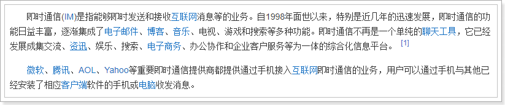

### 4.2、功能说明

在探花交友项目中也提供了类似微信的聊天功能，用户可以和好友或陌生人聊天。

如果是陌生人，通过《聊一下》功能进行打招呼，如果对方同意后，就成为了好友，可以进行聊天了。

陌生人之间如果相互喜欢，那么就会成为好友，也就可以聊天了。

在消息界面中也可以查看：点赞、评论、喜欢、公告等消息信息。

 

 

 

## 5、技术方案

对于高并发的即时通讯实现，还是很有挑战的，所需要考虑的点非常多，除了要实现功能，还要考虑并发、流量、负载、服务器、容灾等等。虽然有难度也并不是高不可攀。

对于现实即时通讯往往有两种方案：

- 方案一：
  - 自主实现，从设计到架构，再到实现。
  - 技术方面可以采用：Netty + WebSocket + RocketMQ + MongoDB + Redis + ZooKeeper + MySQL
  - 
- 方案二：
  - 对接第三方服务完成。
  - 这种方式简单，只需要按照第三方的api进行对接就可以了。
  - 如：环信、网易、容联云通讯等。

如何选择呢？

如果是中大型企业做项目可以选择自主研发，如果是中小型企业研发中小型的项目，选择第二种方案即可。方案一需要有大量的人力、物力的支持，开发周期长，成本高，但可控性强。方案二，成本低，开发周期短，能够快速的集成起来进行功能的开发，只是在可控性方面来说就差了一些。

探花交友项目选择方案二进行实现。

## 6、环信

官网：https://www.easemob.com/  稳定健壮，消息必达，亿级并发的即时通讯云

环信平台为黑马学员开设的专用注册地址：https://datayi.cn/w/woVL50vR


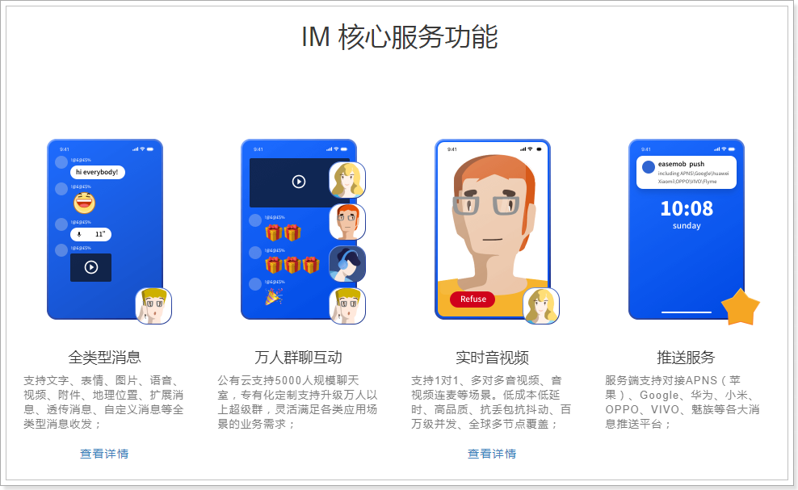

### 6.1、开发简介

文档地址：http://docs-im.easemob.com/

平台架构：

 

集成：

环信和用户体系的集成主要发生在2个地方，服务器端集成和客户端集成。

 

探花集成：

- 探花前端使用AndroidSDK进行集成
  - 文档：http://docs-im.easemob.com/im/android/sdk/import
- 后端集成用户体系
  - 文档：http://docs-im.easemob.com/im/server/ready/user

### 6.2、环信Console

需要使用环信平台，那么必须要进行注册，登录之后即可创建应用。环信100以内的用户免费使用，100以上就要注册企业版了。

企业版价格：

 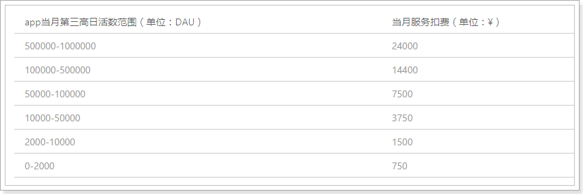

创建应用：

 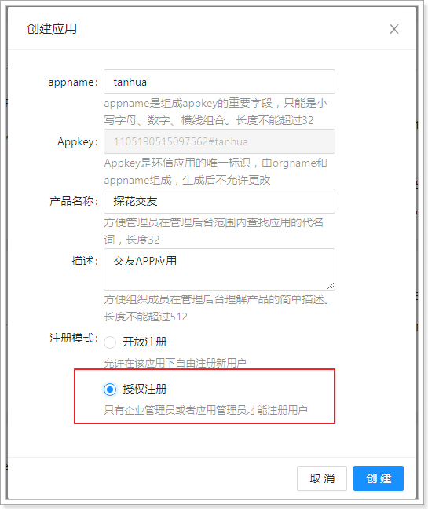

创建完成：


### 6.3、整体流程图


说明：

- 在APP端与后端系统，都需要完成与环信的集成。
- 在APP端，使用Android的SDK与环信进行通信，通信时需要通过后台系统的接口查询当前用户的环信用户名和密码，进行登录环信。
- 后台系统，在用户注册后，同步注册环信用户到环信平台，在后台系统中保存环信的用户名和密码。
- APP拿到用户名和密码后，进行登录环信，登录成功后即可向环信发送消息给好友。
- 后台系统也可以通过管理员的身份给用户发送系统信息。

## 7、获取管理员权限

环信提供的 REST API 需要权限才能访问，权限通过发送 HTTP 请求时携带 token 来体现。

官方文档：[获取管理员权限](http://docs-im.easemob.com/im/server/ready/user#%E8%8E%B7%E5%8F%96%E7%AE%A1%E7%90%86%E5%91%98%E6%9D%83%E9%99%90)

与环信的集成，我们将相关的代码逻辑写入到新的dubbo工程中，名字叫：my-tanhua-dubbo-huanxin。

### 7.1、创建dubbo工程

pom.xml：

~~~xml
<?xml version="1.0" encoding="UTF-8"?>
<project xmlns="http://maven.apache.org/POM/4.0.0"
         xmlns:xsi="http://www.w3.org/2001/XMLSchema-instance"
         xsi:schemaLocation="http://maven.apache.org/POM/4.0.0 http://maven.apache.org/xsd/maven-4.0.0.xsd">
    <parent>
        <artifactId>my-tanhua-dubbo</artifactId>
        <groupId>cn.itcast.tanhua</groupId>
        <version>1.0-SNAPSHOT</version>
    </parent>
    <modelVersion>4.0.0</modelVersion>

    <artifactId>my-tanhua-dubbo-huanxin</artifactId>
    <dependencies>
        <!--引入interface依赖-->
        <dependency>
            <groupId>cn.itcast.tanhua</groupId>
            <artifactId>my-tanhua-dubbo-interface</artifactId>
            <version>1.0-SNAPSHOT</version>
        </dependency>
        <dependency>
            <groupId>org.springframework.boot</groupId>
            <artifactId>spring-boot-starter</artifactId>
        </dependency>
        <dependency>
            <groupId>org.springframework.boot</groupId>
            <artifactId>spring-boot-starter-data-redis</artifactId>
        </dependency>
        <dependency>
            <groupId>org.springframework.boot</groupId>
            <artifactId>spring-boot-starter-test</artifactId>
            <scope>test</scope>
        </dependency>
        <dependency>
            <groupId>com.baomidou</groupId>
            <artifactId>mybatis-plus</artifactId>
        </dependency>
        <dependency>
            <groupId>com.baomidou</groupId>
            <artifactId>mybatis-plus-boot-starter</artifactId>
        </dependency>
        <dependency>
            <groupId>mysql</groupId>
            <artifactId>mysql-connector-java</artifactId>
        </dependency>

        <!--dubbo的springboot支持-->
        <dependency>
            <groupId>com.alibaba.boot</groupId>
            <artifactId>dubbo-spring-boot-starter</artifactId>
        </dependency>
        <!--dubbo框架-->
        <dependency>
            <groupId>com.alibaba</groupId>
            <artifactId>dubbo</artifactId>
        </dependency>
        <!--zk依赖-->
        <dependency>
            <groupId>org.apache.zookeeper</groupId>
            <artifactId>zookeeper</artifactId>
        </dependency>
        <dependency>
            <groupId>com.github.sgroschupf</groupId>
            <artifactId>zkclient</artifactId>
        </dependency>
        <dependency>
            <groupId>io.netty</groupId>
            <artifactId>netty-all</artifactId>
        </dependency>
        <dependency>
            <groupId>cn.hutool</groupId>
            <artifactId>hutool-all</artifactId>
        </dependency>
    </dependencies>

</project>
~~~

application.properties:

~~~properties
# Spring boot application
spring.application.name = itcast-tanhua-dubbo-huanxin

# dubbo 扫描包配置
dubbo.scan.basePackages = com.tanhua.dubbo.server
dubbo.application.name = dubbo-provider-huanxin

#dubbo 对外暴露的端口信息
dubbo.protocol.name = dubbo
dubbo.protocol.port = 20881

#dubbo注册中心的配置
dubbo.registry.address = zookeeper://192.168.31.81:2181
dubbo.registry.client = zkclient
dubbo.registry.timeout = 60000 

# Redis相关配置
spring.redis.jedis.pool.max-wait = 5000ms
spring.redis.jedis.pool.max-Idle = 100
spring.redis.jedis.pool.min-Idle = 10
spring.redis.timeout = 10s
spring.redis.cluster.nodes = 192.168.31.81:6379,192.168.31.81:6380,192.168.31.81:6381
spring.redis.cluster.max-redirects=5

#数据库连接信息
spring.datasource.driver-class-name=com.mysql.jdbc.Driver
spring.datasource.url=jdbc:mysql://192.168.31.81:3306/mytanhua?useUnicode=true&characterEncoding=utf8&autoReconnect=true&allowMultiQueries=true&useSSL=false
spring.datasource.username=root
spring.datasource.password=root

# 表名前缀
mybatis-plus.global-config.db-config.table-prefix=tb_
# id策略为自增长
mybatis-plus.global-config.db-config.id-type=auto
~~~

入口启动类：

```java
package com.tanhua.dubbo.server;

import org.springframework.boot.SpringApplication;
import org.springframework.boot.autoconfigure.SpringBootApplication;
import org.springframework.boot.autoconfigure.data.mongo.MongoDataAutoConfiguration;
import org.springframework.boot.autoconfigure.mongo.MongoAutoConfiguration;

@SpringBootApplication(exclude = {MongoAutoConfiguration.class, MongoDataAutoConfiguration.class}) //排除mongo的自动配置
public class HuanXinDubboApplication {

    public static void main(String[] args) {
        SpringApplication.run(HuanXinDubboApplication.class, args);
    }
}
```

### 7.2、配置

相关的配置，在环信管理控制台中，可以找到相关的参数。

~~~properties
#huanxin.properties

tanhua.huanxin.url=http://a1.easemob.com/
tanhua.huanxin.orgName=1105190515097562
tanhua.huanxin.appName=tanhua
tanhua.huanxin.clientId=YXA67ZofwHblEems-_Fh-17T2g
tanhua.huanxin.clientSecret=YXA60r45rNy2Ux5wQ7YYoEPwynHmUZk
~~~

编写配置类：

~~~java
package com.tanhua.dubbo.server.config;

import lombok.Data;
import org.springframework.boot.context.properties.ConfigurationProperties;
import org.springframework.context.annotation.Configuration;
import org.springframework.context.annotation.PropertySource;

@Configuration
@PropertySource("classpath:huanxin.properties")
@ConfigurationProperties(prefix = "tanhua.huanxin")
@Data
public class HuanXinConfig {

    private String url;
    private String orgName;
    private String appName;
    private String clientId;
    private String clientSecret;

}
~~~

### 7.3、编写实现

具体的获取token的业务逻辑在TokenService中完成。实现要点：

- 分析官方文档中的请求url、参数、响应数据等内容
- 请求到token需要缓存到redis中，不能频繁的获取token操作，可能会被封号

~~~java
package com.tanhua.dubbo.server.service;

import cn.hutool.core.util.StrUtil;
import cn.hutool.http.HttpRequest;
import cn.hutool.http.HttpResponse;
import cn.hutool.json.JSONObject;
import cn.hutool.json.JSONUtil;
import com.tanhua.dubbo.server.config.HuanXinConfig;
import lombok.extern.slf4j.Slf4j;
import org.springframework.beans.factory.annotation.Autowired;
import org.springframework.data.redis.core.RedisTemplate;
import org.springframework.stereotype.Service;

import java.util.HashMap;
import java.util.Map;
import java.util.concurrent.TimeUnit;

@Service
@Slf4j
public class TokenService {

    @Autowired
    private RedisTemplate<String, String> redisTemplate;

    private static final String REDIS_KEY = "HX_TOKEN";

    @Autowired
    private HuanXinConfig huanXinConfig;

    /**
     * 获取token，先从redis中获取，如果没有，再去环信接口获取
     *
     * @return
     */
    public String getToken() {
        String token = this.redisTemplate.opsForValue().get(REDIS_KEY);
        if (StrUtil.isNotEmpty(token)) {
            return token;
        }

        //访问环信接口获取token
        return this.refreshToken();
    }

    /**
     * 刷新token，请求环信接口，将token存储到redis中
     *
     * @return
     */
    public String refreshToken() {
        String targetUrl = this.huanXinConfig.getUrl() +
                this.huanXinConfig.getOrgName() + "/" +
                this.huanXinConfig.getAppName() + "/token";

        Map<String, Object> param = new HashMap<>();
        param.put("grant_type", "client_credentials");
        param.put("client_id", this.huanXinConfig.getClientId());
        param.put("client_secret", this.huanXinConfig.getClientSecret());

        HttpResponse response = HttpRequest.post(targetUrl)
                .body(JSONUtil.toJsonStr(param))
                .timeout(20000) //请求超时时间
                .execute();

        if (!response.isOk()) {
            log.error("刷新token失败~~~ ");
            return null;
        }

        String jsonBody = response.body();
        JSONObject jsonObject = JSONUtil.parseObj(jsonBody);
        String token = jsonObject.getStr("access_token");
        if (StrUtil.isNotEmpty(token)) {
            //将token数据缓存到redis中，缓存时间由expires_in决定
            //提前1小时失效
            long timeout = jsonObject.getLong("expires_in") - 3600;
            this.redisTemplate.opsForValue().set(REDIS_KEY, token, timeout, TimeUnit.SECONDS);

            return token;
        }

        return null;
    }
}

~~~

### 7.4、定义接口

接口定义在my-tanhua-dubbo-interface工程中。

~~~java
package com.tanhua.dubbo.server.api;

/**
 * 与环信平台集成的相关操作
 */
public interface HuanXinApi {

    /**
     * 获取环信token（获取管理员权限）
     * 参见：http://docs-im.easemob.com/im/server/ready/user#%E8%8E%B7%E5%8F%96%E7%AE%A1%E7%90%86%E5%91%98%E6%9D%83%E9%99%90
     *
     * @return
     */
    String getToken();

 
}
~~~

### 7.5、实现接口

在my-tanhua-dubbo-huanxin中完成。

~~~java
package com.tanhua.dubbo.server.api;

@Service(version = "1.0.0")
@Slf4j
public class HuanXinApiImpl implements HuanXinApi {

    @Autowired
    private TokenService tokenService;

    @Override
    public String getToken() {
        return this.tokenService.getToken();
    }
}

~~~

### 7.6、测试

```java
package com.tanhua.dubbo.server;

import com.tanhua.dubbo.server.api.HuanXinApi;
import org.junit.Test;
import org.junit.runner.RunWith;
import org.springframework.beans.factory.annotation.Autowired;
import org.springframework.boot.test.context.SpringBootTest;
import org.springframework.test.context.junit4.SpringRunner;

@SpringBootTest
@RunWith(SpringRunner.class)
public class TestHuanXinApi {

    @Autowired
    private HuanXinApi huanXinApi;

    @Test
    public void testGetToken(){
        String token = this.huanXinApi.getToken();
        System.out.println(token);
    }
}
```

测试结果，已经保存到redis中了：


## 8、用户系统集成

使用环信平台，最重要的就是集成用户体系，基本的逻辑是这样的：新用户在注册后，同时需要注册环信用户。

流程如下：


流程说明：

- 用户在登录时在sso系统中进行判断，如果是新用户，在注册完成后，需要调用dubbo中的环信服务进行注册环信用户。
- dubbo-huanxin服务在注册环信用户时，需要随机生成密码，携带token请求环信的REST API进行用户注册。
- 注册成功后，需要将环信的用户信息保存到MySQL中。
- 用户在APP端使用即时通讯功能时，需要通过环信用户信息登录到环信平台，由于数据存储到服务端，所以需要通过dubbo-huanxin进行查询。
- 在拿到环信账号信息后，登录环信，登录成功后即可与环信平台进行交互。
- 需要注意的是，APP端与环信平台交互，是不走后端系统的，是直连操作。

官方文档：[《用户管理》](http://docs-im.easemob.com/im/server/ready/user#%E7%94%A8%E6%88%B7%E7%AE%A1%E7%90%86)

### 8.1、通用请求逻辑

在与环信接口通信时，使用的是环信的REST接口，所以我们需要封装一个通用的请求服务，在与所有环信接口对接时使用。

另外，请求接口时都需要携带token，前面我们已经将token存储到redis中，但是，可能存在这样一种情况，token在我们redis中有效，但是在环信平台已经失效，这样环信平台会给我们响应401状态码。

对于这种情况，我们就需要检测状态码是否为401，如果是401的话，就需要重新刷新token，再重新执行此次请求。

也就是要支持请求的重试。

#### 8.1.1、Spring-Retry

Spring提供了重试的功能，使用非常的简单、优雅。

> **第一步，导入依赖：**

~~~xml
<!--Spring重试模块-->
<dependency>
    <groupId>org.springframework.retry</groupId>
    <artifactId>spring-retry</artifactId>
</dependency>
<dependency>
    <groupId>org.aspectj</groupId>
    <artifactId>aspectjweaver</artifactId>
</dependency>
~~~

> **第二步，在启动类中添加@EnableRetry注解来激活重试功能：**

~~~java
package com.tanhua.dubbo.server;

import org.springframework.boot.SpringApplication;
import org.springframework.boot.autoconfigure.SpringBootApplication;
import org.springframework.boot.autoconfigure.data.mongo.MongoDataAutoConfiguration;
import org.springframework.boot.autoconfigure.mongo.MongoAutoConfiguration;
import org.springframework.retry.annotation.EnableRetry;

@SpringBootApplication(exclude = {MongoAutoConfiguration.class, MongoDataAutoConfiguration.class}) //排除mongo的自动配置
@EnableRetry
public class HuanXinDubboApplication {

    public static void main(String[] args) {
        SpringApplication.run(HuanXinDubboApplication.class, args);
    }
}

~~~

> **第三步，在需要支持重试操作的Service方法中添加@Retryable注解，demo如下：**

~~~java
//将此类放到test包下测试即可

package com.tanhua.dubbo.server;

import cn.hutool.core.util.RandomUtil;
import org.springframework.retry.annotation.Backoff;
import org.springframework.retry.annotation.Recover;
import org.springframework.retry.annotation.Retryable;
import org.springframework.stereotype.Service;

@Service
public class RetryService {

    @Retryable(value = RuntimeException.class, maxAttempts = 3, backoff = @Backoff(delay = 2000L, multiplier = 2))
    public int execute(int max) {
        int data = RandomUtil.randomInt(1, 99);
        System.out.println("生成：" + data);
        if (data < max) {
            throw new RuntimeException();
        }
        return data;
    }

    @Recover //全部重试失败后执行
    public int recover(Exception e) {
        System.out.println("全部重试完成。。。。。");
        return 88; //返回默认
    }

}

~~~

@Retryable参数说明：

- value：抛出指定异常才会重试

- maxAttempts：最大重试次数，默认3次

- backoff：重试等待策略，默认使用@Backoff
  - @Backoff 的value默认为1000L，我们设置为2000L；
  - multiplier（指定延迟倍数）默认为0，表示固定暂停1秒后进行重试，如果把multiplier设置为2，则第一次重试为2秒，第二次为4秒，第三次为6秒。

@Recover标注的方法，是在所有的重试都失败的情况下，最后执行该方法，该方法有2个要求：

- 方法的第一个参数必须是 Throwable 类型，最好与 @Retryable 中的 value一致。
- 方法的返回值必须与@Retryable的方法返回值一致，否则该方法不能被执行。

测试类：

~~~java
package com.tanhua.dubbo.server;

import org.junit.Test;
import org.junit.runner.RunWith;
import org.springframework.beans.factory.annotation.Autowired;
import org.springframework.boot.test.context.SpringBootTest;
import org.springframework.test.context.junit4.SpringRunner;

@SpringBootTest
@RunWith(SpringRunner.class)
public class TestRetryService {

    @Autowired
    private RetryService retryService;

    @Test
    public void testRetry() {
        System.out.println(this.retryService.execute(90));
    }
}
~~~

> **测试结果，会有3次重试机会进行生成随机数，如果3次随机数都小于90，最后返回88。**

#### 8.1.2、RequestService

```java
package com.tanhua.dubbo.server.service;

import cn.hutool.http.HttpRequest;
import cn.hutool.http.HttpResponse;
import cn.hutool.http.Method;
import com.tanhua.dubbo.server.exception.UnauthorizedException;
import lombok.extern.slf4j.Slf4j;
import org.springframework.beans.factory.annotation.Autowired;
import org.springframework.retry.annotation.Backoff;
import org.springframework.retry.annotation.Recover;
import org.springframework.retry.annotation.Retryable;
import org.springframework.stereotype.Service;

/**
 * 环信接口通用请求服务
 */
@Service
@Slf4j
public class RequestService {

    @Autowired
    private TokenService tokenService;

    /**
     * 通用的发送请求方法
     *
     * @param url    请求地址
     * @param body   请求参数
     * @param method 请求方法
     * @return
     */
    @Retryable(value = UnauthorizedException.class, maxAttempts = 5, backoff = @Backoff(delay = 2000L, multiplier = 2))
    public HttpResponse execute(String url, String body, Method method) {
        String token = this.tokenService.getToken();

        HttpRequest httpRequest;

        switch (method) {
            case POST: {
                httpRequest = HttpRequest.post(url);
                break;
            }
            case DELETE: {
                httpRequest = HttpRequest.delete(url);
                break;
            }
            case PUT: {
                httpRequest = HttpRequest.put(url);
                break;
            }
            case GET: {
                httpRequest = HttpRequest.get(url);
                break;
            }
            default: {
                return null;
            }
        }

        HttpResponse response = httpRequest
                .header("Content-Type", "application/json") //设置请求内容类型
                .header("Authorization", "Bearer " + token)  //设置token
                .body(body) // 设置请求数据
                .timeout(20000) // 超时时间
                .execute(); // 执行请求

        if (response.getStatus() == 401) {
            //token失效，重新刷新token
            this.tokenService.refreshToken();

            //抛出异常，需要进行重试
            throw new UnauthorizedException(url, body, method);
        }

        return response;
    }

    @Recover //全部重试失败后执行
    public HttpResponse recover(UnauthorizedException e) {
        log.error("获取token失败！url = " + e.getUrl() + ", body = " + e.getBody() + ", method = " + e.getMethod().toString());
        //如果重试5次后，依然不能获取到token，说明网络或账号出现了问题，只能返回null了，后续的请求将无法再执行
        return null;
    }
}
```

~~~java
package com.tanhua.dubbo.server.exception;

import cn.hutool.http.Method;
import lombok.AllArgsConstructor;
import lombok.Data;
import lombok.NoArgsConstructor;

@AllArgsConstructor
@NoArgsConstructor
@Data
public class UnauthorizedException extends RuntimeException {

    private String url;
    private String body;
    private Method method;

}

~~~

测试用例：

~~~java
package com.tanhua.dubbo.server;

import cn.hutool.http.HttpResponse;
import cn.hutool.http.Method;
import com.tanhua.dubbo.server.config.HuanXinConfig;
import com.tanhua.dubbo.server.service.RequestService;
import org.junit.Test;
import org.junit.runner.RunWith;
import org.springframework.beans.factory.annotation.Autowired;
import org.springframework.boot.test.context.SpringBootTest;
import org.springframework.test.context.junit4.SpringRunner;

@SpringBootTest
@RunWith(SpringRunner.class)
public class TestRequestService {

    @Autowired
    private RequestService requestService;

    @Autowired
    private HuanXinConfig huanXinConfig;

    @Test
    public void testQueryHuanXinUser() {
        String targetUrl = this.huanXinConfig.getUrl()
                + this.huanXinConfig.getOrgName() + "/"
                + this.huanXinConfig.getAppName() + "/users/1";
        HttpResponse response = this.requestService.execute(targetUrl, null, Method.GET);
        System.out.println(response);

    }
}

~~~

### 8.2、注册环信用户

注册环信用户分为2种，开放注册、授权注册，区别在于开发注册不需要token，授权注册需要token。我们使用的授权注册。

官方文档：[《注册单个用户(授权)》](http://docs-im.easemob.com/im/server/ready/user#%E6%B3%A8%E5%86%8C%E5%8D%95%E4%B8%AA%E7%94%A8%E6%88%B7_%E6%8E%88%E6%9D%83)

> **说明：环信用户数据需要保存到数据中。**

#### 8.2.1、HuanXinUser

在my-tanhua-dubbo-interface工程中创建该类：

需要在此工程中添加MybatisPlus依赖：

~~~xml
<dependency>
    <groupId>com.baomidou</groupId>
    <artifactId>mybatis-plus</artifactId>
</dependency>
~~~

~~~java
package com.tanhua.dubbo.server.pojo;

import com.baomidou.mybatisplus.annotation.TableName;
import lombok.AllArgsConstructor;
import lombok.Data;
import lombok.NoArgsConstructor;

import java.util.Date;

/**
 * 环信用户对象
 */
@Data
@NoArgsConstructor
@AllArgsConstructor
@TableName("tb_huanxin_user")
public class HuanXinUser implements java.io.Serializable{

    private static final long serialVersionUID = -6400630011196593976L;

    private Long id; //主键Id

    /**
     * 环信 ID ;也就是 IM 用户名的唯一登录账号，长度不可超过64个字符长度
     */
    private String username;
    /**
     * 登录密码，长度不可超过64个字符长度
     */
    private String password;
    /**
     * 昵称（可选），在 iOS Apns 推送时会使用的昵称（仅在推送通知栏内显示的昵称），
     * 并不是用户个人信息的昵称，环信是不保存用户昵称，头像等个人信息的，
     * 需要自己服务器保存并与给自己用户注册的IM用户名绑定，长度不可超过100个字符
     */
    private String nickname;

    private Long userId; //用户id

    private Date created; //创建时间

    private Date updated; //更新时间

}

~~~

数据库表结构：

~~~sql
CREATE TABLE `tb_huanxin_user` (
  `id` bigint(20) NOT NULL AUTO_INCREMENT,
  `user_id` bigint(20) NOT NULL COMMENT '用户id',
  `username` varchar(32) NOT NULL COMMENT '环信用户名',
  `password` varchar(32) NOT NULL COMMENT '环信密码',
  `nickname` varchar(100) DEFAULT NULL COMMENT '昵称',
  `created` datetime DEFAULT NULL COMMENT '创建时间',
  `updated` datetime DEFAULT NULL COMMENT '更新时间',
  PRIMARY KEY (`id`),
  KEY `user_id` (`user_id`),
  KEY `username` (`username`)
) ENGINE=InnoDB AUTO_INCREMENT=1 DEFAULT CHARSET=utf8;
~~~

#### 8.2.2、定义接口

~~~java
//com.tanhua.dubbo.server.api.HuanXinApi

	/**
     * 注册环信用户
     * 参见：http://docs-im.easemob.com/im/server/ready/user#%E6%B3%A8%E5%86%8C%E5%8D%95%E4%B8%AA%E7%94%A8%E6%88%B7_%E5%BC%80%E6%94%BE
     *
     * @param userId 用户id
     * @return
     */
    Boolean register(Long userId);

    /**
     * 根据用户Id询环信账户信息
     *
     * @param userId
     * @return
     */
    HuanXinUser queryHuanXinUser(Long userId);
~~~

#### 8.2.3、实现接口

```java
//com.tanhua.dubbo.server.api.HuanXinApiImpl

    @Override
    public Boolean register(Long userId) {
        String targetUrl = this.huanXinConfig.getUrl()
                + this.huanXinConfig.getOrgName() + "/" +
                this.huanXinConfig.getAppName() + "/users";

        HuanXinUser huanXinUser = new HuanXinUser();
        huanXinUser.setUsername("HX_" + userId);  // 用户名
        huanXinUser.setPassword(IdUtil.simpleUUID()); //随机生成的密码

        HttpResponse response = this.requestService.execute(targetUrl, JSONUtil.toJsonStr(Arrays.asList(huanXinUser)), Method.POST);
        if (response.isOk()) {
            //将环信的账号信息保存到数据库
            huanXinUser.setUserId(userId);
            huanXinUser.setCreated(new Date());
            huanXinUser.setUpdated(huanXinUser.getCreated());

            this.huanXinUserMapper.insert(huanXinUser);

            return true;
        }

        return false;
    }

    @Override
    public HuanXinUser queryHuanXinUser(Long userId) {
        QueryWrapper<HuanXinUser> wrapper = new QueryWrapper<>();
        wrapper.eq("user_id", userId);
        return this.huanXinUserMapper.selectOne(wrapper);
    }
```

~~~java
package com.tanhua.dubbo.server.mapper;

import com.baomidou.mybatisplus.core.mapper.BaseMapper;
import com.tanhua.dubbo.server.pojo.HuanXinUser;
import org.apache.ibatis.annotations.Mapper;

@Mapper
public interface HuanXinUserMapper extends BaseMapper<HuanXinUser> {
}

~~~

#### 8.2.4、测试用例

~~~java
package com.tanhua.dubbo.server;

import com.tanhua.dubbo.server.api.HuanXinApi;
import org.junit.Test;
import org.junit.runner.RunWith;
import org.springframework.beans.factory.annotation.Autowired;
import org.springframework.boot.test.context.SpringBootTest;
import org.springframework.test.context.junit4.SpringRunner;

@SpringBootTest
@RunWith(SpringRunner.class)
public class TestHuanXinApi {

    @Autowired
    private HuanXinApi huanXinApi;

    @Test
    public void testRegister(){
        //注册用户id为1的用户到环信
        System.out.println(this.huanXinApi.register(1L));
    }

    @Test
    public void testQueryHuanXinUser(){
        //根据用户id查询环信用户信息
        System.out.println(this.huanXinApi.queryHuanXinUser(1L));
    }

}

~~~

#### 8.2.5、在sso中注册环信用户

需要在sso系统中使用dubbo服务进行注册环信用户。

> **第一步，导入依赖：**

~~~xml
<dependency>
    <groupId>cn.itcast.tanhua</groupId>
    <artifactId>my-tanhua-dubbo-interface</artifactId>
    <version>1.0-SNAPSHOT</version>
</dependency>
<!--dubbo的springboot支持-->
<dependency>
    <groupId>com.alibaba.boot</groupId>
    <artifactId>dubbo-spring-boot-starter</artifactId>
</dependency>
<!--dubbo框架-->
<dependency>
    <groupId>com.alibaba</groupId>
    <artifactId>dubbo</artifactId>
</dependency>
<!--zk依赖-->
<dependency>
    <groupId>org.apache.zookeeper</groupId>
    <artifactId>zookeeper</artifactId>
</dependency>
<dependency>
    <groupId>com.github.sgroschupf</groupId>
    <artifactId>zkclient</artifactId>
</dependency>
~~~

> **第二步，增加dubbo注册中心配置**

application.properties：

~~~properties
#dubbo注册中心配置
dubbo.application.name = itcast-tanhua-server
dubbo.registry.address = zookeeper://192.168.31.81:2181
dubbo.registry.client = zkclient
dubbo.registry.timeout = 60000
dubbo.consumer.timeout = 60000
~~~

> **第三步，在UserService中增加相应的逻辑：**

~~~java
    @Reference(version = "1.0.0")
    private HuanXinApi huanXinApi;

    /**
     * 用户登录
     *
     * @param phone 手机号
     * @param code  验证码
     * @return
     */
    public String login(String phone, String code) {
        String redisKey = "CHECK_CODE_" + phone;
        boolean isNew = false;

        //校验验证码
        String redisData = this.redisTemplate.opsForValue().get(redisKey);
        if (!StringUtils.equals(code, redisData)) {
            return null; //验证码错误
        }

        //验证码在校验完成后，需要废弃
        this.redisTemplate.delete(redisKey);

        QueryWrapper<User> queryWrapper = new QueryWrapper<>();
        queryWrapper.eq("mobile", phone);

        User user = this.userMapper.selectOne(queryWrapper);

        if (null == user) {
            //需要注册该用户
            user = new User();
            user.setMobile(phone);
            user.setPassword(DigestUtils.md5Hex("123456"));

            //注册新用户
            this.userMapper.insert(user);
            isNew = true;

            //注册环信用户
            Boolean result = this.huanXinApi.register(user.getId());
            if (!result) {
                //注册环信失败，记录日志
                log.error("注册环信用户失败~ userId = " + user.getId());
            }
        }

        //生成token
        Map<String, Object> claims = new HashMap<String, Object>();
        claims.put("id", user.getId());

        // 生成token
        String token = Jwts.builder()
                .setClaims(claims) //payload，存放数据的位置，不能放置敏感数据，如：密码等
                .signWith(SignatureAlgorithm.HS256, secret) //设置加密方法和加密盐
                .setExpiration(new DateTime().plusHours(12).toDate()) //设置过期时间，12小时后过期
                .compact();

        try {
            //发送用户登录成功的消息
            Map<String, Object> msg = new HashMap<>();
            msg.put("id", user.getId());
            msg.put("date", System.currentTimeMillis());

            this.rocketMQTemplate.convertAndSend("tanhua-sso-login", msg);
        } catch (MessagingException e) {
            log.error("发送消息失败！", e);
        }

        return token + "|" + isNew;
    }
~~~

#### 8.2.6、测试

将服务全部跑起来，使用APP进行测试，使用新手机号进行登录测试。

新注册的用户：

 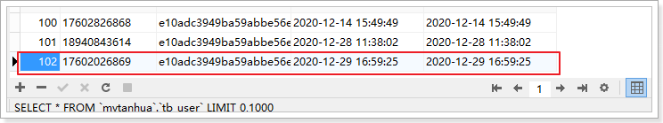

所对应的环信用户：

 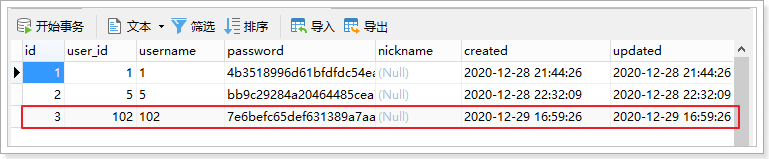

环信平台：

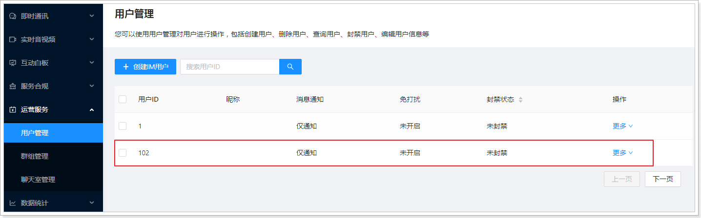

可以看到已经注册到了环信。

### 8.3、查询环信用户信息

在app中，用户登录后需要根据用户名密码登录环信，由于用户名密码保存在后台，所以需要提供接口进行返回。

mock地址：  https://mock-java.itheima.net/project/35/interface/api/563

 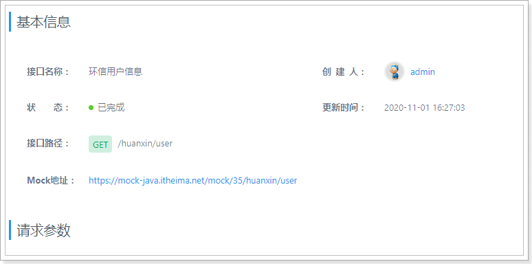

#### 8.3.1、HuanXinUserVo

~~~java
package com.tanhua.server.vo;

import lombok.AllArgsConstructor;
import lombok.Data;
import lombok.NoArgsConstructor;

@Data
@NoArgsConstructor
@AllArgsConstructor
public class HuanXinUserVo {

    private String username;
    private String password;

}

~~~

#### 8.3.2、HuanXinController

~~~java
package com.tanhua.server.controller;

import com.tanhua.server.service.HuanXinService;
import com.tanhua.server.vo.HuanXinUserVo;
import org.springframework.beans.factory.annotation.Autowired;
import org.springframework.http.ResponseEntity;
import org.springframework.web.bind.annotation.GetMapping;
import org.springframework.web.bind.annotation.RequestMapping;
import org.springframework.web.bind.annotation.RestController;

@RestController
@RequestMapping("huanxin")
public class HuanXinController {

    @Autowired
    private HuanXinService huanXinService;

    @GetMapping("user")
    public HuanXinUserVo queryHuanXinUser(){
        return this.huanXinService.queryHuanXinUser();
    }
}

~~~

#### 8.3.3、HuanXinService

```java
package com.tanhua.server.service;

import cn.hutool.core.util.ObjectUtil;
import com.alibaba.dubbo.config.annotation.Reference;
import com.tanhua.common.pojo.User;
import com.tanhua.common.utils.UserThreadLocal;
import com.tanhua.dubbo.server.api.HuanXinApi;
import com.tanhua.dubbo.server.pojo.HuanXinUser;
import com.tanhua.server.vo.HuanXinUserVo;
import org.springframework.stereotype.Service;

@Service
public class HuanXinService {

    @Reference(version = "1.0.0")
    private HuanXinApi huanXinApi;

    public HuanXinUserVo queryHuanXinUser() {
        User user = UserThreadLocal.get();
        //通过dubbo服务查询环信用户
        HuanXinUser huanXinUser = this.huanXinApi.queryHuanXinUser(user.getId());
        if (ObjectUtil.isNotEmpty(huanXinUser)) {
            return new HuanXinUserVo(huanXinUser.getUsername(), huanXinUser.getPassword());
        }
        return null;
    }
}
```

#### 8.3.4、测试

 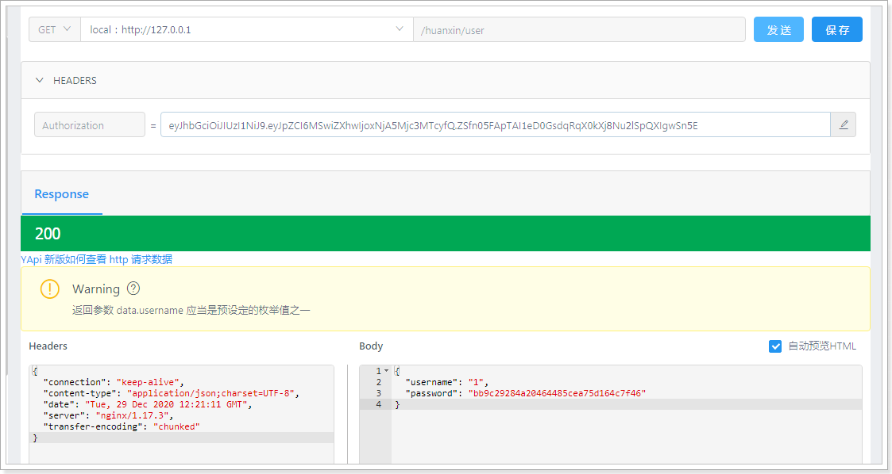

### 8.4、查询个人信息

在消息模块中，需要实现根据环信用户名查询个人的用户信息。

接口文档：https://mock-java.itheima.net/project/35/interface/api/2921

#### 8.4.1、dubbo服务

##### 8.4.1.1、定义接口

~~~java
//com.tanhua.dubbo.server.api.HuanXinApi

	/**
     * 根据环信用户名查询用户信息
     *
     * @param userName
     * @return
     */
    HuanXinUser queryUserByUserName(String userName);
~~~

##### 8.4.1.2、编写实现

~~~java
//com.tanhua.dubbo.server.api.HuanXinApiImpl

	@Override
    public HuanXinUser queryUserByUserName(String userName) {
        QueryWrapper<HuanXinUser> wrapper = new QueryWrapper<>();
        wrapper.eq("username", userName);
        return this.huanXinUserMapper.selectOne(wrapper);
    }
~~~

#### 8.4.2、APP接口服务

##### 8.4.2.1、UserInfoVo

~~~java
package com.tanhua.server.vo;

import cn.hutool.core.annotation.Alias;
import lombok.AllArgsConstructor;
import lombok.Data;
import lombok.NoArgsConstructor;

@Data
@AllArgsConstructor
@NoArgsConstructor
public class UserInfoVo {

    @Alias("userId")
    private Long id; //用户id
    @Alias("logo")
    private String avatar; //头像
    @Alias("nickName")
    private String nickname; //昵称
    private String birthday; //生日 2019-09-11
    private String age; //年龄
    private String gender; //性别 man woman
    private String city; //城市
    @Alias("edu")
    private String education; //学历
    private String income; //月收入
    @Alias("industry")
    private String profession; //行业
    private Integer marriage; //婚姻状态（0未婚，1已婚）

}

~~~

##### 8.4.2.2、IMController

~~~java
//com.tanhua.server.controller.IMController

package com.tanhua.server.controller;

import cn.hutool.core.util.ObjectUtil;
import com.tanhua.server.service.IMService;
import com.tanhua.server.vo.UserInfoVo;
import lombok.extern.slf4j.Slf4j;
import org.springframework.beans.factory.annotation.Autowired;
import org.springframework.http.HttpStatus;
import org.springframework.http.ResponseEntity;
import org.springframework.web.bind.annotation.GetMapping;
import org.springframework.web.bind.annotation.RequestMapping;
import org.springframework.web.bind.annotation.RequestParam;
import org.springframework.web.bind.annotation.RestController;

@RequestMapping("messages")
@RestController
@Slf4j
public class IMController {

    @Autowired
    private IMService imService;

    /**
     * 根据环信用户名查询用户信息
     *
     * @param userName 环信用户
     * @return
     */
    @GetMapping("userinfo")
    public ResponseEntity<UserInfoVo> queryUserInfoByUserName(@RequestParam("huanxinId") String userName) {
        try {
            UserInfoVo userInfoVo = this.imService.queryUserInfoByUserName(userName);
            if (ObjectUtil.isNotEmpty(userInfoVo)) {
                return ResponseEntity.ok(userInfoVo);
            }
        } catch (Exception e) {
            log.error("根据环信id查询用户信息! userName = " + userName, e);
        }
        return ResponseEntity.status(HttpStatus.INTERNAL_SERVER_ERROR).build();
    }

}

~~~

##### 8.4.2.3、IMService

~~~java
//com.tanhua.server.service.IMService

package com.tanhua.server.service;

import cn.hutool.core.bean.BeanUtil;
import cn.hutool.core.util.ObjectUtil;
import cn.hutool.core.util.StrUtil;
import com.alibaba.dubbo.config.annotation.Reference;
import com.tanhua.common.pojo.UserInfo;
import com.tanhua.dubbo.server.api.HuanXinApi;
import com.tanhua.dubbo.server.pojo.HuanXinUser;
import com.tanhua.server.vo.UserInfoVo;
import org.springframework.beans.factory.annotation.Autowired;
import org.springframework.stereotype.Service;

@Service
public class IMService {

    @Reference(version = "1.0.0")
    private HuanXinApi huanXinApi;

    @Autowired
    private UserInfoService userInfoService;

    public UserInfoVo queryUserInfoByUserName(String userName) {
        //查询环信账户
        HuanXinUser huanXinUser = this.huanXinApi.queryUserByUserName(userName);
        if (ObjectUtil.isEmpty(huanXinUser)) {
            return null;
        }

        //查询用户信息
        UserInfo userInfo = this.userInfoService.queryUserInfoByUserId(huanXinUser.getUserId());
        if (ObjectUtil.isEmpty(userInfo)) {
            return null;
        }

        UserInfoVo userInfoVo = BeanUtil.copyProperties(userInfo, UserInfoVo.class, "marriage");
        userInfoVo.setGender(userInfo.getSex().toString().toLowerCase());
        userInfoVo.setMarriage(StrUtil.equals("已婚", userInfo.getMarriage()) ? 1 : 0);

        return userInfoVo;
    }
}

~~~

##### 8.4.2.4、测试

 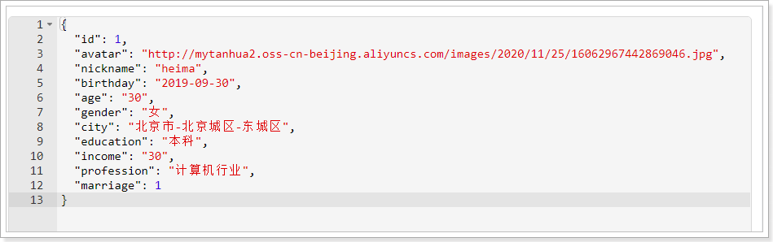

### 8.5、根据用户id查询个人信息

在消息模块与我的模块中，需要根据用户id查询个人信息，其响应的数据结构与上面一致，均为：UserInfoVo对象。

接口地址：https://mock-java.itheima.net/project/35/interface/api/875

#### 8.5.1、MyCenterController

```java
package com.tanhua.server.controller;

import cn.hutool.core.util.ObjectUtil;
import com.tanhua.server.service.MyCenterService;
import com.tanhua.server.vo.UserInfoVo;
import lombok.extern.slf4j.Slf4j;
import org.springframework.beans.factory.annotation.Autowired;
import org.springframework.http.HttpStatus;
import org.springframework.http.ResponseEntity;
import org.springframework.web.bind.annotation.GetMapping;
import org.springframework.web.bind.annotation.RequestMapping;
import org.springframework.web.bind.annotation.RequestParam;
import org.springframework.web.bind.annotation.RestController;

@RequestMapping("users")
@RestController
@Slf4j
public class MyCenterController {

    @Autowired
    private MyCenterService myCenterService;

    /**
     * 根据用户id查询用户信息
     *
     * @param userId 用户id，如果为空，表示查询当前登录人的信息
     * @return
     */
    @GetMapping
    public ResponseEntity<UserInfoVo> queryUserInfoByUserId(@RequestParam(value = "userID", required = false) Long userId) {
        try {
            UserInfoVo userInfoVo = this.myCenterService.queryUserInfoByUserId(userId);
            if (ObjectUtil.isNotEmpty(userInfoVo)) {
                return ResponseEntity.ok(userInfoVo);
            }
        } catch (Exception e) {
            log.error("根据用户id查询用户信息出错~ userId = " + userId, e);
        }
        return ResponseEntity.status(HttpStatus.INTERNAL_SERVER_ERROR).build();
    }
}

```

#### 8.5.2、MyCenterService

```java
package com.tanhua.server.service;

import cn.hutool.core.bean.BeanUtil;
import cn.hutool.core.util.ObjectUtil;
import cn.hutool.core.util.StrUtil;
import com.tanhua.common.pojo.UserInfo;
import com.tanhua.common.utils.UserThreadLocal;
import com.tanhua.server.vo.UserInfoVo;
import org.springframework.beans.factory.annotation.Autowired;
import org.springframework.stereotype.Service;

@Service
public class MyCenterService {

    @Autowired
    private UserInfoService userInfoService;

    public UserInfoVo queryUserInfoByUserId(Long userId) {
        if (ObjectUtil.isEmpty(userId)) {
            //如果查询id为null，就表示查询当前用户信息
            userId = UserThreadLocal.get().getId();
        }
        //查询用户信息
        UserInfo userInfo = this.userInfoService.queryUserInfoByUserId(userId);
        if (ObjectUtil.isEmpty(userInfo)) {
            return null;
        }

        UserInfoVo userInfoVo = BeanUtil.copyProperties(userInfo, UserInfoVo.class, "marriage");
        userInfoVo.setGender(userInfo.getSex().toString().toLowerCase());
        userInfoVo.setMarriage(StrUtil.equals("已婚", userInfo.getMarriage()) ? 1 : 0);
        return userInfoVo;
    }
}
```

#### 8.5.3、测试


### 8.6、发送消息给客户端

目前已经完成了用户体系的对接，下面我们进行测试发送消息，场景是这样的：

 

点击“聊一下”，就会给对方发送一条陌生人信息，这个消息由系统发送完成。

我们暂时通过环信的控制台进行发送： 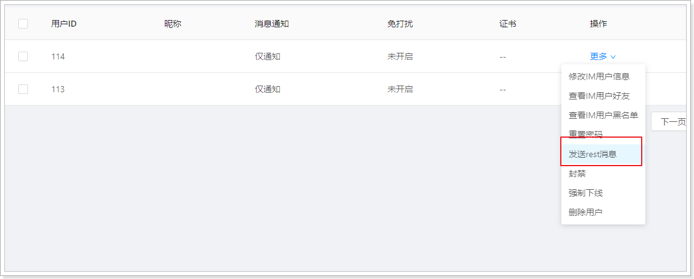

消息内容：

~~~shell
{"userId":1,"huanXinId":"HX_1","nickname":"黑马小妹","strangerQuestion":"你喜欢去看蔚蓝的大海还是去爬巍峨的高山？","reply":"我喜欢秋天的落叶，夏天的泉水，冬天的雪地，只要有你一切皆可~"}
~~~

 

 

 

可以看到已经接收到了消息。

### 8.7、将用户数据同步到环信

需要将1~99用户注册到环信，因为我们提供的数据都是这些用户的数据。

~~~java
//com.tanhua.dubbo.server.TestHuanXinApi

	@Test
    public void testRegisterAllUser(){
        for (int i = 1; i < 100; i++) {
            this.huanXinApi.register(Long.valueOf(i));
        }
    }
~~~

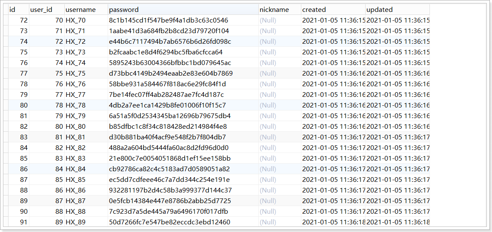

环信：

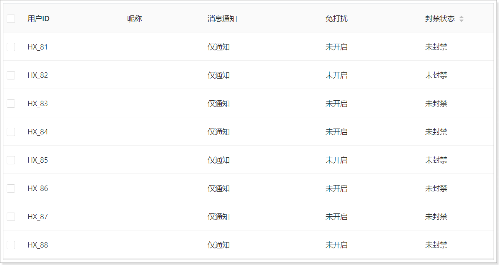

## 9、 添加联系人

点击“聊一下”，就会成为联系人（好友）。

实现：

- 将好友写入到MongoDB中
- 将好友关系注册到环信

具体的流程如下：

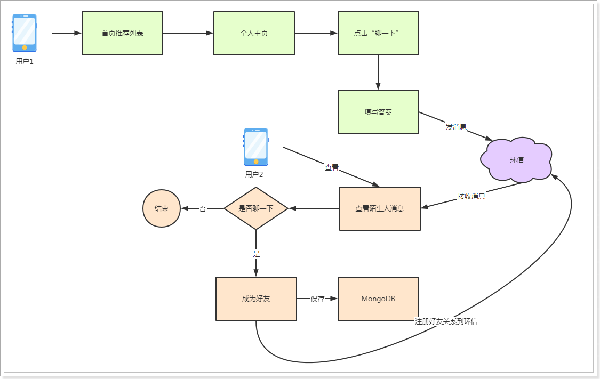

### 9.1、好友dubbo服务

#### 9.1.1、定义接口

~~~java
package com.tanhua.dubbo.server.api;

public interface UsersApi {

    /**
     * 保存好友关系
     *
     * @param userId   用户id
     * @param friendId 好友id
     * @return
     */
    String saveUsers(Long userId, Long friendId);


    /**
     * 删除好友数据
     *
     * @param userId   用户id
     * @param friendId 好友id
     * @return
     */
    Boolean removeUsers(Long userId, Long friendId);
}

~~~

#### 9.1.2、编写实现

~~~java
package com.tanhua.dubbo.server.api;

import cn.hutool.core.util.ObjectUtil;
import com.alibaba.dubbo.config.annotation.Service;
import com.tanhua.dubbo.server.pojo.Users;
import org.bson.types.ObjectId;
import org.springframework.beans.factory.annotation.Autowired;
import org.springframework.data.mongodb.core.MongoTemplate;
import org.springframework.data.mongodb.core.query.Criteria;
import org.springframework.data.mongodb.core.query.Query;

@Service(version = "1.0.0")
public class UsersApiImpl implements UsersApi {

    @Autowired
    private MongoTemplate mongoTemplate;


    @Override
    public String saveUsers(Long userId, Long friendId) {

        if (!ObjectUtil.isAllNotEmpty(userId, friendId)) {
            return null;
        }

        // 检测是否该好友关系是否存在
        Query query = Query.query(Criteria
                .where("userId").is(userId)
                .and("friendId").is(friendId));
        long count = this.mongoTemplate.count(query, Users.class);
        if (count > 0) {
            return null;
        }

        Users users = new Users();
        users.setId(ObjectId.get());
        users.setDate(System.currentTimeMillis());
        users.setUserId(userId);
        users.setFriendId(friendId);

        //注册我与好友的关系
        this.mongoTemplate.save(users);

        //注册好友与我的关系
        users.setId(ObjectId.get());
        users.setUserId(friendId);
        users.setFriendId(userId);
        this.mongoTemplate.save(users);

        return users.getId().toHexString();
    }

    @Override
    public Boolean removeUsers(Long userId, Long friendId) {

        Query query1 = Query.query(Criteria.where("userId").is(userId)
                .and("friendId").is(friendId));

        //删除我与好友的关系数据
        long count1 = this.mongoTemplate.remove(query1, Users.class).getDeletedCount();

        Query query2 = Query.query(Criteria.where("userId").is(friendId)
                .and("friendId").is(userId));
        //删除好友与我的关系数据
        long count2 = this.mongoTemplate.remove(query2, Users.class).getDeletedCount();

        return count1 > 0 && count2 > 0;
    }
}

~~~

### 9.2、环信dubbo服务

#### 9.2.1、定义接口

在my-tanhua-dubbo-interface中定义。

~~~java
//com.tanhua.dubbo.server.api.HuanXinApi

	/**
     * 添加好友（双向好友关系）
     * 参见：http://docs-im.easemob.com/im/server/ready/user#%E6%B7%BB%E5%8A%A0%E5%A5%BD%E5%8F%8B
     *
     * @param userId   自己的id
     * @param friendId 好友的id
     * @return
     */
    Boolean addUserFriend(Long userId, Long friendId);

    /**
     * 删除好友关系（双向删除）
     * 参见：http://docs-im.easemob.com/im/server/ready/user#%E7%A7%BB%E9%99%A4%E5%A5%BD%E5%8F%8B
     *
     * @param userId   自己的id
     * @param friendId 好友的id
     * @return
     */
    Boolean removeUserFriend(Long userId, Long friendId);
~~~

#### 9.2.2、编写实现

在my-tanhua-dubbo-huanxin中实现。

~~~java
//com.tanhua.dubbo.server.api.HuanXinApiImpl

    @Override
    public Boolean addUserFriend(Long userId, Long friendId) {
        String targetUrl = this.huanXinConfig.getUrl()
                + this.huanXinConfig.getOrgName() + "/"
                + this.huanXinConfig.getAppName() + "/users/HX_" +
                userId + "/contacts/users/HX_" + friendId;
        try {
            // 404 -> 对方未在环信注册
            return this.requestService.execute(targetUrl, null, Method.POST).isOk();
        } catch (Exception e) {
            e.printStackTrace();
        }

        // 添加失败
        return false;
    }

    @Override
    public Boolean removeUserFriend(Long userId, Long friendId) {
        String targetUrl = this.huanXinConfig.getUrl()
                + this.huanXinConfig.getOrgName() + "/"
                + this.huanXinConfig.getAppName() + "/users/HX_" +
                userId + "/contacts/users/HX_" + friendId;
        try {
            // 404 -> 对方未在环信注册
            return this.requestService.execute(targetUrl, null, Method.DELETE).isOk();
        } catch (Exception e) {
            e.printStackTrace();
        }

        // 添加失败
        return false;
    }
~~~

### 9.3、APP接口服务

接口地址：https://mock-java.itheima.net/project/35/interface/api/809

在my-tanhua-server中完成。

~~~java
//com.tanhua.server.controller.IMController

	/**
     * 添加好友
     *
     * @param param
     * @return
     */
    @PostMapping("contacts")
    public ResponseEntity<Void> contactUser(@RequestBody Map<String, Object> param) {
        try {
            Long friendId = Long.valueOf(param.get("userId").toString());
            boolean result = this.imService.contactUser(friendId);
            if (result) {
                return ResponseEntity.ok(null);
            }
        } catch (Exception e) {
            log.error("添加联系人失败! param = " + param, e);
        }
        return ResponseEntity.status(HttpStatus.INTERNAL_SERVER_ERROR).build();
    }
~~~

~~~java
package com.tanhua.server.service;

import cn.hutool.core.util.StrUtil;
import com.alibaba.dubbo.config.annotation.Reference;
import com.tanhua.common.pojo.User;
import com.tanhua.common.utils.UserThreadLocal;
import com.tanhua.dubbo.server.api.HuanXinApi;
import com.tanhua.dubbo.server.api.UsersApi;
import org.springframework.stereotype.Service;

@Service
public class IMService {

    @Reference(version = "1.0.0")
    private UsersApi usersApi;

    @Reference(version = "1.0.0")
    private HuanXinApi huanXinApi;

    /**
     * 添加好友
     *
     * @param friendId 好友id
     */
    public boolean contactUser(Long friendId) {
        User user = UserThreadLocal.get();

        String id = this.usersApi.saveUsers(user.getId(), friendId);

        if (StrUtil.isNotEmpty(id)) {
            //注册好友关系到环信
            return this.huanXinApi.addUserFriend(user.getId(), friendId);
        }

        return false;
    }
}

~~~

### 9.4、测试

 接口测试：

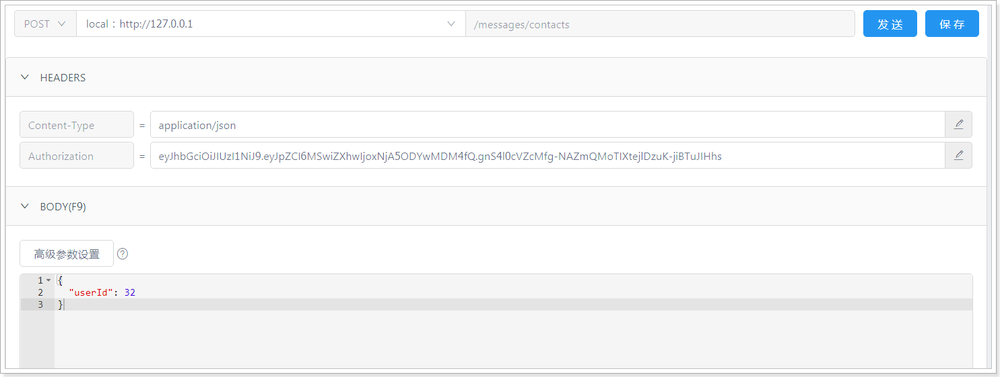

Monodb数据：

 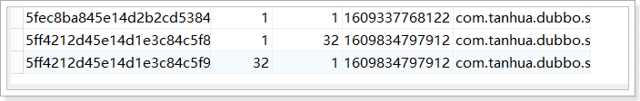

环信平台好友数据：

 

### 9.5、重新生成好友关系数据

由于之前的数据并没有完整的双向数据，所以需要重新生成，如下：

~~~java
package com.tanhua.server;

import cn.hutool.core.convert.Convert;
import cn.hutool.core.util.RandomUtil;
import com.tanhua.common.pojo.User;
import com.tanhua.common.utils.UserThreadLocal;
import com.tanhua.server.service.IMService;
import org.junit.Test;
import org.junit.runner.RunWith;
import org.springframework.beans.factory.annotation.Autowired;
import org.springframework.boot.test.context.SpringBootTest;
import org.springframework.test.context.junit4.SpringRunner;

@RunWith(SpringRunner.class)
@SpringBootTest
public class TestIMService {

    @Autowired
    private IMService imService;

    /**
     * 构造好友数据，为1~99用户构造10个好友
     */
    @Test
    public void testUsers() {
        for (int i = 1; i <= 99; i++) {
            for (int j = 0; j < 10; j++) {
                User user = new User();
                user.setId(Convert.toLong(i));
                UserThreadLocal.set(user);
                this.imService.contactUser(this.getFriendId(user.getId()));
            }
        }
    }

    private Long getFriendId(Long userId) {
        Long friendId = RandomUtil.randomLong(1, 100);
        if (friendId.intValue() == userId.intValue()) {
            getFriendId(userId);
        }
        return friendId;
    }
}

~~~


## 10、联系人列表

用户在消息模块中，可以查看联系人列表（好友列表）。

接口文档地址：https://mock-java.itheima.net/project/35/interface/api/803

### 10.1、dubbo服务

#### 10.1.1、定义接口

~~~java
//com.tanhua.dubbo.server.api.UsersApi

	/**
     * 根据用户id查询全部Users列表
     *
     * @param userId
     * @return
     */
    List<Users> queryAllUsersList(Long userId);

    /**
     * 根据用户id查询Users列表(分页查询)
     *
     * @param userId
     * @return
     */
    PageInfo<Users> queryUsersList(Long userId, Integer page, Integer pageSize);

~~~

#### 10.1.2、接口实现

~~~java
//com.tanhua.dubbo.server.api.UsersApiImpl
	@Override
    public List<Users> queryAllUsersList(Long userId) {
        Query query = Query.query(Criteria.where("userId").is(userId));
        return this.mongoTemplate.find(query, Users.class);
    }

    @Override
    public PageInfo<Users> queryUsersList(Long userId, Integer page, Integer pageSize) {
        PageRequest pageRequest = PageRequest.of(page - 1, pageSize, Sort.by(Sort.Order.desc("created")));
        Query query = Query.query(Criteria.where("userId").is(userId)).with(pageRequest);

        List<Users> usersList = this.mongoTemplate.find(query, Users.class);

        PageInfo<Users> pageInfo = new PageInfo<>();
        pageInfo.setPageNum(page);
        pageInfo.setPageSize(pageSize);
        pageInfo.setRecords(usersList);
        return pageInfo;
    }
~~~

### 10.2、APP接口服务

#### 10.2.1、UsersVo

~~~java
package com.tanhua.server.vo;

import lombok.AllArgsConstructor;
import lombok.Data;
import lombok.NoArgsConstructor;

@Data
@NoArgsConstructor
@AllArgsConstructor
public class UsersVo {

    private Long id;
    private String userId;
    private String avatar;
    private String nickname;
    private String gender;
    private Integer age;
    private String city;

}

~~~

#### 10.2.2、IMController

~~~java
//com.tanhua.server.controller.IMController

	/**
     * 查询联系人列表
     *
     * @param page
     * @param pageSize
     * @param keyword
     * @return
     */
    @GetMapping("contacts")
    public ResponseEntity<PageResult> queryContactsList(@RequestParam(value = "page", defaultValue = "1") Integer page,
                                                        @RequestParam(value = "pagesize", defaultValue = "10") Integer pageSize,
                                                        @RequestParam(value = "keyword", required = false) String keyword) {
        PageResult pageResult = this.imService.queryContactsList(page, pageSize, keyword);
        return ResponseEntity.ok(pageResult);
    }
~~~

#### 10.2.3、IMService

~~~java
//com.tanhua.server.service.IMService

    public PageResult queryContactsList(Integer page, Integer pageSize, String keyword) {
        PageResult pageResult = new PageResult();
        pageResult.setPage(page);
        pageResult.setPagesize(pageSize);

        User user = UserThreadLocal.get();

        List<Users> usersList;
        if (StringUtils.isNotEmpty(keyword)) {
            //关键不为空，查询所有的好友，在后面进行关键字过滤
            usersList = this.usersApi.queryAllUsersList(user.getId());
        } else {
            //关键字为空，进行分页查询
            PageInfo<Users> usersPageInfo = this.usersApi.queryUsersList(user.getId(), page, pageSize);
            usersList = usersPageInfo.getRecords();
        }

        if (CollUtil.isEmpty(usersList)) {
            return pageResult;
        }


        List<Object> userIds = CollUtil.getFieldValues(usersList, "friendId");

        QueryWrapper<UserInfo> queryWrapper = new QueryWrapper<>();
        queryWrapper.in("user_id", userIds);
        if (StringUtils.isNotEmpty(keyword)) {
            queryWrapper.like("nick_name", keyword);
        }

        List<UserInfo> userInfoList = this.userInfoService.queryUserInfoList(queryWrapper);

        List<UsersVo> contactsList = new ArrayList<>();
        //填充用户信息
        for (UserInfo userInfo : userInfoList) {
            UsersVo usersVo = new UsersVo();
            usersVo.setId(userInfo.getUserId());
            usersVo.setAge(userInfo.getAge());
            usersVo.setAvatar(userInfo.getLogo());
            usersVo.setGender(userInfo.getSex().name().toLowerCase());
            usersVo.setNickname(userInfo.getNickName());
            //环信用户账号
            usersVo.setUserId("HX_" + String.valueOf(userInfo.getUserId()));
            usersVo.setCity(StringUtils.substringBefore(userInfo.getCity(), "-"));
            contactsList.add(usersVo);
        }

        pageResult.setItems(contactsList);
        return pageResult;
    }
~~~

### 10.3、测试

 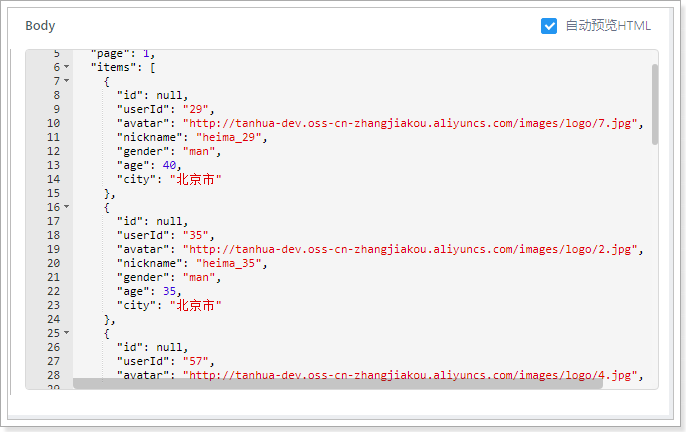

 
