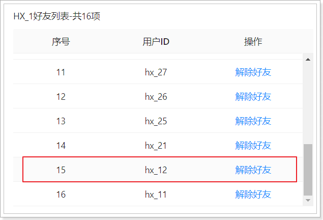
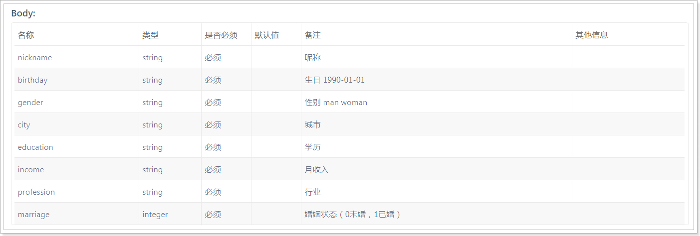

## 课程说明

- 上报地位位置
- 实现搜附近功能
- 实现探花功能
- 用户基本信息维护

## 1、上报地理位置

当客户端检测用户的地理位置，当变化大于500米时或每隔5分钟，向服务端上报地理位置。

用户的地理位置存储到Elasticsearch中，需要使用环境提供的ES集群，如下：

 

### 1.1、dubbo服务

用户地理位置的服务独立一个新的工程来实现，名字为：my-tanhua-dubbo-es。

#### 1.1.1、创建工程

pom.ml文件如下：

~~~xml
<?xml version="1.0" encoding="UTF-8"?>
<project xmlns="http://maven.apache.org/POM/4.0.0"
         xmlns:xsi="http://www.w3.org/2001/XMLSchema-instance"
         xsi:schemaLocation="http://maven.apache.org/POM/4.0.0 http://maven.apache.org/xsd/maven-4.0.0.xsd">
    <parent>
        <artifactId>my-tanhua-dubbo</artifactId>
        <groupId>cn.itcast.tanhua</groupId>
        <version>1.0-SNAPSHOT</version>
    </parent>
    <modelVersion>4.0.0</modelVersion>

    <artifactId>my-tanhua-dubbo-es</artifactId>

    <dependencies>
        <!--引入interface依赖-->
        <dependency>
            <groupId>cn.itcast.tanhua</groupId>
            <artifactId>my-tanhua-dubbo-interface</artifactId>
            <version>1.0-SNAPSHOT</version>
        </dependency>
        <dependency>
            <groupId>org.springframework.boot</groupId>
            <artifactId>spring-boot-starter</artifactId>
        </dependency>
        <dependency>
            <groupId>org.springframework.boot</groupId>
            <artifactId>spring-boot-starter-test</artifactId>
            <scope>test</scope>
        </dependency>
        <dependency>
            <groupId>org.springframework.boot</groupId>
            <artifactId>spring-boot-starter-data-elasticsearch</artifactId>
        </dependency>
        <!--dubbo的springboot支持-->
        <dependency>
            <groupId>com.alibaba.boot</groupId>
            <artifactId>dubbo-spring-boot-starter</artifactId>
        </dependency>
        <!--dubbo框架-->
        <dependency>
            <groupId>com.alibaba</groupId>
            <artifactId>dubbo</artifactId>
        </dependency>
        <!--zk依赖-->
        <dependency>
            <groupId>org.apache.zookeeper</groupId>
            <artifactId>zookeeper</artifactId>
        </dependency>
        <dependency>
            <groupId>com.github.sgroschupf</groupId>
            <artifactId>zkclient</artifactId>
        </dependency>
        <dependency>
            <groupId>io.netty</groupId>
            <artifactId>netty-all</artifactId>
        </dependency>
        <dependency>
            <groupId>cn.hutool</groupId>
            <artifactId>hutool-all</artifactId>
        </dependency>
    </dependencies>
</project>
~~~

application.properties文件：

~~~properties
# Spring boot application
spring.application.name = itcast-tanhua-dubbo-es

# dubbo 扫描包配置
dubbo.scan.basePackages = com.tanhua.dubbo.es
dubbo.application.name = dubbo-provider-es

#dubbo 对外暴露的端口信息
dubbo.protocol.name = dubbo
dubbo.protocol.port = 20882

#dubbo注册中心的配置
dubbo.registry.address = zookeeper://192.168.31.81:2181
dubbo.registry.client = zkclient
dubbo.registry.timeout = 60000 

#ES集群配置
spring.data.elasticsearch.cluster-name=es-tanhua-cluster
spring.data.elasticsearch.cluster-nodes=192.168.31.81:9300,192.168.31.81:9301,192.168.31.81:9302
~~~

启动类：

~~~java
package com.tanhua.dubbo.es;

import org.springframework.boot.SpringApplication;
import org.springframework.boot.autoconfigure.SpringBootApplication;
import org.springframework.boot.autoconfigure.data.mongo.MongoDataAutoConfiguration;
import org.springframework.boot.autoconfigure.mongo.MongoAutoConfiguration;

@SpringBootApplication(exclude = {MongoAutoConfiguration.class, MongoDataAutoConfiguration.class}) //排除mongo的自动配置
public class ESApplication {

    public static void main(String[] args) {
        SpringApplication.run(ESApplication.class, args);
    }
}

~~~

#### 1.1.2、定义pojo

在my-tanhua-dubbo-interface中创建：

~~~java
package com.tanhua.dubbo.server.pojo;

import lombok.AllArgsConstructor;
import lombok.Data;
import lombok.NoArgsConstructor;
import org.elasticsearch.common.geo.GeoPoint;
import org.springframework.data.annotation.Id;
import org.springframework.data.elasticsearch.annotations.Document;
import org.springframework.data.elasticsearch.annotations.Field;
import org.springframework.data.elasticsearch.annotations.FieldType;
import org.springframework.data.elasticsearch.annotations.GeoPointField;

@Data
@NoArgsConstructor
@AllArgsConstructor
@Document(indexName = "tanhua", type = "user_location", shards = 6, replicas = 2)
public class UserLocation {

    @Id
    private Long userId; //用户id
    @GeoPointField
    private GeoPoint location; //lon:经度 lat:纬度

    @Field(type = FieldType.Keyword)
    private String address; //位置描述

    @Field(type = FieldType.Long)
    private Long created; //创建时间

    @Field(type = FieldType.Long)
    private Long updated; //更新时间

    @Field(type = FieldType.Long)
    private Long lastUpdated; //上次更新时间
}

~~~

~~~java
package com.tanhua.dubbo.server.vo;

import cn.hutool.core.bean.BeanUtil;
import com.tanhua.dubbo.server.pojo.UserLocation;
import lombok.AllArgsConstructor;
import lombok.Data;
import lombok.NoArgsConstructor;

import java.util.ArrayList;
import java.util.List;

@Data
@NoArgsConstructor
@AllArgsConstructor
public class UserLocationVo implements java.io.Serializable {

    private static final long serialVersionUID = 4133419501260037769L;

    private Long userId; //用户id
    private Double longitude; //经度
    private Double latitude; //维度
    private String address; //位置描述
    private Long created; //创建时间
    private Long updated; //更新时间
    private Long lastUpdated; //上次更新时间

    public static final UserLocationVo format(UserLocation userLocation) {
        UserLocationVo userLocationVo = BeanUtil.toBean(userLocation, UserLocationVo.class);
        userLocationVo.setLongitude(userLocation.getLocation().getLon());
        userLocationVo.setLatitude(userLocation.getLocation().getLat());
        return userLocationVo;
    }

    public static final List<UserLocationVo> formatToList(List<UserLocation> userLocations) {
        List<UserLocationVo> list = new ArrayList<>();
        for (UserLocation userLocation : userLocations) {
            list.add(format(userLocation));
        }
        return list;
    }
}

~~~

> **由于UserLocation不能序列化，所以要再定义UserLocationVo进行返回数据。**

在my-tanhua-dubbo-interface中添加依赖：

~~~xml
<dependency>
    <groupId>org.springframework.boot</groupId>
    <artifactId>spring-boot-starter-data-elasticsearch</artifactId>
</dependency>
<dependency>
    <groupId>cn.hutool</groupId>
    <artifactId>hutool-all</artifactId>
</dependency>
~~~

#### 1.1.3、定义dubbo接口

在my-tanhua-dubbo-interface工程中。

~~~java
package com.tanhua.dubbo.server.api;

public interface UserLocationApi {

    /**
     * 更新用户地理位置
     *
     * @param userId 用户id
     * @param longitude 经度
     * @param latitude 纬度
     * @param address 地址名称
     * @return
     */
    Boolean updateUserLocation(Long userId, Double longitude, Double latitude, String address);

}

~~~

#### 1.1.4、编写实现

~~~java
package com.tanhua.dubbo.es.api;

import cn.hutool.core.util.ObjectUtil;
import com.alibaba.dubbo.config.annotation.Service;
import com.tanhua.dubbo.server.api.UserLocationApi;
import com.tanhua.dubbo.server.pojo.UserLocation;
import lombok.extern.slf4j.Slf4j;
import org.elasticsearch.action.update.UpdateRequest;
import org.elasticsearch.common.geo.GeoPoint;
import org.springframework.beans.factory.annotation.Autowired;
import org.springframework.data.elasticsearch.core.ElasticsearchTemplate;
import org.springframework.data.elasticsearch.core.query.*;

import javax.annotation.PostConstruct;
import java.util.HashMap;
import java.util.Map;

@Service(version = "1.0.0")
@Slf4j
public class UserLocationApiImpl implements UserLocationApi {

    @Autowired
    private ElasticsearchTemplate elasticsearchTemplate;

    /**
     * 初始化索引库
     *
     */
    @PostConstruct
    public void initIndex(){
        //判断索引库是否存在，如果不存在，需要创建
        if(!this.elasticsearchTemplate.indexExists("tanhua")){
            this.elasticsearchTemplate.createIndex(UserLocation.class);
        }

        //判断表是否存在，如果不存在，需要创建
        if(!this.elasticsearchTemplate.typeExists("tanhua", "user_location")){
            this.elasticsearchTemplate.putMapping(UserLocation.class);
        }
    }

    @Override
    public Boolean updateUserLocation(Long userId, Double longitude, Double latitude, String address) {
        //查询个人的地理位置数据，如果不存在，需要新增，如果是存在数据，更新数据

        try {
            GetQuery getQuery = new GetQuery();
            getQuery.setId(String.valueOf(userId));
            UserLocation userLocation = this.elasticsearchTemplate.queryForObject(getQuery, UserLocation.class);
            if(ObjectUtil.isEmpty(userLocation)){
                //新增数据
                userLocation = new UserLocation();
                userLocation.setUserId(userId);
                userLocation.setAddress(address);
                userLocation.setCreated(System.currentTimeMillis());
                userLocation.setUpdated(userLocation.getCreated());
                userLocation.setLastUpdated(userLocation.getCreated());
                userLocation.setLocation(new GeoPoint(latitude, longitude));

                IndexQuery indexQuery = new IndexQueryBuilder().withObject(userLocation).build();

                //保存数据到ES中
                this.elasticsearchTemplate.index(indexQuery);
            }else {
                //更新数据

                //更新的字段
                Map<String,Object> map = new HashMap<>();
                map.put("location", new GeoPoint(latitude, longitude));
                map.put("updated", System.currentTimeMillis());
                map.put("lastUpdated", userLocation.getUpdated());
                map.put("address", address);

                UpdateRequest updateRequest = new UpdateRequest();
                updateRequest.doc(map);

                UpdateQuery updateQuery = new UpdateQueryBuilder()
                        .withId(String.valueOf(userId))
                        .withClass(UserLocation.class)
                        .withUpdateRequest(updateRequest).build();

                //更新数据
                this.elasticsearchTemplate.update(updateQuery);
            }

            return true;
        } catch (Exception e) {
            log.error("更新地理位置失败~ userId = " + userId + ", longitude = " + longitude + ", latitude = " + latitude + ", address = " + address, e);
        }

        return false;
    }
}

~~~

#### 1.1.5、单元测试

```java
package com.tanhua.dubbo.es;

import com.tanhua.dubbo.server.api.UserLocationApi;
import com.tanhua.dubbo.server.vo.PageInfo;
import com.tanhua.dubbo.server.vo.UserLocationVo;
import org.junit.Test;
import org.junit.runner.RunWith;
import org.springframework.beans.factory.annotation.Autowired;
import org.springframework.boot.test.context.SpringBootTest;
import org.springframework.test.context.junit4.SpringRunner;

@RunWith(SpringRunner.class)
@SpringBootTest
public class TestUserLocationApi {

    @Autowired
    private UserLocationApi userLocationApi;

    @Test
    public void testUpdateUserLocation() {
        this.userLocationApi.updateUserLocation(1L, 121.512253, 31.24094, "金茂大厦");
        this.userLocationApi.updateUserLocation(2L, 121.506377, 31.245105, "东方明珠广播电视塔");
        this.userLocationApi.updateUserLocation(10L, 121.508815, 31.243844, "陆家嘴地铁站");
        this.userLocationApi.updateUserLocation(12L, 121.511999, 31.239185, "上海中心大厦");
        this.userLocationApi.updateUserLocation(25L, 121.493444, 31.240513, "上海市公安局");
        this.userLocationApi.updateUserLocation(27L, 121.494108, 31.247011, "上海外滩美术馆");
        this.userLocationApi.updateUserLocation(30L, 121.462452, 31.253463, "上海火车站");
        this.userLocationApi.updateUserLocation(32L, 121.81509, 31.157478, "上海浦东国际机场");
        this.userLocationApi.updateUserLocation(34L, 121.327908, 31.20033, "虹桥火车站");
        this.userLocationApi.updateUserLocation(38L, 121.490155, 31.277476, "鲁迅公园");
        this.userLocationApi.updateUserLocation(40L, 121.425511, 31.227831, "中山公园");
        this.userLocationApi.updateUserLocation(43L, 121.594194, 31.207786, "张江高科");
    }

}
```

### 1.2、APP接口

接口文档：https://mock-java.itheima.net/project/35/interface/api/557

#### 1.2.1、BaiduController

~~~java
package com.tanhua.server.controller;

import com.tanhua.server.service.BaiduService;
import org.springframework.beans.factory.annotation.Autowired;
import org.springframework.http.HttpStatus;
import org.springframework.http.ResponseEntity;
import org.springframework.web.bind.annotation.PostMapping;
import org.springframework.web.bind.annotation.RequestBody;
import org.springframework.web.bind.annotation.RequestMapping;
import org.springframework.web.bind.annotation.RestController;

import java.util.Map;

@RestController
@RequestMapping("baidu")
public class BaiduController {

    @Autowired
    private BaiduService baiduService;

    /**
     * 更新位置
     *
     * @param param
     * @return
     */
    @PostMapping("location")
    public ResponseEntity<Void> updateLocation(@RequestBody Map<String, Object> param) {
        try {
            Double longitude = Double.valueOf(param.get("longitude").toString());
            Double latitude = Double.valueOf(param.get("latitude").toString());
            String address = param.get("addrStr").toString();

            Boolean bool = this.baiduService.updateLocation(longitude, latitude, address);
            if (bool) {
                return ResponseEntity.ok(null);
            }
        } catch (Exception e) {
            e.printStackTrace();
        }

        return ResponseEntity.status(HttpStatus.INTERNAL_SERVER_ERROR).build();
    }
}

~~~

#### 1.2.2、BaiduService

```java
package com.tanhua.server.service;

import com.alibaba.dubbo.config.annotation.Reference;
import com.tanhua.common.pojo.User;
import com.tanhua.common.utils.UserThreadLocal;
import com.tanhua.dubbo.server.api.UserLocationApi;
import lombok.extern.slf4j.Slf4j;
import org.springframework.stereotype.Service;

@Service
@Slf4j
public class BaiduService {

    @Reference(version = "1.0.0")
    private UserLocationApi userLocationApi;

    public Boolean updateLocation(Double longitude, Double latitude, String address) {
        User user = UserThreadLocal.get();
        try {
            return this.userLocationApi.updateUserLocation(user.getId(), longitude, latitude, address);
        } catch (Exception e) {
            log.error("更新地理位置失败~ userId = " + user.getId() + ", longitude = " + longitude + ", latitude = " + latitude + ", address = " + address, e);
        }
        return false;
    }

}
```

### 1.3、测试

## 

## 2、搜附近

在首页中点击“搜附近”可以搜索附近的好友，效果如下：

  

实现思路：根据当前用户的位置，查询附近范围内的用户。范围是可以设置的。

### 2.1、dubbo服务

#### 2.1.1、定义接口方法

~~~java
//com.tanhua.dubbo.server.api.UserLocationApi

	/**
     * 查询用户地理位置
     *
     * @param userId
     * @return
     */
    UserLocationVo queryByUserId(Long userId);

    /**
     * 根据位置搜索
     *
     * @param longitude 经度
     * @param latitude  纬度
     * @param distance  距离(米)
     * @param page      页数
     * @param pageSize  页面大小
     */
    PageInfo<UserLocationVo> queryUserFromLocation(Double longitude, Double latitude, Double distance, Integer page, Integer pageSize);

~~~

#### 2.1.2、编写实现

~~~java
//com.tanhua.dubbo.es.api.UserLocationApiImpl

	/**
     * 查询用户的位置信息
     *
     * @param userId
     * @return
     */
    @Override
    public UserLocationVo queryByUserId(Long userId) {

        GetQuery getQuery = new GetQuery();
        getQuery.setId(String.valueOf(userId));
        UserLocation userLocation = this.elasticsearchTemplate.queryForObject(getQuery, UserLocation.class);
        if(ObjectUtil.isNotEmpty(userLocation)){
            return UserLocationVo.format(userLocation);
        }

        return null;
    }

    /**
     * 根据位置搜索
     *
     * @param longitude 经度
     * @param latitude  纬度
     * @param distance  距离(米)
     * @param page      页数
     * @param pageSize  页面大小
     */
    @Override
    public PageInfo<UserLocationVo> queryUserFromLocation(Double longitude, Double latitude, Double distance, Integer page, Integer pageSize) {
        PageInfo<UserLocationVo> pageInfo = new PageInfo<>();
        pageInfo.setPageNum(page);
        pageInfo.setPageSize(pageSize);

        String fieldName = "location";

        //实现了SearchQuery接口，构造分页、排序
        NativeSearchQueryBuilder searchQueryBuilder = new NativeSearchQueryBuilder();

        //分页
        PageRequest pageRequest = PageRequest.of(page - 1, pageSize);
        searchQueryBuilder.withPageable(pageRequest);

        BoolQueryBuilder boolQueryBuilder = new BoolQueryBuilder();

        //以一个点为中心，指定范围查询
        GeoDistanceQueryBuilder geoDistanceQueryBuilder = new GeoDistanceQueryBuilder(fieldName);
        //中心点
        geoDistanceQueryBuilder.point(new GeoPoint(latitude, longitude));
        //距离（画圆的半径）单位：公里
        geoDistanceQueryBuilder.distance(distance / 1000, DistanceUnit.KILOMETERS);

        boolQueryBuilder.must(geoDistanceQueryBuilder);
        searchQueryBuilder.withQuery(boolQueryBuilder);

        //排序，由近到远排序
        GeoDistanceSortBuilder geoDistanceSortBuilder = new GeoDistanceSortBuilder(fieldName, latitude, longitude);
        geoDistanceSortBuilder.order(SortOrder.ASC); //正序排序
        geoDistanceSortBuilder.unit(DistanceUnit.KILOMETERS); //设置单位
        searchQueryBuilder.withSort(geoDistanceSortBuilder);

        AggregatedPage<UserLocation> aggregatedPage = this.elasticsearchTemplate.queryForPage(searchQueryBuilder.build(), UserLocation.class);
        if(CollUtil.isEmpty(aggregatedPage.getContent())){
            return pageInfo;
        }

        pageInfo.setRecords(UserLocationVo.formatToList(aggregatedPage.getContent()));

        return pageInfo;
    }
~~~

#### 2.1.3、单元测试

~~~java
//com.tanhua.dubbo.es.TestUserLocationApi

	@Test
    public void testQueryByUserId(){
        UserLocationVo userLocationVo = this.userLocationApi.queryByUserId(1L);
        System.out.println(userLocationVo);
    }

    @Test
    public void testQueryUserFromLocation(){
        UserLocationVo userLocationVo = this.userLocationApi.queryByUserId(1L);
        PageInfo<UserLocationVo> pageInfo = this.userLocationApi
                .queryUserFromLocation(userLocationVo.getLongitude(),
                        userLocationVo.getLatitude(), 5000d, 1, 10);
        pageInfo.getRecords().forEach(vo -> System.out.println(vo));
    }
~~~

### 2.2、APP接口服务

文档地址：https://mock-java.itheima.net/project/35/interface/api/611

#### 2.2.1、NearUserVo

~~~java
package com.tanhua.server.vo;

import lombok.AllArgsConstructor;
import lombok.Data;
import lombok.NoArgsConstructor;

@Data
@NoArgsConstructor
@AllArgsConstructor
public class NearUserVo {

    private Long userId;
    private String avatar;
    private String nickname;

}

~~~

#### 2.2.2、TanHuaController

~~~java
//com.tanhua.server.controller.TanHuaController

	/**
     * 搜附近
     *
     * @param gender
     * @param distance
     * @return
     */
    @GetMapping("search")
    public ResponseEntity<List<NearUserVo>> queryNearUser(@RequestParam(value = "gender", required = false) String gender,
                                                          @RequestParam(value = "distance", defaultValue = "2000") String distance) {
        try {
            List<NearUserVo> list = this.tanHuaService.queryNearUser(gender, distance);
            return ResponseEntity.ok(list);
        } catch (Exception e) {
            e.printStackTrace();
        }
        return ResponseEntity.status(HttpStatus.INTERNAL_SERVER_ERROR).build();
    }
~~~

#### 2.2.3、TanHuaService

```java
//com.tanhua.server.service.TanHuaService

    public List<NearUserVo> queryNearUser(String gender, String distance) {
        //查询当前用户的位置
        User user = UserThreadLocal.get();
        UserLocationVo userLocationVo = this.userLocationApi.queryByUserId(user.getId());
        if(ObjectUtil.isEmpty(userLocationVo)){
            return ListUtil.empty();
        }

        PageInfo<UserLocationVo> pageInfo = this.userLocationApi.queryUserFromLocation(userLocationVo.getLongitude(),
                userLocationVo.getLatitude(),
                Convert.toDouble(distance),
                1,
                50
        );

        List<UserLocationVo> records = pageInfo.getRecords();
        if(CollUtil.isEmpty(records)){
            return ListUtil.empty();
        }

        //构造筛选条件
        List<Object> userIdList = CollUtil.getFieldValues(records, "userId");
        QueryWrapper<UserInfo> queryWrapper = new QueryWrapper<>();
        queryWrapper.in("user_id", userIdList);
        if(StrUtil.equalsIgnoreCase(gender, "man")){
            queryWrapper.eq("sex", SexEnum.MAN);
        }else if(StrUtil.equalsIgnoreCase(gender, "woman")){
            queryWrapper.eq("sex", SexEnum.WOMAN);
        }

        List<UserInfo> userInfoList = this.userInfoService.queryUserInfoList(queryWrapper);

        List<NearUserVo> result = new ArrayList<>();
        for (UserLocationVo locationVo : records) {
            //排除自己
            if(ObjectUtil.equals(locationVo.getUserId(), user.getId())){
                continue;
            }

            for (UserInfo userInfo : userInfoList) {
                if(ObjectUtil.equals(locationVo.getUserId(), userInfo.getUserId())){

                    NearUserVo nearUserVo = new NearUserVo();
                    nearUserVo.setUserId(userInfo.getUserId());
                    nearUserVo.setAvatar(userInfo.getLogo());
                    nearUserVo.setNickname(userInfo.getNickName());
                    result.add(nearUserVo);
                    break;
                }
            }
        }

        return result;
    }
```

#### 2.2.4、测试

 

## 3、探花

探花功能是将推荐的好友随机的通过卡片的形式展现出来，用户可以选择左滑、右滑操作，左滑：“不喜欢”，右滑：“喜欢”。

喜欢：如果双方喜欢，那么就会成为好友。

 

如果已经喜欢或不喜欢的用户在列表中不再显示。

### 3.1、喜欢的dubbo服务

用户的喜欢与不喜欢列表需要保存在redis中，为了防止redis中的数据丢失，同时需要将数据保存到mongodb进行持久化保存。

#### 3.1.1、实体对象

```java
package com.tanhua.dubbo.server.pojo;

import lombok.AllArgsConstructor;
import lombok.Data;
import lombok.NoArgsConstructor;
import org.bson.types.ObjectId;
import org.springframework.data.mongodb.core.index.Indexed;
import org.springframework.data.mongodb.core.mapping.Document;

@Data
@NoArgsConstructor
@AllArgsConstructor
@Document(collection = "user_like")
public class UserLike implements java.io.Serializable {

    private static final long serialVersionUID = 6739966698394686523L;

    private ObjectId id;
    @Indexed
    private Long userId; //用户id，自己
    @Indexed
    private Long likeUserId; //喜欢的用户id，对方
    private Long created; //创建时间

}
```

#### 3.1.2、定义接口

```java
package com.tanhua.dubbo.server.api;

import java.util.List;

public interface UserLikeApi {

    /**
     * 喜欢
     *
     * @param userId
     * @param likeUserId
     * @return
     */
    Boolean likeUser(Long userId, Long likeUserId);

    /**
     * 不喜欢
     *
     * @param userId
     * @param likeUserId
     * @return
     */
    Boolean notLikeUser(Long userId, Long likeUserId);


    /**
     * 是否相互喜欢
     *
     * @param userId
     * @param likeUserId
     * @return
     */
    Boolean isMutualLike(Long userId, Long likeUserId);


    /**
     * 查询喜欢列表
     *
     * @param userId
     * @return
     */
    List<Long> queryLikeList(Long userId);

    /**
     * 查询不喜欢列表
     *
     * @param userId
     * @return
     */
    List<Long> queryNotLikeList(Long userId);

}
```

#### 3.1.3、编写实现

```java
package com.tanhua.dubbo.server.api;

import cn.hutool.core.collection.CollUtil;
import cn.hutool.core.collection.ListUtil;
import cn.hutool.core.convert.Convert;
import com.alibaba.dubbo.config.annotation.Service;
import com.tanhua.dubbo.server.pojo.UserLike;
import org.bson.types.ObjectId;
import org.springframework.beans.factory.annotation.Autowired;
import org.springframework.data.mongodb.core.MongoTemplate;
import org.springframework.data.mongodb.core.query.Criteria;
import org.springframework.data.mongodb.core.query.Query;
import org.springframework.data.redis.core.RedisTemplate;

import java.util.ArrayList;
import java.util.List;
import java.util.Set;

@Service(version = "1.0.0")
public class UserLikeApiImpl implements UserLikeApi {

    @Autowired
    private MongoTemplate mongoTemplate;

    @Autowired
    private RedisTemplate<String,String> redisTemplate;

    public static final String LIKE_REDIS_KEY_PREFIX = "USER_LIKE_";

    public static final String NOT_LIKE_REDIS_KEY_PREFIX = "USER_NOT_LIKE_";


    /**
     * 喜欢
     *
     * @param userId
     * @param likeUserId
     * @return
     */
    @Override
    public Boolean likeUser(Long userId, Long likeUserId) {
        //判断该用户是否已经喜欢，如果已经喜欢就返回
        if(this.isLike(userId, likeUserId)){
            return false;
        }

        UserLike userLike = new UserLike();
        userLike.setId(ObjectId.get());
        userLike.setUserId(userId);
        userLike.setLikeUserId(likeUserId);
        userLike.setCreated(System.currentTimeMillis());

        //将数据存储到MongoDB
        this.mongoTemplate.save(userLike);

        //用户的喜欢数据保存到redis
        //用户1：key -> USER_LIKE_1 , value -> 2, "1"
        //用户1：key -> USER_LIKE_1 , value -> 3, "1"
        //用户2：key -> USER_LIKE_2 , value -> 4, "1"
        String redisKey = this.getLikeRedisKey(userId);
        String hashKey = String.valueOf(likeUserId);
        this.redisTemplate.opsForHash().put(redisKey, hashKey, "1");

        //判断，喜欢的用户是否在不喜欢的列表中，如果在，就需要删除数据
        if(this.isNotLike(userId, likeUserId)){
            redisKey = this.getNotLikeRedisKey(userId);
            this.redisTemplate.opsForHash().delete(redisKey, hashKey);
        }

        return true;
    }

    /**
     * 获取喜欢数据的redis key
     *
     * @param userId
     * @return
     */
    private String getLikeRedisKey(Long userId){
        return LIKE_REDIS_KEY_PREFIX + userId;
    }

    /**
     * 获取不喜欢数据的redis key
     *
     * @param userId
     * @return
     */
    private String getNotLikeRedisKey(Long userId){
        return NOT_LIKE_REDIS_KEY_PREFIX + userId;
    }

    /**
     * 是否喜欢
     *
     * @param userId
     * @param likeUserId
     * @return
     */
    private Boolean isLike(Long userId, Long likeUserId){
        String redisKey = this.getLikeRedisKey(userId);
        String hashKey = String.valueOf(likeUserId);
        return this.redisTemplate.opsForHash().hasKey(redisKey, hashKey);
    }

    /**
     * 是否不喜欢
     *
     * @param userId
     * @param likeUserId
     * @return
     */
    private Boolean isNotLike(Long userId, Long likeUserId){
        String redisKey = this.getNotLikeRedisKey(userId);
        String hashKey = String.valueOf(likeUserId);
        return this.redisTemplate.opsForHash().hasKey(redisKey, hashKey);
    }

    @Override
    public Boolean notLikeUser(Long userId, Long likeUserId) {
        //判断用户是否已经不喜欢，如果已经不喜欢，就返回
        if(this.isNotLike(userId, likeUserId)){
            return false;
        }

        //将用户保存到不喜欢列表中
        String redisKey = this.getNotLikeRedisKey(userId);
        String hashKey = String.valueOf(likeUserId);
        this.redisTemplate.opsForHash().put(redisKey, hashKey, "1");

        //判断用户是否在喜欢列表中，如果存在的话，需要删除数据
        if(this.isLike(userId, likeUserId)){
            //删除MongoDB数据
            Query query = Query.query(Criteria
                    .where("userId").is(userId)
                    .and("likeUserId").is(likeUserId)
            );
            this.mongoTemplate.remove(query, UserLike.class);

            //删除redis中的数据
            redisKey = this.getLikeRedisKey(userId);
            this.redisTemplate.opsForHash().delete(redisKey, hashKey);
        }

        return true;
    }

    @Override
    public Boolean isMutualLike(Long userId, Long likeUserId) {
        return this.isLike(userId, likeUserId)
                && this.isLike(likeUserId, userId);
    }

    @Override
    public List<Long> queryLikeList(Long userId) {
        // 查询redis
        String redisKey = this.getLikeRedisKey(userId);
        Set<Object> keys = this.redisTemplate.opsForHash().keys(redisKey);
        if(CollUtil.isEmpty(keys)){
            return ListUtil.empty();
        }

        List<Long> result = new ArrayList<>(keys.size());
        keys.forEach(o -> result.add(Convert.toLong(o)));
        return result;
    }

    @Override
    public List<Long> queryNotLikeList(Long userId) {
        // 查询redis
        String redisKey = this.getNotLikeRedisKey(userId);
        Set<Object> keys = this.redisTemplate.opsForHash().keys(redisKey);
        if(CollUtil.isEmpty(keys)){
            return ListUtil.empty();
        }

        List<Long> result = new ArrayList<>(keys.size());
        keys.forEach(o -> result.add(Convert.toLong(o)));
        return result;
    }
}

```

#### 3.1.4、单元测试

```java
package com.tanhua.dubbo.server.api;

import org.junit.Test;
import org.junit.runner.RunWith;
import org.springframework.beans.factory.annotation.Autowired;
import org.springframework.boot.test.context.SpringBootTest;
import org.springframework.test.context.junit4.SpringRunner;

@RunWith(SpringRunner.class)
@SpringBootTest
public class TestUserLikeApi {

    @Autowired
    private UserLikeApi userLikeApi;

    @Test
    public void testUserLike() {
        System.out.println(this.userLikeApi.likeUser(1L, 2L));
        System.out.println(this.userLikeApi.likeUser(1L, 3L));
        System.out.println(this.userLikeApi.likeUser(1L, 4L));

        System.out.println(this.userLikeApi.notLikeUser(1L, 5L));
        System.out.println(this.userLikeApi.notLikeUser(1L, 6L));

        System.out.println(this.userLikeApi.likeUser(1L, 5L));
        System.out.println(this.userLikeApi.notLikeUser(1L, 2L));
    }

    @Test
    public void testQueryList(){
        this.userLikeApi.queryLikeList(1L).forEach(a -> System.out.println(a));
        System.out.println("-------");
        this.userLikeApi.queryNotLikeList(1L).forEach(a -> System.out.println(a));
    }
}
```

### 3.2、查询推荐列表dubbo服务

#### 3.2.1、定义接口

```java
//com.tanhua.dubbo.server.api.RecommendUserApi

/**
 * 查询探花列表，查询时需要排除不喜欢列表用户
 *
 * @param userId
 * @param count
 * @return
 */
List<RecommendUser> queryCardList(Long userId, Integer count);
```

#### 3.2.2、编写实现

```java
//com.tanhua.dubbo.server.api.RecommendUserApiImpl

    @Override
    public List<RecommendUser> queryCardList(Long userId, Integer count) {
        //设置分页以及排序，按照得分倒序排序
        PageRequest pageRequest = PageRequest.of(0, count, Sort.by(Sort.Order.desc("score")));

        //排除已喜欢或不喜欢的用户
        List<Long> userIds = new ArrayList<>();
        //查询喜欢列表
        userIds.addAll(this.userLikeApi.queryLikeList(userId));

        //查询不喜欢列表
        userIds.addAll(this.userLikeApi.queryNotLikeList(userId));

        //构造查询条件
        Criteria criteria = Criteria.where("toUserId").is(userId);
        if(CollUtil.isNotEmpty(userIds)){
            //加入到查询条件中，排除这些用户
            criteria.andOperator(Criteria.where("userId").nin(userIds));
        }

        Query query = Query.query(criteria).with(pageRequest);
        List<RecommendUser> recommendUserList = this.mongoTemplate.find(query, RecommendUser.class);
        return recommendUserList;
    }
```

#### 3.2.3、单元测试

```java
//com.tanhua.dubbo.server.api.TestRecommendUserApi

@Test
public void testQueryCardList(){
    this.recommendUserApi.queryCardList(2L, 20)
            .forEach(recommendUser -> System.out.println(recommendUser));
}
```

### 3.3、查询推荐列表APP接口实现

接口文档：https://mock-java.itheima.net/project/35/interface/api/593

#### 3.3.1、TanHuaController

~~~java

	/**
     * 探花
     *
     * @return
     */
    @GetMapping("cards")
    public ResponseEntity<List<TodayBest>> queryCardsList() {
        try {
            List<TodayBest> list = this.tanHuaService.queryCardsList();
            return ResponseEntity.ok(list);
        } catch (Exception e) {
            e.printStackTrace();
        }
        return ResponseEntity.status(HttpStatus.INTERNAL_SERVER_ERROR).build();
    }
~~~

#### 3.3.2、TanHuaService

~~~properties
#默认推荐列表
tanhua.default.recommend.users=2,3,8,10,18,20,24,29,27,32,36,37,56,64,75,88
~~~

```java
/**
 * 查询推荐卡片列表，从推荐列表中随机选取10个用户
 *
 * @return
 */
    public List<TodayBest> queryCardsList() {

        User user = UserThreadLocal.get();
        int count = 50;

        //查询到的50条数据，并不是用来直接展现，需要从这50条数据中随机返回一些数据
        List<RecommendUser> recommendUserList = this.recommendUserService.queryCardList(user.getId(), count);
        if (CollUtil.isEmpty(recommendUserList)) {
            recommendUserList = new ArrayList<>();
            //默认推荐列表
            List<String> list = StrUtil.split(defaultRecommendUsers, ',');
            for (String userId : list) {
                RecommendUser recommendUser = new RecommendUser();

                recommendUser.setToUserId(user.getId());
                recommendUser.setUserId(Convert.toLong(userId));
                recommendUserList.add(recommendUser);
            }
        }

        //计算展现的数量，默认展现10个
        int showCount = Math.min(10, recommendUserList.size());
        List<RecommendUser> result = new ArrayList<>();
        for (int i = 0; i < showCount; i++) {
            //TODO 可能重复
            int index = RandomUtil.randomInt(0, recommendUserList.size());
            RecommendUser recommendUser = recommendUserList.get(index);
            result.add(recommendUser);
        }

        List<Object> userIdList = CollUtil.getFieldValues(result, "userId");
        List<UserInfo> userInfoList = this.userInfoService.queryUserInfoByUserIdList(userIdList);
        List<TodayBest> todayBests = new ArrayList<>();
        for (UserInfo userInfo : userInfoList) {
            TodayBest todayBest = new TodayBest();
            todayBest.setId(userInfo.getUserId());
            todayBest.setAge(userInfo.getAge());
            todayBest.setAvatar(userInfo.getLogo());
            todayBest.setGender(userInfo.getSex().name().toLowerCase());
            todayBest.setNickname(userInfo.getNickName());
            todayBest.setTags(Convert.toStrArray(StrUtil.split(userInfo.getTags(), ',')));
            todayBest.setFateValue(0L);

            todayBests.add(todayBest);
        }

        return todayBests;
    }
```

#### 3.3.3、测试


效果：

 

### 3.4、左滑右滑

左滑：“不喜欢”，右滑：“喜欢”，如果双方喜欢，那么就会成为好友。

喜欢的接口文档：https://mock-java.itheima.net/project/35/interface/api/599

不喜欢的接口文档：https://mock-java.itheima.net/project/35/interface/api/605

#### 3.4.1、TanHuaController

```java
/**
 * 喜欢
 *
 * @param likeUserId
 * @return
 */
@GetMapping("{id}/love")
public ResponseEntity<Void> likeUser(@PathVariable("id") Long likeUserId) {
    try {
        this.tanHuaService.likeUser(likeUserId);
        return ResponseEntity.ok(null);
    } catch (Exception e) {
        e.printStackTrace();
    }
    return ResponseEntity.status(HttpStatus.INTERNAL_SERVER_ERROR).build();
}

/**
 * 不喜欢
 *
 * @param likeUserId
 * @return
 */
@GetMapping("{id}/unlove")
public ResponseEntity<Void> notLikeUser(@PathVariable("id") Long likeUserId) {
    try {
        this.tanHuaService.notLikeUser(likeUserId);
        return ResponseEntity.ok(null);
    } catch (Exception e) {
        e.printStackTrace();
    }
    return ResponseEntity.status(HttpStatus.INTERNAL_SERVER_ERROR).build();
}
```

#### 3.4.2、TanHuaService

```java
//com.tanhua.server.service.TanHuaService

public Boolean likeUser(Long likeUserId) {
    User user = UserThreadLocal.get();
    Boolean result = this.userLikeApi.likeUser(user.getId(), likeUserId);
    if (!result) {
        return false;
    }

    if (this.userLikeApi.isMutualLike(user.getId(), likeUserId)) {
        //相互喜欢成为好友
        this.imService.contactUser(likeUserId);
    }
    return true;
}

public Boolean notLikeUser(Long likeUserId) {
    User user = UserThreadLocal.get();
    return this.userLikeApi.notLikeUser(user.getId(), likeUserId);
}
```

#### 3.4.3、测试


user_like表，可以看到已经相互喜欢了：

 

tanhua_users表，可以看到相互是好友了：

 

环信平台：

 

## 4、用户资料

在我的中心模块中，可以对个人信息做修改。

 

### 4.1、基本信息

在前面实现的查询个人信息接口中，已经返回个人基本数据，所以可以直接展现出个人信息，下面只需要进行实现数据的保存即可。

#### 4.4.1、接口信息

接口地址：https://mock-java.itheima.net/project/35/interface/api/887


请求参数：

#### 

#### 4.4.2、MyCenterController

```java
//com.tanhua.server.controller.MyCenterController

/**
 * 更新用户信息
 *
 * @param userInfoVo
 * @return
 */
@PutMapping
public ResponseEntity<Void> updateUserInfo(@RequestBody UserInfoVo userInfoVo){
    try {
        Boolean bool = this.myCenterService.updateUserInfo(userInfoVo);
        if(bool){
            return ResponseEntity.ok(null);
        }
    } catch (Exception e) {
        e.printStackTrace();
    }
    return ResponseEntity.status(HttpStatus.INTERNAL_SERVER_ERROR).build();
}
```

#### 4.4.3、MyCenterService

```java
//com.tanhua.server.service.MyCenterService

public Boolean updateUserInfo(UserInfoVo userInfoVo) {
    User user = UserThreadLocal.get();
    UserInfo userInfo = new UserInfo();
    userInfo.setUserId(user.getId());
    userInfo.setAge(Integer.valueOf(userInfoVo.getAge()));
    userInfo.setSex(StringUtils.equalsIgnoreCase(userInfoVo.getGender(), "man") ? SexEnum.MAN : SexEnum.WOMAN);
    userInfo.setBirthday(userInfoVo.getBirthday());
    userInfo.setCity(userInfoVo.getCity());
    userInfo.setEdu(userInfoVo.getEducation());
    userInfo.setIncome(StringUtils.replaceAll(userInfoVo.getIncome(), "K", ""));
    userInfo.setIndustry(userInfoVo.getProfession());
    userInfo.setMarriage(userInfoVo.getMarriage() == 1 ? "已婚" : "未婚");
    return this.userInfoService.updateUserInfoByUserId(userInfo);
}
```

#### 4.4.4、UserInfoService

```java
//com.tanhua.server.service.UserInfoService

public boolean updateUserInfoByUserId(UserInfo userInfo) {
    QueryWrapper<UserInfo> queryWrapper = new QueryWrapper<>();
    queryWrapper.eq("user_id", userInfo.getUserId());
    return this.userInfoMapper.update(userInfo, queryWrapper) > 0;
}
```

#### 4.4.5、bug修复

在之前的查询个人信息中接口中，返回数据中的性别数据有误，需要返回man或woman。

如下：

~~~java
//com.tanhua.server.service.MyCenterService

	public UserInfoVo queryUserInfoByUserId(Long userId) {
        if (ObjectUtil.isEmpty(userId)) {
            //如果查询id为null，就表示查询当前用户信息
            userId = UserThreadLocal.get().getId();
        }
        //查询用户信息
        UserInfo userInfo = this.userInfoService.queryUserInfoByUserId(userId);
        if (ObjectUtil.isEmpty(userInfo)) {
            return null;
        }

        UserInfoVo userInfoVo = BeanUtil.copyProperties(userInfo, UserInfoVo.class, "marriage");
        userInfoVo.setGender(userInfo.getSex().getValue() == 1 ? "man" : "women");
        userInfoVo.setMarriage(StrUtil.equals("已婚", userInfo.getMarriage()) ? 1 : 0);
        return userInfoVo;
    }
~~~

### 4.2、更新头像

上传头像使用sso中的上传逻辑即可，只是路径不同，所以我们只需要修改nginx配置和在sso中定义Controller即可。

接口文档：https://mock-java.itheima.net/project/35/interface/api/881 

~~~shell
#user  nobody;
worker_processes  1;

#error_log  logs/error.log;
#error_log  logs/error.log  notice;
#error_log  logs/error.log  info;

#pid        logs/nginx.pid;


events {
    worker_connections  1024;
}


http {
    include       mime.types;
    default_type  application/octet-stream;

    #log_format  main  '$remote_addr - $remote_user [$time_local] "$request" '
    #                  '$status $body_bytes_sent "$http_referer" '
    #                  '"$http_user_agent" "$http_x_forwarded_for"';

    #access_log  logs/access.log  main;

    sendfile        on;
    #tcp_nopush     on;

    #keepalive_timeout  0;
    keepalive_timeout  65;

    #gzip  on;

    server {
        listen       80;
        server_name  localhost;

        #charset koi8-r;

        #access_log  logs/host.access.log  main;

        #error_page  404              /404.html;

        # redirect server error pages to the static page /50x.html
        #
        error_page   500 502 503 504  /50x.html;
        location = /50x.html {
            root   html;
        }

        location /user/ {  #请求路径中凡是以/user/开头的请求，转发到sso系统
            client_max_body_size  300m;  #设置最大的请求体大小，解决大文件上传不了的问题
            proxy_connect_timeout 300s;  #代理连接超时时间
            proxy_send_timeout 300s;  #代理发送数据的超时时间
            proxy_read_timeout 300s;  #代理读取数据的超时时间
            proxy_pass   http://127.0.0.1:18080;  #转发请求
        }

        location /users/header {  #请求路径中凡是以/user/header开头的请求，转发到sso系统
            client_max_body_size  300m;  #设置最大的请求体大小，解决大文件上传不了的问题
            proxy_connect_timeout 300s;  #代理连接超时时间
            proxy_send_timeout 300s;  #代理发送数据的超时时间
            proxy_read_timeout 300s;  #代理读取数据的超时时间
            proxy_pass   http://127.0.0.1:18080;  #转发请求
        }

        location / {   #上面未匹配到的在这里处理
            client_max_body_size  300m;
            proxy_connect_timeout 300s;
            proxy_send_timeout 300s;
            proxy_read_timeout 300s;
                proxy_pass   http://127.0.0.1:18081;  #转发请求到server系统
            }
        }

}
~~~

#### 4.2.2、MyCenterController

在sso工程中定义MyCenterController。

```java
package com.tanhua.sso.controller;

import com.tanhua.sso.vo.ErrorResult;
import org.springframework.beans.factory.annotation.Autowired;
import org.springframework.http.HttpStatus;
import org.springframework.http.ResponseEntity;
import org.springframework.web.bind.annotation.*;
import org.springframework.web.multipart.MultipartFile;

@RestController
@RequestMapping("users")
public class MyCenterController {

    @Autowired
    private UserInfoController userInfoController;

    /**
     * 上传头像
     *
     * @param file
     * @param token
     * @return
     */
    @PostMapping("header")
    public ResponseEntity<Object> saveLogo(@RequestParam("headPhoto") MultipartFile file, @RequestHeader("Authorization") String token) {
        return this.userInfoController.saveUserLogo(file, token);
    }
}
```


