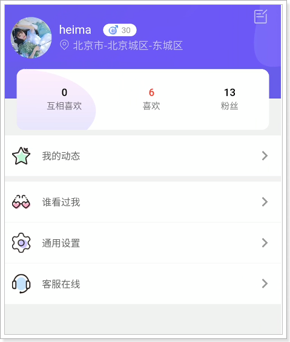
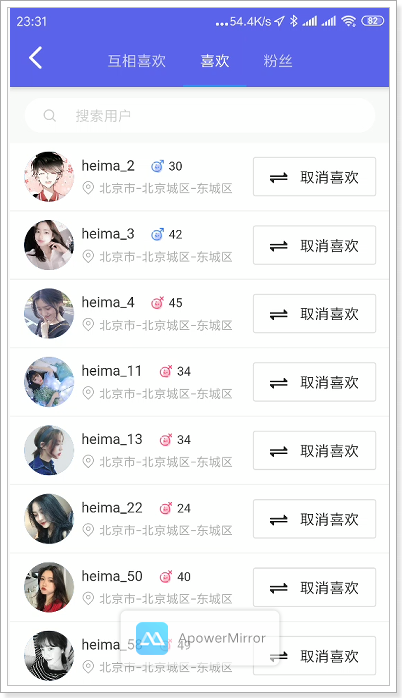
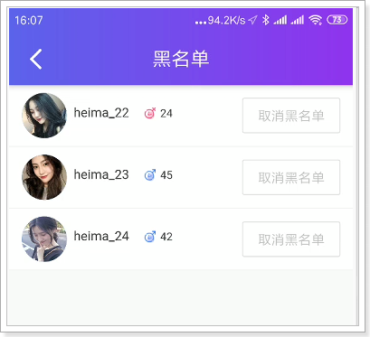

## 课程说明

- 实现我的喜欢功能
- 实现用户通用设置
- 实现黑名单功能
- 实现修改手机号功能

## 1、我的喜欢统计数

在我的模块中，将详细展现“喜欢”相关的数据，如下：

 

 

### 1.1、概念说明

- 喜欢
  - 我喜欢别人，如：张三喜欢李四，就是喜欢的数据，并不代表李四也喜欢张三。
- 粉丝
  - 对于李四而言，张三就是他的粉丝。
- 相互关注（喜欢）
  - 如果李四也喜欢张三，那么，张三和李四就是相互喜欢。

### 1.2、dubbo服务

#### 1.2.1、UserLikeApi

~~~java
//com.tanhua.dubbo.server.api.UserLikeApi

	/**
     * 相互喜欢的数量
     *
     * @return
     */
    Long queryMutualLikeCount(Long userId);

    /**
     * 喜欢数
     *
     * @return
     */
    Long queryLikeCount(Long userId);

    /**
     * 粉丝数
     *
     * @return
     */
    Long queryFanCount(Long userId);
~~~

#### 1.2.2、UserLikeApiImpl

~~~java
//com.tanhua.dubbo.server.api.UserLikeApiImpl

	/**
     * 查询相互喜欢数
     * 实现2种方式：第一种：查询redis，第二种：查询MongoDB
     * 建议：优先使用redis查询，其次考虑使用Mongodb
     *
     * @param userId
     * @return
     */
    @Override
    public Long queryMutualLikeCount(Long userId) {
        //查询我的喜欢列表
        List<Long> likeUserIdList = this.queryLikeList(userId);

        Long count = 0L;
        for (Long likeUserId : likeUserIdList) {
            String redisKey = this.getLikeRedisKey(likeUserId);
            String hashKey = String.valueOf(userId);
            //“别人” 的喜欢列表中是否有 “我”
            if (this.redisTemplate.opsForHash().hasKey(redisKey, hashKey)) {
                count++;
            }
        }
        return count;
    }

    @Override
    public Long queryLikeCount(Long userId) {
        String redisKey = this.getLikeRedisKey(userId);
        return this.redisTemplate.opsForHash().size(redisKey);
    }

    @Override
    public Long queryFanCount(Long userId) {
        //无法通过redis查询完成，必须从Mongodb中查询
        Query query = Query.query(Criteria.where("likeUserId").is(userId));
        return this.mongoTemplate.count(query, UserLike.class);
    }
~~~

#### 1.2.3、单元测试

~~~java
package com.tanhua.dubbo.server.api;

import org.junit.Test;
import org.junit.runner.RunWith;
import org.springframework.beans.factory.annotation.Autowired;
import org.springframework.boot.test.context.SpringBootTest;
import org.springframework.test.context.junit4.SpringJUnit4ClassRunner;

@RunWith(SpringJUnit4ClassRunner.class)
@SpringBootTest
public class TestUserLikeApiImpl {

    @Autowired
    private UserLikeApi userLikeApi;

    @Test
    public void testQueryCounts(){
        System.out.println(this.userLikeApi.queryEachLikeCount(1L));
        System.out.println(this.userLikeApi.queryFanCount(1L));
        System.out.println(this.userLikeApi.queryLikeCount(1L));
    }

}

~~~

### 1.3、APP接口服务

文档地址：https://mock-java.itheima.net/project/35/interface/api/899

#### 1.3.1、CountsVo

~~~java
package com.tanhua.server.vo;

import lombok.AllArgsConstructor;
import lombok.Data;
import lombok.NoArgsConstructor;

@Data
@NoArgsConstructor
@AllArgsConstructor
public class CountsVo {

    private Long eachLoveCount; //互相喜欢
    private Long loveCount; //喜欢
    private Long fanCount; //粉丝

}

~~~

#### 1.3.2、UsersController

~~~java
//com.tanhua.server.controller.MyCenterController

	/**
     * 互相喜欢，喜欢，粉丝 - 统计
     *
     * @return
     */
    @GetMapping("counts")
    public ResponseEntity<CountsVo> queryCounts(){
        try {
            CountsVo countsVo = this.myCenterService.queryCounts();
            if(null != countsVo){
                return ResponseEntity.ok(countsVo);
            }
        } catch (Exception e) {
            e.printStackTrace();
        }
        return ResponseEntity.status(HttpStatus.INTERNAL_SERVER_ERROR).build();
    }
~~~

#### 1.3.3、UsersService

~~~java
//com.tanhua.server.service.MyCenterService

	public CountsVo queryCounts() {
        User user = UserThreadLocal.get();
        CountsVo countsVo = new CountsVo();

        countsVo.setEachLoveCount(this.userLikeApi.queryMutualLikeCount(user.getId()));
        countsVo.setFanCount(this.userLikeApi.queryFanCount(user.getId()));
        countsVo.setLoveCount(this.userLikeApi.queryLikeCount(user.getId()));

        return countsVo;
    }
~~~

#### 1.3.4、测试

 

## 2、喜欢列表

接口服务：https://mock-java.itheima.net/project/35/interface/api/905

该接口集成了4个接口，用type做了区分： 1 互相关注 2 我关注 3 粉丝 4 谁看过我 

### 2.1、喜欢dubbo接口服务

#### 2.1.1、定义接口

在dubbo接口中定义方法：

~~~java
//com.tanhua.dubbo.server.api.UserLikeApi

	/**
     * 查询相互喜欢列表
     *
     * @param userId
     * @param page
     * @param pageSize
     * @return
     */
    PageInfo<UserLike> queryMutualLikeList(Long userId, Integer page, Integer pageSize);

    /**
     * 查询我喜欢的列表
     *
     * @param userId
     * @param page
     * @param pageSize
     * @return
     */
    PageInfo<UserLike> queryLikeList(Long userId, Integer page, Integer pageSize);

    /**
     * 查询粉丝列表
     *
     * @param userId
     * @param page
     * @param pageSize
     * @return
     */
    PageInfo<UserLike> queryFanList(Long userId, Integer page, Integer pageSize);
~~~

#### 2.1.2、实现接口

~~~java
 //com.tanhua.dubbo.server.api.UserLikeApiImpl

	@Override
    public PageInfo<UserLike> queryMutualLikeList(Long userId, Integer page, Integer pageSize) {
        //查询我的喜欢列表
        List<Long> userLikeIdList = this.queryLikeList(userId);

        //查询喜欢我的人
        Query query = Query.query(Criteria.where("userId").in(userLikeIdList)
                .and("likeUserId").is(userId)
        );

        return this.queryList(query, page, pageSize);
    }

	@Override
    public PageInfo<UserLike> queryLikeList(Long userId, Integer page, Integer pageSize) {
        Query query = Query.query(Criteria.where("userId").is(userId));
        return this.queryList(query, page, pageSize);
    }

    @Override
    public PageInfo<UserLike> queryFanList(Long userId, Integer page, Integer pageSize) {
        Query query = Query.query(Criteria.where("likeUserId").is(userId));
        return this.queryList(query, page, pageSize);
    }

    private PageInfo<UserLike> queryList(Query query, Integer page, Integer pageSize) {
        //设置分页
        PageRequest pageRequest = PageRequest.of(page - 1, pageSize,
                Sort.by(Sort.Order.desc("created")));
        query.with(pageRequest);

        List<UserLike> userLikeList = this.mongoTemplate.find(query, UserLike.class);

        PageInfo<UserLike> pageInfo = new PageInfo<>();
        pageInfo.setPageNum(page);
        pageInfo.setPageSize(pageSize);
        pageInfo.setRecords(userLikeList);

        return pageInfo;
    }
~~~

### 2.2、最近访客dubbo服务

#### 2.2.1、定义接口

~~~java
//com.tanhua.dubbo.server.api.VisitorsApi

	/**
     * 按照时间倒序排序，查询最近的访客信息
     *
     * @param userId
     * @param page
     * @param pageSize
     * @return
     */
    PageInfo<Visitors> topVisitor(Long userId, Integer page, Integer pageSize);
~~~

#### 2.2.2、编写实现

~~~java
//com.tanhua.dubbo.server.api.VisitorsApiImpl

    @Override
    public List<Visitors> queryMyVisitor(Long userId) {
        // 查询前5个访客数据，按照访问时间倒序排序
        // 如果用户已经查询过列表，记录查询时间，后续查询需要按照这个时间往后查询

        // 上一次查询列表的时间
        Long date = Convert.toLong(this.redisTemplate.opsForHash().get(VISITOR_REDIS_KEY, String.valueOf(userId)));

        PageRequest pageRequest = PageRequest.of(0, 5, Sort.by(Sort.Order.desc("date")));
        Query query = Query.query(Criteria.where("userId").is(userId))
                .with(pageRequest);
        if (ObjectUtil.isNotEmpty(date)) {
            query.addCriteria(Criteria.where("date").gte(date));
        }
        return this.queryList(query, userId);
    }

    private List<Visitors> queryList(Query query, Long userId){
        List<Visitors> visitorsList = this.mongoTemplate.find(query, Visitors.class);
        //查询每个来访用户的得分
        for (Visitors visitors : visitorsList) {

            Query queryScore = Query.query(Criteria.where("toUserId")
                    .is(userId).and("userId").is(visitors.getVisitorUserId())
            );
            RecommendUser recommendUser = this.mongoTemplate.findOne(queryScore, RecommendUser.class);
            if(ObjectUtil.isNotEmpty(recommendUser)){
                visitors.setScore(recommendUser.getScore());
            }else {
                //默认得分
                visitors.setScore(90d);
            }
        }

        return visitorsList;
    }

    @Override
    public PageInfo<Visitors> topVisitor(Long userId, Integer page, Integer pageSize) {
        PageRequest pageRequest = PageRequest.of(page - 1, pageSize,
                Sort.by(Sort.Order.desc("date")));
        Query query = Query.query(Criteria.where("userId").is(userId)).with(pageRequest);
        List<Visitors> visitorsList = this.queryList(query, userId);

        PageInfo<Visitors> pageInfo = new PageInfo<>();
        pageInfo.setPageNum(page);
        pageInfo.setPageSize(pageSize);
        pageInfo.setRecords(visitorsList);

        //记录当前的时间到redis中，在首页查询时，就可以在这个时间之后查询了
        String redisKey = VISITOR_REDIS_KEY;
        String hashKey = String.valueOf(userId);
        String value = String.valueOf(System.currentTimeMillis());
        this.redisTemplate.opsForHash().put(redisKey, hashKey, value);

        return pageInfo;
    }
~~~

### 2.3、APP接口服务

接口文档：https://mock-java.itheima.net/project/35/interface/api/905

#### 2.3.1、UserLikeListVo

~~~java
package com.tanhua.server.vo;

import lombok.AllArgsConstructor;
import lombok.Data;
import lombok.NoArgsConstructor;

@Data
@NoArgsConstructor
@AllArgsConstructor
public class UserLikeListVo {

    private Long id;
    private String avatar;
    private String nickname;
    private String gender;
    private Integer age;
    private String city;
    private String education;
    private Integer marriage; //婚姻状态（0未婚，1已婚）
    private Integer matchRate; //匹配度
    private Boolean alreadyLove; //是否喜欢ta

}

~~~

#### 2.3.2、MyCenterController

~~~java
//com.tanhua.server.controller.MyCenterController

	/**
     * 互相关注、我关注、粉丝、谁看过我 - 翻页列表
     *
     * @param type     1 互相关注 2 我关注 3 粉丝 4 谁看过我
     * @param page
     * @param pageSize
     * @param nickname
     * @return
     */
    @GetMapping("friends/{type}")
    public ResponseEntity<PageResult> queryLikeList(@PathVariable("type") String type,
                                                    @RequestParam(value = "page", defaultValue = "1") Integer page,
                                                    @RequestParam(value = "pagesize", defaultValue = "10") Integer pageSize,
                                                    @RequestParam(value = "nickname", required = false) String nickname) {
        try {
            page = Math.max(1, page);
            PageResult pageResult = this.myCenterService.queryLikeList(Integer.valueOf(type), page, pageSize, nickname);
            return ResponseEntity.ok(pageResult);
        } catch (Exception e) {
            e.printStackTrace();
        }
        return ResponseEntity.status(HttpStatus.INTERNAL_SERVER_ERROR).build();
    }
~~~

#### 2.3.3、MyCenterService

~~~java
//com.tanhua.server.service.MyCenterService

	public PageResult queryLikeList(Integer type, Integer page, Integer pageSize, String nickname) {
        PageResult pageResult = new PageResult();
        pageResult.setPage(page);
        pageResult.setPagesize(pageSize);

        Long userId = UserThreadLocal.get().getId();

        List<Object> userIdList = null;

        //1 互相关注 2 我关注 3 粉丝 4 谁看过我
        switch(type){
            case 1:{
                PageInfo<UserLike> pageInfo = this.userLikeApi.queryMutualLikeList(userId, page, pageSize);
                userIdList = CollUtil.getFieldValues(pageInfo.getRecords(), "userId");
                break;
            }
            case 2:{
                PageInfo<UserLike> pageInfo = this.userLikeApi.queryLikeList(userId, page, pageSize);
                userIdList = CollUtil.getFieldValues(pageInfo.getRecords(), "likeUserId");
                break;
            }
            case 3:{
                PageInfo<UserLike> pageInfo = this.userLikeApi.queryFanList(userId, page, pageSize);
                userIdList = CollUtil.getFieldValues(pageInfo.getRecords(), "userId");
                break;
            }
            case 4:{
                PageInfo<Visitors> pageInfo = this.visitorsApi.topVisitor(userId, page, pageSize);
                userIdList = CollUtil.getFieldValues(pageInfo.getRecords(), "visitorUserId");
                break;
            }
            default:
                return pageResult;
        }

        if(CollUtil.isEmpty(userIdList)){
            return pageResult;
        }

        QueryWrapper<UserInfo> queryWrapper = new QueryWrapper<>();
        queryWrapper.in("user_id", userIdList);
        if(StrUtil.isNotEmpty(nickname)){
            queryWrapper.like("nick_name", nickname);
        }

        List<UserInfo> userInfoList = this.userInfoService.queryUserInfoList(queryWrapper);
        List<UserLikeListVo> userLikeListVos = new ArrayList<>();
        for (UserInfo userInfo : userInfoList) {
            UserLikeListVo userLikeListVo = new UserLikeListVo();
            userLikeListVo.setAge(userInfo.getAge());
            userLikeListVo.setAvatar(userInfo.getLogo());
            userLikeListVo.setCity(userInfo.getCity());
            userLikeListVo.setEducation(userInfo.getEdu());
            userLikeListVo.setGender(userInfo.getSex().name().toLowerCase());
            userLikeListVo.setId(userInfo.getUserId());
            userLikeListVo.setMarriage(StringUtils.equals(userInfo.getMarriage(), "已婚") ? 1 : 0);
            userLikeListVo.setNickname(userInfo.getNickName());
            //是否喜欢  userLikeApi中的isLike开放出来
            userLikeListVo.setAlreadyLove(this.userLikeApi.isLike(userId, userInfo.getUserId()));

            Double score = this.recommendUserService.queryScore(userId, userInfo.getUserId());
            userLikeListVo.setMatchRate(Convert.toInt(score));

            userLikeListVos.add(userLikeListVo);
        }

        pageResult.setItems(userLikeListVos);

        return pageResult;
    }
~~~

#### 2.3.4、测试

 

 

 

 

 

### 2.4、取消喜欢

在列表中可以进行“取消喜欢”操作。

接口文档：https://mock-java.itheima.net/project/35/interface/api/923

#### 2.4.1、MyCenterController

~~~java
 //com.tanhua.server.controller.MyCenterController

	/**
     * 取消喜欢
     *
     * @param userId
     * @return
     */
    @DeleteMapping("like/{uid}")
    public ResponseEntity<Void> disLike(@PathVariable("uid") Long userId) {
        try {
            this.myCenterService.disLike(userId);
            return ResponseEntity.ok(null);
        } catch (Exception e) {
            e.printStackTrace();
        }
        return ResponseEntity.status(HttpStatus.INTERNAL_SERVER_ERROR).build();
    }
~~~

#### 2.4.2、MyCenterService

~~~java
//com.tanhua.server.service.MyCenterService

    /**
     * 取消喜欢
     *
     * @param userId
     */
    public void disLike(Long userId) {
        //判断当前用户与此用户是否相互喜欢
        User user = UserThreadLocal.get();
        Boolean mutualLike = this.userLikeApi.isMutualLike(user.getId(), userId);

        //取消喜欢
        this.userLikeApi.notLikeUser(user.getId(), userId);

        if(mutualLike){
            //取消好友关系，解除在环信平台的好友关系
            this.imService.removeUser(userId);
        }
    }
~~~

#### 2.4.3、IMService

~~~java
	//com.tanhua.server.service.IMService 

    /**
     * 删除好友
     *
     * @param userId 好友id
     */
    public void removeUser(Long userId) {
        //删除好友关系
        User user = UserThreadLocal.get();
        Boolean result = this.usersApi.removeUsers(user.getId(), userId);
        if(result){
            //将环信平台的好友关系解除
            this.huanXinApi.removeUserFriend(user.getId(), userId);
        }
    }
~~~

#### 2.4.4、测试

测试时，需要将MongoDB中的user_like表数据清空以及将Redis中喜欢和不喜欢数据删除。

使用用户2进行测试，现在和用户1是好友：

 

取消喜欢：

 

### 2.5、 喜欢粉丝

在查看粉丝列表中，可以对粉丝进行“喜欢操作”。

文档地址：https://mock-java.itheima.net/project/35/interface/api/917

#### 2.5.1、MyCenterController

~~~java
//com.tanhua.server.controller.MyCenterController

    /**
     * 关注粉丝
     *
     * @param userId
     * @return
     */
    @PostMapping("fans/{uid}")
    public ResponseEntity<Void> likeFan(@PathVariable("uid") Long userId){
        try {
            this.myCenterService.likeFan(userId);
            return ResponseEntity.ok(null);
        } catch (Exception e) {
            e.printStackTrace();
        }
        return ResponseEntity.status(HttpStatus.INTERNAL_SERVER_ERROR).build();
    }
~~~

#### 2.5.2、MyCenterService

~~~java
//com.tanhua.server.service.MyCenterService

	@Autowired
    private TanHuaService tanHuaService;

    /**
     * 喜欢
     *
     * @param userId
     */
    public void likeFan(Long userId) {
        //喜欢用户，如果用户是相互喜欢的话就会成为好友
        this.tanHuaService.likeUser(userId);
    }
~~~

#### 2.5.3、测试

 

## 3、用户通用设置

### 3.1、表结构

~~~sql
CREATE TABLE `tb_settings` (
  `id` bigint(20) NOT NULL AUTO_INCREMENT,
  `user_id` bigint(20) DEFAULT NULL,
  `like_notification` tinyint(4) DEFAULT '1' COMMENT '推送喜欢通知',
  `pinglun_notification` tinyint(4) DEFAULT '1' COMMENT '推送评论通知',
  `gonggao_notification` tinyint(4) DEFAULT '1' COMMENT '推送公告通知',
  `created` datetime DEFAULT NULL,
  `updated` datetime DEFAULT NULL,
  PRIMARY KEY (`id`)
) ENGINE=InnoDB DEFAULT CHARSET=utf8 COMMENT='设置表';
~~~

### 3.2、pojo

my-tanhua-common工程：

~~~java
package com.tanhua.common.pojo;

import lombok.AllArgsConstructor;
import lombok.Data;
import lombok.NoArgsConstructor;

@Data
@NoArgsConstructor
@AllArgsConstructor
public class Settings extends BasePojo {

    private Long id;
    private Long userId;
    private Boolean likeNotification = true;
    private Boolean pinglunNotification = true;
    private Boolean gonggaoNotification = true;

}
~~~

### 3.3、SettingsMapper

~~~java
package com.tanhua.common.mapper;

import com.baomidou.mybatisplus.core.mapper.BaseMapper;
import com.tanhua.common.pojo.Settings;

public interface SettingsMapper extends BaseMapper<Settings> {

}

~~~

### 3.4、SettingsService

~~~java
package com.tanhua.server.service;

import com.baomidou.mybatisplus.core.conditions.query.QueryWrapper;
import com.tanhua.common.mapper.SettingsMapper;
import com.tanhua.common.pojo.Settings;
import org.springframework.beans.factory.annotation.Autowired;
import org.springframework.stereotype.Service;

@Service
public class SettingsService {

    @Autowired
    private SettingsMapper settingsMapper;

    /**
     * 根据用户id查询配置
     * 
     * @param userId
     * @return
     */
    public Settings querySettings(Long userId) {
        QueryWrapper<Settings> queryWrapper = new QueryWrapper<>();
        queryWrapper.eq("user_id", userId);
        return this.settingsMapper.selectOne(queryWrapper);
    }
}

~~~

### 3.5、查询配置

文档地址：https://mock-java.itheima.net/project/35/interface/api/893

#### 3.5.1、SettingsVo

~~~java
package com.tanhua.server.vo;

import lombok.AllArgsConstructor;
import lombok.Data;
import lombok.NoArgsConstructor;

@Data
@NoArgsConstructor
@AllArgsConstructor
public class SettingsVo {

    private Long id;
    //陌生人问题
    private String strangerQuestion = "";
    //手机号
    private String phone;
    //推送喜欢通知
    private Boolean likeNotification = true;
    //推送评论通知
    private Boolean pinglunNotification = true;
    //推送公告通知
    private Boolean gonggaoNotification = true;

}

~~~

#### 3.5.2、MyCenterController

~~~java
//com.tanhua.server.controller.MyCenterController

    /**
     * 查询配置
     *
     * @return
     */
    @GetMapping("settings")
    public ResponseEntity<SettingsVo> querySettings() {
        try {
            SettingsVo settingsVo = this.myCenterService.querySettings();
            if (null != settingsVo) {
                return ResponseEntity.ok(settingsVo);
            }
        } catch (Exception e) {
            e.printStackTrace();
        }
        return ResponseEntity.status(HttpStatus.INTERNAL_SERVER_ERROR).build();
    }
~~~

#### 3.5.3、MyCenterService

~~~java
//com.tanhua.server.service.MyCenterService

    public SettingsVo querySettings() {
        SettingsVo settingsVo = new SettingsVo();
        User user = UserThreadLocal.get();

        //设置用户的基本信息
        settingsVo.setId(user.getId());
        settingsVo.setPhone(user.getMobile());

        //查询用户的配置数据
        Settings settings = this.settingsService.querySettings(user.getId());
        if(ObjectUtil.isNotEmpty(settings)){
            settingsVo.setGonggaoNotification(settings.getGonggaoNotification());
            settingsVo.setLikeNotification(settings.getLikeNotification());
            settingsVo.setPinglunNotification(settings.getPinglunNotification());
        }

        //查询陌生人问题
        settingsVo.setStrangerQuestion(this.tanHuaService.queryQuestion(user.getId()));

        return settingsVo;
    }
~~~

#### 2.5.4、测试

 

 

### 3.6、保存陌生人问题

文档地址：https://mock-java.itheima.net/project/35/interface/api/929

#### 3.6.1、MyCenterController

~~~java
 //com.tanhua.server.controller.MyCenterController

    /**
     * 设置陌生人问题
     *
     * @return
     */
    @PostMapping("questions")
    public ResponseEntity<Void> saveQuestions(@RequestBody Map<String, String> param) {
        try {
            String content = param.get("content");
            this.myCenterService.saveQuestions(content);
            return ResponseEntity.ok(null);
        } catch (Exception e) {
            e.printStackTrace();
        }
        return ResponseEntity.status(HttpStatus.INTERNAL_SERVER_ERROR).build();
    }
~~~

#### 3.6.2、MyCenterService

~~~java
//com.tanhua.server.service.MyCenterService

	public void saveQuestions(String content) {
        User user = UserThreadLocal.get();
        this.questionService.save(user.getId(), content);
    }
~~~

#### 3.6.3、QuestionService

~~~java
//com.tanhua.server.service.QuestionService

	public void save(Long userId, String content) {
        Question question = this.queryQuestion(userId);
        if(null != question){
            question.setTxt(content);
            this.questionMapper.updateById(question);
        }else {
            question = new Question();
            question.setUserId(userId);
            question.setTxt(content);
            question.setCreated(new Date());
            question.setUpdated(question.getCreated());
            this.questionMapper.insert(question);
        }
    }
~~~

### 3.7、黑名单列表

黑名单功能可以用在陌生人打招呼时，进行判断，如果是黑名单的则不能打招呼。

接口文档：https://mock-java.itheima.net/project/35/interface/api/935

#### 3.7.1、表结构

~~~sql
CREATE TABLE `tb_black_list` (
  `id` bigint(20) NOT NULL AUTO_INCREMENT,
  `user_id` bigint(20) DEFAULT NULL,
  `black_user_id` bigint(20) DEFAULT NULL,
  `created` datetime DEFAULT NULL,
  `updated` datetime DEFAULT NULL,
  PRIMARY KEY (`id`),
  KEY `user_id` (`user_id`)
) ENGINE=InnoDB DEFAULT CHARSET=utf8 COMMENT='黑名单';

--测试数据
INSERT INTO `tb_black_list` (`id`, `user_id`, `black_user_id`, `created`, `updated`) VALUES ('1', '1', '22', '2019-11-01 15:47:22', '2019-11-01 15:47:24');
INSERT INTO `tb_black_list` (`id`, `user_id`, `black_user_id`, `created`, `updated`) VALUES ('2', '1', '23', '2019-11-01 15:47:39', '2019-11-01 15:47:42');
INSERT INTO `tb_black_list` (`id`, `user_id`, `black_user_id`, `created`, `updated`) VALUES ('3', '1', '24', '2019-11-01 15:47:51', '2019-11-01 15:47:56');

~~~

#### 3.7.2、pojo

~~~java
package com.tanhua.common.pojo;

import lombok.AllArgsConstructor;
import lombok.Data;
import lombok.NoArgsConstructor;

@Data
@NoArgsConstructor
@AllArgsConstructor
public class BlackList extends BasePojo {

    private Long id;
    private Long userId;
    private Long blackUserId;
}

~~~

#### 3.7.3、BlackListMapper

~~~java
package com.tanhua.common.mapper;

import com.baomidou.mybatisplus.core.mapper.BaseMapper;
import com.tanhua.common.pojo.BlackList;

public interface BlackListMapper extends BaseMapper<BlackList> {
}

~~~

#### 3.7.4、BlackListService

~~~java
package com.tanhua.server.service;

import com.baomidou.mybatisplus.core.conditions.query.QueryWrapper;
import com.baomidou.mybatisplus.core.metadata.IPage;
import com.baomidou.mybatisplus.extension.plugins.pagination.Page;
import com.tanhua.common.mapper.BlackListMapper;
import com.tanhua.common.pojo.BlackList;
import org.springframework.beans.factory.annotation.Autowired;
import org.springframework.stereotype.Service;

@Service
public class BlackListService {

    @Autowired
    private BlackListMapper blackListMapper;

    public IPage<BlackList> queryBlacklist(Long userId, Integer page, Integer pageSize) {
        QueryWrapper<BlackList> wrapper = new QueryWrapper<BlackList>();
        wrapper.eq("user_id", userId);
        wrapper.orderByDesc("created");
        Page<BlackList> pager = new Page<>(page, pageSize);
        return this.blackListMapper.selectPage(pager, wrapper);
    }
}

~~~

配置分页插件：

~~~java
package com.tanhua.server.config;

import com.baomidou.mybatisplus.extension.plugins.PaginationInterceptor;
import org.springframework.context.annotation.Bean;
import org.springframework.context.annotation.Configuration;

@Configuration
public class MybatisPlusConfig {
    /**
     * 分页插件
     */
    @Bean
    public PaginationInterceptor paginationInterceptor() {
        return new PaginationInterceptor();
    }
}
~~~

#### 3.7.5、BlackListVo

~~~java
package com.tanhua.server.vo;

import lombok.AllArgsConstructor;
import lombok.Data;
import lombok.NoArgsConstructor;

@Data
@AllArgsConstructor
@NoArgsConstructor
public class BlackListVo {

    private Long id;
    private String avatar;
    private String nickname;
    private String gender;
    private Integer age;

}

~~~

#### 3.7.6、MyCenterController

~~~java
 //com.tanhua.server.controller.MyCenterController

	/**
     * 查询黑名单
     *
     * @param page
     * @param pagesize
     * @return
     */
    @GetMapping("blacklist")
    public ResponseEntity<PageResult> queryBlacklist(@RequestParam(value = "page", defaultValue = "1") Integer page,
                                                     @RequestParam(value = "pagesize", defaultValue = "10") Integer pagesize) {
        try {
            PageResult pageResult = this.myCenterService.queryBlacklist(page, pagesize);
            return ResponseEntity.ok(pageResult);
        } catch (Exception e) {
            e.printStackTrace();
        }
        return ResponseEntity.status(HttpStatus.INTERNAL_SERVER_ERROR).build();
    }
~~~

#### 3.7.7、MyCenterService

~~~java
//com.tanhua.server.service.MyCenterService

	public PageResult queryBlacklist(Integer page, Integer pageSize) {
        User user = UserThreadLocal.get();

        IPage<BlackList> blackListIPage = this.blackListService.queryBlacklist(user.getId(), page, pageSize);

        PageResult pageResult = new PageResult();
        pageResult.setPage(page);
        pageResult.setPagesize(pageSize);
        pageResult.setCounts(Convert.toInt(blackListIPage.getTotal()));
        pageResult.setPages(Convert.toInt(blackListIPage.getPages()));

        List<BlackList> records = blackListIPage.getRecords();
        if(CollUtil.isEmpty(records)){
            return pageResult;
        }

        List<Object> userIds = CollUtil.getFieldValues(records, "blackUserId");
        List<UserInfo> userInfoList = this.userInfoService.queryUserInfoByUserIdList(userIds);

        List<BlackListVo> blackListVos = new ArrayList<>();
        for (UserInfo userInfo : userInfoList) {
            BlackListVo blackListVo = new BlackListVo();
            blackListVo.setAge(userInfo.getAge());
            blackListVo.setAvatar(userInfo.getLogo());
            blackListVo.setGender(userInfo.getSex().name().toLowerCase());
            blackListVo.setId(userInfo.getUserId());
            blackListVo.setNickname(userInfo.getNickName());

            blackListVos.add(blackListVo);
        }

        pageResult.setItems(blackListVos);

        return pageResult;
    }
~~~

#### 3.7.8、测试

 

### 3.8、移除黑名单

 接口文档：https://mock-java.itheima.net/project/35/interface/api/941

#### 3.8.1、MyCenterController

~~~java
    /**
     * 移除黑名单
     *
     * @return
     */
    @DeleteMapping("blacklist/{uid}")
    public ResponseEntity<Void> delBlacklist(@PathVariable("uid") Long userId) {
        try {
            this.myCenterService.delBlacklist(userId);
            return ResponseEntity.ok(null);
        } catch (Exception e) {
            e.printStackTrace();
        }
        return ResponseEntity.status(HttpStatus.INTERNAL_SERVER_ERROR).build();
    }
~~~

#### 3.8.2、MyCenterService

~~~java
    public void delBlacklist(Long userId) {
        User user = UserThreadLocal.get();
        this.blackListService.delBlacklist(user.getId(), userId);
    }
~~~

#### 3.8.3、BlackListService

~~~java
    public Boolean delBlacklist(Long userId, Long blackUserId) {
        QueryWrapper<BlackList> wrapper = new QueryWrapper<BlackList>();
        wrapper.eq("user_id", userId).eq("black_user_id", blackUserId);
        return this.blackListMapper.delete(wrapper) > 0;
    }
~~~

### 3.9、更新通知

接口文档：https://mock-java.itheima.net/project/35/interface/api/965

#### 3.9.1、MyCenterController

~~~java
//com.tanhua.server.controller.MyCenterController

	/**
     * 更新通知设置
     *
     * @param param
     * @return
     */
    @PostMapping("notifications/setting")
    public ResponseEntity<Void> updateNotification(@RequestBody Map<String, Boolean> param) {
        try {
            Boolean likeNotification = param.get("likeNotification");
            Boolean pinglunNotification = param.get("pinglunNotification");
            Boolean gonggaoNotification = param.get("gonggaoNotification");

            this.usersService.updateNotification(likeNotification, pinglunNotification, gonggaoNotification);
            return ResponseEntity.ok(null);
        } catch (Exception e) {
            e.printStackTrace();
        }
        return ResponseEntity.status(HttpStatus.INTERNAL_SERVER_ERROR).build();
    }
~~~

#### 2.9.2、MyCenterService

~~~java
//com.tanhua.server.service.MyCenterService

	public void updateNotification(Boolean likeNotification, Boolean pinglunNotification, Boolean gonggaoNotification) {
        User user = UserThreadLocal.get();
        this.settingsService.updateNotification(user.getId(), likeNotification, pinglunNotification, gonggaoNotification);
    }
~~~

#### 2.9.3、SettingsService

~~~java
//com.tanhua.server.service.SettingsService

	public void updateNotification(Long userId, Boolean likeNotification, Boolean pinglunNotification, Boolean gonggaoNotification) {
        QueryWrapper<Settings> queryWrapper = new QueryWrapper<>();
        queryWrapper.eq("user_id", userId);

        Settings settings = this.settingsMapper.selectOne(queryWrapper);
        if(null == settings){
            //如果没有数据的话，插入一条数据
            settings = new Settings();
            settings.setUserId(userId);
            this.settingsMapper.insert(settings);
        }else{
            //更新
            settings.setLikeNotification(likeNotification);
            settings.setPinglunNotification(pinglunNotification);
            settings.setGonggaoNotification(gonggaoNotification);
            this.settingsMapper.update(settings, queryWrapper);
        }
    }
~~~

### 3.10、更新手机号

更新手机号的逻辑在sso系统中完成，其流程是：旧手机号获取验证码，验证码校验通过后，设置新手机号，最后保存新的手机号。

步骤1，发送短信验证码：https://mock-java.itheima.net/project/35/interface/api/947

步骤2，校验验证码：https://mock-java.itheima.net/project/35/interface/api/953

步骤3，保存新手机号：https://mock-java.itheima.net/project/35/interface/api/959

配置nginx：

~~~shell
	location /users/phone {  #请求路径中凡是以/user/phone开头的请求，转发到sso系统
        client_max_body_size  300m;  #设置最大的请求体大小，解决大文件上传不了的问题
        proxy_connect_timeout 300s;  #代理连接超时时间
        proxy_send_timeout 300s;  #代理发送数据的超时时间
        proxy_read_timeout 300s;  #代理读取数据的超时时间
        proxy_pass   http://127.0.0.1:18080;  #转发请求
     }
~~~

#### 3.10.1、 发送短信验证码

MyCenterController:

~~~~java
//com.tanhua.sso.controller.MyCenterController

	/**
     * 发送短信验证码
     *
     * @return
     */
    @PostMapping("phone/sendVerificationCode")
    public ResponseEntity<Void> sendVerificationCode(@RequestHeader("Authorization") String token) {
        try {
            boolean bool = this.myCenterService.sendVerificationCode(token);
            if (bool) {
                return ResponseEntity.ok(null);
            }
        } catch (Exception e) {
            e.printStackTrace();
        }
        return ResponseEntity.status(HttpStatus.INTERNAL_SERVER_ERROR).build();
    }
~~~~

MyCenterService:

~~~java
//com.tanhua.sso.service.MyCenterService

package com.tanhua.sso.service;

import com.tanhua.common.pojo.User;
import com.tanhua.sso.vo.ErrorResult;
import org.springframework.beans.factory.annotation.Autowired;
import org.springframework.stereotype.Service;

@Service
public class MyCenterService {

    @Autowired
    private UserService userService;

    @Autowired
    private SmsService smsService;

    public Boolean sendVerificationCode(String token) {
        //校验token
        User user = this.userService.queryUserByToken(token);
        if(ObjectUtil.isEmpty(user)){
            return false;
        }

        ErrorResult errorResult = this.smsService.sendCheckCode(user.getMobile());
        return errorResult == null;
    }
}

~~~

#### 3.10.2、 校验验证码

MyCenterController：

~~~java
//com.tanhua.sso.controller.MyCenterController

    /**
     * 校验验证码
     *
     * @param param
     * @param token
     * @return
     */
    @PostMapping("phone/checkVerificationCode")
    public ResponseEntity<Map<String, Object>> checkVerificationCode(@RequestBody Map<String, String> param,
                                                                     @RequestHeader("Authorization") String token) {
        try {
            String code = param.get("verificationCode");
            Boolean bool = this.myCenterService.checkVerificationCode(code, token);
            Map<String, Object> result = new HashMap<>();
            result.put("verification", bool);
            return ResponseEntity.ok(result);
        } catch (Exception e) {
            e.printStackTrace();
        }
        return ResponseEntity.status(HttpStatus.INTERNAL_SERVER_ERROR).build();
    }
~~~

MyCenterService：

~~~java
//com.tanhua.sso.service.MyCenterService

    public Boolean checkVerificationCode(String code, String token) {
        //校验token
        User user = this.userService.queryUserByToken(token);
        if(ObjectUtil.isEmpty(user)){
            return false;
        }

        //校验验证码，先查询redis中的验证码
        String redisKey = "CHECK_CODE_" + user.getMobile();
        String value = this.redisTemplate.opsForValue().get(redisKey);

        if(StrUtil.equals(code, value)){
            //将验证码删除
            this.redisTemplate.delete(redisKey);
            return true;
        }

        return false;
    }
~~~

#### 3.10.3、保存新手机号

MyCenterController：

~~~java
//com.tanhua.sso.controller.MyCenterController

	/**
     * 保存新手机号
     *
     * @return
     */
    @PostMapping("phone")
    public ResponseEntity<Void> updatePhone(@RequestBody Map<String, String> param,
                                            @RequestHeader("Authorization") String token) {
        try {
            String newPhone = param.get("phone");
            boolean bool = this.myCenterService.updatePhone(token, newPhone);
            if (bool) {
                return ResponseEntity.ok(null);
            }
        } catch (Exception e) {
            e.printStackTrace();
        }
        return ResponseEntity.status(HttpStatus.INTERNAL_SERVER_ERROR).build();
    }
~~~

MyCenterService：

~~~java
//com.tanhua.sso.service.MyCenterService

	public Boolean updatePhone(String token, String newPhone) {
        //校验token
        User user = this.userService.queryUserByToken(token);
        if(ObjectUtil.isEmpty(user)){
            return false;
        }
        Boolean result = this.userService.updatePhone(user.getId(), newPhone);
        if(result){
            String redisKey = "TANHUA_USER_MOBILE_" + user.getId();
            this.redisTemplate.delete(redisKey);
        }

        return result;
    }
~~~

UserService：

~~~java
//com.tanhua.sso.service.UserService

	public Boolean updatePhone(Long userId, String newPhone) {
        //先查询新手机号是否已经注册，如果已经注册，就不能修改
        QueryWrapper<User> queryWrapper = new QueryWrapper<>();
        queryWrapper.eq("mobile", newPhone);
        User user = this.userMapper.selectOne(queryWrapper);
        if(ObjectUtil.isNotEmpty(user)){
            //新手机号已经被注册
            return false;
        }

        user = new User();
        user.setId(userId);
        user.setMobile(newPhone);

        return this.userMapper.updateById(user) > 0;
    }
~~~
